# 1. Engineering

Made during Placement year at Kainos 2020-2021

- [1. Engineering](#1-engineering)
- [2. Key Learning objectives](#2-key-learning-objectives)
- [3. Being cynical](#3-being-cynical)
- [4. Running and developing code](#4-running-and-developing-code)
    - [4.1. Local environments](#41-local-environments)
        - [4.1.1. What it simplifies](#411-what-it-simplifies)
    - [4.2. Remove environment - why we need it?](#42-remove-environment---why-we-need-it)
    - [4.3. Remote environments and pipelines](#43-remote-environments-and-pipelines)
    - [4.4. Remote Environments](#44-remote-environments)
    - [4.5. Communicating over network](#45-communicating-over-network)
    - [4.6. Deploying remotely](#46-deploying-remotely)
    - [4.7. Remote == available in internet](#47-remote--available-in-internet)
    - [4.8. Principles for secure engineering](#48-principles-for-secure-engineering)
    - [4.9. Hybrid Environments](#49-hybrid-environments)
        - [4.9.1. Auth](#491-auth)
    - [4.10. Cloud Computing](#410-cloud-computing)
        - [4.10.1. Types of offerings](#4101-types-of-offerings)
            - [4.10.1.1. PaaS can be extended with CaaS and FaaS](#41011-paas-can-be-extended-with-caas-and-faas)
        - [4.10.2. Shared responsibility](#4102-shared-responsibility)
        - [4.10.3. Why bother?](#4103-why-bother)
        - [4.10.4. Impact on your work/design?](#4104-impact-on-your-workdesign)
        - [4.10.5. Security in Cloud](#4105-security-in-cloud)
            - [4.10.5.1. The Top 7 Advanced Cloud Security Challenges](#41051-the-top-7-advanced-cloud-security-challenges)
        - [4.10.6. Pillars of Cloud Security](#4106-pillars-of-cloud-security)
        - [4.10.7. NIST Cyber Security Framework](#4107-nist-cyber-security-framework)
    - [4.11. Observability](#411-observability)
        - [4.11.1. Pillars of observability](#4111-pillars-of-observability)
            - [4.11.1.1. Logging - what to log](#41111-logging---what-to-log)
            - [4.11.1.2. Logging - what not to log](#41112-logging---what-not-to-log)
            - [4.11.1.3. Logging - when to log](#41113-logging---when-to-log)
            - [4.11.1.4. Logging - levels](#41114-logging---levels)
            - [4.11.1.5. Logging - structured logging](#41115-logging---structured-logging)
            - [4.11.1.6. Metrics](#41116-metrics)
                - [4.11.1.6.1. Metrics - anatomy of a metric](#411161-metrics---anatomy-of-a-metric)
            - [4.11.1.7. Tracing](#41117-tracing)
                - [4.11.1.7.1. Key concepts](#411171-key-concepts)
                - [4.11.1.7.2. Alerting](#411172-alerting)
                - [4.11.1.7.3. Alerting - some good practices](#411173-alerting---some-good-practices)
            - [4.11.1.8. When to think about observability](#41118-when-to-think-about-observability)
    - [4.12. Stability Patterns](#412-stability-patterns)
        - [4.12.1. SLAs \& Failures](#4121-slas--failures)
        - [4.12.2. Failures](#4122-failures)
        - [4.12.3. In spec vs out of spec failures](#4123-in-spec-vs-out-of-spec-failures)
        - [4.12.4. Stability](#4124-stability)
        - [4.12.5. Integration Points](#4125-integration-points)
        - [4.12.6. Chain Reaction](#4126-chain-reaction)
        - [4.12.7. Cascading Failure](#4127-cascading-failure)
        - [4.12.8. Users](#4128-users)
        - [4.12.9. Blocked Threads](#4129-blocked-threads)
        - [4.12.10. Slow Responses](#41210-slow-responses)
        - [4.12.11. Attacks of self-denial - tips](#41211-attacks-of-self-denial---tips)
- [5. 16/07 Data Solution Architecture - Data Mesh](#5-1607-data-solution-architecture---data-mesh)
    - [5.1. Why it's important to us](#51-why-its-important-to-us)
    - [5.2. Typical Data flow](#52-typical-data-flow)
    - [5.3. Global Governance and Open Standards](#53-global-governance-and-open-standards)
    - [5.4. 4 Principles](#54-4-principles)
    - [5.5. Conway's Law](#55-conways-law)
    - [5.6. Challenges](#56-challenges)
    - [5.7. Benefits](#57-benefits)
- [6. General Architecture chat 23/07/21](#6-general-architecture-chat-230721)

# 2. Key Learning objectives

-   How to build operational ready and stable software
-   Extend the familiarity of executing the code in the remote environment
-   Structure the knowledge about cloud computing
-   Extend teh familiarity of service observation
-   Extend the appreciation of software failures, their reasons and patterns to mitigate

# 3. Being cynical

-   Bad things will happen
-   You should not trust data coming as your input or coming back from downstream
-   NFRs help protect the system functions
-   What can go wrong - will go wrong

# 4. Running and developing code

## 4.1. Local environments

You control everything

-   Permissions
-   Network rules ingress/egress
-   Runtime environment
-   Installed libraries/extensions
-   Adhoc changes (to env, to code, to config)
-   Data (db, files, etc)

-   Running with IDE

    -   simplified approach
    -   No pipeline, no deployment, de facto CI/CD

-   Debugging

    -   Easy
    -   Fast
    -   Effective

-   Access to filesystem
    -   Easy to verify what actually is running

### 4.1.1. What it simplifies

-   Communication over localhost(stable)
-   Most likely scale factor of 1
    -   Scalability issues/considerations
-   Local Run
    -   Work with mocks/local mocks
-   Simplifications
    -   Configuration
    -   Permission
    -   Network rules
    -   Separations of components

## 4.2. Remove environment - why we need it?

-   Code verification
    -   Did i commit and push everything ?
    -   Is it buildable on CI server?
    -   Automated test run
        -   Automation = consistency
-   Configuration verification
    -   Are any parameters missing?
    -   Are all parameter values properly defined?
-   Deployment verification
    -   What is necessary to properly deploy the code
    -   Automate integration tests
-   Runtime constraints
    -   OS/runtime related dependencies/requirements
    -   Components/libraries/extensions presence and version

## 4.3. Remote environments and pipelines

1. Automation
    1. Biggest advantages
2. Consistency
3. Anyone can deploy
    1. Helps with new joiners
4. Faster, more efficient, more reliable
5. Repeatable
6. Immediate feedback

## 4.4. Remote Environments

-   What is different
-   What will work differently?
-   Will it work?
-   How to manage?
    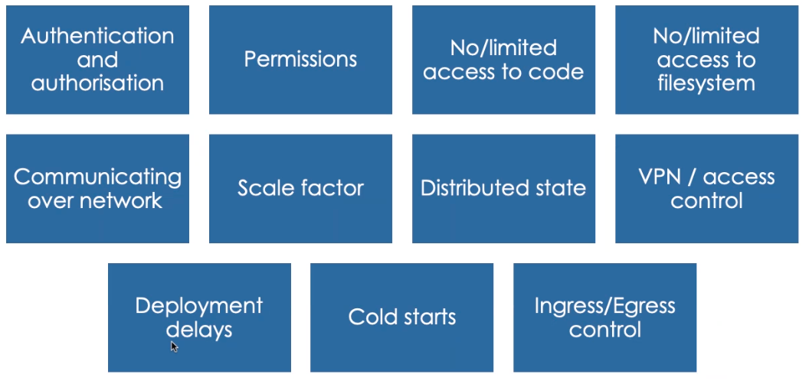

## 4.5. Communicating over network

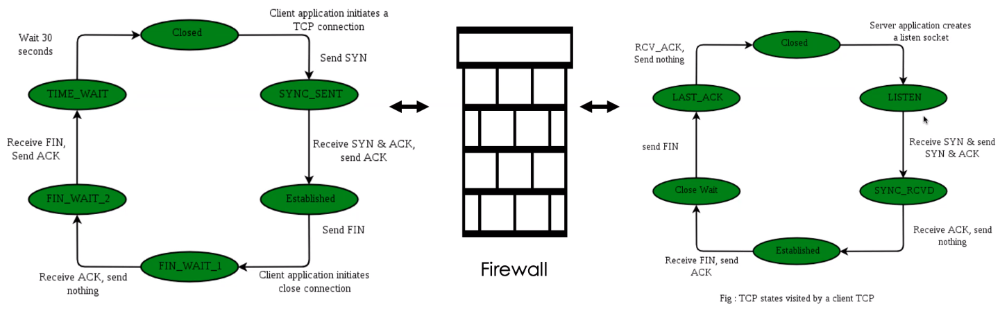
It's complicated and not stable

## 4.6. Deploying remotely

-   Will it run on remote OS/runtime?
-   Source of extension/libraries
    -   Is that library available?
    -   Is it compatible with remote environment?
-   Configuration
    -   Is everything configured?
    -   All all values provided?
    -   Correctly?
-   Scale
    -   What happens when there is more than one instance?
-   Stability patterns (covered later)

## 4.7. Remote == available in internet

1. Ensure it is behind authentication
2. Ensure authentication is not trivial (admin/admin: defaults)
3. Test data setup
    1. Quality of test data
    2. Consider clean and setup test data on deploy
    3. Anonymization of test data (GDPR)
4. Web Application Firewall (WAF)
    1. Cost
    2. Interferences in development/testing
5. Care for security
    1. Software updates
    2. Security policies

## 4.8. Principles for secure engineering

-   Developers work closely with Security Engineers and Security Architects to understand how new features impact security.
-   Applications are built in such a way that the OWASP Top 10 Application Security Risks are mitigated.
-   Applications are built using language specific secure coding guidelines
-   Developers are trained in security best practices
-   Automated checks are used to ensure secrets aren't committed to source control
-   Dependencies used by the application are automatically checked to ensure known vulnerabilities aren't present
-   Transactions which update or create data are audited, to reliably record the change (who, what adn when )
-   Application are written to make monitoring easy by the correct use of the response codes, appropriate logging and emitting custom metrics.
-   Developers and operations personnel are familiar with the project's incident response playbook

## 4.9. Hybrid Environments

Components deployed locally + communicating with cloud infra:

-   When you need to share a database
-   When you need to share many microservices
-   When you need to share infrastructure
    -   E.g. queues (Azure service bus, SQS)
-   When you are not able to setup components/infra locally
    -   Mail server
    -   Service Bus
-   When integrating with remote services/API's

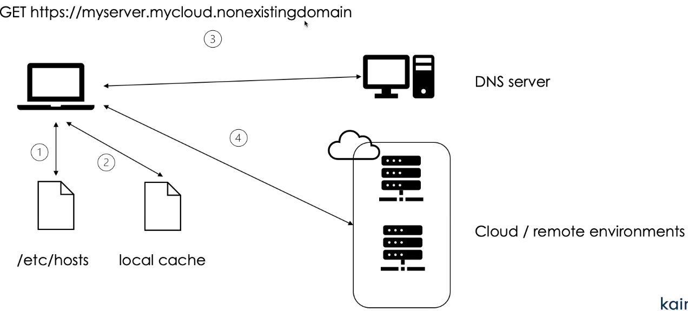

### 4.9.1. Auth

You need to access resources from you machine - ot means that, in most cases, it can be accessed from internet.
You need authenticated code

## 4.10. Cloud Computing

-   Public cloud
    -   Azure, AWS, Google Cloud
    -   Publically shared virtual Resources
    -   Supports multiple customenrs
    -   Supports connectivity over the internet
    -   Suited for less confidential information
-   Private cloud
    -   Privately shared Resources
    -   Custer of dedicated customers
    -   connectivity over internet, fibre and private network
    -   Suited for security confidential information and core systems
-   Hybrid Cloud
    -   Having only part of the application using cloud
-   Database
-   Applications
-   Mobile
-   Storage
-   Servers

### 4.10.1. Types of offerings

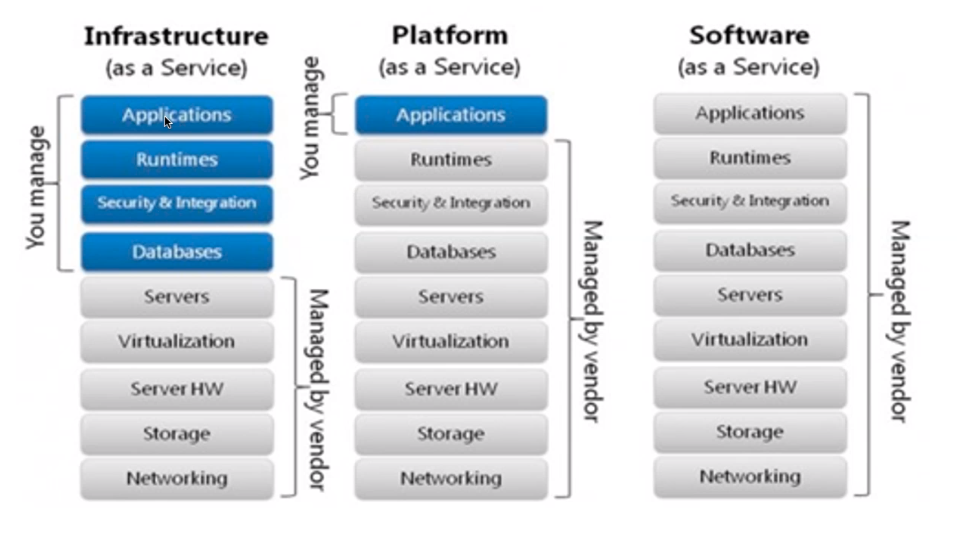

#### 4.10.1.1. PaaS can be extended with CaaS and FaaS

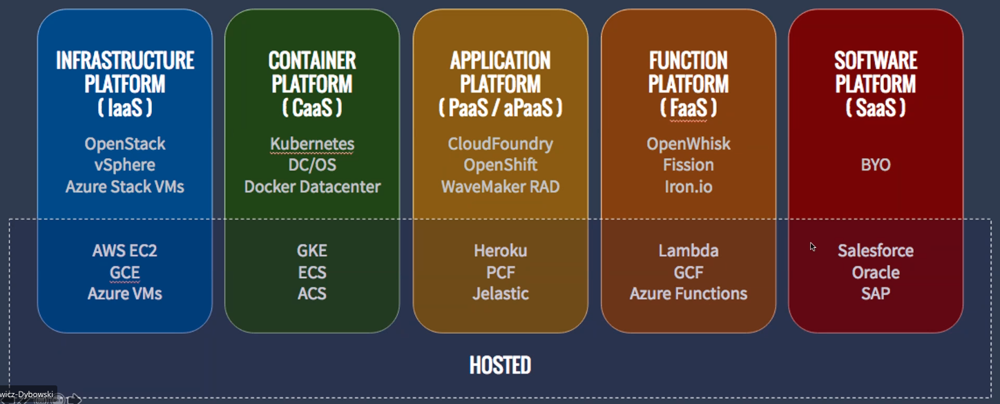

### 4.10.2. Shared responsibility

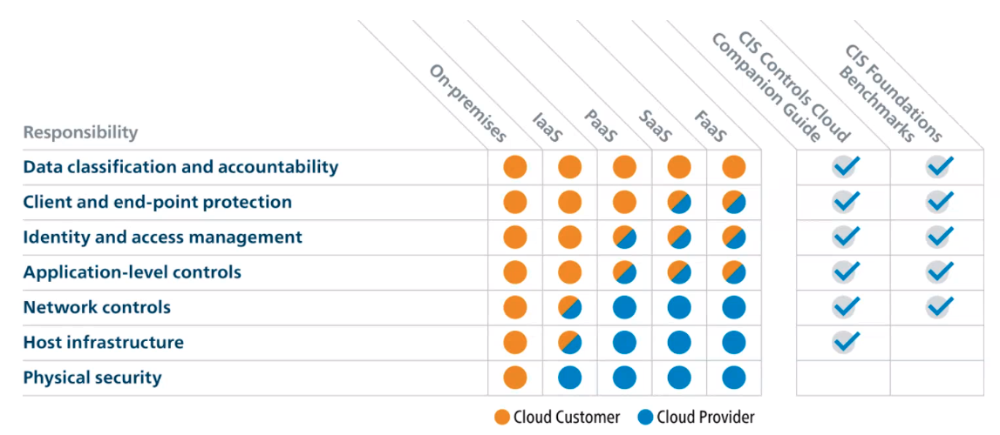

### 4.10.3. Why bother?

-   A great flexibility of scale (for vertical and horizontal scaling)
-   Ability to fine tine your costs
-   A lot of problems that don't solve business need are solved for you (VM provisioning, OS patching, DB clusters, etc)
-   Provides delivery efficiency

### 4.10.4. Impact on your work/design?

-   You have to be careful with fine-tuning - it may be easy to overprovision (and have a big bill)
-   It runs on shared responsibility model
-   You can hit noisy neighbors problems
-   There's huge capacity - but it is not unlimited

### 4.10.5. Security in Cloud

Cloud security is a responsibility that is shared between the cloud provider and the customer.

#### 4.10.5.1. The Top 7 Advanced Cloud Security Challenges

-   Increased Attack Surface
-   Lack of Visibility and Tracking
-   Ever-Changing Workloads
-   DevOps, DevSecOps and Automation
    -   Shared responsibility
-   Granular Privilege and Key Management
-   Complex Environments
-   Cloud and Governance

### 4.10.6. Pillars of Cloud Security

-   Visibility and Compliance
-   Compute-based security
-   Network Protections
-   Identity security

### 4.10.7. NIST Cyber Security Framework

-   Identify
    -   Asset Management
    -   Business Environment
    -   Governance
    -   Risk Assessment
    -   Risk Management
    -   Strategy
-   Protect
    -   Access Control
    -   Awareness and Training
    -   Data Security
    -   Info protection process and procedures
    -   Maintenance
    -   Protective Technology
-   Detect
    -   Anomalies and Events
    -   Security Continuous Monitoring
    -   Detection Process
-   Respond
    -   Response Planning
    -   Communications
    -   AnalysisP
    -   Mitigation
    -   Improvements
-   Recover
    -   Recovery Planning
    -   Improvements
    -   Communications

## 4.11. Observability

You can create perfect and stable software which is able to handle any error
but there will still be problems regardless

`Observability` - is a measure of how easy is it to interpret system states from logs

### 4.11.1. Pillars of observability

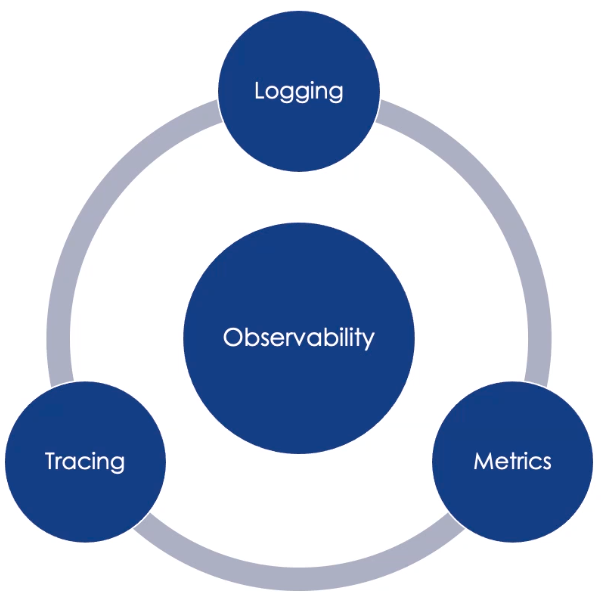

#### 4.11.1.1. Logging - what to log

Keep in mind who will be using logs:

1. Machines - for for monitoring and alerting purpose
2. Ops - to assess healthiness and state of system
3. Ops - to identify the problems
4. Ops - to remediate the problems
5. Devs - tp understand and fix a root cause of the problems

What to log

-   Incoming and outgoing messages
    -   Key to understand what really service get and send
-   Service and function invocations
    -   With appropriate level (eg.DEBUG) - it will help investigate issues
-   Key processing stages/states/events
    -   Validation, filters, transformations - with appropriate level
    -   Eg. payment processing stages
-   User Interactions and business stats
-   Data operations
-   System events
-   Performance stats
-   Threats and vulnerabilities

#### 4.11.1.2. Logging - what not to log

-   Personal identifiable information (PII)
-   Financial data
-   Secrets: passwords, security keys, auth tokens

#### 4.11.1.3. Logging - when to log

-   Ensure that logging is correct place ( not silenced by some "if")
-   Ensure that logging is precise
-   Ensure that logging is consistent
-   Ensure that logging is clear

Example: long running heavy report
What can go wrong?

-   Job hangs
-   Job is running really long
    How logging can help here?

#### 4.11.1.4. Logging - levels

Logging can impact performance on Production:

-   Divide logs into levels
-   Not all information are always needed/useful
-   Levels helps setup monitoring and alerting

Levels

-   Fatal - severe error - lead the application to abort
-   Error - error event that might still the application to continue running (eg. one time connection error - on retry works fine)
-   Warn - denotes less-harmful events that error. Usually, they do not lead to any degradation of capabilities or complete failure fot eh application. However, they are still red flags and must be investigated
-   Info - important message/information (eg. successful payment)
-   Debug - lowest level - specific and detailed information - usuals used for debugging purpose

#### 4.11.1.5. Logging - structured logging

Logs will be mainly used by machines (scripts) and ops - make it parseable => they have to be in consistent structure:

-   who - name
-   When
-   Where
-   What
-   With appropriate log level

#### 4.11.1.6. Metrics

Metrics are a numerical representation of data that can be used to determine a service or component's overall behavior over time

##### 4.11.1.6.1. Metrics - anatomy of a metric

-   Name
-   Datetime (point in time)
-   Value
-   Attributes/Tags(label: value)

#### 4.11.1.7. Tracing

-   Distributed tracing, also called distributed request tracing, is a method used to profile and monitor applications, especially those built using a microservices

##### 4.11.1.7.1. Key concepts

-   Trace
-   Span - references to other spans
-   Tags - key value pairs
-   Logs - key value pairs useful for capturing span specific messages
-   Span context - caries data

##### 4.11.1.7.2. Alerting

-   When an event on the system happens that requires human intervention on alert should be raised
-   Alerts could be mails, sms, etc

##### 4.11.1.7.3. Alerting - some good practices

-   Multi-User alerting
-   Alert Noise Reduction
-   Enriched Incident Context
-   Multiple Alert Types
-   Rick HTML Email Notifications
-   Dynamic Notifications
-   Incident History Audit

#### 4.11.1.8. When to think about observability

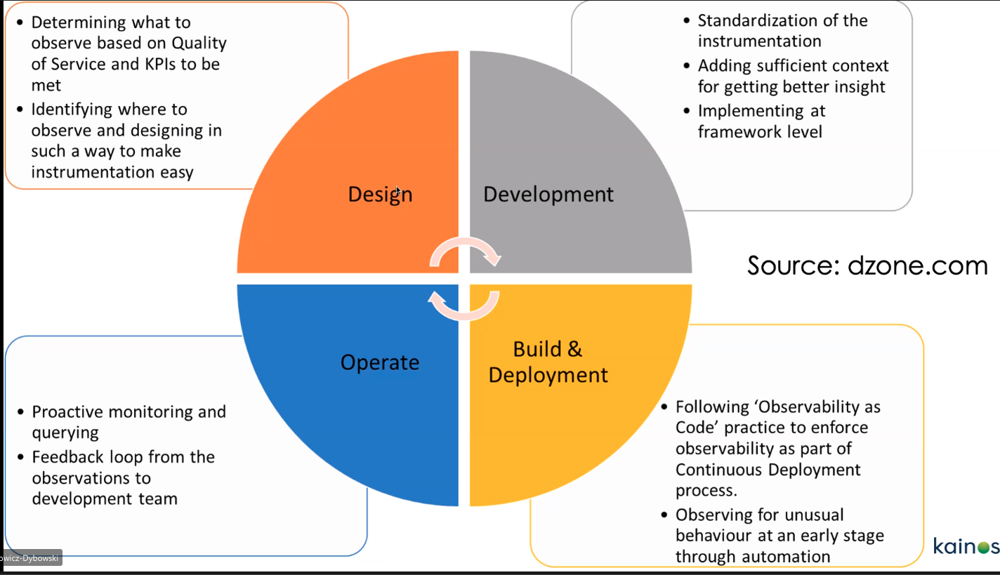

## 4.12. Stability Patterns

### 4.12.1. SLAs & Failures

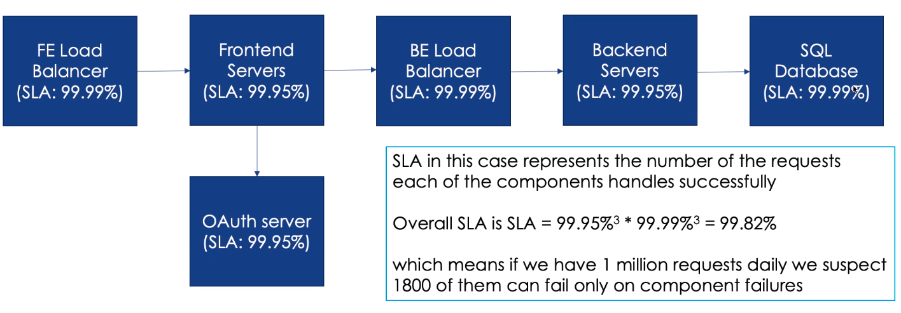

### 4.12.2. Failures

-   Main reason of the failure are the integration points
-   Every out of process can and eventually will kill the system (unless we cater for it)

### 4.12.3. In spec vs out of spec failures

-   In spec failures
    -   TCP Connection refused
    -   HTTP response code 500
    -   Error messaged in JSON response
-   Out of spec failures
    -   TCP connection established - no data send
    -   Server responds with HTML
    -   Server stream binary data

### 4.12.4. Stability

-   Allow systems to cater for failures and/or unexpected behaviors

### 4.12.5. Integration Points

-   Every Integration point will eventually fail in some way, and you need to be prepared for that failure
-   Failures propagate quickly when you code isn't defensive enough
-   Integration point failures take several forms. e.g. protocol violation, slow response, or outright hang
-   Debugging integration point failures usually requires peeling back a layer of abstraction - packet sniffers (hard or impossible to do PaaS / FaaS)

### 4.12.6. Chain Reaction

-   FAilure moves horizontally across tiers
-   Common in search engines and app servers
-   One server down will jeopardize the rest
-   Look for resource leak

### 4.12.7. Cascading Failure

-   Failure moves vertically across tiers
-   Common in enterprise services

### 4.12.8. Users

-   The user amount and behaviours can cause a lot of strain
    -   Shed the load - eg limit the amount fo data being passed to smaller datasets
-   Some malicious users
-   Front-page viewers
-   Screen scrapers/bots
    -   Try bot protection

### 4.12.9. Blocked Threads

-   All requests threads blocked = "crash"
-   Hung request handlers leads to
    -   less capacity
    -   frustrated user/caller
-   Each remaining thread servers 1/(N-1) extra requests ( a risk of chain reaction)
-   Beware the code you cannot sea (eg. from libraries or api)
-   Don't wait forever

### 4.12.10. Slow Responses

-   Worse than failing quickly as ties down resources
    -   Caller backed off, but the server is still doing the compute
-   Can trigger cascading Failures
-   Your System should track it's own responsiveness
    -   Consider sending an immediate error
-   Hunt for memory leaks or resource contention

### 4.12.11. Attacks of self-denial - tips

-   Avoid deep links
-   Static landing pages
-   CDN diverts or throttles users
-   Shared-nothing architecture
-   Session only on 2nd click

# 5. 16/07 Data Solution Architecture - Data Mesh

## 5.1. Why it's important to us

-   Published mid 2019
-   Most importantly, for the right organizations, Data Mesh provides their best option to achieve long term agility in exploiting data assets
-   TLDR - Must Partition correctly and govern effectively

## 5.2. Typical Data flow

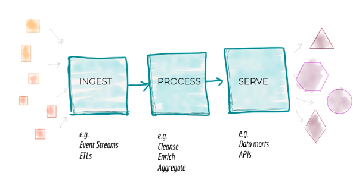
Architecture decomposition is orthogonal to the axis of change when introducing or enhancing features, leading to coupling and slower delivery

## 5.3. Global Governance and Open Standards

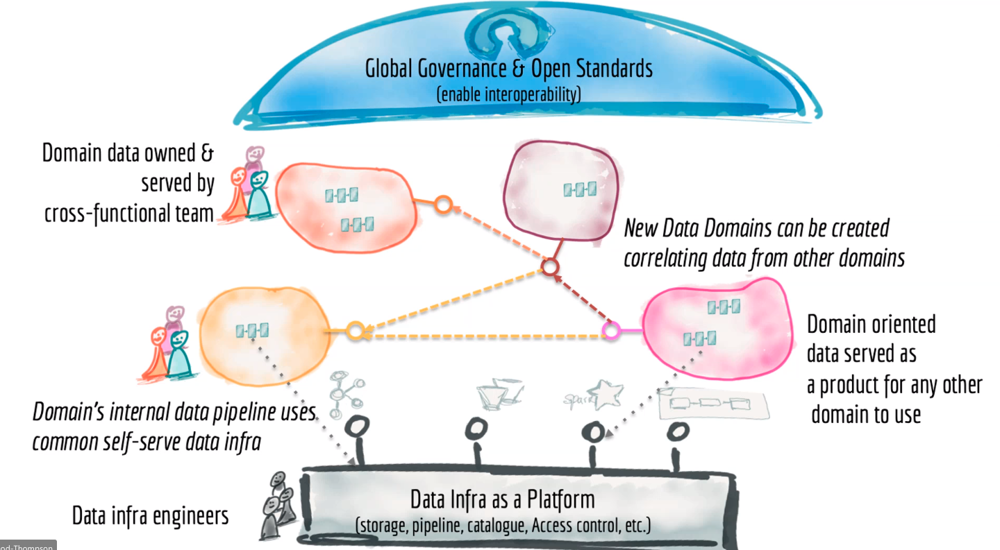

## 5.4. 4 Principles

-   Domain Ownership
    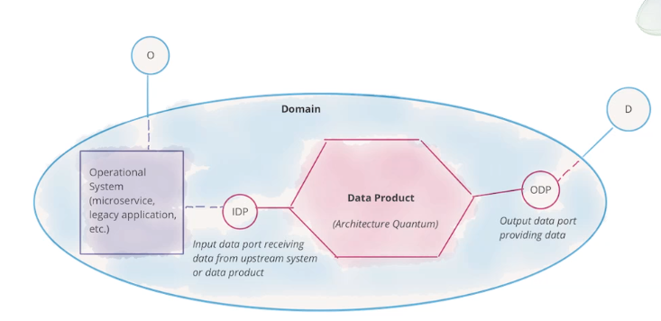
-   Data as a product
-   Sef-serve data platform
-   Federated computational governance

## 5.5. Conway's Law

"Any organisation that designs a system (defined broadly) will produce a design whose structure is a copy of the organisation's communication structure"

## 5.6. Challenges

-   Acceptance of duplicate data
-   Data contract management
-   Business not always optimal
-   Federated Governance is HARD / tech not ready
-   Mindset change and Complexity
-   Brownfield /Legacy
-   Scale of changes for benefit realization / potential long haul

## 5.7. Benefits

-   Use localised expertise/skills
-   Decoupling for technical agility/less 'competition'
-   Harder data functions centralised/standardised
-   Domains can evolve independently
-   More delivered sooner

For the right organisations, Data Mesh provides their best option to achieve long term agility in exploiting data assets

# 6. General Architecture chat 23/07/21

Welcomed new people and discussed what could be the future topics
