# 1. Data Structures

!!! note
    The Data Structure names link to wiki pages.
    
    Click them :material-cursor-default-click:

<style type="text/css">
.tg    {border-collapse:collapse;border-spacing:0;}
.tg td{border-color:black;border-style:solid;border-width:1px;font-family:Arial, sans-serif;font-size:14px;
    overflow:hidden;padding:10px 5px;word-break:normal;}
.tg th{border-color:black;border-style:solid;border-width:1px;font-family:Arial, sans-serif;font-size:14px;
    font-weight:normal;overflow:hidden;padding:10px 5px;word-break:normal;}
.tg .tg-q2a3{background-color:#FF0;border-color:inherit;text-align:center;vertical-align:top}
.tg .tg-hpcd{background-color:#E3E3E3;border-color:inherit;text-align:center;vertical-align:top}
.tg .tg-g3z5{background-color:#53D000;border-color:inherit;color:#444;text-align:center;vertical-align:top}
.tg .tg-2r8t{background-color:#53D000;border-color:inherit;text-align:center;vertical-align:top}
.tg .tg-3178{background-color:#EFEFEF;border-color:inherit;text-align:left;vertical-align:top}
.tg .tg-hadw{background-color:#C8EA00;border-color:inherit;text-align:center;vertical-align:top}
.tg .tg-iaeg{background-color:#C0C0C0;border-color:inherit;text-align:left;vertical-align:top}
.tg .tg-0pky{border-color:inherit;text-align:left;vertical-align:top}
.tg .tg-89x0{background-color:#C0C0C0;border-color:inherit;color:#444;text-align:left;vertical-align:top}
.tg .tg-ddvw{background-color:#FFC543;border-color:inherit;text-align:center;vertical-align:top}
</style>
<table class="tg">
<thead>
    <tr>
        <th class="tg-iaeg"><span style="color:black;font-weight:normal;background-color:#C0C0C0">Data Structure</span></th>
        <th class="tg-iaeg" colspan="8"><span style="color:black;font-weight:normal;background-color:#C0C0C0">Time Complexity</span></th>
        <th class="tg-iaeg"><span style="color:black;font-weight:normal;background-color:#C0C0C0">Space complexity</span></th>
    </tr>
</thead>
<tbody>
    <tr>
        <td class="tg-0pky"></td>
        <td class="tg-3178" colspan="4"><span style="color:black;background-color:#EFEFEF">Average</span></td>
        <td class="tg-3178" colspan="4"><span style="color:black;background-color:#EFEFEF">Worst</span></td>
        <td class="tg-3178"><span style="color:black;background-color:#EFEFEF">Worst</span></td>
    </tr>
    <tr>
        <td class="tg-0pky"></td>
        <td class="tg-3178"><span style="color:black;background-color:#EFEFEF">Access</span></td>
        <td class="tg-3178"><span style="color:black;background-color:#EFEFEF">Search</span></td>
        <td class="tg-3178"><span style="color:black;background-color:#EFEFEF">Insert</span></td>
        <td class="tg-3178"><span style="color:black;background-color:#EFEFEF">Delete</span></td>
        <td class="tg-3178"><span style="color:black;background-color:#EFEFEF">Access</span></td>
        <td class="tg-3178"><span style="color:black;background-color:#EFEFEF">Search</span></td>
        <td class="tg-3178"><span style="color:black;background-color:#EFEFEF">Insert</span></td>
        <td class="tg-3178"><span style="color:black;background-color:#EFEFEF">Delete</span></td>
        <td class="tg-0pky"></td>
    </tr>
    <tr>
        <td class="tg-89x0"><a href="http://en.wikipedia.org/wiki/Array_data_structure" style="color:black;background-color:transparent">Array</a></td>
        <td class="tg-2r8t"><span style="color:black;background-color:#53D000">O(1)</span></td>
        <td class="tg-q2a3"><span style="color:black;background-color:#FF0">O(n)</span></td>
        <td class="tg-q2a3"><span style="color:black;background-color:#FF0">O(n)</span></td>
        <td class="tg-q2a3"><span style="color:black;background-color:#FF0">O(n)</span></td>
        <td class="tg-g3z5">O(1)</td>
        <td class="tg-q2a3"><span style="color:black;background-color:#FF0">O(n)</span></td>
        <td class="tg-q2a3"><span style="color:black;background-color:#FF0">O(n)</span></td>
        <td class="tg-q2a3"><span style="color:black;background-color:#FF0">O(n)</span></td>
        <td class="tg-q2a3"><span style="color:black;background-color:#FF0">O(n)</span></td>
    </tr>
    <tr>
        <td class="tg-89x0"><a href="http://en.wikipedia.org/wiki/Stack_(abstract_data_type)"><span style="color:black;background-color:transparent">Stack</span></a></td>
        <td class="tg-q2a3"><span style="color:black;background-color:yellow">O(n)</span></td>
        <td class="tg-q2a3"><span style="color:black;background-color:yellow">O(n)</span></td>
        <td class="tg-2r8t"><span style="color:black;background-color:#53D000">O(1)</span></td>
        <td class="tg-2r8t"><span style="color:black;background-color:#53D000">O(1)</span></td>
        <td class="tg-q2a3"><span style="color:black;background-color:yellow">O(n)</span></td>
        <td class="tg-q2a3"><span style="color:black;background-color:yellow">O(n)</span></td>
        <td class="tg-2r8t"><span style="color:black;background-color:#53D000">O(1)</span></td>
        <td class="tg-2r8t"><span style="color:black;background-color:#53D000">O(1)</span></td>
        <td class="tg-q2a3"><span style="color:black;background-color:yellow">O(n)</span></td>
    </tr>
    <tr>
        <td class="tg-89x0"><a href="http://en.wikipedia.org/wiki/Queue_(abstract_data_type)"><span style="color:black;background-color:transparent">Queue</span></a></td>
        <td class="tg-q2a3"><span style="color:black;background-color:yellow">O(n)</span></td>
        <td class="tg-q2a3"><span style="color:black;background-color:yellow">O(n)</span></td>
        <td class="tg-2r8t"><span style="color:black;background-color:#53D000">O(1)</span></td>
        <td class="tg-2r8t"><span style="color:black;background-color:#53D000">O(1)</span></td>
        <td class="tg-q2a3"><span style="color:black;background-color:yellow">O(n)</span></td>
        <td class="tg-q2a3"><span style="color:black;background-color:yellow">O(n)</span></td>
        <td class="tg-2r8t"><span style="color:black;background-color:#53D000">O(1)</span></td>
        <td class="tg-2r8t"><span style="color:black;background-color:#53D000">O(1)</span></td>
        <td class="tg-q2a3"><span style="color:black;background-color:yellow">O(n)</span></td>
    </tr>
    <tr>
        <td class="tg-89x0"><a href="http://en.wikipedia.org/wiki/Singly_linked_list#Singly_linked_lists"><span style="color:black;background-color:transparent">Singly-Linked List</span></a></td>
        <td class="tg-q2a3"><span style="color:black;background-color:yellow">O(n)</span></td>
        <td class="tg-q2a3"><span style="color:black;background-color:yellow">O(n)</span></td>
        <td class="tg-2r8t"><span style="color:black;background-color:#53D000">O(1)</span></td>
        <td class="tg-2r8t"><span style="color:black;background-color:#53D000">O(1)</span></td>
        <td class="tg-q2a3"><span style="color:black;background-color:yellow">O(n)</span></td>
        <td class="tg-q2a3"><span style="color:black;background-color:yellow">O(n)</span></td>
        <td class="tg-2r8t"><span style="color:black;background-color:#53D000">O(1)</span></td>
        <td class="tg-2r8t"><span style="color:black;background-color:#53D000">O(1)</span></td>
        <td class="tg-q2a3"><span style="color:black;background-color:yellow">O(n)</span></td>
    </tr>
    <tr>
        <td class="tg-89x0"><a href="http://en.wikipedia.org/wiki/Doubly_linked_list"><span style="color:black;background-color:transparent">Doubly-Linked List</span></a></td>
        <td class="tg-q2a3"><span style="color:black;background-color:yellow">O(n)</span></td>
        <td class="tg-q2a3"><span style="color:black;background-color:yellow">O(n)</span></td>
        <td class="tg-2r8t"><span style="color:black;background-color:#53D000">O(1)</span></td>
        <td class="tg-2r8t"><span style="color:black;background-color:#53D000">O(1)</span></td>
        <td class="tg-q2a3"><span style="color:black;background-color:yellow">O(n)</span></td>
        <td class="tg-q2a3"><span style="color:black;background-color:yellow">O(n)</span></td>
        <td class="tg-2r8t"><span style="color:black;background-color:#53D000">O(1)</span></td>
        <td class="tg-2r8t"><span style="color:black;background-color:#53D000">O(1)</span></td>
        <td class="tg-q2a3"><span style="color:black;background-color:yellow">O(n)</span></td>
    </tr>
    <tr>
        <td class="tg-89x0"><a href="http://en.wikipedia.org/wiki/Skip_list"><span style="color:black;background-color:transparent">Skip List</span></a></td>
        <td class="tg-hadw"><span style="color:black;background-color:#C8EA00">O(log(n))</span></td>
        <td class="tg-hadw"><span style="color:black;background-color:#C8EA00">O(log(n))</span></td>
        <td class="tg-hadw"><span style="color:black;background-color:#C8EA00">O(log(n))</span></td>
        <td class="tg-hadw"><span style="color:black;background-color:#C8EA00">O(log(n))</span></td>
        <td class="tg-q2a3"><span style="color:black;background-color:yellow">O(n)</span></td>
        <td class="tg-q2a3"><span style="color:black;background-color:yellow">O(n)</span></td>
        <td class="tg-q2a3"><span style="color:black;background-color:yellow">O(n)</span></td>
        <td class="tg-q2a3"><span style="color:black;background-color:yellow">O(n)</span></td>
        <td class="tg-ddvw"><span style="color:black;background-color:#FFC543">O(n log(n))</span></td>
    </tr>
    <tr>
        <td class="tg-89x0"><a href="http://en.wikipedia.org/wiki/Hash_table"><span style="color:black;background-color:transparent">Hash Table</span></a></td>
        <td class="tg-hpcd"><span style="color:black;background-color:#E3E3E3">N/A</span></td>
        <td class="tg-2r8t"><span style="color:black;background-color:#53D000">O(1)</span></td>
        <td class="tg-2r8t"><span style="color:black;background-color:#53D000">O(1)</span></td>
        <td class="tg-2r8t"><span style="color:black;background-color:#53D000">O(1)</span></td>
        <td class="tg-hpcd"><span style="color:black;background-color:#E3E3E3">N/A</span></td>
        <td class="tg-q2a3"><span style="color:black;background-color:yellow">O(n)</span></td>
        <td class="tg-q2a3"><span style="color:black;background-color:yellow">O(n)</span></td>
        <td class="tg-q2a3"><span style="color:black;background-color:yellow">O(n)</span></td>
        <td class="tg-q2a3"><span style="color:black;background-color:yellow">O(n)</span></td>
    </tr>
    <tr>
        <td class="tg-89x0"><a href="http://en.wikipedia.org/wiki/Binary_search_tree"><span style="color:black;background-color:transparent">Binary Search Tree</span></a></td>
        <td class="tg-hadw"><span style="color:black;background-color:#C8EA00">O(log(n))</span></td>
        <td class="tg-hadw"><span style="color:black;background-color:#C8EA00">O(log(n))</span></td>
        <td class="tg-hadw"><span style="color:black;background-color:#C8EA00">O(log(n))</span></td>
        <td class="tg-hadw"><span style="color:black;background-color:#C8EA00">O(log(n))</span></td>
        <td class="tg-q2a3"><span style="color:black;background-color:yellow">O(n)</span></td>
        <td class="tg-q2a3"><span style="color:black;background-color:yellow">O(n)</span></td>
        <td class="tg-q2a3"><span style="color:black;background-color:yellow">O(n)</span></td>
        <td class="tg-q2a3"><span style="color:black;background-color:yellow">O(n)</span></td>
        <td class="tg-q2a3"><span style="color:black;background-color:yellow">O(n)</span></td>
    </tr>
    <tr>
        <td class="tg-89x0"><a href="https://en.wikipedia.org/wiki/Cartesian_tree"><span style="color:black;background-color:transparent">Cartesian Tree</span></a></td>
        <td class="tg-hpcd"><span style="color:black;background-color:#E3E3E3">N/A</span></td>
        <td class="tg-hadw"><span style="color:black;background-color:#C8EA00">O(log(n))</span></td>
        <td class="tg-hadw"><span style="color:black;background-color:#C8EA00">O(log(n))</span></td>
        <td class="tg-hadw"><span style="color:black;background-color:#C8EA00">O(log(n))</span></td>
        <td class="tg-hpcd"><span style="color:black;background-color:#E3E3E3">N/A</span></td>
        <td class="tg-q2a3"><span style="color:black;background-color:yellow">O(n)</span></td>
        <td class="tg-q2a3"><span style="color:black;background-color:yellow">O(n)</span></td>
        <td class="tg-q2a3"><span style="color:black;background-color:yellow">O(n)</span></td>
        <td class="tg-q2a3"><span style="color:black;background-color:yellow">O(n)</span></td>
    </tr>
    <tr>
        <td class="tg-89x0"><a href="http://en.wikipedia.org/wiki/B_tree"><span style="color:black;background-color:transparent">B-Tree</span></a></td>
        <td class="tg-hadw"><span style="color:black;background-color:#C8EA00">O(log(n))</span></td>
        <td class="tg-hadw"><span style="color:black;background-color:#C8EA00">O(log(n))</span></td>
        <td class="tg-hadw"><span style="color:black;background-color:#C8EA00">O(log(n))</span></td>
        <td class="tg-hadw"><span style="color:black;background-color:#C8EA00">O(log(n))</span></td>
        <td class="tg-hadw"><span style="color:black;background-color:#C8EA00">O(log(n))</span></td>
        <td class="tg-hadw"><span style="color:black;background-color:#C8EA00">O(log(n))</span></td>
        <td class="tg-hadw"><span style="color:black;background-color:#C8EA00">O(log(n))</span></td>
        <td class="tg-hadw"><span style="color:black;background-color:#C8EA00">O(log(n))</span></td>
        <td class="tg-q2a3"><span style="color:black;background-color:yellow">O(n)</span></td>
    </tr>
    <tr>
        <td class="tg-89x0"><a href="http://en.wikipedia.org/wiki/Red-black_tree"><span style="color:black;background-color:transparent">Red-Black Tree</span></a></td>
        <td class="tg-hadw"><span style="color:black;background-color:#C8EA00">O(log(n))</span></td>
        <td class="tg-hadw"><span style="color:black;background-color:#C8EA00">O(log(n))</span></td>
        <td class="tg-hadw"><span style="color:black;background-color:#C8EA00">O(log(n))</span></td>
        <td class="tg-hadw"><span style="color:black;background-color:#C8EA00">O(log(n))</span></td>
        <td class="tg-hadw"><span style="color:black;background-color:#C8EA00">O(log(n))</span></td>
        <td class="tg-hadw"><span style="color:black;background-color:#C8EA00">O(log(n))</span></td>
        <td class="tg-hadw"><span style="color:black;background-color:#C8EA00">O(log(n))</span></td>
        <td class="tg-hadw"><span style="color:black;background-color:#C8EA00">O(log(n))</span></td>
        <td class="tg-q2a3"><span style="color:black;background-color:yellow">O(n)</span></td>
    </tr>
    <tr>
        <td class="tg-89x0"><a href="https://en.wikipedia.org/wiki/Splay_tree"><span style="color:black;background-color:transparent">Splay Tree</span></a></td>
        <td class="tg-hpcd"><span style="color:black;background-color:#E3E3E3">N/A</span></td>
        <td class="tg-hadw"><span style="color:black;background-color:#C8EA00">O(log(n))</span></td>
        <td class="tg-hadw"><span style="color:black;background-color:#C8EA00">O(log(n))</span></td>
        <td class="tg-hadw"><span style="color:black;background-color:#C8EA00">O(log(n))</span></td>
        <td class="tg-hpcd"><span style="color:black;background-color:#E3E3E3">N/A</span></td>
        <td class="tg-hadw"><span style="color:black;background-color:#C8EA00">O(log(n))</span></td>
        <td class="tg-hadw"><span style="color:black;background-color:#C8EA00">O(log(n))</span></td>
        <td class="tg-hadw"><span style="color:black;background-color:#C8EA00">O(log(n))</span></td>
        <td class="tg-q2a3"><span style="color:black;background-color:yellow">O(n)</span></td>
    </tr>
    <tr>
        <td class="tg-89x0"><a href="http://en.wikipedia.org/wiki/AVL_tree"><span style="color:black;background-color:transparent">AVL Tree</span></a></td>
        <td class="tg-hadw"><span style="color:black;background-color:#C8EA00">O(log(n))</span></td>
        <td class="tg-hadw"><span style="color:black;background-color:#C8EA00">O(log(n))</span></td>
        <td class="tg-hadw"><span style="color:black;background-color:#C8EA00">O(log(n))</span></td>
        <td class="tg-hadw"><span style="color:black;background-color:#C8EA00">O(log(n))</span></td>
        <td class="tg-hadw"><span style="color:black;background-color:#C8EA00">O(log(n))</span></td>
        <td class="tg-hadw"><span style="color:black;background-color:#C8EA00">O(log(n))</span></td>
        <td class="tg-hadw"><span style="color:black;background-color:#C8EA00">O(log(n))</span></td>
        <td class="tg-hadw"><span style="color:black;background-color:#C8EA00">O(log(n))</span></td>
        <td class="tg-q2a3"><span style="color:black;background-color:yellow">O(n)</span></td>
    </tr>
    <tr>
        <td class="tg-89x0"><a href="http://en.wikipedia.org/wiki/K-d_tree"><span style="color:black;background-color:transparent">KD Tree</span></a></td>
        <td class="tg-hadw"><span style="color:black;background-color:#C8EA00">O(log(n))</span></td>
        <td class="tg-hadw"><span style="color:black;background-color:#C8EA00">O(log(n))</span></td>
        <td class="tg-hadw"><span style="color:black;background-color:#C8EA00">O(log(n))</span></td>
        <td class="tg-hadw"><span style="color:black;background-color:#C8EA00">O(log(n))</span></td>
        <td class="tg-q2a3"><span style="color:black;background-color:yellow">O(n)</span></td>
        <td class="tg-q2a3"><span style="color:black;background-color:yellow">O(n)</span></td>
        <td class="tg-q2a3"><span style="color:black;background-color:yellow">O(n)</span></td>
        <td class="tg-q2a3"><span style="color:black;background-color:yellow">O(n)</span></td>
        <td class="tg-q2a3"><span style="color:black;background-color:yellow">O(n)</span></td>
    </tr>
</tbody>
</table>
<!-- Can by modified with https://www.tablesgenerator.com/html_tables# -->

There are two types of structures:

- Linear - Data Elements arranged in the sequential manner
- Non-Linear

## 1.1. Arrays

Contiguous Data Structure - Easy to retrieve the data as they can be referred by the index

Non Contiguous Data Structure - next element is referred by a pointer which is stored by the previous element

Two types of Arrays:

-   `Homogeneous Containers` Stores only one type of data
-   `Heterogeneous Structures` Store multiple different types of data

> Because python is using a heterogeneous structure, it uses pointers to refer to different type elements


## 1.2. Linked Lists

=== "Node Structure"
    ```python
    class Node:
        data
        next #(pointer to next node)
        prev #(pointer to previous node, for doubly linked list)
    ```
=== "Insert at a head"
    ```python
    function insertAtBeginning(head, newData):
        newNode = createNode(newData)
        newNode.next = head
        if head is not null:
            head.prev = newNode  # For doubly linked list
        head = newNode
        return head
    ```
=== "Insert at the end"
    ```python
    function insertAtEnd(head, newData):
        newNode = createNode(newData)
        
        if head is null:
            return newNode
        
        current = head
        while current.next is not null:
            current = current.next
        
        current.next = newNode
        newNode.prev = current  # For doubly linked list
        
        return head
    ```
=== "Delete First Node"
    ```python
    function deleteFirst(head):
        if head is null:
            return null
        
        newHead = head.next
        if newHead is not null:
            newHead.prev = null  # For doubly linked list
        
        return newHead
    ```
=== "Delete Last Node"
    ```python
    function deleteLast(head):
        if head is null:
            return null
        
        if head.next is null:
            return null
        
        current = head
        while current.next is not null:
            current = current.next
        
        current.prev.next = null
        return head
    ```
=== "Delete Node With Given Key"
    ```python
    function deleteNode(head, key):
        if head is null:
            return null
        
        # If head node itself holds the key
        if head.data == key:
            return deleteFirst(head)
        
        current = head
        while current is not null:
            if current.data == key:
                # Update previous node's next pointer
                if current.prev is not null:
                    current.prev.next = current.next
                
                # Update next node's previous pointer
                if current.next is not null:
                    current.next.prev = current.prev
                
                return head
            current = current.next
        
        return head  # Key not found
    ```
=== "Search Key"
    ```python
    function search(head, key):
        current = head
        while current is not null:
            if current.data == key:
                return current
            current = current.next
        
        return null  // Key not found
    ```
=== "Get Length"
    ```python
    function getLength(head):
        count = 0
        current = head
        while current is not null:
            count = count + 1
            current = current.next
        
        return count
    ```


Self Referential Objects

-   Singly linked list

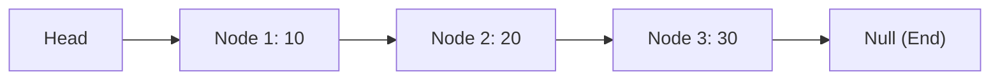

-   Doubly linked list

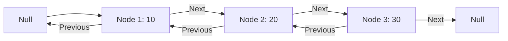
- Circular Linked List

- Circular doubly linked list
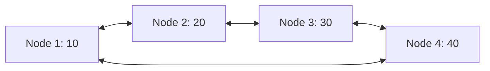


## 1.3. Stack

Last-In-First-Out

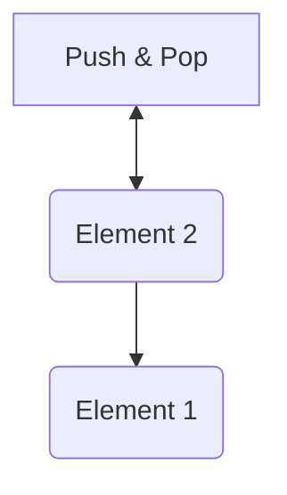

-   `Push`: Add an element to the top of a stack
-   `Pop`: Remove an element from the top of a stack
-   `IsEmpty`: Check if the stack is empty
-   `IsFull`: Check if the stack is full
-   `Peek`: Get the value of the top element without removing it

## 1.4. Circular Queue

## 1.5. Queue

First-In-First-Out

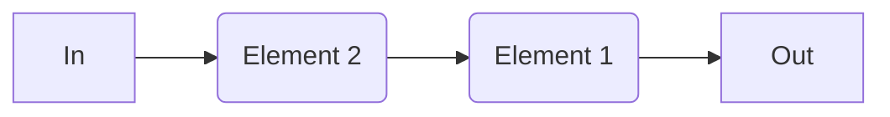

-   `Enqueue` − add an item to the start of the queue.
-   `Dequeue` − remove an item from the front of the queue.
-   `Peek` − Gets the element at the front of the queue without removing it.
-   `Isfull` − Checks if the queue is full.
-   `Isempty` − Checks if the queue is empty

Types of Queue

-   **Circular Queue** - Last element points to the first element making a circular link

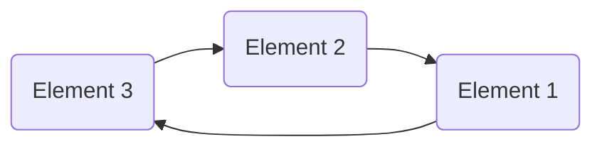

-   **Priority Queue** - Insertion occurs based on the arrival of the values and removal based on priority
-   **Deque** - insertion and removal can be performed in other way

## 1.6. Deque (Double-ended Queue)

Insertion and removal of elements can either be performed from the front or the rear. Does not follow FIFO rule

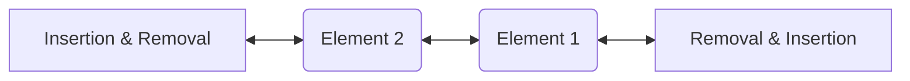

## Hash Tables

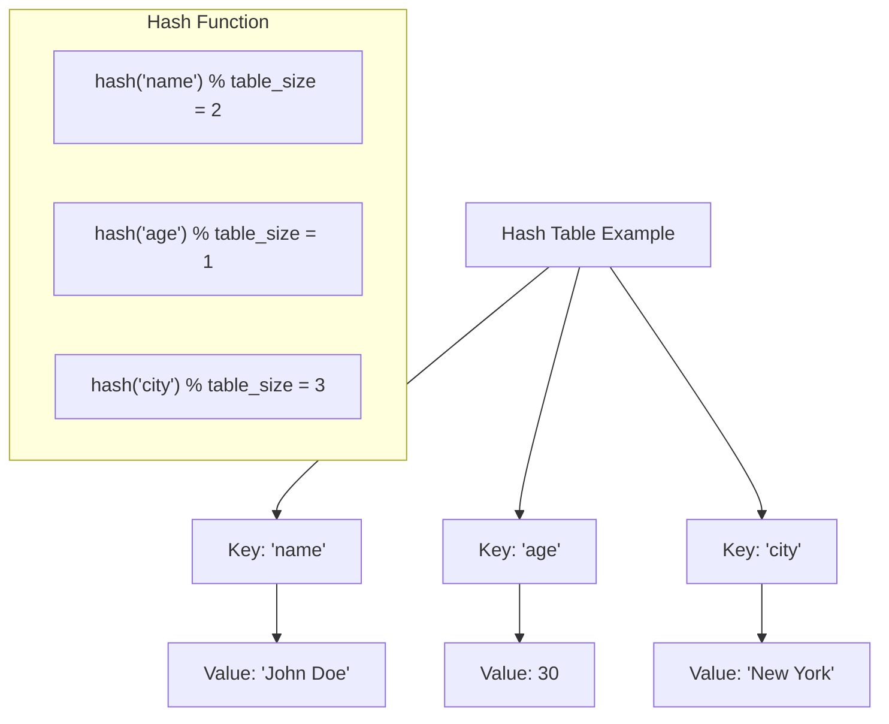

## Trees

<!-- ```mermaid -->

<!-- ``` -->

## Binary Trees

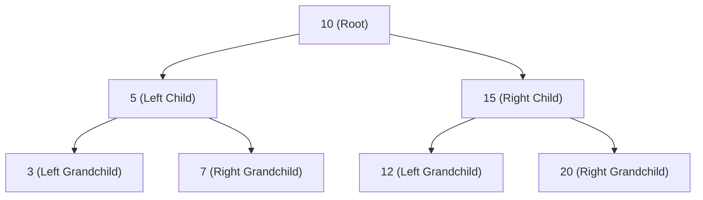

## Binary Search Trees (BST)

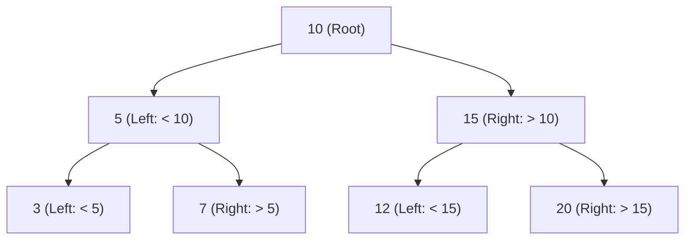

## Advanced Tree Structurs

<!-- ```mermaid

``` -->

## Graphs

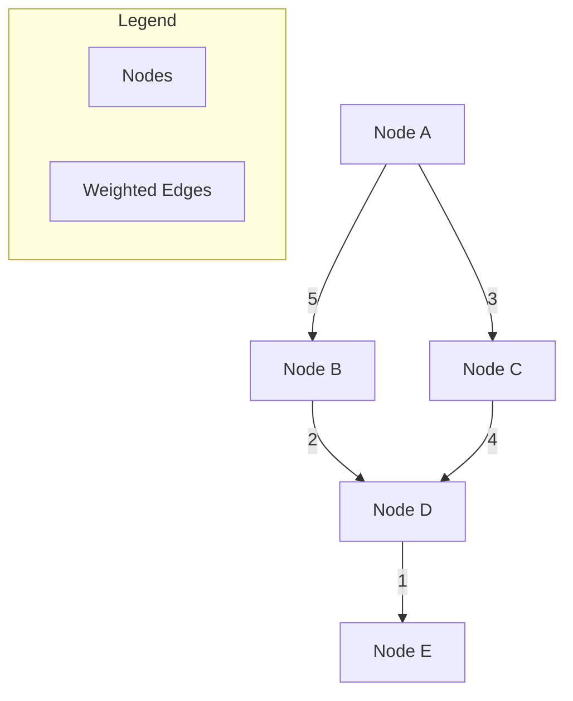
