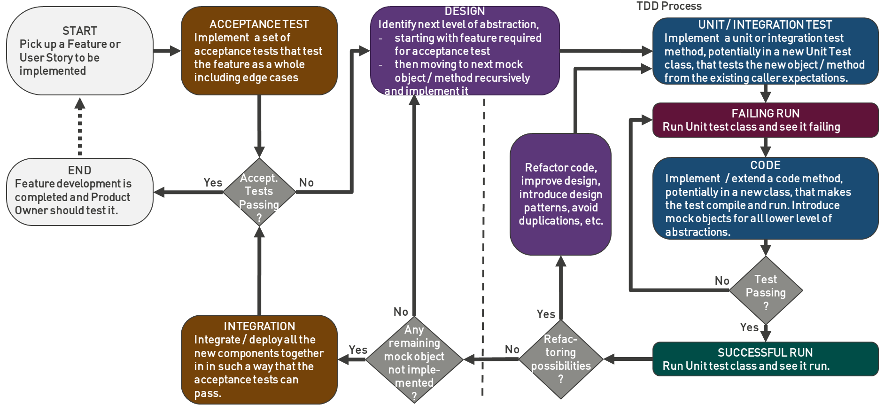

# 1. :test_tube: TDD and Refactoring

## 1.1. :bookmark_tabs: TOC

## 1.2. :gear: TDD (Test-Driven Development)

!!! info "TDD Concept"
    TDD is about driving development from tests, offering a more iterative approach.

### 1.2.1. :footprints: Steps

1. Express intent in the form of a test
2. Test the test by Running it and Seeing it **Fail**
3. Create the **Minimum code** to meet the needs of the test
4. Run it and see it **Pass**
5. Now in a stable, passing state, **Refactor** test and code for quality and generality
6. Repeat

### 1.2.2. :trophy: Attributes of Good Code

- **Modular**
- **Loosely Coupled**
- **Cohesive**
- **Separation of Concerns**
- **Information Hiding**

### 1.2.3. :scales: Two Important Classes of Test:

- **Technical Testing**
- **User-Centered Testing**

### 1.2.4. :white_check_mark: Properties of Good Tests:

- **Behavioral Focus**
- **Executable Specifications**
- **Control the Variables**
- **Repeatable and Reliable**

### 1.2.5. :no_entry: Common Testing Anti-pattern: Excessive Setup

!!! danger "Causes and Problems"
    - **Cause**: Poor Separation of Concerns in System under Test (SUT)
    - **Problems**:
        - Test and SUT are tightly-coupled and so Fragile
        - Result is inflexible
        - Hard to Understand and Debug

!!! tip "Corrections"
    - Improve Separation of Concerns in SUT
    - Improve Abstraction in SUT
    - Write Tests First!

### 1.2.6. :bulb: In TDD

- Focus on Interface Design
- Test Behavior Not Implementation
- Use Collaborators as Points of Measurements
- Inject Fake points of measurement with dependency injection

## 1.3. :recycle: Refactoring Legacy Code

### 1.3.1. :camera: Approval Testing

Like snapshot testing, where the test compares function output with a previously saved snapshot of a function output every time the code is run.

### 1.3.2. :ladder: Steps

1. **Reduce Clutter**
    - Remove unnecessary comments and make variable names more informative
    - Remove dead code
2. **Reduce Cyclomatic complexity** (reduce number of branches)
    - Extract a method
    - Separate concerns
3. **Compose Methods**
    - Organize in a way using labels and names to make it easy to understand what the method does

!!! quote "Key Principle"
    "Move stuff that's related closer together
    Move stuff that's unrelated further apart"

!!! tip "Writing Test Names"
    When writing tests, it can help to think of the name for the test by starting it with 'should'

# 2. :books: Reference

- [Test Driven Development - What? Why? and How?](https://www.youtube.com/watch?v=llaUBH5oayw&list=PLwLLcwQlnXByqD3a13UPeT4SMhc3rdZ8q&index=2)
- [Does TDD Lead to better software design?](https://www.youtube.com/watch?v=fSvQNG7Rz-8&list=PLwLLcwQlnXByqD3a13UPeT4SMhc3rdZ8q&index=3)