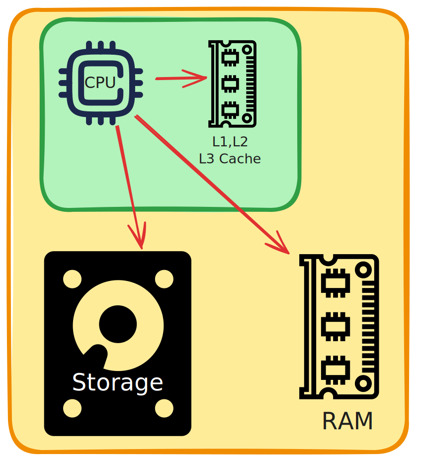

# 1. System Design

## Computer Architecture

{ width="300" }

Computures use bit's (0 or 1) to represent data and commands

- `bit` - 0 or 1
- `byte` - 8 bits
- `KB` - 1024 bytes
- `MB` - 1024 KBs
- `GB` - 1024 MBs
- `TB` - 1024 GBs
- etc...

## Storage

Arranged from slowest to fastest and largest to smallest possible size:

- `HDD` | `SSD` - Non-volatile (retains data without power)
- `RAM` - Volatile (loses data without power)
- `Cache` - Order of CPU looking for data in cache (L1 -> L2 -> L3 -> RAM)

## CPU

Fetches decodes and executes instructions

Can read/write from RAM/Disk/Cache data

## High-level Architecture of a Production App

### CI/CD
Continuous Integration and Continuous Deployment

`Load Balancer` - ensures the user requests are evenly distributed between servers
`Logging & Monitoring` - standard practice is to store those on a separate server from production server.

# Resources

- [System Design Concepts Course and Interview Prep| freeCodeCamp.org](https://www.youtube.com/watch?v=F2FmTdLtb_4)