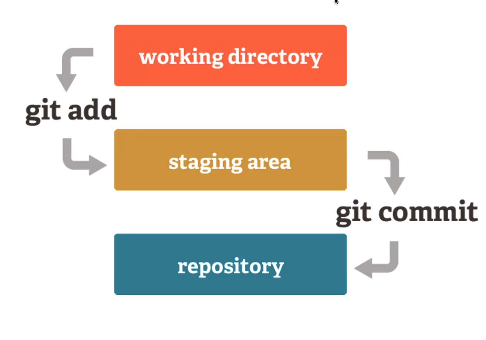
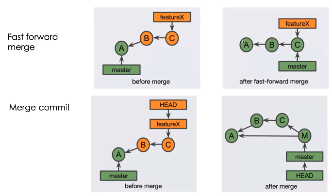
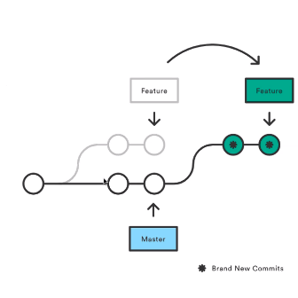
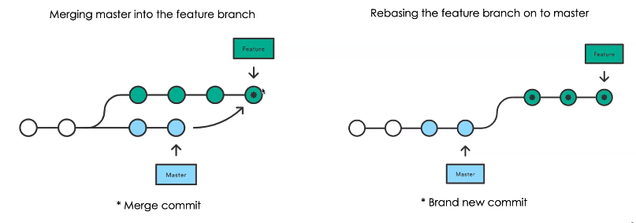

# 1. Git

Git is a distributed version control system

## 1.1. :beginner: Git 101



!!! info "Note"
    This diagram is missing the remote repo

## 1.2. :scroll: Scenarios

### 1.2.1. :pencil2: Modifying pushed commit (changes and message)

!!! tip "Amending a pushed commit"
    If you pushed a commit but realize you pushed something wrong, you can amend your previous commit:

1. To change commit content without changing message:
   ```
   git commit --no-edit --amend
   ```

2. To change commit message:
   ```
   git commit --amend -m 'New commit message'
   ```

3. After amending, force push the changes:
   ```
   git push --force
   ```

### 1.2.2. :rewind: Pushed changes that were not supposed to be committed

!!! danger "Removing unwanted pushed changes"
    1. Move back `n` commits:
       ```
       git reset HEAD~n
       ```
    2. Example: Move back two commits:
       ```
       git reset HEAD~2
       ```
    3. Delete all changes:
       ```
       git reset HEAD --hard
       ```
    4. :warning: **WARNING**: Force push changes (rewriting history)
        ```
        git push --force
        ```

### 1.2.3. :cherries: Cherry Picking

!!! info "Moving specific commits between branches"
    1. Checkout the target branch (e.g., master)
    2. Cherry-pick the desired commit:
       ```
       git cherry-pick <commit-hash>
       ```
    3. To merge the rest of the source branch:
       ```
       git rebase <source-branch>
       ```

### 1.2.4. :snail: :arrow_right: :rabbit2: Optimizing slow local Git

!!! tip "Speed up Git with garbage collection"
    Run `git gc` to perform housekeeping tasks:
    
    - Compress file revisions
    - Remove unreachable objects
    - Pack refs
    - Prune reflog
    - Clean rerere metadata

### 1.2.5. :sparkles: Creating and Pushing new branch

!!! info "Automatically set up remote branch"
    For Git version 2.37.0 and later:
    ```bash
    git config --global --add --bool push.autoSetupRemote true
    ```
    Now `git push` will automatically set up the remote branch

### 1.2.6. :compression: Squashing commits that contain a merge

!!! tip "Squash feature branch commits"
    1. Create a temporary branch from master:
       ```
       git checkout -b temp master
       ```
    2. Squash-merge the feature branch:
       ```
       git merge --squash feature
       ```
    3. Commit changes:
       ```
       git commit -m "feature"
       ```
    4. Point feature branch to temp branch:
       ```
       git checkout feature
       git reset --hard temp
       ```
    5. Delete temporary branch:
       ```
       git branch -d temp
       ```
    6. Force push changes
        ```
        git push --force
        ```

### 1.2.7. :part_alternation_mark: Revert part of the commit

!!! tip "Partially revert a commit"
    1. Create a new branch:
       ```
       git checkout -b revertBranch
       ```
    2. Revert the commit:
       ```
       git revert <commit-hash>
       ```
    3. Reset the last commit to staging:
       ```
       git reset HEAD~1
       ```
    4. Remove parts you want to keep from staging

### 1.2.8. :see_no_evil: Gitignore file without deleting it, and not tracking changes

!!! info "Ignore changes to tracked files"
    - Disable tracking:
      ```
      git update-index --assume-unchanged <file-or-directory>
      ```
    - Re-enable tracking:
      ```
      git update-index --no-assume-unchanged <file>
      ```
    - View files with disabled tracking:
      ```
      git ls-files -v | grep ^[h]
      ```

### 1.2.9. :capital_abcd: Git not noticing folder and file capitalization changes

!!! tip "Make Git case-sensitive"
    - For a single folder:
      ```
      git config core.ignorecase false
      ```
    - Globally:
      ```
      git config --global core.ignorecase true
      ```

### 1.2.10. :twisted_rightwards_arrows: Rebasing feature branch with develop when based on another feature branch

!!! tip "Interactive rebase to update feature branch"
    1. Start interactive rebase:
       ```
       git rebase -i master
       ```
    2. Mark commits to keep (`p`) or drop (`d`)
    3. Force push changes:
       ```
       git push --force
       ```

!!! info "Rebase command options"
    - `p`, `pick`: use commit
    - `r`, `reword`: use commit, edit message
    - `e`, `edit`: use commit, stop for amending
    - `s`, `squash`: meld into previous commit
    - `f`, `fixup`: like squash, discard message
    - `x`, `exec`: run command using shell
    - `b`, `break`: stop here
    - `d`, `drop`: remove commit
    - `l`, `label`: label current HEAD
    - `t`, `reset`: reset HEAD to a label
    - `m`, `merge`: create a merge commit

## 1.3. :label: Tags

- View tags: `git tag`
- Create annotated tag: `git tag -a -m "includes feature 1" v0.1`

## 1.4. :twisted_rightwards_arrows: Merge



## 1.5. :recycle: Rebase

!!! info "Rebasing"
    - Moves or combines a sequence of commits to a new base commit
    - Maintains a linear project history



## 1.6. :scales: Rebase vs Merge



## 1.7. :arrows_counterclockwise: Resetting local branch to origin

!!! tip "Reset local branch to match remote"
    1. Fetch all changes:
       ```
       git fetch --all
       ```
    2. Reset to origin:
       ```
       git reset --hard origin/<branch>
       ```


# 2. :books: Reference

- For more information on rewriting history, visit: [Git Tools - Rewriting History](https://git-scm.com/book/en/v2/Git-Tools-Rewriting-History)
