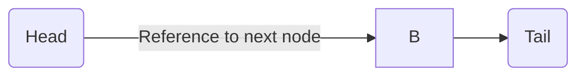
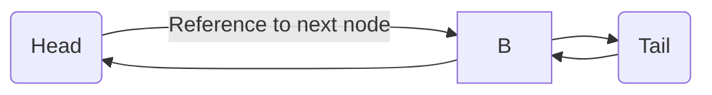
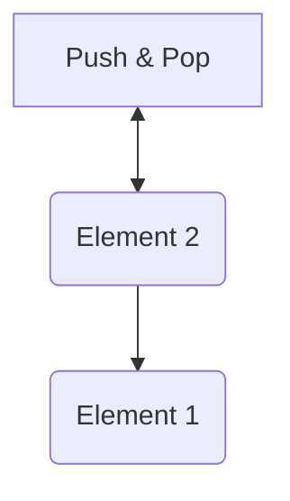
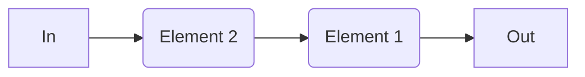
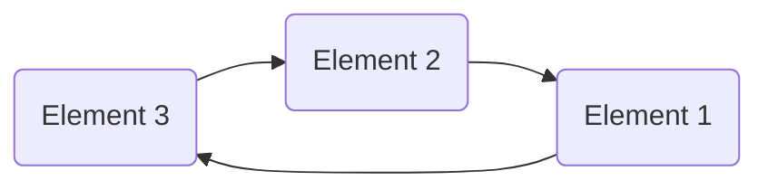
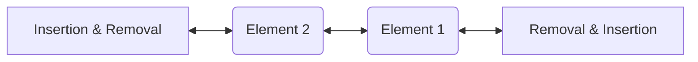

# 1. Data Structures and Algorithms


# 2. Algorithms

## 2.1. Time Complexity

<https://www.bigocheatsheet.com/>

`Big O` - a mathematical notation that describes the limiting behaviour of a function when the argument tends towards a particular value or infinity.


**Polynomial Runtimes** - Considered efficient and adequate to be used.

| Big O        | Name             | Example                       |
| ------------ | ---------------- | ----------------------------- |
| `O(1)`       | Constant Time    | Accessing a HashMap element   |
| `O(log n)`   | Logarithmic Time | Basically reverse of exponent |
| `O(n)`       | Linear Time      | Iterating an array            |
| `O(n^2)`     | Quadratic Time   | Bubble sort                   |
| `O(n log n)` | Quasilinear Time | Merge sort                    |

**Exponential Runtimes** - Number increases exponentially, far too expensive to be used.

| Big O    | Name                                | Example                                |
| -------- | ----------------------------------- | -------------------------------------- |
| `O(2^n)` | Exponential Time                    | Usually used in brute force algorithms |
| `O(n!)`  | Factorial Time / Combinatorial Time | Travelling salesman                    |

## 2.2. Space Complexity

Like time complexity, is measured in the worst case scenario.

The size of the data structure doesn't matter in space complexity calculation. What matters is how much additional storage is needed as the algorithm progresses.

## 2.3. Recursion and Space Complexity

> In languages like python which prefer iterative approaches, languages have maximum recursive depth after which the operation fails.
>
> > Some languages have tail optimisation, which means there is no recursive depth.

-   Recursive approach doesn't modify underlying data
-   In recursive approach additional storage is used for arguments and function calls to be stored on the stack (Hence the stack overflow error)

## 2.4. Search Algorithms

### 2.4.1. Linear Search - `O(n)`

List **L** of **n** and target **T**, find the index of the target **T** in **L**.

1. Set i to 0.
2. If $L_i$ = T, the search terminates successfully; return i.
3. Increase i by 1.
4. If i < n, go to step 2. Otherwise, the search terminates unsuccessfully.

> If the list is ordered, can improve worst case scenario if the value is not present by checking if the value should have been passed by then

**Python**

```python
"""
return - Index of target position in list, else returns -1
"""
def linear_search(list, target):
        # Iterate over all elements of the list
        for i in range(0, len(list)): # Can simplify with enumerate
                if list[i] == target:
                        return i
        # Return None if target wasn't found
        return -1
```

**Java**

```java
public class Search {
        public static int linearSearch(int[] list, int target) {
                for(int i = 0; i < list.length; index++) {
                        if (list[i] == target) return i;
                }
                return -1;
        }
}
```

---

**Time Complexity**
| Best Case | Average Case | Worst Case |
| ------------------------------------- | ------------ | ------------------------------------ |
| `O(1)` | `O(n/2)` | `O(n)` |
| When target<br> is the first element | | When target<br> is the last element |

---

**Space Complexity**
| Worst Case |
| ----------------------------------------------------------- |
| `O(1)` |
| It only consumes space for 3 integers ( length , value, i ) |

**<span style="color:green">Pros:</span>**

-   Works on random and unsorted lists
-   Easy to implement

**<span style="color:red">Cons:</span>**

-   Only makes sense to use on short lists

### 2.4.2. Binary Search - `O(log n)`

Given an array A of n elements with values $A_0$ , $A_1$ , $A_2$ , … , $A _{n − 1}$ sorted such that $A_0$ ≤ $A_1$ ≤ $A_2$ ≤ ⋯ ≤ $A_{n − 1}$, and target value T, find the index of T in A.

1. Set L to 0 and R to n − 1 .
2. If L > R , the search terminates as unsuccessful.
3. Set m (middle index) to the floor of $\frac{L + R}{2}$.
4. If $A_m$ < T , set L to m + 1 and go to step 2.
5. If $A_m$ > T , set R to m − 1 and go to step 2.
6. Now $A_m$ = T , return m .

---

Iterative

**Python**

```python
def binary_search(list, target):
        first = 0
        last = len(list) - 1
        while first <= last:
                midpoint = (first + last) // 2
                # // floor division - rounds down
                if list[midpoint] == target:
                        return midpoint
                elif list[midpoint] < target:
                        first = midpoint + 1
                else:
                        last = midpoint - 1

        return -1
```

**Java**

```java
public class Search {
        public static Integer binarySearch(int[] list, int target) {
                int first = 0;
                int last = list.length -1;

                while(first <= last) {
                        int mid = (first + last) / 2;

                        if (list[mid] == target) {
                                return mid;
                        } else if (input[mid] < target) {
                                first = mid + 1;
                        } else {
                                last = mid - 1;
                        }
                }

                return -1;
        }
}
```

---

Recursive

**Python**

```python
def recursive_binary_search(list, target, start=0, end=None):
        if end is None:
                end = len(list) - 1
        if start > end:
                return -1

        mid = (start + end) // 2

        if target == list[mid]:
                return mid
        else:
                if target < list[mid]:
                        return recursive_binary_search(list, target, start, mid-1)
                else:
                        return recursive_binary_search(list, target, mid+1, end)
```

**Java**

```Java
public class RecursiveBinarySearch {
        public static ini binarySearch(int[] list, int target) {
                return binarySearchHelper(list, target, 0, list.length -1)
        }

        public static int binarySearchHelper(int[] input, int target, int start, int end) {
                if (start >= end) {
                        return -1;
                } else {
                        int mid = start + (end - start) / 2;

                        if (target < input[mid]) {
                                return binarySearchHelper(input, target, start, mid-1);
                        } else if (target > input[mid]) {
                                return binarySearchHelper(input, target, mid+1, end);
                        } else {
                                return mid;
                        }
                }
        }
}
```

**Time Complexity**
| Best Case | Average Case | Worst Case |
| -------------------------------------------- | ------------ | ---------- |
| `O(1)` | `O(log n)` | `O(log n)` |
| When target<br> is the first middle element | | |

Iterative
**Space Complexity**
| Worst Case |
| ---------- |
| `O(1)` |
| |

Recursive
**Space Complexity**
| Worst Case |
| ---------------------------------------------------------- |
| `O(log n)` |
| If using a list splice function to half list on every call |

**<span style="color:green">Pros:</span>**

-   Efficient on large datasets

**<span style="color:red">Cons:</span>**

-   Only works on sorted lists

## 2.5. Sort Algorithms

# 3. Data Structures

<style type="text/css">
.tg    {border-collapse:collapse;border-spacing:0;}
.tg td{border-color:black;border-style:solid;border-width:1px;font-family:Arial, sans-serif;font-size:14px;
    overflow:hidden;padding:10px 5px;word-break:normal;}
.tg th{border-color:black;border-style:solid;border-width:1px;font-family:Arial, sans-serif;font-size:14px;
    font-weight:normal;overflow:hidden;padding:10px 5px;word-break:normal;}
.tg .tg-q2a3{background-color:#FF0;border-color:inherit;text-align:center;vertical-align:top}
.tg .tg-hpcd{background-color:#E3E3E3;border-color:inherit;text-align:center;vertical-align:top}
.tg .tg-g3z5{background-color:#53D000;border-color:inherit;color:#444;text-align:center;vertical-align:top}
.tg .tg-2r8t{background-color:#53D000;border-color:inherit;text-align:center;vertical-align:top}
.tg .tg-3178{background-color:#EFEFEF;border-color:inherit;text-align:left;vertical-align:top}
.tg .tg-hadw{background-color:#C8EA00;border-color:inherit;text-align:center;vertical-align:top}
.tg .tg-iaeg{background-color:#C0C0C0;border-color:inherit;text-align:left;vertical-align:top}
.tg .tg-0pky{border-color:inherit;text-align:left;vertical-align:top}
.tg .tg-89x0{border-color:inherit;color:#444;text-align:left;vertical-align:top}
.tg .tg-ddvw{background-color:#FFC543;border-color:inherit;text-align:center;vertical-align:top}
</style>
<table class="tg">
<thead>
    <tr>
        <th class="tg-iaeg"><span style="font-weight:normal;background-color:#C0C0C0">Data Structure</span></th>
        <th class="tg-iaeg" colspan="8"><span style="font-weight:normal;background-color:#C0C0C0">Time Complexity</span></th>
        <th class="tg-iaeg"><span style="font-weight:normal;background-color:#C0C0C0">Space complexity</span></th>
    </tr>
</thead>
<tbody>
    <tr>
        <td class="tg-0pky"></td>
        <td class="tg-3178" colspan="4"><span style="background-color:#EFEFEF">Average</span></td>
        <td class="tg-3178" colspan="4"><span style="background-color:#EFEFEF">Worst</span></td>
        <td class="tg-3178"><span style="background-color:#EFEFEF">Worst</span></td>
    </tr>
    <tr>
        <td class="tg-0pky"></td>
        <td class="tg-3178"><span style="background-color:#EFEFEF">Access</span></td>
        <td class="tg-3178"><span style="background-color:#EFEFEF">Search</span></td>
        <td class="tg-3178"><span style="background-color:#EFEFEF">Insert</span></td>
        <td class="tg-3178"><span style="background-color:#EFEFEF">Delete</span></td>
        <td class="tg-3178"><span style="background-color:#EFEFEF">Access</span></td>
        <td class="tg-3178"><span style="background-color:#EFEFEF">Search</span></td>
        <td class="tg-3178"><span style="background-color:#EFEFEF">Insert</span></td>
        <td class="tg-3178"><span style="background-color:#EFEFEF">Delete</span></td>
        <td class="tg-0pky"></td>
    </tr>
    <tr>
        <td class="tg-0pky"><a href="http://en.wikipedia.org/wiki/Array_data_structure" target="_blank" rel="noopener noreferrer">Array</a></td>
        <td class="tg-2r8t"><span style="background-color:#53D000">O(1)</span></td>
        <td class="tg-q2a3"><span style="background-color:#FF0">O(n)</span></td>
        <td class="tg-q2a3"><span style="background-color:#FF0">O(n)</span></td>
        <td class="tg-q2a3"><span style="background-color:#FF0">O(n)</span></td>
        <td class="tg-g3z5">O(1)</td>
        <td class="tg-q2a3"><span style="background-color:#FF0">O(n)</span></td>
        <td class="tg-q2a3"><span style="background-color:#FF0">O(n)</span></td>
        <td class="tg-q2a3"><span style="background-color:#FF0">O(n)</span></td>
        <td class="tg-q2a3"><span style="background-color:#FF0">O(n)</span></td>
    </tr>
    <tr>
        <td class="tg-89x0"><a href="http://en.wikipedia.org/wiki/Stack_(abstract_data_type)"><span style="color:#444;background-color:transparent">Stack</span></a></td>
        <td class="tg-q2a3"><span style="color:black;background-color:yellow">O(n)</span></td>
        <td class="tg-q2a3"><span style="color:black;background-color:yellow">O(n)</span></td>
        <td class="tg-2r8t"><span style="color:black;background-color:#53D000">O(1)</span></td>
        <td class="tg-2r8t"><span style="color:black;background-color:#53D000">O(1)</span></td>
        <td class="tg-q2a3"><span style="color:black;background-color:yellow">O(n)</span></td>
        <td class="tg-q2a3"><span style="color:black;background-color:yellow">O(n)</span></td>
        <td class="tg-2r8t"><span style="color:black;background-color:#53D000">O(1)</span></td>
        <td class="tg-2r8t"><span style="color:black;background-color:#53D000">O(1)</span></td>
        <td class="tg-q2a3"><span style="color:black;background-color:yellow">O(n)</span></td>
    </tr>
    <tr>
        <td class="tg-89x0"><a href="http://en.wikipedia.org/wiki/Queue_(abstract_data_type)"><span style="color:#444;background-color:transparent">Queue</span></a></td>
        <td class="tg-q2a3"><span style="color:black;background-color:yellow">O(n)</span></td>
        <td class="tg-q2a3"><span style="color:black;background-color:yellow">O(n)</span></td>
        <td class="tg-2r8t"><span style="color:black;background-color:#53D000">O(1)</span></td>
        <td class="tg-2r8t"><span style="color:black;background-color:#53D000">O(1)</span></td>
        <td class="tg-q2a3"><span style="color:black;background-color:yellow">O(n)</span></td>
        <td class="tg-q2a3"><span style="color:black;background-color:yellow">O(n)</span></td>
        <td class="tg-2r8t"><span style="color:black;background-color:#53D000">O(1)</span></td>
        <td class="tg-2r8t"><span style="color:black;background-color:#53D000">O(1)</span></td>
        <td class="tg-q2a3"><span style="color:black;background-color:yellow">O(n)</span></td>
    </tr>
    <tr>
        <td class="tg-89x0"><a href="http://en.wikipedia.org/wiki/Singly_linked_list#Singly_linked_lists"><span style="color:#444;background-color:transparent">Singly-Linked List</span></a></td>
        <td class="tg-q2a3"><span style="color:black;background-color:yellow">O(n)</span></td>
        <td class="tg-q2a3"><span style="color:black;background-color:yellow">O(n)</span></td>
        <td class="tg-2r8t"><span style="color:black;background-color:#53D000">O(1)</span></td>
        <td class="tg-2r8t"><span style="color:black;background-color:#53D000">O(1)</span></td>
        <td class="tg-q2a3"><span style="color:black;background-color:yellow">O(n)</span></td>
        <td class="tg-q2a3"><span style="color:black;background-color:yellow">O(n)</span></td>
        <td class="tg-2r8t"><span style="color:black;background-color:#53D000">O(1)</span></td>
        <td class="tg-2r8t"><span style="color:black;background-color:#53D000">O(1)</span></td>
        <td class="tg-q2a3"><span style="color:black;background-color:yellow">O(n)</span></td>
    </tr>
    <tr>
        <td class="tg-89x0"><a href="http://en.wikipedia.org/wiki/Doubly_linked_list"><span style="color:#444;background-color:transparent">Doubly-Linked List</span></a></td>
        <td class="tg-q2a3"><span style="color:black;background-color:yellow">O(n)</span></td>
        <td class="tg-q2a3"><span style="color:black;background-color:yellow">O(n)</span></td>
        <td class="tg-2r8t"><span style="color:black;background-color:#53D000">O(1)</span></td>
        <td class="tg-2r8t"><span style="color:black;background-color:#53D000">O(1)</span></td>
        <td class="tg-q2a3"><span style="color:black;background-color:yellow">O(n)</span></td>
        <td class="tg-q2a3"><span style="color:black;background-color:yellow">O(n)</span></td>
        <td class="tg-2r8t"><span style="color:black;background-color:#53D000">O(1)</span></td>
        <td class="tg-2r8t"><span style="color:black;background-color:#53D000">O(1)</span></td>
        <td class="tg-q2a3"><span style="color:black;background-color:yellow">O(n)</span></td>
    </tr>
    <tr>
        <td class="tg-89x0"><a href="http://en.wikipedia.org/wiki/Skip_list"><span style="color:#444;background-color:transparent">Skip List</span></a></td>
        <td class="tg-hadw"><span style="color:black;background-color:#C8EA00">O(log(n))</span></td>
        <td class="tg-hadw"><span style="color:black;background-color:#C8EA00">O(log(n))</span></td>
        <td class="tg-hadw"><span style="color:black;background-color:#C8EA00">O(log(n))</span></td>
        <td class="tg-hadw"><span style="color:black;background-color:#C8EA00">O(log(n))</span></td>
        <td class="tg-q2a3"><span style="color:black;background-color:yellow">O(n)</span></td>
        <td class="tg-q2a3"><span style="color:black;background-color:yellow">O(n)</span></td>
        <td class="tg-q2a3"><span style="color:black;background-color:yellow">O(n)</span></td>
        <td class="tg-q2a3"><span style="color:black;background-color:yellow">O(n)</span></td>
        <td class="tg-ddvw"><span style="color:black;background-color:#FFC543">O(n log(n))</span></td>
    </tr>
    <tr>
        <td class="tg-89x0"><a href="http://en.wikipedia.org/wiki/Hash_table"><span style="color:#444;background-color:transparent">Hash Table</span></a></td>
        <td class="tg-hpcd"><span style="color:black;background-color:#E3E3E3">N/A</span></td>
        <td class="tg-2r8t"><span style="color:black;background-color:#53D000">O(1)</span></td>
        <td class="tg-2r8t"><span style="color:black;background-color:#53D000">O(1)</span></td>
        <td class="tg-2r8t"><span style="color:black;background-color:#53D000">O(1)</span></td>
        <td class="tg-hpcd"><span style="color:black;background-color:#E3E3E3">N/A</span></td>
        <td class="tg-q2a3"><span style="color:black;background-color:yellow">O(n)</span></td>
        <td class="tg-q2a3"><span style="color:black;background-color:yellow">O(n)</span></td>
        <td class="tg-q2a3"><span style="color:black;background-color:yellow">O(n)</span></td>
        <td class="tg-q2a3"><span style="color:black;background-color:yellow">O(n)</span></td>
    </tr>
    <tr>
        <td class="tg-89x0"><a href="http://en.wikipedia.org/wiki/Binary_search_tree"><span style="color:#444;background-color:transparent">Binary Search Tree</span></a></td>
        <td class="tg-hadw"><span style="color:black;background-color:#C8EA00">O(log(n))</span></td>
        <td class="tg-hadw"><span style="color:black;background-color:#C8EA00">O(log(n))</span></td>
        <td class="tg-hadw"><span style="color:black;background-color:#C8EA00">O(log(n))</span></td>
        <td class="tg-hadw"><span style="font-weight:400;font-style:normal">O(log(n))</span></td>
        <td class="tg-q2a3"><span style="color:black;background-color:yellow">O(n)</span></td>
        <td class="tg-q2a3"><span style="color:black;background-color:yellow">O(n)</span></td>
        <td class="tg-q2a3"><span style="color:black;background-color:yellow">O(n)</span></td>
        <td class="tg-q2a3"><span style="color:black;background-color:yellow">O(n)</span></td>
        <td class="tg-q2a3"><span style="color:black;background-color:yellow">O(n)</span></td>
    </tr>
    <tr>
        <td class="tg-89x0"><a href="https://en.wikipedia.org/wiki/Cartesian_tree"><span style="color:#444;background-color:transparent">Cartesian Tree</span></a></td>
        <td class="tg-hpcd"><span style="color:black;background-color:#E3E3E3">N/A</span></td>
        <td class="tg-hadw"><span style="font-weight:400;font-style:normal">O(log(n))</span></td>
        <td class="tg-hadw"><span style="font-weight:400;font-style:normal">O(log(n))</span></td>
        <td class="tg-hadw"><span style="font-weight:400;font-style:normal">O(log(n))</span></td>
        <td class="tg-hpcd"><span style="color:black;background-color:#E3E3E3">N/A</span></td>
        <td class="tg-q2a3"><span style="color:black;background-color:yellow">O(n)</span></td>
        <td class="tg-q2a3"><span style="color:black;background-color:yellow">O(n)</span></td>
        <td class="tg-q2a3"><span style="color:black;background-color:yellow">O(n)</span></td>
        <td class="tg-q2a3"><span style="color:black;background-color:yellow">O(n)</span></td>
    </tr>
    <tr>
        <td class="tg-89x0"><a href="http://en.wikipedia.org/wiki/B_tree"><span style="color:#444;background-color:transparent">B-Tree</span></a></td>
        <td class="tg-hadw"><span style="font-weight:400;font-style:normal">O(log(n))</span></td>
        <td class="tg-hadw"><span style="font-weight:400;font-style:normal">O(log(n))</span></td>
        <td class="tg-hadw"><span style="font-weight:400;font-style:normal">O(log(n))</span></td>
        <td class="tg-hadw"><span style="font-weight:400;font-style:normal">O(log(n))</span></td>
        <td class="tg-hadw"><span style="color:black;background-color:#C8EA00">O(log(n))</span></td>
        <td class="tg-hadw"><span style="color:black;background-color:#C8EA00">O(log(n))</span></td>
        <td class="tg-hadw"><span style="color:black;background-color:#C8EA00">O(log(n))</span></td>
        <td class="tg-hadw"><span style="color:black;background-color:#C8EA00">O(log(n))</span></td>
        <td class="tg-q2a3"><span style="color:black;background-color:yellow">O(n)</span></td>
    </tr>
    <tr>
        <td class="tg-89x0"><a href="http://en.wikipedia.org/wiki/Red-black_tree"><span style="color:#444;background-color:transparent">Red-Black Tree</span></a></td>
        <td class="tg-hadw"><span style="font-weight:400;font-style:normal">O(log(n))</span></td>
        <td class="tg-hadw"><span style="font-weight:400;font-style:normal">O(log(n))</span></td>
        <td class="tg-hadw"><span style="font-weight:400;font-style:normal">O(log(n))</span></td>
        <td class="tg-hadw"><span style="font-weight:400;font-style:normal">O(log(n))</span></td>
        <td class="tg-hadw"><span style="color:black;background-color:#C8EA00">O(log(n))</span></td>
        <td class="tg-hadw"><span style="color:black;background-color:#C8EA00">O(log(n))</span></td>
        <td class="tg-hadw"><span style="color:black;background-color:#C8EA00">O(log(n))</span></td>
        <td class="tg-hadw"><span style="color:black;background-color:#C8EA00">O(log(n))</span></td>
        <td class="tg-q2a3"><span style="color:black;background-color:yellow">O(n)</span></td>
    </tr>
    <tr>
        <td class="tg-89x0"><a href="https://en.wikipedia.org/wiki/Splay_tree"><span style="color:#444;background-color:transparent">Splay Tree</span></a></td>
        <td class="tg-hpcd"><span style="color:black;background-color:#E3E3E3">N/A</span></td>
        <td class="tg-hadw"><span style="font-weight:400;font-style:normal">O(log(n))</span></td>
        <td class="tg-hadw"><span style="font-weight:400;font-style:normal">O(log(n))</span></td>
        <td class="tg-hadw"><span style="font-weight:400;font-style:normal">O(log(n))</span></td>
        <td class="tg-hpcd"><span style="color:black;background-color:#E3E3E3">N/A</span></td>
        <td class="tg-hadw"><span style="color:black;background-color:#C8EA00">O(log(n))</span></td>
        <td class="tg-hadw"><span style="color:black;background-color:#C8EA00">O(log(n))</span></td>
        <td class="tg-hadw"><span style="color:black;background-color:#C8EA00">O(log(n))</span></td>
        <td class="tg-q2a3"><span style="color:black;background-color:yellow">O(n)</span></td>
    </tr>
    <tr>
        <td class="tg-89x0"><a href="http://en.wikipedia.org/wiki/AVL_tree"><span style="color:#444;background-color:transparent">AVL Tree</span></a></td>
        <td class="tg-hadw"><span style="font-weight:400;font-style:normal">O(log(n))</span></td>
        <td class="tg-hadw"><span style="font-weight:400;font-style:normal">O(log(n))</span></td>
        <td class="tg-hadw"><span style="font-weight:400;font-style:normal">O(log(n))</span></td>
        <td class="tg-hadw"><span style="font-weight:400;font-style:normal">O(log(n))</span></td>
        <td class="tg-hadw"><span style="color:black;background-color:#C8EA00">O(log(n))</span></td>
        <td class="tg-hadw"><span style="color:black;background-color:#C8EA00">O(log(n))</span></td>
        <td class="tg-hadw"><span style="color:black;background-color:#C8EA00">O(log(n))</span></td>
        <td class="tg-hadw"><span style="color:black;background-color:#C8EA00">O(log(n))</span></td>
        <td class="tg-q2a3"><span style="color:black;background-color:yellow">O(n)</span></td>
    </tr>
    <tr>
        <td class="tg-89x0"><a href="http://en.wikipedia.org/wiki/K-d_tree"><span style="color:#444;background-color:transparent">KD Tree</span></a></td>
        <td class="tg-hadw"><span style="font-weight:400;font-style:normal">O(log(n))</span></td>
        <td class="tg-hadw"><span style="font-weight:400;font-style:normal">O(log(n))</span></td>
        <td class="tg-hadw"><span style="font-weight:400;font-style:normal">O(log(n))</span></td>
        <td class="tg-hadw"><span style="font-weight:400;font-style:normal">O(log(n))</span></td>
        <td class="tg-q2a3"><span style="color:black;background-color:yellow">O(n)</span></td>
        <td class="tg-q2a3"><span style="color:black;background-color:yellow">O(n)</span></td>
        <td class="tg-q2a3"><span style="color:black;background-color:yellow">O(n)</span></td>
        <td class="tg-q2a3"><span style="color:black;background-color:yellow">O(n)</span></td>
        <td class="tg-q2a3"><span style="color:black;background-color:yellow">O(n)</span></td>
    </tr>
</tbody>
</table>
<!-- Can by modified with https://www.tablesgenerator.com/html_tables# -->

## 3.1. Arrays

Contiguous Data Structure - Easy to retrieve the data as they can be referred by the index

Non Contiguous Data Structure - next element is referred by a pointer which is stored by the previous element

Two types of Arrays:

-   `Homogeneous Containers` Stores only one type of data
-   `Heterogeneous Structures` Store multiple different types of data

> Because python is using a heterogeneous structure, it uses pointers to refer to different type elements

## 3.2. Linked Lists

Self Referential Objects

-   Singly linked list



-   Doubly linked list



## 3.3. Stack

Last-In-First-Out



-   `Push`: Add an element to the top of a stack
-   `Pop`: Remove an element from the top of a stack
-   `IsEmpty`: Check if the stack is empty
-   `IsFull`: Check if the stack is full
-   `Peek`: Get the value of the top element without removing it

## 3.4. Circular Queue

## 3.5. Queue

First-In-First-Out



-   `Enqueue` − add an item to the start of the queue.
-   `Dequeue` − remove an item from the front of the queue.
-   `Peek` − Gets the element at the front of the queue without removing it.
-   `Isfull` − Checks if the queue is full.
-   `Isempty` − Checks if the queue is empty

Types of Queue

-   **Circular Queue** - Last element points to the first element making a circular link



-   **Priority Queue** - Insertion occurs based on the arrival of the values and removal based on priority
-   **Deque** - insertion and removal can be performed in other way

## 3.6. Deque (Double-ended Queue)

Insertion and removal of elements can either be performed from the front or the rear. Does not follow FIFO rule



# 4. Sources

-   [freeCodeCamp](https://www.youtube.com/watch?v=8hly31xKli0) Stopped at 2:56
