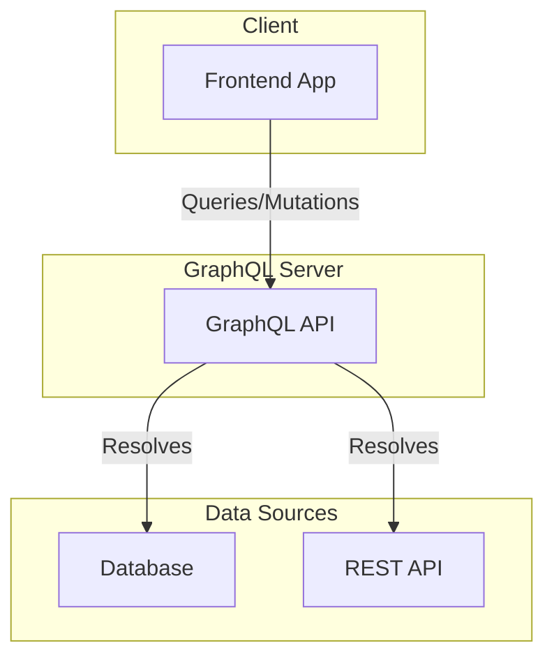
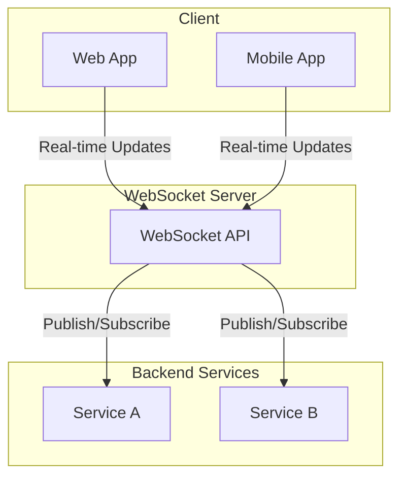

# Notes
!!! note
    Work in progress, please use Header Navigation:)

## Legend

-   :construction: - Currently being worked on (WIP)
-   :no_entry: - Abandoned notes
-   :white_check_mark: - Done
-   :spider_web: - Outdated
-   :baby: - I am too new, nothing useful here yet

---

-   [Artificial Intelligence - A Modern Approach Book]() :no_entry:
-   [Architecture]()
    <!-- - [Monolithic Architecture]() :baby: -->
    <!-- - [Client-Server Architecture]() :baby: -->
    <!-- - [Microservices Architecture]() :baby: -->
    <!-- - [Service-Oriented Architecture (SOA)]() :baby: -->
    -   [Event-Driven Architecture]() :baby:
    <!-- - [Layered Architecture]() :baby: -->
    <!-- -   [Model-View-Controller (MVC)]() :baby: -->
    <!-- -   [Component-Based Architecture]() :baby: -->
    <!-- -   [Hexagonal (Ports and Adapters) Architecture]() :baby: -->
    <!-- -   [Event Sourcing]() :baby: -->
    <!-- -   [CQRS (Command Query Responsibility Segregation)]() :baby: -->
    <!-- -   [Serverless Architecture]() :baby: -->
    <!-- -   [Blockchain-based Architecture]() :baby: -->
    <!-- -   [N-Tier Architecture]() :baby: -->
    <!-- -   [Container-Based Architecture]() :baby: -->
    <!-- -   [Server-Side Rendering (SSR) and Client-Side Rendering (CSR)]() :baby: -->
    <!-- -   [GraphQL-Based Architecture]() :baby: -->
-   [Data Structures & Algorithms]() :construction: (WIP)
    <!-- - [Data Structures]() :baby: -->
    <!-- - [Sorting Algorithms]() :baby: -->
    <!-- - [Search Algorithms]() :baby: -->
    <!-- - [Algorithm Complexity analysis]() :baby: -->
-   Version Control
    -   [Git]() :construction:
-   Cloud Computing
    -   Azure
        -   [Azure AZ-900 Fundamentals]() :white_check_mark:
        -   [Azure AZ-204 Developer]() :baby:
-   Languages
    -   [JavaScript]()
    -   [Java]() :white_check_mark:
        -   [Java 8]()
    -   [TypeScript]() :white_check_mark:
    -   [Python]() :construction: (WIP 90%)
    -   [Kotlin]() :white_check_mark:
    -   [Go]() :baby:
-   Methodologies and Patterns
    -   [12 Factor App]() :construction: (WIP)
    -   [TDD]() :white_check_mark:
-   [Testing]()
    -   [Types of testing]() :baby: (unit, integration, end-to-end)
-   [Web Dev]()
    -   [API Architectures]() :construction:
    <!-- -   [Swagger]() :baby: -->
    <!-- -   [Postman]() :baby: -->
    -   [CSS]()
    -   Libraries and Frameworks
        -   [ReactJS]()
        -   [Redux]()
        -   [Angular]() :construction:
-   Backend
    -   [Databases]()
        -   [MongoDB]() :baby:
    -   Frameworks
        -   [Spring Boot]()
-   Containerisation and Orchestration
    -   [Docker]() :baby:
    -   [Docker Compose]() :white_check_mark:
-   Authentication and Authorisation
    -   [User authentication methods]() :baby:
    <!-- - [Role-based Access Control]() :baby: -->
    <!-- -   [Security best practices]() :baby: -->
-   Caching and Performance
    -   [Caching strategies]() :baby:
    <!-- - [Load balancing and scaling]() :baby: -->
    <!-- -   [Profiling and optimising code]() :baby: -->
-   Monitoring and Logging
    <!-- - [Log analysis and real-time monitoring]() :baby: -->
    
    ## 1.2. SOAP

## 1.3. GRAPHQL

- 1.4. Apache Kafka

- 1.5. AsyncAPI

- 1.6. RPC

- 1.7. WebSocket

- 1.8. Webhook

- 1.9. MQTT

- 1.10. AMQP
