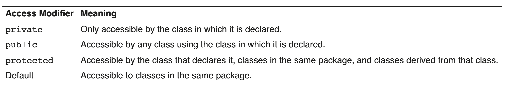

# 1. Java

- [1. Java](#1-java)
  - [1.1. Introduction to Java](#11-introduction-to-java)
    - [1.1.1. Introduction](#111-introduction)
      - [1.1.1.1. Acronyms](#1111-acronyms)
      - [1.1.1.2. Classes](#1112-classes)
    - [1.1.2. Minimum Viable Java](#112-minimum-viable-java)
    - [1.1.3. Packages and the JRE Libraries](#113-packages-and-the-jre-libraries)
  - [1.2. 2 Java Syntax](#12-2-java-syntax)
    - [1.2.1. The String Class](#121-the-string-class)
  - [1.3. 3 SOLID Principles of Object-Oriented Programming](#13-3-solid-principles-of-object-oriented-programming)
    - [1.3.1. Introduction](#131-introduction)
    - [1.3.2. 3.2 Classes](#132-32-classes)
      - [1.3.2.1. SOLID Principle: Single responsibility](#1321-solid-principle-single-responsibility)
    - [1.3.3. Objects](#133-objects)
    - [1.3.4. Creating Classes](#134-creating-classes)
    - [1.3.5. Methods](#135-methods)
      - [1.3.5.1. Method Parameters](#1351-method-parameters)
    - [1.3.6. Constructors](#136-constructors)
      - [1.3.6.1. Object Destruction](#1361-object-destruction)
    - [1.3.7. Encapsulation](#137-encapsulation)
    - [1.3.8. Overloading Methods](#138-overloading-methods)
    - [1.3.9. Inheritance](#139-inheritance)
      - [1.3.9.1. Overriding Methods](#1391-overriding-methods)
      - [1.3.9.2. Overriding Methods Inherited from Object](#1392-overriding-methods-inherited-from-object)
      - [1.3.9.3. SOLID Principle: Open/Closed](#1393-solid-principle-openclosed)
    - [1.3.10. Polymorphism](#1310-polymorphism)
      - [1.3.10.1. Simple Polymorphism](#13101-simple-polymorphism)
        - [1.3.10.1.1. SOLID Principle: Liskov Substitutio](#131011-solid-principle-liskov-substitutio)
    - [1.3.11. Interfaces](#1311-interfaces)
      - [1.3.11.1. Default Methods](#13111-default-methods)
      - [1.3.11.2. SOLID Principle: Dependency Inversion](#13112-solid-principle-dependency-inversion)
      - [1.3.11.3. SOLID Principle: Interface Segregation](#13113-solid-principle-interface-segregation)
      - [1.3.11.4. Abstact Classes](#13114-abstact-classes)
    - [1.3.12. The static modifier](#1312-the-static-modifier)
    - [1.3.13. The final Modifier](#1313-the-final-modifier)
    - [1.3.14. SOLID Principles Revisited](#1314-solid-principles-revisited)
      - [1.3.14.1. Single Responsibility Principle](#13141-single-responsibility-principle)
      - [1.3.14.2. Open/Closed Principle](#13142-openclosed-principle)
      - [1.3.14.3. Liskov Substitution Principle](#13143-liskov-substitution-principle)
      - [1.3.14.4. Interface Segregation Principle](#13144-interface-segregation-principle)
      - [1.3.14.5. Dependency Inversion Principle](#13145-dependency-inversion-principle)
  - [1.4. 4 Exceptions](#14-4-exceptions)
    - [1.4.1. Exceptions](#141-exceptions)
    - [1.4.2. RuntimeException and Subclasses](#142-runtimeexception-and-subclasses)
    - [1.4.3. Throwing Exceptions](#143-throwing-exceptions)
    - [1.4.4. Using Finally](#144-using-finally)
  - [1.5. Collections](#15-collections)
    - [1.5.1. Arrays](#151-arrays)
      - [1.5.1.1. object array](#1511-object-array)
      - [1.5.1.2. Itteration](#1512-itteration)
    - [1.5.2. Collection Classes](#152-collection-classes)
    - [1.5.3. Iterable and Iterator](#153-iterable-and-iterator)
    - [1.5.4. Manipulating Collections](#154-manipulating-collections)
      - [1.5.4.1. Testing collection Contents](#1541-testing-collection-contents)
      - [1.5.4.2. Comparing and Reading Collections](#1542-comparing-and-reading-collections)
      - [1.5.4.3. Manipulating Collectin Contents](#1543-manipulating-collectin-contents)
      - [1.5.4.4. Creating Unmodifiable Collections](#1544-creating-unmodifiable-collections)
    - [1.5.5. Predefined Collection Classes](#155-predefined-collection-classes)
      - [1.5.5.1. Iterating over Collections](#1551-iterating-over-collections)
    - [1.5.6. 5.6 Generics](#156-56-generics)
    - [1.5.7. 5.7 The Map Interface](#157-57-the-map-interface)
    - [1.5.8. Functions Provided by the Collections Class](#158-functions-provided-by-the-collections-class)
      - [1.5.8.1. Comparisons and Natural Order](#1581-comparisons-and-natural-order)
    - [1.5.9. Streams](#159-streams)
      - [1.5.9.1. Steam Sources](#1591-steam-sources)
      - [1.5.9.2. Stream Operations](#1592-stream-operations)
      - [1.5.9.3. Behavioural Parameters: Predicates, Functions, Operators, Suppliers, and Consumers](#1593-behavioural-parameters-predicates-functions-operators-suppliers-and-consumers)
      - [1.5.9.4. Filtering](#1594-filtering)
      - [1.5.9.5. Mapping and Sorting](#1595-mapping-and-sorting)
      - [1.5.9.6. Terminal Operations](#1596-terminal-operations)
  - [1.6. Distributed Version Control with Git](#16-distributed-version-control-with-git)
    - [1.6.1. Version Control](#161-version-control)
    - [1.6.2. Configuring Git](#162-configuring-git)
    - [1.6.3. Working with Repositories](#163-working-with-repositories)


## 1.1. Introduction to Java
### 1.1.1. Introduction
#### 1.1.1.1. Acronyms
`JVM`
    Java Virtual Machine: This is what allows Java to be cross platform—the source code compiles to a bytecode (or machine code) that runs on the JVM rather than running directly on the hosting hardware. 
`JRE`
    Java Runtime Environment: This is what you install when you download Java because a website or application needs it. It consists of a JVM suited to your platform, along with the core Java libraries. 
`JDK`
    Java Development Kit: This is the bare minimum you’ll need to develop Java applications. It consists of a JRE along with tools used to compile and package Java applications. 
`IDE`
    Integrated Development Environment: This is an application like IntelliJ, Eclipse, or Netbeans that makes developing full applications so much easier. We’ll spend a lot of time in one of these.

#### 1.1.1.2. Classes
All Java code is contained in classes. A class is a unit of code contained within a .java file in a project filesystem, and when compiled becomes a .class file in the filesystem or in a .jar file. It has:

    - A name (by which it can be referred to)
    - Fields (in which data can be stored, i.e. variables)
    - Methods (functions that operate on the fields, or perform some task)

> The name of the class matches the name of the file that contains it.
> 
A class is a definition; therefore the fields declared in it don’t actually exist. To make it do something useful an instance of the class or Object must be created. An object created from a class will contain the fields declared in that class, and the class methods will operate on these fields. Note that multiple objects of a class can be created, and each will have their own copies of the fields. 
### 1.1.2. Minimum Viable Java
The class is declared with the following code:
public class Hello {

The following list is a very high-level description of what just happened. We’ll drill into all of these later, but for now let’s stick to the bullet points:

- “public” is an access modifier that controls who and what can use this class.
- “class” is a keyword.
- “Hello” is the name of the class being declared.
- The contents of the class are between opening and closing braces, ”{” and ”}”. An area bounded by braces is known as a block. All class code must be contained within this block, with a few well-defined exceptions.
- Inside the class, there’s another container, this one called “main”. This is called a method, and it behaves just like a function in some other languages.
- The actual work is performed by something that looks like a function, written System.out.println. This is a bit object-oriented, and we’ll come back to this in due course
### 1.1.3. Packages and the JRE Libraries
```java
import java.io.PrintStream; 
import java.net.URL;
```


`Package java.lang` is implicitly imported into every file
## 1.2. 2 Java Syntax
### 1.2.1. The String Class
```java
String s1 = "Hello";
String s2 = new String("Hello").intern(); // turns it into s1?
```
## 1.3. 3 SOLID Principles of Object-Oriented Programming
### 1.3.1. Introduction
 SOLID means:
- Single responsibility
- Open/closed
- Liskov substitution
- Interface segregation
- Dependency inversion
### 1.3.2. 3.2 Classes
```java
class <classname> { 
 
}
```
```java
public class Employee { 
   public short number;// employee number 
   public int salary;  // current salary in pence 
   public String name;// employee name 
} 
```
#### 1.3.2.1. SOLID Principle: Single responsibility
Each class should have a single responsibility. Could mean that the class should be responsible for knowing things about or manupulating one real-world thing.
### 1.3.3. Objects
variable contains reference to the object
```java
Employee emp1 = new Employee();

emp1.number = 10; 
emp1.salary = 15000_00; 
emp1.name = "A. Smith";
```
### 1.3.4. Creating Classes
```java
public static void main(String[] args){ 
   Employee emp1 = new Employee(); 
   emp1.number = 10; 
   emp1.salary = 15000_00; 
   emp1.name   = "A. Smith"; 
   String message = 
      String.format("Employee %d: %s, £%,.2f.", 
      emp1.number, emp1.name, emp1.salary/100.0); 
   System.out.println(message); 
}
```
http://docs.oracle.com/javase/9/docs/api/java/util/Formatter.html#syntax
>  `%d` Digits, i.e. a whole number. 
`%s` A string. 
`%f` A floating point number, further specified with: 
`,` Add a comma as a thousands separator. 
`.2` Place two digits after the decimal point.

### 1.3.5. Methods
```java
public class Employee{ 
   public short number;  // employee number 
   public int salary;    // employee salary in pence 
   public String name;   // employee name 
 
   public int calcPay(){ // calculate monthly pay in pence 
      return salary / 12; 
   } 
}
```
> When you divide an int by an int, any fractional part is discarded. This is not the same as rounding.

#### 1.3.5.1. Method Parameters
Java passes by value
```java
int i = 0; 
String s = "Hello"; 
Employee a = new Employee(); 
a.name = "Bob"; 
func1(i); 
func2(s); 
func3(a); 
 
// i still has a value of 0 
// s still has the value "Hello" 
// a still has the name "Bob" 
... 
void func1(int i){ 
   i = 10; 
} 
void func2(String s){ 
   s = "World"; 
} 
void func3(Employee e){ 
   Employee x = new Employee(); 
   x.name = "Fred"; 
   e = x; 
}
```

### 1.3.6. Constructors
```java
public Employee() { 
   number = -1; 
}
```
c# passses by reference
```c
// C# code 
int x = 10; 
int *y = & x;     // y is a pointer to x 
int z = (int) y;  // z contains the memory address of x
```

#### 1.3.6.1. Object Destruction
```java
void MyMethod() { 
   Employee emp1 = new Employee(); 
   emp1.number = 10; 
   emp1.salary = 15000_00; 
   return;  // the new Employee will be destroyed 
} 
```

use `this()` to call a constructor within the class
### 1.3.7. Encapsulation
Don't allow direct access the variables, it's better to provide methods with constraints which allow to change and retrieve values from object
- prevents bugs
- give security to who can run manipulate vields
- Simplifies use of the class  (because it hides implementation details)
```java
public class Employee { 
   private short number; 

   public short getNumber() { 
   return number; 
   }
 
public boolean setNumber(short thisNumber){ 
   if (thisNumber > 0) { 
      number = thisNumber; 
      return true; 
   } else { 
      return false; 
   } 
   }
}
```
### 1.3.8. Overloading Methods
In Java, a class can have two methods that only differ by the number or type of parameters they take. One use for overloading methods is to provide methods that can be called using different data types.  

Can have multiple methods with the same name which have differenct signature
```java
public boolean setNumber(String thisNumber){ 
   short s = Short.parseShort(thisNumber); 
   return setNumber(s); 
}
```
### 1.3.9. Inheritance
lets you create a new object which behaves the same as another class, but with more methods and values,without completely rewritting the previouse class
```java
public class SalesEmployee extends Employee {
```
#### 1.3.9.1. Overriding Methods
```java
// This won't work initially 
@Override 
public int calcPay() { 
   return (salary / 12) + Math.round(commissionRate * salesTotal); 
}
```


#### 1.3.9.2. Overriding Methods Inherited from Object

`equals`
   compares an argument with this object and returns true if they are equal in some meaningful way. For example, you might compare an Employee object with this object and return true if the name, number, and salary fields are equal. Note that this method doesn’t require that two variables point to the same object instance.

   Note that the inherited equals method declares a parameter of type Object. You can use instanceof to test an object’s class before casting from Object. For example:Bear in mind that instanceof also returns true for subclasses.
   ```java
   public boolean equals(Object obj){ 
      if (obj instanceof Employee){ 
         Employee emp = (Employee) obj; 
         return this.getNumber() == emp.getNumber() 
            && this.getName().equals(emp.getName()) 
            && this.getSalary() == emp.getSalary(); 
      } else return false; 
   }
```
   The related hashCode method generates a hash from the object’s properties. It can be used to test for value equality, but is more frequently used in collections that store objects based on their hash. 
`clone`
   returns a new object that has the same values (i.e. would pass the equals test) as this object.

   You must also implement the Cloneable interface Interfaces are described later in this chapter. in your class to indicate to the Object.clone method that your class can clone its own objects.The inherited clone method declares that it throws the CloneNotSupportedException. Exceptions are covered in a later chapter. 
`toString`
   returns a string that describes an object. For example, you might return a string that says “Employee 15 is named A. Smith and earns £15000.00 per year” for an employee with those values.

#### 1.3.9.3. SOLID Principle: Open/Closed
When you aim for your code to follow the open/closed principle, you intend for your code to be:

- Open for extension
- Closed for modification
### 1.3.10. Polymorphism
```java
Employee emp1 = new SalesEmployee(); // emp1 is polymorphic 
emp1.setNumber(10); 
emp1.setSalary(12_000_0); 
emp1.setName("A. Smith"); 
Double monthlyPay = emp1.calcPay(); // returns 1000.0
```
Can treat an objects as if it is another object

```java
SalesEmployee emp1 = new Employee(); // does not compile
```
#### 1.3.10.1. Simple Polymorphism
##### 1.3.10.1.1. SOLID Principle: Liskov Substitutio
The Liskov substitution principle describes a relationship that might otherwise be called strong behavioural subtyping

 A typical definition:

If S is a subtype of T, then objects of type T may be replaced with objects of type S, without breaking the program.

**T** Base type, in this case Employee 
**S** Subtype, in this case SalesEmployee, an explicit subclass of Employee.

In simple terms, any class that inherits another class for extension, has at least the same interface as its parent. However, this alone does not satisfy the Liskov substitution principle. There are several ways that, even with explicit subclasses, the program could break if we substituted a subclass instance for its parent class.
### 1.3.11. Interfaces
An interface is a specification that enables polymorphism by disconnecting a variable type from the type of the object it contains. 
```java
public interface IFives{ 
   int five(); 
   double addFive(double input); 
}
```

```java
public class FivesA implements IFives{       // (a) 
   public int five(){                        // (b) 
      return 5; 
   } 
 
   public double addFive(double input){      // (b) 
      return input + five(); 
   } 
 
   public double subtractFive(double input){ // (c) 
      return input - five(); 
   } 
```

The line marked (a) shows the implements keyword. This is an indicator to the compiler that this class implements the IFives interface, and therefore must implement all its members. If either of the method declarations marked (b) were missing, the class would not compile. Also, those two methods must have signatures—name, parameters, and return type—identical to those in the interface.

The line marked (c) indicates a method that is not specified in the interface, but is still allowed in the class. Classes can define members that are not specified in the interface.

```java
IFives f2 = new FivesA();
```

#### 1.3.11.1. Default Methods
```java
default long nearestFactor(double p) { 
   return Math.round(p / five()); 
}
```
considers a default methods, considering the class implementing this interface, doesn't have it's version
> Private interface methods can only be consumed within the interface by default methods

#### 1.3.11.2. SOLID Principle: Dependency Inversion
Rather than depend on implementation classes, your client code should depend on abstractions. The PayrollSystem doesn’t care about the implementation details of Employee, so it shouldn’t have to depend on the entire class. It only cares whether it has a calcPay() method. If we abstract that behaviour to an interface, then our PayrollSystem can depend on that interface. This inverts the dependency: Now our PayrollSystem class does not depend on Employee; rather, Employee now depends on our interface. Because the interface is an abstraction that defines the relationship, our concrete classes are no longer tightly coupled but can be associated as required. 
#### 1.3.11.3. SOLID Principle: Interface Segregation
The IFives interface takes a bundle of behaviours together and puts them in a single interface. This is contrived for teaching purposes, and does not follow good design principles. In particular, it is not role-based; it’s easy to imagine an implementation where one or other method is not used by an implementing client.

This leads to a useful guideline: Clients should not be forced to depend on methods they do not use.

Consider Payable: It exists to provide a consistent, decoupled interface between the PayrollSystem and other objects. The PayrollSystem requires that its objects have two methods, getName() and calcPay(). It does not care about commission, daily rate, annual salary, or other implementation details, nor should it. This is the key: The PayrollSystem should only depend on methods that it needs.

Naming conventions can help: “Payable” is an adjective that describes objects and their relation to client code: My payroll system is a client of “Payable” objects, and “Payable” objects can interact with the payroll system accordingly, in a clearly role-based way. It doesn’t matter to the PayrollSystem class if an object has a salary, daily rate, or commission, as long as it can be described as payable.

A complex object might play many roles to different clients. The interface segregation principle suggests that you create a distinct, minimal interface for each such role, so that clients only depend on those specific behaviours. 
#### 1.3.11.4. Abstact Classes
Between class and interface, can declare but not implement
### 1.3.12. The static modifier
Indicates that this thing belongs to the class not the instance, Can call static method without instantiating the class
```java
class myClass 
{ 
   static myClass CreateC() 
   { 
      myClass myC = new myClass(); 
      myC.init(); 
      return myC; 
   } 
 
   void init() 
   { 
      //some code 
   } 
}
```
static method can only interact with static memebers
### 1.3.13. The final Modifier
```java
final class Employee
```
final class cannot be subclassed

```java
public final int calcPay() { 
   return salary / 12; 
}
```
finalmethods cannot be Overridden.
```java
final int i = 10; 
final templ_empl = new Employee(Short.MAX_VALUE, "New Employee", Employee.MIN_SALARY); 

i = 15;                                              // disallowed 
templ_empl = new Employee(15, "Broken", 15_000_00);  // disallowed 
templ_empl.setName("Sherlock Holmes");               // allowed
```
A final variable must be initialized, and the value cannot be changed once created. This is the same as const in C++. Note that the value of an object reference is the object instance to which it refers; it is still possible to change that object’s state: 

final fields cannot be modified
### 1.3.14. SOLID Principles Revisited
Although we presented each principle in a relatively simple context, it’s true to say that each principle ties together many of the object-oriented features that we have discussed, not just those that applied where we discussed each principle5.

#### 1.3.14.1. Single Responsibility Principle

You first saw the single responsibility principle when we created our first class, and described is as having a clear purpose. The code in that class would change only if our representation of Employee instances changed. When we added a new type of Employee, that change was not part of our design for that class, so our modification did not result in a change to the code.

As your application develops, it is tempting to create objects that are responsible for too much. You’ll recognise this from your own experience if you’ve worked with classes that you were tempted to call “System” or “Utils”. Even our main class in this chapter ended up being a client of too much.

Rather than design a class that does too much, consider breaking such classes into interfaces with separate, clear, single responsibility. Then you can separate the classes according to interface, interact directly with those classes, or through classes with the same interface that represent them indirectly, for example using the Decorator pattern.

#### 1.3.14.2. Open/Closed Principle

We saw that your code should be open to extension, but closed for modification. This caused us to consider extension points, elements of the code’s interface that is of interest to client code. We saw that all members that are not private might be used by client code, which affects how you design your code for inheritance.

If you declare a class as final, you unambiguously state that this code cannot be extended. This might be a necessary part of your design if you need to make a class that cannot be extended according to the open/closed principle.

At the other end of the spectrum, you can use interfaces to design for extension. Even if you initually have only one implementing class, that class is itself extending the interface; Future changes might result in different classes implementing the same interface, but client code does not need to change in order to use the new class, if the client was originally coded to work with the interface.

In addition, default methods in interfaces enable you to extend that interface without modifying existing implementation code. Classes remain closed for modification, but with judicious design and dependency inversion, the interface remains the extension point.

#### 1.3.14.3. Liskov Substitution Principle

When we first discussed the Liskov substitution principle, we did so in the context of inheritance-derived polymorphism. Since then we’ve looked at how interfaces provide a much more flexible basis for polymorphism. Liskov substitution applies here too, where any instance of an interface subtype—i.e. an implementing class—can substitute for other implementing classes, provided the interface contract is satisfied for all interface members.

Now that we have covered interface segregation and dependency inversion, it should be clear that any object that implements an interface should be substitutable for other implementing classes for the purposes of the dependent client. A well-designed system must consider the contracts—both explicit and implicit—for interface methods, and ensure that they are met in all circumstances where substution might happen.

#### 1.3.14.4. Interface Segregation Principle

Complex objects might have multiple roles for different clients. You might have a “InsurancePolicy” object that has multiple conditions, endorsements, payments, claims etc. Even so, your design should stick to the principles outlined here.

Interface segregation enables clarity even on very large or complex objects: Each object, however complex, might have multiple clients each with differing requirements. When you create an interface to define each relationship, each role played by the object, this clarifies the relationship and creates extension points to support the open/closed principle.

This encourages single-responsibility clients, and it enables extension of only those behaviours as required. It also enables Liskov substitution of types that might be unrelated in the class hierarchy, as long as the “role”, the interface behaviours, are satisfied.

#### 1.3.14.5. Dependency Inversion Principle

When we added the Payable interface, we removed the PayrollSystem class’s dependency on Employee. This improves the adaptability of the code; it can now be used in situations where other objects are payable, and Employee instances might not even be part of such a system. It also improves the maintainability of the code: When you change a class on which another class depends, then it’s likely that both classes must be modified. In complex systems with many such dependencies, a single change might result in a large web of potential modifications.

The interface segregation principle suggests that we break relationships between classes into minimal role-based relationships, represented by interfaces. Dependency inversion enables you to reduce direct dependencies between classes, instead, depending on these minimal, segregated interfaces.

One major benefit of this: Any behavioural change that affects a related pair of classes is first identified in the interface that defines that relationship. It becomes immediately clear to developers what that change involves, and the affected classes. 
## 1.4. 4 Exceptions
### 1.4.1. Exceptions
```java
try{ 
   statement_1; 
   statement_2; 
} catch(WombleException e1){ 
   // code to handle WombleExceptions 
} catch(BananaException e2){ 
   // code to handle BananaExceptions 
}
```

```java
try{ 
   statement_1; 
   statement_2; 
} catch(WombleException | BananaException e){ 
   // code to handle either exception 
}
```

```java
try{ 
   statement_1; 
   statement_2; 
} catch(Exception e){   // BAD 
   // code to handle any exception 
}
```
```java
try{ 
   statement_1; 
   statement_2; 
} catch(WombleException e1){ 
   // code to handle WombleExceptions 
} catch(BananaException e2){ 
   // code to handle BananaExceptions 
} finally { 
   // code to run whether or not an exception has occurred 
}
```
### 1.4.2. RuntimeException and Subclasses
RuntimeException is a subclass of Exception that defines those exceptions that can occur at runtime and can be thrown during the normal course of excecution. A method that throws these exceptions does not need to declare them in its throws clause, so the compiler does not require that you handle them. This can cause problems. 
### 1.4.3. Throwing Exceptions
```java
public void setSalary(int salary) {
        if(salary >= MIN_SALARY) {
            this.salary = salary;
        } else {
            throw new SalaryTooLowException(
                    String.format("Salary £%,.2f is below the minimum salary £%,.2f.",
                            salary/100.0, MIN_SALARY/100.0));
        }
    }
```
### 1.4.4. Using Finally
```java
// setup code 
try{ 
   // Code that throws ExA or ExB 
   return true; 
} catch(ExA a){ 
   throw new WombleException(a); 
} catch(ExB b){ 
   System.err.println("Minor error. Continuing."); 
} finally { 
   // Cleanup code 
} 
return false;
```
## 1.5. Collections
### 1.5.1. Arrays
```java
int[] i = new int[3]; 
i[0] = 5; 
i[1] = 23; 
i[2] = 42; 
```
#### 1.5.1.1. object array
```java
Employee emp1 = new Employee( (short) 10, 15000_00); 
Employee emp2 = new Employee( (short) 15, 20000_00); 
 
// Creating an empty array of a set size 
Employee[] staff = new Employee[3]; 
staff[0] = emp1; 
staff[1] = emp2; 
 
// Initializing an array with implicit size 
Employee[] = { emp1, emp2 };
```
#### 1.5.1.2. Itteration 
```java
for(int j = 0; j < 3; j++){ 
   System.out.println(i[j]); 
} 
```
### 1.5.2. Collection Classes
```java
public static void main(String[] args){ 
   Collection c = new ArrayList(); 
   c.add("Chris"); 
   c.add("Martin"); 
   c.add("Helen"); 
   c.add("Helen"); // duplicate 
   c.add("Peter"); 
   System.out.println(c);  // (a) 
}
```
### 1.5.3. Iterable and Iterator
he Iterator interface declares hasNext, next, and remove. These methods don’t take any parameters, and they operate as follows:

`hasNext` Returns a boolean, indicating whether the collection being iterated over has any more objects. 

`next` Returns the next element in the iteration.

`remove` Removes the last object returned from the underlying collection.
```java
Iterator i = c.iterator(); 
while(i.hasNext()){ 
    System.out.println("Next element is: " + i.next()); 
}
```
### 1.5.4. Manipulating Collections
#### 1.5.4.1. Testing collection Contents
The following methods enable you to test the size and contents of a collection:

`size` Returns the number of elements in the collection. 

`contains` Returns true if the collection contains a specified element. 

`isEmpty` Returns true if the collection is empty.
#### 1.5.4.2. Comparing and Reading Collections
You can also perform operations at the Collection level, either by comparing a collection with another collection, or by converting this collection to an alternative configuration. The following methods operate at the collection level:

`containsAll` Returns true if it contains all elements that are in another specified collection. 

`equals` Returns true if this collection contains the same elements that are in another specified collection. 

`iterator` Returns an iterator object over this collection. 

`toArray` Returns an array containing the contents of this collection.

#### 1.5.4.3. Manipulating Collectin Contents
Collections may (and usually do) implement some of the following methods:

`add` after running this, the object is in the collection. 

`addAll` Add the contents of a specified collection to this collection. 

`remove` Remove an instance of the object from the collection. 

`removeAll` Remove the contents of a specified collection from this collection. 

`retainAll` Remove all elements of this collection that are not in the specified collection.

#### 1.5.4.4. Creating Unmodifiable Collections
If you want an unmodifiable collection, or an unmodifiable version of a collection, you can use the of or copyOf methods. This might be useful if you are passing a collection as a parameter to a method (or returning to a context) that might attempt to modify the collection, but you do not want it to.

`Collection.of(e1, e2, ...)` Returns an unmodifiable Collection (or List, or Set, …) that contains the literally provided elements. You can also pass in an array. 

`Collection.copyOf(myCol)` Returns an unmodifiable copy of the myCol collection.

### 1.5.5. Predefined Collection Classes
- Sets
- Lists
- ArrayList
- HashSet
- Stack
- Queue
  - PriorityQueue
#### 1.5.5.1. Iterating over Collections
```java
Iterator iterator = c1.iterator(); 
while(iterator.hasNext()){ 
    Object o = iterator.next(); 
    System.out.println(o.getClass()); 
} 


// can be used as long as it implements iterator
for(Object o : c1){ 
   System.out.println(o.getClass()); 
} 
```
### 1.5.6. 5.6 Generics
### 1.5.7. 5.7 The Map Interface
```java
Map<String, Employee> m = new HashMap<>(); 
m.put(emp1.getName(), emp1); 
Employee e1 = m.get("A. Smith");
```
```java
for(Map.Entry<String, Employee> e : m.entrySet()){ 
   System.out.println(e.getKey() + " earns " + e.getValue().calcPay()); 
}
```
### 1.5.8. Functions Provided by the Collections Class
The Collections class provides many static methods that operate on whole collections.

There are methods including:

`shuffle` Randomises the order of elements in the collection 

`reverse` Reverses the stored order of elements in the collection 

`sort` Sorts the list, either by natural order or according to some comparator 

`binarySearch` Searches a sorted list (in natural order or according to a specified comparator) using a binary search algorithm 

`swap` Swaps the position of two elements in the list 

`max` Returns the largest element, either by natural order or according to some comparator 

`min` Returns the smallest element, either by natural order or according to some comparator
#### 1.5.8.1. Comparisons and Natural Order
For example, the sort method sorts a list either by its natural order, or by using a custom Comparator, providing a compare method that returns a negative, zero, or positive integer depending on whether its first parameter is less than, equal to, or greater than its second, according to a specified algorithm. 
```java
Comparator<Employee> whoEarnsMore = new Comparator<Employee>(){
   @Override 
   public int compare(Employee e1, Employee e2){ 
      return (int) (e1.getSalary() - e2.getSalary()); 
   } 
}; 
Collections.sort(emps, whoEarnsMore);
```

Or you can implement comparable interface, you can have compare to method in your class
```java
public class Employee implements Payable, Comparable<Employee> { 
 
... 
 
   public int compareTo(Employee x){ 
      return Float.compare(this.getSalary(), x.getSalary()); 
   }
```
### 1.5.9. Streams
 Available stream types include:

`Stream` A stream of arbitrary objects 

`IntStream` A stream of int primitives 

`LongStream` ...and longs 

`DoubleStream` ..and doubles
```java
Collection<Widget> widgets = .... // some object collection 
... 
int sum = widgets.stream() 
                 .filter(w -> w.getColor() == RED) 
                 .mapToInt(w -> w.getWeight()) 
                 .sum();
```

#### 1.5.9.1. Steam Sources
`parallelStream()`
`stream()`

#### 1.5.9.2. Stream Operations
`Intermediate operations`
    process the stream by filtering or transforming elements and passing the transformed stream on to the next operation. The source is never modified; rather, each operation creates a new stream. Intermediate operations include filter(), map(), distinct(), limit(), and skip(). 

`Terminal operations` 
    end the pipeline. They include methods like count(), min(), and max(). The numeric stream types IntStream, LongStream, and DoubleStream also include average() and sum(). Other terminal operations include forEach(), collect, reduce(), and iterator().
####  1.5.9.3. Behavioural Parameters: Predicates, Functions, Operators, Suppliers, and Consumers
In a typical Java method declaration, the parameters define the values that you pass into the method. When you work with stream operations, the parameters often define some behaviour to pass into the method. These behavioural parameters are declared as predicates, functions, operators, suppliers, and consumers.

- A predicate evaluates to true or false.
- A function takes an argument and returns a value.
- An operator returns a value of the same type as its operand(s).
- A consumer accepts an argument and returns nothing. It is expected to operate via side-effects. That is, because it doesn’t provide useful work to the stream, its useful work must affect something external to the stream.
- A supplier takes no arguments but provides a result stream. It might be considered the opposite of a consumer.

#### 1.5.9.4. Filtering
```java
emps.stream() 
   .filter(e -> e.getName().length() > 7) 
   .forEach(System.out::println);
```
 Filtering by using member of the object
```java
emps.stream() 
   .filter(Employee::isManager) 
   .forEach(System.out::println);
```

#### 1.5.9.5. Mapping and Sorting
```java
emps.stream().map(e -> e.getName()) 
   .forEach(System.out::println);
```

```java
emps.stream().filter(e -> e.getClass() == SalesEmployee.class) 
   .map(e -> { 
            Employee newEmp = new Employee( 
                     e.getNumber(), 
                     e.getSalary(), 
                     e.getName()); 
            return newEmp; 
          } 
      ) 
   .forEach(System.out::println);
```
```java

emps.stream() 
   .mapToDouble(Employee::getSalary) 
   .forEach(System.out::println); 
```

#### 1.5.9.6. Terminal Operations
```java
List salesEmps = emps.stream() 
      .filter(x -> x instanceof SalesEmployee) 
      .collect(Collectors.toList());


Iterator<Employee> mgrs = emps.stream() 
            .filter(Employee::isManager) 
            .iterator(); 
while (mgrs.hasNext()){ 
   System.out.println(mgrs.next()); 
}


Stream mgrs = emps.stream().filter(Employee::isManager); 
for (Employee x : (Iterable<Employee>) mgrs::iterator){ 
   System.out.println(x); 
}
```
## 1.6. Distributed Version Control with Git
### 1.6.1. Version Control
### 1.6.2. Configuring Git
```bash
git config --global user.name "Roman Surname" 
git config --global user.email "email@gmail.com"
git config --global core.editor "nano -w" 
```
The --global option places the settings in your ˜/.gitconfig file:
### 1.6.3. Working with Repositories
```
git init 
git status 
tree -a
```
