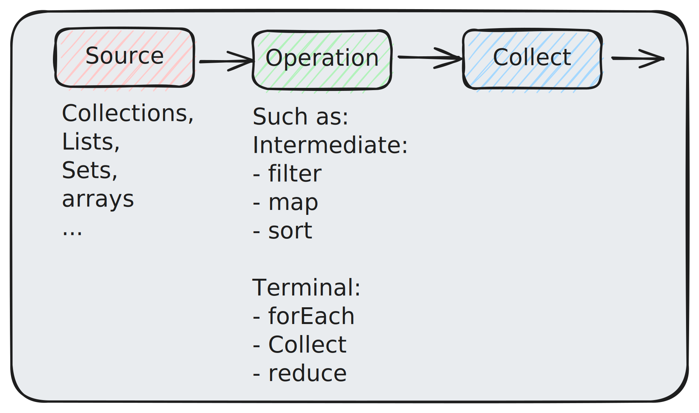

# 1. Java 8

## 1.1. Lambda

Functional approach to writing methods. Anonymous functions can be passed as arguments to other methods or stored in variables. Simplifies the use of APIs that rely on callbacks or event handlers.

```java
x -> x - 1 // single parameter
(x, y) -> x - y // multi-parameter
```

More complex expressions can be put between curly braces

```java
(x, y) -> {
        code block
        return;
}
```

Lambdas are used when passed as a parameter to a function

```java
ArrayList<Integer> nums = new ArrayList<>();
nums.add(42);
nums.add(300);
nums.add(90000);
nums.forEach( (n) -> {
        System.out.println(n);
});
```

### 1.1.1. Functional Interfaces

Functional Interfaces:

#### 1.1.1.1. Consumer

`Consumer:` accepts a single input and returns no output

- `void accept(T t);` Single Abstractor Method (**SAM**), Accepts single argument of type T
- `default Consumer<T> andThen(Consumer<? super T> after);` default method used for composition of multiple consumers. Returns a functional Consumer interface that can be daisy chained in sequence.
```java
Consumer<String> printConsumer = (t) -> System.out.println(t);
Stream<String> cities = Stream.of("London", "New York", "Mexico City");
cities.forEach(printConsumer);
```

- Composing Multiple consumers
```java
Stream<String> cities = Stream.of("London", "New York", "Mexico City");
Consumer<List<String>> upperCaseConsumer = list -> {
for (int i=0; i < list.size(); i++) {
        list.set(i, list.get(i).toUpperCase());
}
};
Consumer<List<String>> printConsumer = list -> list.stream().forEach(System.out::println);

upperCaseconsumer.andThen(printConsumer).accept(cities);
```

- Using `Consumer` interface to store a lambda expression in a variable
```java
ArrayList<Integer> numbers = new ArrayList<Integer>();
numbers.add(1);
numbers.add(2);
numbers.add(3);
numbers.add(4);
Consumer<Integer> method = (n) -> { System.out.println(n); };
numbers.forEach( method );
```

- Using Lambda expression as a method parameter
```java
interface StringFunction {
  String run(String str);
}

public class Main {
  public static void main(String[] args) {
    StringFunction exclaim = (s) -> s + "!";
    StringFunction ask = (s) -> s + "?";
    printFormatted("Hello", exclaim); // Hello!
    printFormatted("Hello", ask); // Hello?
  }
  public static void printFormatted(String str, StringFunction format) {
    String result = format.run(str);
    System.out.println(result);
  }
}
```

#### 1.1.1.2. Supplier

`Supplier:` indicates that this implementation is a supplier of results

- `get()`
```java
Supplier<Double> doubleSupplier1 = () -> Math.random();
DoubleSupplier doubleSupplier2 = Math::random;

System.out.println(doubleSupplier1.get()); // Prints a random value
System.out.println(doubleSupplier2.getAsDouble()); // Prints a random value

```

- Primary use of this interface is to enable deferred execution. For example using it with an optional. This method is triggered if optional does not have data
```java
public void supplierWithOptional(){
    Supplier<Double> doubleSupplier = () -> Math.random();
    Optional<Double> optionalDouble = Optional.empty();
    System.out.println(optionalDouble.orElseGet(doubleSupplier));
}
``` 

#### 1.1.1.3. Predicate

`Predicate:` Boolean-valued function of an argument. Mainly used to filter data from Steam. The filter method of a stream accepts a predicate to filter the data and returns a new stream satisfying the predicate
- `test()` accepts an argument and returns a boolean value
```java
List<String> names = Arrays.asList("Roman", "Scott", "Alex");
Predicate<String> nameStartsWithS = str -> str.startsWith("S");

names.stream().filter(nameStartsWithS).forEach(System.out::println);
```

- Predicate provides default and static methods for composition and other
```java
default Predicate<T> and(Predicate<? super T> other);
default Predicate<T> or(Predicate<? super T> other);
static <T> Predicate<T> isEquals(Object targetRef);
default Predicate<T> negate();
```

- Example use
```java
List<String> names = Arrays.asList("John", "Smith", "Samueal", "Catley", "Sie");
Predicate<String> startPredicate = str -> str.startsWith("S");
Predicate<String> lengthPredicate = str -> str.length() >= 5;
names.stream().filter(startPredicate.and(lengthPredicate)).forEach(System.out::println);
```

#### 1.1.1.4. Function

`Function:` a generic interface that takes 1 argument and produces a result. Has a Single Abstract Method (SAM) which accepts an argument of type T and produces a result of type R. Ex [stream.map](http://stream.map) method.
```java
List<String> names = Array.asList("Roman", "Scott", "Alex");
Function<String, Integer> nameMappingFunction = String::length;
List<Integer> nameLength = name.stream().map(nameMappingFunction).collect(Collectors.toList());
```

## 1.2. Streams

<!--  -->


A new API for processing collections of data in a declarative way. Consists of a source, followed by zero or more intermediate operations;and a terminal operation. Streams support lazy evaluation, parallel execution, and functional operations such as **map**, **filter**, **reduce**, and **collect**.

- Stream is not a data structure and it never modifies the underlying data source.

### 1.2.1. Stream Creation

```java
// Array
private static Employee[] arrayOfEmps = {
        new Employee(1, "Jeff Bezos", 100000.0),
        new Employee(2, "Bill Gates", 200000.0),
        new Employee(3, "Mark Zuckerberg", 300000.0)
};
Stream.of(arrayOfEmps);
```

```java
// or obtain stream from already existing list
List<Employee> empList = Arrays.asList(arrayOfEmps);
empList.stream();
```

Java 8 added a new `stream()` method to the Collection interface

```java
// Create a stream out of individual objects
Stream.of(arrayOfEmps[0], arrayOfEmps[1], arrayOfEmps[2]);
```

```java
// Or using a Stream.builder()
Stream.Builder<Employee> empStreamBuilder = Stream.builder();

empStreamBuilder.accept(arrayOfEmps[0]);
empStreamBuilder.accept(arrayOfEmps[1]);
empStreamBuilder.accept(arrayOfEmps[2]);

Stream<Employee> empStream = empStreamBuilder.build();
```

### 1.2.2. Intermediate Operators

- `map` produces a new stream after applying a function to each element of the original stream.
```java
Integer[] empIds = {1, 2, 3};
List<Employee> employees = Stream.of(empIds)
        .map(employeeRepository::findById)
        .collect(Collectors.toList());

assertEquals(employees.size(), empIds.length);
```

- `filter` Produces a new stream that contains elements that pass the given predicate
```java
Integer[] ids = {1, 2, 3, 4};

List<Employee> employees = Stream.of(ids)
        .map(empoyeeRepository::findById)
        .filter(e -> e !=null)
        .filter(e -> e.getSalary() > 200000)
        .collect(Collectors.toList());
```

- `findFirst` returns an **Optional** for the first entry in the stream
```java
Integer[] ids = {1, 2, 3, 4}

Employee employee = Stream.of(ids)
        .map(employeeRepository::findById)
        .filter(e -> e != null)
        .filter(e -> e.getSalary() > 100000)
        .findFirst()
        .orElse(null);
```

- `toArray` Returns array of the stream
```java
Employee[] employees = empList.stream().toArray(Employee[]::new);
// Employee[]::new    creates an empty array which is filled with elements from the stream
```

- `flatMap` Fattens the data structure
```java
List<List<String>> namesNested = Arrays.asList(
        Arrays.asList("Jeff", "Bezos"),
        Arrays.asList("Bill", "Gates"),
        Arrays.asList("Mark", "Zuckerberg"));

List<String> namesFlatStream = namesNested.stream()
        .flatMap(Collection::stream)
        .collect(Collectors.toList());
```

- `peek` Similar to forEach(), but unlike it it’s not terminal. Returns a new stream which can be used further.
```java
Employee[] arrayOfEmps = {
new Employee(1, "Jeff Bezos", 100000.0),
new Employee(2, "Bill Gates", 200000.0),
new Employee(3, "Mark Zuckerberg", 300000.0)
};

List<Employee> empList = Arrays.asList(arrayOfEmps);

empList.stream()
.peek(e -> e.salaryIncrement(10.0))
.peek(System.out::println)
.collect(Collectors.toList());
```
!!! note ""
    `peek` should only be used for debugging to observe the vales passing through. Do not use for any logic or side effects. As this might not be called in some instances
- `anyMatch` take a predicate and return a boolean true if any match
```java
List<Integer> intList = Arrays.asList(2, 4, 5, 6, 8);
boolean oneEven = intList.stream().anyMatch(i -> i % 2 == 0);
// true
```

- `allMatch` take a predicate and return a boolean true if all match
```java
List<Integer> intList = Arrays.asList(2, 4, 5, 6, 8);
    
boolean allEven = intList.stream().allMatch(i -> i % 2 == 0);
// false
```

- `noneMatch` take a predicate and return a boolean true if none match
```java
List<Integer> intList = Arrays.asList(2, 4, 5, 6, 8);
boolean noneMultipleOfThree = intList.stream().noneMatch(i -> i % 3 == 0);
//false
```

- `#ct` returns the #ct elements in the stream, eliminating duplicates. It uses the equals() method of the elements to decide whether two elements are equal or not
```java
List<Integer> intList = Arrays.asList(2, 5, 3, 2, 4, 3);
List<Integer> #ctIntList = intList.stream().#ct().collect(Collectors.toList());
//2, 5, 3, 4
```

- `limit` Limits stream to n number of elements
```java
List<Integer> collect = infiniteStream
        .skip(3)
        .limit(5)
        .collect(Collectors.toList());
```

- `skip` skips n number of elements in the stream
```java
IntStream
        .range(1, 10)
        .skip(5)
        .forEach(System.out::println)
        //6, 7, 8, 9
```

- `sorted` sorts elements
    - Natural Order
```java
List<String> list = Arrays
.asList("9", "A", "Z", "1", "B", "Y", "4", "a", "c");

List<String> sortedList = list
   .stream()
   .sorted()
   .collect(Collectors.toList());
// or
List<String> sortedList = list.stream()
   .sorted((o1,o2)-> o1.compareTo(o2))
   .collect(Collectors.toList());
// or
List<String> sortedList = list.stream()
   .sorted(Comparator.naturalOrder())
   .collect(Collectors.toList());
// 1 4 9 A B Y Z a c
```

    - In Reverse Order
```java
List<String> list = Arrays
.asList("9", "A", "Z", "1", "B", "Y", "4", "a", "c");

        
List<String> sortedList = list.stream()
   .sorted((o1,o2)-> o2.compareTo(o1))
   .collect(Collectors.toList());
// OR
List<String> sortedList = list.stream()
   .sorted(Comparator.reverseOrder())
   .collect(Collectors.toList());
// c a Z Y B A 9 4 1
```

    - Object Sort
```java
// name and age fields
static List<User> users = Arrays.asList(
            new User("C", 30),
            new User("D", 40),
            new User("A", 10),
            new User("B", 20),
            new User("E", 50));

List<User> sortedList = users.stream()
        .sorted((o1, o2) -> o1.getAge() - o2.getAge())
        .collect(Collectors.toList());
// or            
List<User> sortedList = users.stream()
        .sorted(Comparator.comparingInt(User::getAge))
        .collect(Collectors.toList());
/*
User{name='A', age=10}
User{name='B', age=20}
User{name='C', age=30}
User{name='D', age=40}
User{name='E', age=50}
*/
```

    - Object Reverse Order
```java
List<User> sortedList = users.stream()
        .sorted(Comparator.comparingInt(User::getAge)
        .reversed())
        .collect(Collectors.toList());
/*
User{name='E', age=50}
User{name='D', age=40}
User{name='C', age=30}
User{name='B', age=20}
User{name='A', age=10}
*/
```

### 1.2.3. Terminal Operations

- `forEach` Loops over stream elements
```java
List<String> names = Arrays.asList("Larry", "Steve", "James");

names
   .stream()
   .forEach(System.out::println);
```
    - **It’s a terminal operation**: after the operation is performed, the stream pipeline is considered consumed and can no longer be used

- `collect` Gets stuff out of the stream once we are done with it. Performs mutable fold operations (repackaging elements to some data structures and applying some additional logic.)
```java
List<Employee> employees = empList.stream()
        .collect(Collectors.toList());
```

- `toArray` Like Collect previously, but specifically return array
```java
Employee[] employees = empList
        .stream()
        .toArray(Employee[]::new);
```
- `count` Counts elements in the stream
```java
int count = IntStream
        .range(1,10)
        .filter(x -> x <= 2)
        .count();
        
// count = 2
```
- `sum` sum numerical elements of the stream.
```java
int output = IntStream
        .range(1,5)
        .sum()
// output = 10
```
- `max`
```java
int count = IntStream
        .range(1,10)
        .max();
        
// count = 9
```

- `min`
```java
int count = IntStream
        .range(1,10)
        .min();
        
// count = 1
```
- `average`
```java
Arrays.stream(new int[] {2, 4, 6, 8, 10})
        .average()
        .ifPresent(System.out::println)
// 6
```

- `reduce` aggregates
```java
double total = Stream.of(7.3, 1.5, 4.8)
        .reduce(0.0, (Double a, Double b) -> a + b);
        // First argument: starting value
        // Second argument: 
                // a: running total
                // b: new element passed in
// total = 
```

- `summaryStatistics`
```java
IntSummaryStatistics summary = IntStream.of(7, 2, 19, 88, 73, 4, 10)
        .summaryStatistics();
// summary: {count=7, sum=203, min=2, average=29.000, max=88}
```

- `joining`
```java
String empNames = empList.stream()
      .map(Employee::getName)
      .collect(Collectors.joining(", ")) // Joins string
      .toString();
    
// "Roman, Bob, James"
```

- `toSet`
```java
Set<String> empNames = empList.stream()
        .map(Employee::getName)
        .collect(Collectors.toSet());
    
```

- `toCollection` extract the elements into any other collection by passing in a `Supplier<Collection>`. We can also use a constructor reference for the Supplier
```java
Vector<String> empNames = empList.stream()
        .map(Employee::getName)
        .collect(Collectors.toCollection(Vector::new));
```

- `partitioningBy`
- `groupingBy`
- `mapping`
- `reducing`

### 1.2.4. Method Types and Pipelines

Operations:

- `Intermediate:` returns stream on which further processing can be done
- `Terminal:` Mark the stream as consumed, after which point it can no longer be used further.

### 1.2.5. Stream Pipeline

- A stream pipeline consists of a steam source, followed by zero or more intermediate operation, and a terminal operation.

- Intermediate and terminal
```java
Long count = empList.stream()
        .filter(e -> e.getSalary() > 20000)
        .count();
```

- Short-circuit operation: allows computations on **infinite** streams to complete in finite time.
```java
Stream<Integer> infiniteStream = Stream.iterate(2, i -> i * 2);
// Stream.iterate() creats an infinite stream

List<Integer> collect = infiniteStream
.skip(3)
.limit(5)
.collect(Collectors.toList());

assertEquals(collect, Arrays.asList(16, 32, 64, 128, 256));
```

### 1.2.6. Lazy Evaluation

- Computation of the source data is only performed when the terminal operation is initiated, and source elements are consumed only as needed
    - All Intermediate operations are lazy, so they’re not executed until a result of a processing is actually needed.

For example, `list.stream().filter(x -> x > 0).map(x -> x * 2).sum()` is a stream expression that filters a list of numbers by keeping only the positive ones, doubles each element, and returns the sum of the resulting list.

Processing streams lazily allows avoiding examining all the data when that’s not necessary. This behaviour becomes even more important when the input stream is infinite and not just very large.

### 1.2.7. Stream call specializations

There are primitive streams `IntStream`, `LongStream`, and `DoubleStream`

You can use them like this

```java
Integer latestEmpId = empList.stream()
      .mapToInt(Employee::getId) // Convert to Int stream
      .max()
      .orElseThrow(NoSuchElementException::new);
```

#### 1.2.7.1. .of creation
```java
IntStream.of(1, 2, 3);

IntStream.range(10, 20)
//stream of numbers 10 to 19.
```


`Stream.of(1, 2, 3)` is not the same as `IntStream.of(1, 2, 3)`, one is `Stream<Integer>` another is `IntStream`
same with `map()` and `mapToInt()`

## Method References

Method reference is used to refer method of functional interface using an easy form of lambda expression. There are 3 method references

### Static Method

Refer to static method defined in a class

```java
interface Sayable{
    void say();
}

public class MethodReference {
    public static void saySomething(){
        System.out.println("Hello, this is static method.");
    }
    
    public static void main(String[] args) {
        // Referring static method
        Sayable sayable = MethodReference::saySomething;
        // Calling interface method
        sayable.say();
        // Will print "Hello, this is static method."
    }
}
```

[//]: # (TODO: to be continue)


### Instance Method

### Constructor

TODO:

- **Default methods**: You can provide default implementations for interface methods, which can be overridden by implementing classes if needed. Default methods enable backward compatibility and multiple inheritances of behaviour in interfaces. For example, `interface A { default void foo() { System.out.println("A"); } }` is an interface with a default method foo().
        
   ```java
   interface Vehicle {
       default void print() {
           System.out.println("I am a vehicle!");
       }
   }
   ```
- **Method references**: You can refer to existing methods by name instead of writing lambda expressions. Method references are useful when you want to pass a method as an argument to another method or use it as a constructor reference. For example, `System.out::println` is a method reference that refers to the println method of the System.out class.
- **Optional**: A new class that represents a value that may or may not be present. Optional helps you avoid null pointer exceptions and write more robust code by forcing you to explicitly handle the absence of a value. For example, `Optional<String> name = Optional.ofNullable(getName()); name.ifPresent(System.out::println);` is an example of using Optional to get a name from a method that may return null and print it if it is present.
     To handle null values and reduce NullPointerExceptions.

   ```java
   Optional<String> optional = Optional.of("hello");
   String result = optional.orElse("default");
   ```
-  New Date and Time API:
   Improved date and time handling with java.time package.

   ```java
   LocalDate date = LocalDate.now();
   LocalTime time = LocalTime.now();
   LocalDateTime dateTime = LocalDateTime.now();
   ```

## 1.3. Source

- [W3schools.com: Java Lambda Expressions](https://www.w3schools.com/java/java_lambda.asp)
- [medium.com: Understanding Java 8’s Consumer, Supplier, Predicate and Function](https://medium.com/swlh/understanding-java-8s-consumer-supplier-predicate-and-function-c1889b9423d)
- [stackify.com: A Guide to Java Streams in Java 8: In-Depth Tutorial With Examples](https://stackify.com/streams-guide-java-8/)
- [Youtube: Java 8 STREAMS Tutorial](https://www.youtube.com/watch?v=t1-YZ6bF-g0)
- [Java 8 – How to sort list with stream.sorted()](https://mkyong.com/java8/java-8-how-to-sort-list-with-stream-sorted/)
- [Java 8 Method Reference](https://www.javatpoint.com/java-8-method-reference)
