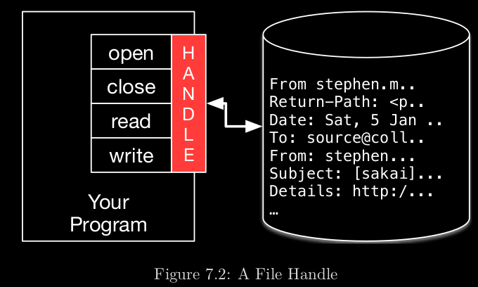
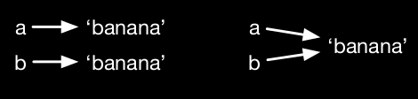
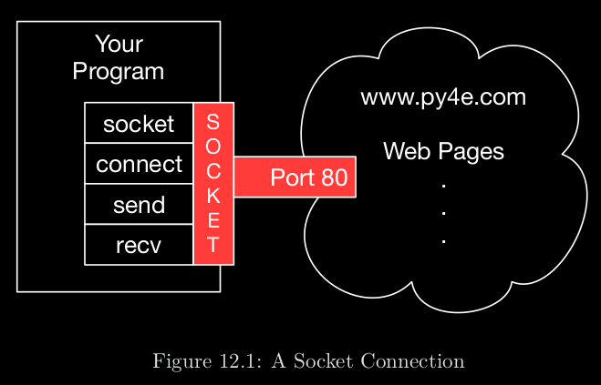

# 1. Python 3

# 2. Contents

- [1. Python 3](#1-python-3)
- [2. Contents](#2-contents)
- [3. Variables, expressions, and Statements](#3-variables-expressions-and-statements)
        - [3.1. Types](#31-types)
        - [3.2. Variables](#32-variables)
                - [3.2.1. Python reserved keywords](#321-python-reserved-keywords)
        - [3.3. Operators and operands](#33-operators-and-operands)
                - [3.3.1. Order of operations](#331-order-of-operations)
        - [3.4. String operations](#34-string-operations)
                - [3.4.1. Concatenation](#341-concatenation)
                - [3.4.2. Multiplication](#342-multiplication)
        - [3.5. User Input](#35-user-input)
        - [3.6. Glossary](#36-glossary)
- [4. Conditional Execution](#4-conditional-execution)
        - [4.1. Boolean expressions](#41-boolean-expressions)
        - [4.2. Conditional execution](#42-conditional-execution)
        - [4.3. Catching exceptions using try and except](#43-catching-exceptions-using-try-and-except)
        - [4.4. Short-circuit evaluation of logical expressions](#44-short-circuit-evaluation-of-logical-expressions)
        - [4.5. Glossary](#45-glossary)
- [5. Functions](#5-functions)
        - [5.1. Built-in Functions](#51-built-in-functions)
        - [5.2. Math functions](#52-math-functions)
        - [5.3. Random numbers](#53-random-numbers)
        - [5.4. Type conversion](#54-type-conversion)
        - [5.5. New Functions](#55-new-functions)
                - [5.5.1. Default arguments](#551-default-arguments)
                - [5.5.2. Variable-length Arguments](#552-variable-length-arguments)
        - [5.6. Glossary](#56-glossary)
- [6. Iteration](#6-iteration)
        - [6.1. The while statement](#61-the-while-statement)
        - [6.2. Continue and Break](#62-continue-and-break)
        - [6.3. Loops](#63-loops)
                - [6.3.1. Range()](#631-range)
                        - [6.3.1.1. else](#6311-else)
        - [6.4. Glossary](#64-glossary)
- [7. Strings](#7-strings)
        - [7.1. Assessing characters](#71-assessing-characters)
        - [7.2. Length](#72-length)
        - [7.3. Traversal](#73-traversal)
        - [7.4. String slices](#74-string-slices)
                - [7.4.1. Reverse a string](#741-reverse-a-string)
        - [7.5. Strings are immutable](#75-strings-are-immutable)
        - [7.6. The `in` operator](#76-the-in-operator)
        - [7.7. String comparison](#77-string-comparison)
        - [7.8. String methods](#78-string-methods)
        - [7.9. Parsing strings](#79-parsing-strings)
        - [7.10. Format Operator](#710-format-operator)
        - [7.11. Glossary](#711-glossary)
- [8. Files](#8-files)
        - [8.1. Opening files modes](#81-opening-files-modes)
        - [8.2. The file object attributes](#82-the-file-object-attributes)
        - [8.3. Opening files](#83-opening-files)
        - [8.4. Text files and lines](#84-text-files-and-lines)
        - [8.5. Reading files](#85-reading-files)
        - [8.6. Searching through a file](#86-searching-through-a-file)
        - [8.7. Writing files](#87-writing-files)
        - [8.8. Glossary](#88-glossary)
- [9. Lists](#9-lists)
        - [9.1. Lists are mutable](#91-lists-are-mutable)
        - [9.2. Dims as variables](#92-dims-as-variables)
        - [9.3. `in` operator](#93-in-operator)
        - [9.4. Traversing a list](#94-traversing-a-list)
                - [9.4.1. next() iteration](#941-next-iteration)
        - [9.5. List operations](#95-list-operations)
                - [9.5.1. `+`](#951-)
                - [9.5.2. `*`](#952-)
        - [9.6. List slices](#96-list-slices)
        - [9.7. List methods](#97-list-methods)
                - [9.7.1. append()](#971-append)
                - [9.7.2. extends()](#972-extends)
                - [9.7.3. sort()](#973-sort)
                - [9.7.4. pop()](#974-pop)
                - [9.7.5. del](#975-del)
                - [9.7.6. remove()](#976-remove)
        - [9.8. Lists and functions](#98-lists-and-functions)
        - [9.9. Lists and strings](#99-lists-and-strings)
        - [9.10. Objects and values](#910-objects-and-values)
                - [9.10.1. `is` - refer to the dame object, checks for `Identity`](#9101-is---refer-to-the-dame-object-checks-for-identity)
                - [9.10.2. Aliasing](#9102-aliasing)
        - [9.11. List arguments](#911-list-arguments)
                - [9.11.1. Modifies the list](#9111-modifies-the-list)
                - [9.11.2. Creates new list](#9112-creates-new-list)
        - [9.12. Glossary](#912-glossary)
- [10. Dictionaries](#10-dictionaries)
        - [10.1. Create](#101-create)
        - [10.2. Add](#102-add)
        - [10.3. Create pre-populated](#103-create-pre-populated)
        - [10.4. Look up](#104-look-up)
        - [10.5. Number of pairs](#105-number-of-pairs)
        - [10.6. `in` check if a **key** is in the dictionary (does not work for **value**)](#106-in-check-if-a-key-is-in-the-dictionary-does-not-work-for-value)
        - [10.7. Check if value is in the dictionary](#107-check-if-value-is-in-the-dictionary)
        - [10.8. Looping and dictonaries](#108-looping-and-dictonaries)
        - [10.9. Glossary](#109-glossary)
- [11. Tuples](#11-tuples)
        - [11.1. Comparing Tuples](#111-comparing-tuples)
        - [11.2. Tuple Assignment](#112-tuple-assignment)
        - [11.3. Dictionaries and tuples](#113-dictionaries-and-tuples)
        - [11.4. Multiple assignment with dictionaries](#114-multiple-assignment-with-dictionaries)
        - [11.5. Using tuples as keys in dictionaries](#115-using-tuples-as-keys-in-dictionaries)
        - [11.6. Glossary](#116-glossary)
- [12. Regular Expressions](#12-regular-expressions)
        - [12.1. search()](#121-search)
        - [12.2. Special characters](#122-special-characters)
        - [12.3. Extracting data using regular expressions](#123-extracting-data-using-regular-expressions)
        - [12.4. Combining searching and extracting](#124-combining-searching-and-extracting)
        - [12.5. Combining searching and extracting](#125-combining-searching-and-extracting)
        - [12.6. Glossary](#126-glossary)
- [13. Networked Programs](#13-networked-programs)
        - [13.1. The world's simplest web browser](#131-the-worlds-simplest-web-browser)
        - [13.2. Retrieving an image over HTTP](#132-retrieving-an-image-over-http)
        - [13.3. Retrieving web pages with urllib](#133-retrieving-web-pages-with-urllib)
        - [13.4. Reading binary files using urllib](#134-reading-binary-files-using-urllib)
        - [13.5. Parsing HTML and scraping the web](#135-parsing-html-and-scraping-the-web)
        - [13.6. Parsing HTML using regular expressions](#136-parsing-html-using-regular-expressions)
- [14. Using Web Services](#14-using-web-services)
- [15. Object-oriented programming](#15-object-oriented-programming)
- [16. Using Databases and SQL](#16-using-databases-and-sql)
- [17. Visualising data](#17-visualising-data)
- [18. Reference](#18-reference)

# 3. Variables, expressions, and Statements

## 3.1. Types

```python
>>> type('hello world')
<class 'str'>
>>> type(17)
<class 'int'>
>>> type(1.3)
<class 'float'>
>>> type(True)
<class 'bool'>
```

Will output the class of the variable

```python
>>> print(1,000,000)
1 0 0
```

`,` in print are interpreted as spaces

## 3.2. Variables

```python
text = 'Hello friend'
number = 19
pi = 3.14
isEmpyt = True
```

Variables can:

-   can contain

    -   letters
    -   numbers

-   Cannon start with numbers

-   Start variables with lowercase letters

### 3.2.1. Python reserved keywords

|   and    |   del   |  from  |   None   | True  |
| :------: | :-----: | :----: | :------: | :---: |
|    as    |  elif   | global | nonlocal | while |
|  assert  |  else   |   if   |   not    | while |
|  break   | except  | import |    or    | with  |
|  class   |  False  |   in   |   pass   | yield |
| continue | finally |   is   |  raise   | async |
|   def    |   for   | lambda |  return  | await |

## 3.3. Operators and operands

`operators` - are specific symbols that represent computations

`operands` - are the values the operator is applied to

| Operators | Action                                                           | Example |
| --------- | ---------------------------------------------------------------- | ------- |
| +         | Addition                                                         | `20+30` |
| -         | Subtraction                                                      | `4-1`   |
| \*        | Multiplication                                                   | `2*2`   |
| /         | Division (can produce floating point)                            | `10/5`  |
| //        | Division (floored)                                               | `11//2` |
| %         | Modulus - remainder of the division of left operand by the right | `5 % 2` |
| \*\*      | Exponentiation                                                   | `2**4`  |

### 3.3.1. Order of operations

Using acronym **PEMDAS**, from highest to lowest

-   **P**arentheses
-   **E**xponentiation
-   **M**ultiplication and **D**ivision, have the same precedence
-   **A**ddition and **S**ubtraction, which also have the same precedence
-   Operators with the same precedence are evaluated from left to right

## 3.4. String operations

### 3.4.1. Concatenation

`+` can be used to concatenate two strings together

```python
>>> first = '100'
>>> second = '500'
>>> print(first+second)
100500
```

### 3.4.2. Multiplication

`*` can be used to repeat string a given number of times.

```python
>>> first = 'Test '
>>> second = 3
>>> print(first * second)
Test Test Test
```

## 3.5. User Input

```python
>>> user_input = input("Give me your name?\n")
```

Is you are expecting an integer you are going to need to convert **string** to **int**

```python
>>> int(string_val)
12
```

## 3.6. Glossary

-   `assignment` A statement that assigns a value to a variable.
-   `concatenate` To join two operands end to end.
-   `commen    `Information in a program that is meant for other programmers (or anyone reading the source code) and has no effect on the execution of the program.
-   `evaluate` To simplify an expression by performing the operations in order to yield a single value.
-   `expression` A combination of variables, operators, and values that represents a single result value.
-   `floating point` A type that represents numbers with fractional parts.
    `integer` A type that represents whole numbers.
-   `keyword` A reserved word that is used by the compiler to parse a program; you cannot use keywords like if, def, and while as variable names.
-   `mnemonic` A memory aid. We often give variables mnemonic names to help us remember what is stored in the variable.
-   `modulus operator` An operator, denoted with a percent sign (%), that works on integers and yields the remainder when one number is divided by another.
-   `operand` One of the values on which an operator operates.
-   `operator` A special symbol that represents a simple computation like addition, multiplication, or string concatenation.
-   `rules of precedence` The set of rules governing the order in which expressions involving multiple operators and operands are evaluated.
-   `statement` A section of code that represents a command or action. So far, the statements we have seen are assignments and print expression statement
-   `string` A type that represents sequences of characters.
-   `type` A category of values. The types we have seen so far are integers (type int), floating-point numbers (type float), and strings (type str).
-   `value` One of the basic units of data, like a number or string, that a program manipulates.
-   `variable` A name that refers to a value.

# 4. Conditional Execution

## 4.1. Boolean expressions

| Comparison operators | Action                 |
| -------------------- | ---------------------- |
| x == y               | Equality               |
| x != y               | Inequality             |
| x > y                | Greater than           |
| x < y                | Less than              |
| x >= y               | Greater than or equal  |
| x <= y               | Less than or equal     |
| x is y               | x is the same as y     |
| x is not y           | x is not the same as y |

| Logical operators |
| ----------------- |
| and               |
| or                |

## 4.2. Conditional execution

```python
if x < 3:
        print('small')
elif x == 3:
        print('same')
else:
        print('big')
```

## 4.3. Catching exceptions using try and except

```python
inp = input('Enter Fahrenheit Temp')
try:
        fahr = float(inp)
        cel = (fahr - 32.0) * 5.0 / 9.0
        print(cel)
except ValueError as err:
        print('wrong value type {0}'.format(err))
except:
        print('something else')
```

## 4.4. Short-circuit evaluation of logical expressions

Logical expressions are evaluated from left to right. if in `and` the first part of the condition evaluates to **False** then there is no reason to evaluate the rest, you can return zero.

```python
>>> x = 6
>>> y = 0
>>> x >= 2 and y != 0 and (x/y) > 2
```

## 4.5. Glossary

-   `body` The sequence of statements within a compound statement.
-   `boolean expression` An expression whose value is either True or False.
-   `branch` One of the alternative sequences of statements in a conditional
-   `chained conditiona`l A conditional statement with a series of alternative branches.
-   `comparison operator` One of the operators that compares its operands: ==, !=,>, <, >=, and <=.
-   `conditional statement` A statement that controls the flow of execution depending on some condition.
-   `condition` The boolean expression in a conditional statement that determines which branch is executed.
-   `compound statement` A statement that consists of a header and a body. The header ends with a colon (:). The body is indented relative to the header.
-   `guardian pattern` Where we construct a logical expression with additional comparisons to take advantage of the short-circuit behavior.
-   `logical operator` One of the operators that combines boolean expressions: and, or, and not.
-   `nested conditional` A conditional statement that appears in one of the branches of another conditional statement.
-   `traceback` A list of the functions that are executing, printed when an exception occurs.
-   `short circuit` When Python is part-way through evaluating a logical expression and stops the evaluation because Python knows the final value for the expression without needing to evaluate the rest of the expression.

# 5. Functions

## 5.1. Built-in Functions

|                                                                                  |                                                                                  | Built-in Functions                                                            |                                                                                    |                                                                                   |
| :------------------------------------------------------------------------------- | :------------------------------------------------------------------------------- | :---------------------------------------------------------------------------- | :--------------------------------------------------------------------------------- | :-------------------------------------------------------------------------------- |
| [`abs()`](https://docs.python.org/3/library/functions.html#abs)                  | [`delattr()`](https://docs.python.org/3/library/functions.html#delattr)          | [`hash()`](https://docs.python.org/3/library/functions.html#hash)             | [`memoryview()`](https://docs.python.org/3/library/functions.html#func-memoryview) | [`set()`](https://docs.python.org/3/library/functions.html#func-set)              |
| [`all()`](https://docs.python.org/3/library/functions.html#all)                  | [`dict()`](https://docs.python.org/3/library/functions.html#func-dict)           | [`help()`](https://docs.python.org/3/library/functions.html#help)             | [`min()`](https://docs.python.org/3/library/functions.html#min)                    | [`setattr()`](https://docs.python.org/3/library/functions.html#setattr)           |
| [`any()`](https://docs.python.org/3/library/functions.html#any)                  | [`dir()`](https://docs.python.org/3/library/functions.html#dir)                  | [`hex()`](https://docs.python.org/3/library/functions.html#hex)               | [`next()`](https://docs.python.org/3/library/functions.html#next)                  | [`slice()`](https://docs.python.org/3/library/functions.html#slice)               |
| [`ascii()`](https://docs.python.org/3/library/functions.html#ascii)              | [`divmod()`](https://docs.python.org/3/library/functions.html#divmod)            | [`id()`](https://docs.python.org/3/library/functions.html#id)                 | [`object()`](https://docs.python.org/3/library/functions.html#object)              | [`sorted()`](https://docs.python.org/3/library/functions.html#sorted)             |
| [`bin()`](https://docs.python.org/3/library/functions.html#bin)                  | [`enumerate()`](https://docs.python.org/3/library/functions.html#enumerate)      | [`input()`](https://docs.python.org/3/library/functions.html#input)           | [`oct()`](https://docs.python.org/3/library/functions.html#oct)                    | [`staticmethod()`](https://docs.python.org/3/library/functions.html#staticmethod) |
| [`bool()`](https://docs.python.org/3/library/functions.html#bool)                | [`eval()`](https://docs.python.org/3/library/functions.html#eval)                | [`int()`](https://docs.python.org/3/library/functions.html#int)               | [`open()`](https://docs.python.org/3/library/functions.html#open)                  | [`str()`](https://docs.python.org/3/library/functions.html#func-str)              |
| [`breakpoint()`](https://docs.python.org/3/library/functions.html#breakpoint)    | [`exec()`](https://docs.python.org/3/library/functions.html#exec)                | [`isinstance()`](https://docs.python.org/3/library/functions.html#isinstance) | [`ord()`](https://docs.python.org/3/library/functions.html#ord)                    | [`sum()`](https://docs.python.org/3/library/functions.html#sum)                   |
| [`bytearray()`](https://docs.python.org/3/library/functions.html#func-bytearray) | [`filter()`](https://docs.python.org/3/library/functions.html#filter)            | [`issubclass()`](https://docs.python.org/3/library/functions.html#issubclass) | [`pow()`](https://docs.python.org/3/library/functions.html#pow)                    | [`super()`](https://docs.python.org/3/library/functions.html#super)               |
| [`bytes()`](https://docs.python.org/3/library/functions.html#func-bytes)         | [`float()`](https://docs.python.org/3/library/functions.html#float)              | [`iter()`](https://docs.python.org/3/library/functions.html#iter)             | [`print()`](https://docs.python.org/3/library/functions.html#print)                | [`tuple()`](https://docs.python.org/3/library/functions.html#func-tuple)          |
| [`callable()`](https://docs.python.org/3/library/functions.html#callable)        | [`format()`](https://docs.python.org/3/library/functions.html#format)            | [`len()`](https://docs.python.org/3/library/functions.html#len)               | [`property()`](https://docs.python.org/3/library/functions.html#property)          | [`type()`](https://docs.python.org/3/library/functions.html#type)                 |
| [`chr()`](https://docs.python.org/3/library/functions.html#chr)                  | [`frozenset()`](https://docs.python.org/3/library/functions.html#func-frozenset) | [`list()`](https://docs.python.org/3/library/functions.html#func-list)        | [`range()`](https://docs.python.org/3/library/functions.html#func-range)           | [`vars()`](https://docs.python.org/3/library/functions.html#vars)                 |
| [`classmethod()`](https://docs.python.org/3/library/functions.html#classmethod)  | [`getattr()`](https://docs.python.org/3/library/functions.html#getattr)          | [`locals()`](https://docs.python.org/3/library/functions.html#locals)         | [`repr()`](https://docs.python.org/3/library/functions.html#repr)                  | [`zip()`](https://docs.python.org/3/library/functions.html#zip)                   |
| [`compile()`](https://docs.python.org/3/library/functions.html#compile)          | [`globals()`](https://docs.python.org/3/library/functions.html#globals)          | [`map()`](https://docs.python.org/3/library/functions.html#map)               | [`reversed()`](https://docs.python.org/3/library/functions.html#reversed)          | [`__import__()`](https://docs.python.org/3/library/functions.html#__import__)     |
| [`complex()`](https://docs.python.org/3/library/functions.html#complex)          | [`hasattr()`](https://docs.python.org/3/library/functions.html#hasattr)          | [`max()`](https://docs.python.org/3/library/functions.html#max)               | [`round()`](https://docs.python.org/3/library/functions.html#round)                |                                                                                   |

## 5.2. Math functions

To use [math](https://docs.python.org/3.0/library/math.html) module

```python
import math
```

## 5.3. Random numbers

```python
import random

x = random.random()# returns float between 0.0 and 1.0 (including 0.0 but not 1.0)
```

```python
random.randint(low, high)
```

```python
t = [1, 2, 3]
random.choice(t)
```

## 5.4. Type conversion

```python
>>> int('32')
32
>>> int(3.9999)
3
>>> int('Hello')
ValueError: invalid literal for int() with base 10: 'Hello'
```

```python
>>> float(32)
32.0
>>> float('3.123')
3.123
```

```python
>>> str(32)
'32'
>>> str(3.123)
'3.123'
```

```python
>>> bool('abc')
True
>>> bool('')
False
```

```python
>>> ord('a')
97
>>> ord('€')
8364
```

```python
>>> chr(92)
'a'
>>> chr(8364)
'€'
```

## 5.5. New Functions

```python
def sum(a, b):
        added = a + b
        return added
```

### 5.5.1. Default arguments

```python
def sum(a=4, b=2)
	added = a + b
        return added
```

`def func(a=1, b) ` is not allowed because calling `func(5)` will set a but will leave b with not value

### 5.5.2. Variable-length Arguments

if you don't know the number of arguments needed in the function

-   `*` - tuple
-   `**` - dictionary

```python
def display(*name, **address):
        for items in name:
                print (items)

        for items in address.items():
                print(items)

display(''john','Mary','Nina',John='LA',Mary='NY',Nina='DC'')
```

output

```
John
Mary
Nina
('John', 'LA')
('Mary', 'NY')
('Nina', 'DC')
```

## 5.6. Glossary

-   `algorithm` A general process for solving a category of problems.
-   `argument `A value provided to a function when the function is called. This value is assigned to the corresponding parameter in the function.
-   `body` The sequence of statements inside a function definition.
-   `composition` Using an expression as part of a larger expression, or a statement as part of a larger statement.
-   `deterministic `Pertaining to a program that does the same thing each time it runs, given the same inputs.
-   `dot notation` The syntax for calling a function in another module by specifying the module name followed by a dot (period) and the function name.
-   `flow of execution` The order in which statements are executed during a program run.
-   `fruitful function` A function that returns a value.
-   `function` A named sequence of statements that performs some useful operation. Functions may or may not take arguments and may or may not produce a result.
-   `function call `A statement that executes a function. It consists of the function name followed by an argument list.
-   `function definition` A statement that creates a new function, specifying its name, parameters, and the statements it executes.
-   `function object` A value created by a function definition. The name of the function is a variable that refers to a function object.
-   `header` The first line of a function definition.
-   `import statement` A statement that reads a module file and creates a module object.
-   `module object` A value created by an import statement that provides access to the data and code defined in a module.
-   `parameter` A name used inside a function to refer to the value passed as an argument.
-   `pseudorandom` Pertaining to a sequence of numbers that appear to be random, but are generated by a deterministic program.
-   `return value` The result of a function. If a function call is used as an expression, the return value is the value of the expression.
-   `void function` A function that does not return a value.

# 6. Iteration

## 6.1. The while statement

```python
n = 5
while n > 0:
        print(n)
        n = n - 1
```

## 6.2. Continue and Break

```python
while True:
        line = input('> ')
        if line[0] == '#':
        	continue
        if line == 'done':
        		break
        print(line)
print('Done!')
```

## 6.3. Loops

```python
friends = ['Josh', 'Glenn', 'Sally']
for friend in friends:
        print('Hello ', friend)
print('Done')
```

### 6.3.1. Range()

```python
for x in range(6):
        print(x)
```

`range(6)` is from **0** to **5**

```python
for x in range(2,6)
	print(x)
```

`range(2,6)` is from **2** to **5**

```python
for x in range(2,30,3)
	print(x)
```

`range(2,30,3)` is from **2** to **29** but with increments of **3**

#### 6.3.1.1. else

```python
for x in range (6):
        print(x)
else:
        print('Finally finished!')
```

## 6.4. Glossary

-   `accumulator` A variable used in a loop to add up or accumulate a result.
-   `counter` A variable used in a loop to count the number of times something happened. We initialize a counter to zero and then increment the counter each time we want to “count” something.
-   `decrement` An update that decreases the value of a variable.
-   `initialize` An assignment that gives an initial value to a variable that will be updated.
-   `increment` An update that increases the value of a variable (often by one).
-   `infinite loop` A loop in which the terminating condition is never satisfied or for which there is no terminating condition.
-   `iteration` Repeated execution of a set of statements using either a function that calls itself or a loop.

# 7. Strings

## 7.1. Assessing characters

```python
>>> fruit = 'banana'
>>> letter = fruit[0]
```

## 7.2. Length

```python
>>> fruit = 'banana'
>>> len(fruit)
6
```

## 7.3. Traversal

Can use index or

```python
for char in fruit:
        print(char)
```

## 7.4. String slices

```python
>>> s = 'Monty Python'
>>> print(s[0:5])
Monty
>>> print(s[6:12])
Python
```

```python
>>> fruit = 'banana'
>>> fruit[:3]
'ban'
>>> fruit[3:]
'ana'
```

```python
>>> fruit = 'banana'
>>> fruit[3:3]
''
```

### 7.4.1. Reverse a string

```python
>>> a = "!dlrow olleH"
>>> backward = a[::-1]
>>> print(backward)
Hello world!
```

## 7.5. Strings are immutable

Cannon change a character as indexes.

```python
>>> greeting = 'Hello, world!'
>>> greeting[0] = 'J'
TypeError: 'str' object does not support item assignment
```

## 7.6. The `in` operator

Boolean operator

```python
>>> 'a' in 'banana'
True
>>> 'seed' in 'banana'
False
```

## 7.7. String comparison

```python
if word == 'banana':
        print('All right, bananas')
elif word < 'banana':
        print('Your word comes before banana')
elif wor > 'banana':
        print('Your word comes after banana')
```

## 7.8. String methods

Can use `dir(obj)` to find out methods for the object, or just is this [site](https://docs.python.org/3/library/stdtypes.html#string-methods)

```python
>>> stuff = 'Hello World'
>>> type(stuff)
<class 'str'>
>>> dir(stuff)
['capitalize', 'casefold', 'center', 'count', 'encode',
'endswith' , 'expandtabs', 'find', 'format', 'format_map',
'index' , 'isalnum', 'isalpha', 'isdecimal', 'isdigit',
'isidentifier' , 'islower', 'isnumeric', 'isprintable',
'isspace' , 'istitle', 'isupper', 'join', 'ljust', 'lower',
'lstrip' , 'maketrans', 'partition', 'replace', 'rfind',
'rindex' , 'rjust', 'rpartition', 'rsplit', 'rstrip',
'split' , 'splitlines', 'startswith', 'strip', 'swapcase',
'title' , 'translate', 'upper', 'zfill']
>>> helpt(str.capitalize)
Help on method_descriptor:
capitalize(...)
        S.capitalize() -> str

        Return a capitalized version of S, i.e. make the first character
        have upper case and the rest lower case.
```

```python
>>> word = 'banana'
>>> word.upper()
BANANA
```

```python
>>> word = 'banana'
>>> word.find('a')
1
>>> word.find('na')
2
>>> word.find('na',3) # second argument is the index where it should start looking
4
```

```python
>>> line = '	Here we go	'
>>> line.strip()
'Here we go'
```

```python
>>> line = 'Have a nice day'
>>> line.startswith('Have')
True
>>> line.startswith('h')
False
```

## 7.9. Parsing strings

```python
>>> data = 'From stephen.marquard@uct.ac.za Sat Jan
>>> atpos = data.find('@')
>>> print(atpos)
21
>>> sppos = data.find(' ',atpos)
>>> print(sppos)
31
>>> host = data[atpos+1:sppos]
>>> print(ho
```

## 7.10. Format Operator

`%` allows to contract strings, which can be replaced with data stored in variables.

| Format | Type                                                              |
| ------ | ----------------------------------------------------------------- |
| %s     | String (or any object with a string representation, like numbers) |
| %d     | Integers                                                          |
| %g     | Floating point numbers                                            |

```python
>>> camels = 42
>>> 'what is %d ?' % camels
'what is 42 ?'
```

```python
>>> 'In %d years I have spotted %g %s.' % (3, 0.1, 'camels')
'In 3 years I have spotted 0.1 camels.'
```

## 7.11. Glossary

-   `counter` A variable used to count something, usually initialized to zero and then incremented.
-   `empty string `A string with no characters and length 0, represented by two quotation marks.
-   `format operator` An operator, %, that takes a format string and a tuple and generates a string that includes the elements of the tuple formatted as specified by the format string.
-   `format sequence` A sequence of characters in a format string, like %d, that specifies how a value should be formatted.
-   `format string` A string, used with the format operator, that contains format sequences.
-   `flag` A boolean variable used to indicate whether a condition is true or false.
-   `invocation` A statement that calls a method.
-   `immutable` The property of a sequence whose items cannot be assigned.
-   `index` An integer value used to select an item in a sequence, such as a character in a string.
-   `item` One of the values in a sequence.
-   `method` A function that is associated with an object and called using dot notation.
-   `object` Something a variable can refer to. For now, you can use “object” and “value” interchangeably.
-   `search` A pattern of traversal that stops when it finds what it is looking for.
-   `sequence` An ordered set; that is, a set of values where each value is identified by an integer index.
-   `slice` A part of a string specified by a range of indices.
-   `traverse` To iterate through the items in a sequence, performing a similar operation on each.

# 8. Files

## 8.1. Opening files modes

| Mode  | Description                                                                                                                                                                                                                                |
| ----- | ------------------------------------------------------------------------------------------------------------------------------------------------------------------------------------------------------------------------------------------ |
| `r`   | Opens a file for reading only. The file pointer is placed at the beginning of the file. This is the default mode.                                                                                                                          |
| `rb`  | Opens a file for reading only in binary format. The file pointer is placed at the beginning of the file. This is the default mode.                                                                                                         |
| `r+`  | Opens a file for both reading and writing. The file pointer placed at the beginning of the file.                                                                                                                                           |
| `rb+` | Opens a file for both reading and writing in binary format. The file pointer placed at the beginning of the file.                                                                                                                          |
| `w`   | Opens a file for writing only. Overwrites the file if the file exists. If the file does not exist, creates a new file for writing.                                                                                                         |
| `wb`  | Opens a file for writing only in binary format. Overwrites the file if the file exists. If the file does not exist, creates a new file for writing.                                                                                        |
| `w+`  | Opens a file for both writing and reading. Overwrites the existing file if the file exists. If the file does not exist, creates a new file for reading and writing.                                                                        |
| `wb+` | Opens a file for both writing and reading in binary format. Overwrites the existing file if the file exists. If the file does not exist, creates a new file for reading and writing.                                                       |
| `a`   | Opens a file for appending. The file pointer is at the end of the file if the file exists. That is, the file is in the append mode. If the file does not exist, it creates a new file for writing.                                         |
| `ab`  | Opens a file for appending in binary format. The file pointer is at the end of the file if the file exists. That is, the file is in the append mode. If the file does not exist, it creates a new file for writing.                        |
| `a+`  | Opens a file for both appending and reading. The file pointer is at the end of the file if the file exists. The file opens in the append mode. If the file does not exist, it creates a new file for reading and writing.                  |
| `ab+` | Opens a file for both appending and reading in binary format. The file pointer is at the end of the file if the file exists. The file opens in the append mode. If the file does not exist, it creates a new file for reading and writing. |

## 8.2. The file object attributes

| Attribute        | Description                                                            |
| ---------------- | ---------------------------------------------------------------------- |
| `file.closed`    | Returns true if file is closed, false otherwise.                       |
| `file.mode`      | Returns access mode with which file was opened.                        |
| `file.name`      | Returns name of the file.                                              |
| `file.softspace` | Returns false if space explicitly required with print, true otherwise. |

## 8.3. Opening files

`mbox.txt` stored in the same directory as where the python is run

```python
>>> file_handle = open('mbox.txt')
>>> print(file_handle)
<_io.TextIOWrapper name='mbox.txt' mode='r' encoding='cp1252'>
```



## 8.4. Text files and lines

```python
>>> stuff = 'Hello\nWorld!'
>>> stuff
'Hello\nWorld!'
>>> print(stuff)
Hello
World!
>>> stuff = 'X\nY'
>>> print(stuff)
X
Y
>>> len(stuff)
3
```

## 8.5. Reading files

Counting lines

```python
fhand = open('mbox.txt')
count = 0
for line in fhand:
        count = count + 1
print('Line Count:', count)
```

`open` does not read the entire file, it takes the same time opening any file regardless of the size of the file.

If you know the file to be small you can read the whole file at once

```python
>>> fhand = open('mbox.txt')
>>> inp = fhand.read()
>>> print(len(inp))
94626
>>> print(len(fhand.read()))
0
```

## 8.6. Searching through a file

```python
fhand = open('mbox.txt')
count = 0
for line in fhand:
        line = line.rstrip() # strips white space from the right side
        if line.startswith('From:')
        	print(line)
```

```python
fhand = open('mbox.txt')
for line in fhand:
        line = line.rstrip()
        if line.find('@uct.ac.za') == -1: continue # -1 not found
        print(line)
```

## 8.7. Writing files

```python
>>> fout = open('output.txt', 'w')
>>> fout.write("This here's the wattle,\n")# write does not add new line automatically
24 # number of characters written
>>> fout.close() # physically writes data to the disk
```

If the file already exists opening it in `write mode` clears out the old data

Closing files is more important in writing, but can also be done with reading

## 8.8. Glossary

-   `catch` To prevent an exception from terminating a program using the try and except statements.
-   `newline` A special character used in files and strings to indicate the end of a line.
-   `Pythonic `A technique that works elegantly in Python. “Using try and except is the Pythonic way to recover from missing files”.
-   `Quality Assurance` A person or team focused on insuring the overall quality of a software product. QA is often involved in testing a product and identifying problems before the product is released.
-   `text file` A sequence of characters stored in permanent storage like a hard drive.

# 9. Lists

```python
>>> numbers = [10, 20, 30, 40]
>>> words = ['hello', 'friend', '!']
>>> mix = ['spam', 2.0, 5, [10,20]]
```

## 9.1. Lists are mutable

```python
>>> numbers = [17, 123]
>>> numbers[1] = 5
>>> print(numbers)
[17, 5]
```

## 9.2. Dims as variables

```python
>>> array = [5, 10, 15, 20]
>>> five, ten, fift, twent = array
>>> print(five, ten, fift, twen)
5, 10, 15, 20
```

## 9.3. `in` operator

```python
>>> cheeses = ['Cheddar', 'Edam', 'Gouda']
>>> 'Edam' in cheeses
True
>>> 'Brie' in cheeses
False
```

## 9.4. Traversing a list

```python
for cheese in cheeses:
        print(cheese)
```

```python
for i in range(len(numbers)):
        numbers[i] = numbers[i] * 2
```

### 9.4.1. next() iteration

```python
>>> g = (x ** 2 for x in range(10))
>>> print(next(g))
0
>>> print(next(g))
1
```

## 9.5. List operations

### 9.5.1. `+`

```python
>>> a = [1, 2, 3]
>>> b = [4, 5, 6]
>>> c = a + b
>>> print(c)
[1, 2, 3, 4, 5, 6]
```

### 9.5.2. `*`

```python
>>> [0] * 4
[0, 0, 0, 0]
>>> [1, 2, 3] * 3
[1, 2, 3, 1, 2, 3, 1, 2, 3]
```

## 9.6. List slices

```python
>>> t = ['a', 'b', 'c', 'd', 'e', 'f']
>>> t[1:3]
['b', 'c']
>>> t[:4]
['a', 'b', 'c', 'd']
>>> t[3:]
['d', 'e', 'f']
>>> t[:]
['a', 'b', 'c', 'd', 'e', 'f']
>>> t[::-1]
['f', 'e', 'd', 'c', 'b', 'a']
>>> t[1:3] = ['x', 'y']
>>> print(t)
['a', 'x', 'y', 'd', 'e', 'f']
```

## 9.7. List methods

### 9.7.1. append()

```python
>>> t = ['a', 'b', 'c']
>>> t. append('d')
>>> print(t)
['a', 'b', 'c', 'd']
```

### 9.7.2. extends()

```python
>>> t1 = ['a', 'b', 'c']
>>> t2 = ['d', 'e']
>>> t1.extend(t2)
>>> print(t1)
['a', 'b', 'c', 'd', 'e']
```

### 9.7.3. sort()

```python
>>> t = ['d', 'c', 'e', 'b', 'a']
>>> t.sort()
>>> print(t)
['a', 'b', 'c', 'd', 'e']
```

### 9.7.4. pop()

```python
>>> t = ['a', 'b', 'c']
>>> x = t.pop(1) # if index not provided, removes the last element
>>> print(t)
['a', 'c']
```

### 9.7.5. del

```python
>>> t = ['a', 'b', 'c']
>>> del t[1]
>>> print(t)
['a', 'c']
```

```python
>>> t = ['a', 'b', 'c', 'd', 'e', 'f']
>>> del t[1:5]
>>> print(t)
['a', 'f']
```

### 9.7.6. remove()

```python
>>> t = ['a', 'b', 'c']
>>> t.remove('b')
>>> print(t)
['a', 'c']
```

## 9.8. Lists and functions

```python
>>> nums = [3, 41, 12, 9, 74, 15]
>>> print(len(nums))
6
>>> print(max(nums))
74
>>> print(min(nums))
3
>>> print(sum(nums)) # only works with numbers
154
>>> print(sum(nums)/len(nums))
25
```

## 9.9. Lists and strings

```python
>>> s = 'spam'
>>> t = list(s)
>>> print(t)
['s', 'p', 'a', 'm']
```

```python
>>> s = 'pining for the fjords'
>>> t = s.split()
>>> print(t)
['pining', 'for', 'the', 'fjords']
```

```python
>>> s = 'spam-spam-spam'
>>> delimiter = '-'
>>> s.split(delimiter)
['spam', 'spam', 'spam']
```

```python
>>> t = ['pining', 'for', 'the', 'fjords']
>>> delimiter = ' '
>>> delimiter.join(t)
'pining for the fjords'
```

## 9.10. Objects and values

Checking if values refer to two different objects with the same value or if they both refer to the same object



### 9.10.1. `is` - refer to the dame object, checks for `Identity`

```python
>>> a = 'banana'
>>> b = 'banana'
>>> a is b
True
```

When creating lists you get two different objects

```python
>>> a = [1, 2, 3]
>>> b = [1, 2, 3]
>>> a is b
False
```

Lists here are

-   `Equivalent` - because have the same elements
-   `Non Identical` - because they are not the same object

### 9.10.2. Aliasing

```python
>>> a = [1, 2, 3]
>>> b = a
>>> b is a
True
```

## 9.11. List arguments

Lists are mutable so when it is passed into the function and gets modified there, there is no need to return.

```python
def delete_head(t):
        del t[0]
```

```python
>>> letters = ['a', 'b', 'c']
>>> delete_head(letters)
>>> print(letters)
['b', 'c']
```

### 9.11.1. Modifies the list

```python
>>> t1 = [1, 2]
>>> t2 = t1.append(3)
>>> print(t1)
[1, 2, 3]
>>> print(t2)
None
```

### 9.11.2. Creates new list

```python
>>> t3 = t1 +[3]
>>> print(t3)
[1, 2, 3]
>>> t2 is t3
False
```

## 9.12. Glossary

-   `aliasing` A circumstance where two or more variables refer to the same object.
-   `delimiter` A character or string used to indicate where a string should be split.
-   `element` One of the values in a list (or other sequence); also called items.
-   `equivalent` Having the same value.
-   `index` An integer value that indicates an element in a list.
-   `identical` Being the same object (which implies equivalence).
-   `list` A sequence of values.
-   `list traversal` The sequential accessing of each element in a list.
-   `nested list `A list that is an element of another list.
-   `object` Something a variable can refer to. An object has a type and a value.
-   `reference` The association between a variable and its value.

# 10. Dictionaries

## 10.1. Create

```python
>>> eng2sp = dict() # Creaes new dictionarry with no items
>>> print(eng2sp)
{}
```

## 10.2. Add

```python
>>> eng2sp['one'] = 'uno'
>>> print(eng2sp)
{'one': 'uno'}
```

## 10.3. Create pre-populated

```python
>>> eng2sp = {'one': 'uno', 'two': 'dos', 'three': 'tres'}
>>> print(eng2sp)
{'one': 'uno', 'three': 'tres', 'two': 'dos'} # dictonary order is unpredictable
```

## 10.4. Look up

```python
>>> print(eng2sp['two'])
'dos'
```

```python
>>> eng2sp.get('two')
'dos'
```

```python
>>> eng2sp.get('dog')
None
>>> eng2sp.get('dog', 'not in the dictionary')
'not in the dictionary'
```

## 10.5. Number of pairs

```python
>>> len(eng2sp)
3
```

## 10.6. `in` check if a <u>**key**</u> is in the dictionary (does not work for <u>**value**</u>)

```python
>>> 'one' in eng2sp
True
>>> 'uno' in eng2sp
False
```

## 10.7. Check if value is in the dictionary

```python
>>> vals = list(eng2sp.values())
>>> 'uno' in vals
True
```

## 10.8. Looping and dictonaries

```python
counts = { 'chuck' : 1, 'annie' : 42, 'jan': 100}
for key in counts:
        print(key, counts[key])
```

```
jan 100
chuck 1
annie 42
```

## 10.9. Glossary

-   `dictionary` A mapping from a set of keys to their corresponding values.
-   `hashtable `The algorithm used to implement Python dictionaries.
-   `hash function` A function used by a hashtable to compute the location for a key.
-   `histogram` A set of counters.
-   `implementation` A way of performing a computation.
-   `item` Another name for a key-value pair.
-   `key` An object that appears in a dictionary as the first part of a key-value pair.
-   `key-value pair` The representation of the mapping from a key to a value.
-   `lookup` A dictionary operation that takes a key and finds the corresponding value.
-   `nested loops` When there are one or more loops “inside” of another loop. The inner loop runs to completion each time the outer loop runs once.
-   `value` An object that appears in a dictionary as the second part of a key-value pair. This is more specific than our previous use of the word “value”.

# 11. Tuples

> -   Tuples are immutable
> -   Tuples are comparable
> -   Tuples are hashable

```python
>>> t = 'a', 'b', 'c', 'd', 'e'
```

or

```python
>>> t = ('a', 'b', 'c', 'd', 'e')
```

To make a tuple with single element, include last comma

```python
>>> t1 = ('a', )
<type 'tuple'>
>>> t1 = ('a')
<type 'str'>
```

Empty tuple with build-in function

```python
>>> t = tuple()
>>> print(t)
()
```

```python
>>> t = tuple('lupins')
>>> print(t)
('l', 'u', 'p', 'i', 'n', 's')
>>> print(t[0])
'l'
```

Can also use slice operator

```python
>>> print(t[1:3])
('b', 'c')
```

## 11.1. Comparing Tuples

```python
>>> (0, 1, 2) < (0, 3, 4)
True
>>> (0, 1, 2000000) < (0, 3, 4)
True
```

The comparison operators work with tuples and other sequences. Python starts by comparing the first element from each sequence. If they are equal, it goes on to the next element, and so on, until it finds elements that differ. Subsequent elements are not considered (even if they are really big).

Sort function works the same way. It sorts primarily by first element, but in case of a tie, it sorts by second element and so on.

**Example** list

```python
txt = 'but soft what light in yonder window breaks'
words = txt.split()
t = list()
for word in words:
        t.append((len(word), word))

t.sort(reverse=True) # Decreasing order

res = list()
for length, word in t:
	res.append(word)

print(res)
```

```
['yonder', 'window', 'breaks', 'light', 'what', 'soft', 'but', 'in']
```

## 11.2. Tuple Assignment

Python allows to have tuple on the right side of assignment

```python
>>> m = ['have', 'fun']
>>> x, y = m # also can do (x, y) = m
>>> x
'have'
>>> y
'fun'
```

With this it allows us to swap two values with each other

```python
>>> a, b = b, a
```

```python
>>> addr = 'monty@python.org'
>>> uname, domain = addr.split('@')
```

## 11.3. Dictionaries and tuples

Dictionaries have a method called `items` that returns a list of tuples, where each tuples is a key-value pair

```python
>>> d = {'a':10, 'b':1, 'c':22}
>>> t = list(d.items())
>>> print(t)
[('b', 1), ('a', 10), ('c', 22)]
>>> t.sort()
>>> t
[('a', 10), ('b', 1), ('c', 22)]
```

## 11.4. Multiple assignment with dictionaries

```python
for key, val in list(d.items()):
        print(val, key)
```

## 11.5. Using tuples as keys in dictionaries

> Tuples are hashable

```python
directory[last, first] = number
```

## 11.6. Glossary

-   `comparable` A type where one value can be checked to see if it is greater than, less than, or equal to another value of the same type. Types which are comparable can be put in a list and sorted.
-   `data structure` A collection of related values, often organized in lists, dictionaries, tuples, etc.
-   `DSU` Abbreviation of “decorate-sort-undecorate”, a pattern that involves building a list of tuples, sorting, and extracting part of the result.
-   `gather` The operation of assembling a variable-length argument tuple.
-   `hashable` A type that has a hash function. Immutable types like integers, floats, and strings are hashable; mutable types like lists and dictionaries are not.
-   `scatter` The operation of treating a sequence as a list of arguments.
-   `shape (of a data structure)` A summary of the type, size, and composition of a data structure.
-   `singleton` A list (or other sequence) with a single element.
-   `tuple` An immutable sequence of elements.
-   `tuple assignment` An assignment with a sequence on the right side and a tuple of variables on the left. The right side is evaluated and then its elements are assigned to the variables on the left.

# 12. Regular Expressions

## 12.1. search()

Returns a Boolean saying if the value was found.

```python
import re # regular expression library
hand = open('mbox-short.txt')
for line in hand:
        line = line.rstrip()
        if re.search('From:', line):
        	print(line)
```

## 12.2. Special characters

| Character              | Meaning                                                                              | Example             |
| ---------------------- | ------------------------------------------------------------------------------------ | ------------------- | --- | --- |
| **Basics**             |                                                                                      |                     |
| `.`                    | matches anything                                                                     | `'^F..m:'`          |
| `                      | `                                                                                    | or                  | `'a | b'` |
| `a`                    | The character a                                                                      |                     |
| `ab`                   | The string ab                                                                        |                     |
| `\`                    | Escape character                                                                     | `\*` matches **\*** |
| **Quantifiers**        |                                                                                      |                     |
| `*`                    | 0-or-more - (greedy)                                                                 | `'^From:.*@'`       |
| `+`                    | 1-or-more - (greedy)                                                                 | `'^From:.+@'`       |
| `?`                    | 0-or-1                                                                               | `'^From:.?@'`       |
| `*?`                   | match zero or more times in 'non-greedy mode'                                        |                     |
| `+?`                   | match one or more times in 'non-greedy mode'                                         |                     |
| `{2}`                  | Exactly 2                                                                            | `'^From:.{2}@'`     |
| `{2,5}`                | Between 2 and 5                                                                      | `'^From:.{2,5}@'`   |
| `{2,}`                 | 2 or more                                                                            | `'^From:.{2,}@'`    |
| `{,5}`                 | Up to 5                                                                              | `'^From:.{,5}@'`    |
| **Groups**             |                                                                                      |                     |
| `(...)`                | Capturing Group                                                                      |                     |
| `(?P<Y>...)`           | Capturing Group named Y                                                              |                     |
| `(?:...)`              | Non-capturing Group                                                                  |                     |
| `\Y`                   | Match the Y'th captured group                                                        |                     |
| `(?P=Y)`               | Match the named group Y                                                              |                     |
| `(?#...)`              | Comment                                                                              |                     |
| **Character Classes**  |                                                                                      |                     |
| `[a-zA-Z0-9]`          | One character from Alphabet or numbers                                               |                     |
| `[ab-d]`               | One character of: a, b, c, d                                                         |                     |
| `[^ab-d]`              | One character except: a, b, c, d                                                     |                     |
| `[\b]`                 | Backspace character                                                                  |                     |
| `\d`                   | One digit                                                                            |                     |
| `\D`                   | One non-digit                                                                        |                     |
| `\s`                   | One whitespace                                                                       |                     |
| `\S`                   | One non-whitespace                                                                   |                     |
| `\w`                   | One word character                                                                   |                     |
| `\W`                   | One non-word character                                                               |                     |
| **Assertions**         |                                                                                      |                     |
| `^`                    | Start of string                                                                      | `'^From:'`          |
| `\A`                   | Start of string, ignores m flag                                                      |                     |
| `$`                    | End of string                                                                        |                     |
| `\Z`                   | End of string, ignores m flag                                                        |                     |
| `\b`                   | Word boundary - Matches the empty string, but only at the start or end of a word.    |                     |
| `\B`                   | Non-word boundary - Matches the empty string, but not at the start or end of a word. |                     |
| `(?=...)`              | Positive lookahead                                                                   |                     |
| `(?!...)`              | Negative lookahead                                                                   |                     |
| `(?<=...)`             | Positive lookbehind                                                                  |                     |
| `(?<!...)`             | Negative lookbehind                                                                  |                     |
| `(?()                  | )`                                                                                   | Conditional         |     |
| **Flag**               |                                                                                      |                     |
| `i`                    | Ignore case                                                                          |                     |
| `m`                    | ^ and $ match start and end of line                                                  |                     |
| `s`                    | . matches newline as well                                                            |                     |
| `x`                    | Allow spaces and comments                                                            |                     |
| `L`                    | Locale character classes                                                             |                     |
| `u`                    | Unicode character classes                                                            |                     |
| `(?iLmsux)`            | Set flags within regex                                                               |                     |
| **Special Characters** |                                                                                      |                     |
| `\n`                   | Newline                                                                              |                     |
| `\r`                   | Carriage return                                                                      |                     |
| `\t`                   | Tab                                                                                  |                     |
| `\YYY`                 | Octal Character YYY                                                                  |                     |
| `\xYY`                 | Hexadecimal character YY                                                             |                     |
| **Replacement**        |                                                                                      |                     |
| `\g<0>`                | Insert entire match                                                                  |                     |
| `\g<Y>`                | Insert match Y (name of number)                                                      |                     |
| `\Y`                   | Insert group numbered Y                                                              |                     |

For Quantifiers, default is greedy. By appending ? you make it reluctant

## 12.3. Extracting data using regular expressions

Use `findall()` to extract all sub-strings matching regex from a string

Let's look at an example of how to extract email address from text

```
From stephen.marquard@uct.ac.za Sat Jan 5 09:14:16 2008
Return-Path: <postmaster@collab.sakaiproject.org>
for <source@collab.sakaiproject.org>;
Received: (from apache@localhost)
Author: stephen.marquard@uct.ac.za
```

```python
import re
hand = open('mbox-short.txt')
for line in hand:
        line = line.rstrip()
        x = re.findall('[a-zA-Z0-9]\S+@\S+[a-zA-Z]', line)
        if len(x) > 0:
        	print(x)
```

## 12.4. Combining searching and extracting

Want to find number on lines which start with X-

```
X-DSPAM-Confidence: 0.8475
X-DSPAM-Probability: 0.0000
X-DSPAM-Confidence: 0.6178
X-DSPAM-Probability: 0.0000
```

```python
import re
hand = open('mbox-short.txt')
for line in hand:
        line = line.rstrip()
        if re.search('^X\S*: [0-9.]+', line):
        	print(line)
```

This will filter out lines and only leave the lines we are looking for. Now lets extract the number

```python
# Search for lines that start with 'X' followed by any
# non whitespace characters and ':' followed by a space
# and any number. The number can include a decimal.
# Then print the number if it is greater than zero.
import re
hand = open('mbox-short.txt')
for line in hand:
        line = line.rstrip()
        x = re.findall('^X\S*: ([0-9.]+)', line)
        if len(x) > 0:
        	print(x)
```

```
['0.8475']
['0.0000']
['0.6178']
['0.0000']
['0.6961']
['0.0000']
```

## 12.5. Combining searching and extracting

Lets extract the hour from this line

```From stephen.marquard@uct.ac.za Sat Jan
From stephen.marquard@uct.ac.za Sat Jan 5 09:14:16 2008
```

```python
import re
hand = open('mbox-short.txt')
for line in hand:
        line = line.rstrip()
        x = re.findall('^From .* ([0-9][0-9]):', line)
        if len(x) > 0: print(x)
```

```
['09']
['18']
['16']
['15']
```

## 12.6. Glossary

-   `brittle code` Code that works when the input data is in a particular format but is prone to breakage if there is some deviation from the correct format. We call this “brittle code” because it is easily broken.
-   `greedy matching` The notion that the + and \* characters in a regular expression expand outward to match the largest possible string.
-   `grep` A command available in most Unix systems that searches through text files looking for lines that match regular expressions. The command name stands for “Generalized Regular Expression Parser”.
-   `regular expression` A language for expressing more complex search strings. A regular expression may contain special characters that indicate that a search only matches at the beginning or end of a line or many other similar capabilities.
-   `wild card` A special character that matches any character. In regular expressions
    the wild-card character is the period.

# 13. Networked Programs

## 13.1. The world's simplest web browser

```python
import socket

mysock = socket.socket(socket.AF_INET, socket.SOCK_STREAM)
mysock.connect(('data.pr4e.org', 80))
cmd = 'GET http://data.pr4e.org/romeo.txt HTTP/1.0\r\n\r\n'.encode() # converts to byte object
# \r\n signifies EOF
mysock.send(cmd)

while True:
        data = mysock.recv(512)
        if len(data) < 1:
             break
        print(data.decode(), end='')# decode from byte to string

mysock.close()
```



Answer:

```
HTTP/1.1 200 OK
Date: Wed, 11 Apr 2018 18:52:55 GMT
Server: Apache/2.4.7 (Ubuntu)
Last-Modified: Sat, 13 May 2017 11:22:22 GMT
ETag: "a7-54f6609245537"
Accept-Ranges: bytes
Content-Length: 167
Cache-Control: max-age=0, no-cache, no-store, must-revalidate
Pragma: no-cache
Expires: Wed, 11 Jan 1984 05:00:00 GMT
Connection: close
Content-Type: text/plain

But soft what light through yonder window breaks
It is the east and Juliet is the sun
Arise fair sun and kill the envious moon
Who is already sick and pale with grief

```

```python
>>> b'Hello world'
b'Hello world'
>>> 'Hello world'.encode()
b'Hello world'
```

## 13.2. Retrieving an image over HTTP

```python
import socket
import time

HOST = 'data.pr4e.org'
PORT = 80
mysock = socket.socket(socket.AF_INET, socket.SOCK_STREAM)
mysock.connect((HOST, PORT))
mysock.sendall(b'GET http://data.pr4e.org/cover3.jpg HTTP/1.0\r\n\r\n')
count = 0
picture = b""

while True:
        data = mysock.recv(5120)
        if len(data) < 1: break
        #time.sleep(0.25)
        count = count + len(data)
        print(len(data), count)
        picture = picture + data

mysock.close()

# Look for the end of the header (2 CRLF)
pos = picture.find(b"\r\n\r\n")
print('Header length', pos)
print(picture[:pos].decode())

# Skip past the header and save the picture data
picture = picture[pos+4:]
fhand = open("stuff.jpg", "wb")
fhand.write(picture)
fhand.close()
```

```
$ python urljpeg.py
        5120 5120
        5120 10240
        4240 14480
        5120 19600
        ...
        5120 214000
        3200 217200
        5120 222320
        5120 227440
        3167 230607
        Header length 393
        HTTP/1.1 200 OK
        Date: Wed, 11 Apr 2018 18:54:09 GMT
        Server: Apache/2.4.7 (Ubuntu)
        Last-Modified: Mon, 15 May 2017 12:27:40 GMT
        ETag: "38342-54f8f2e5b6277"
        Accept-Ranges: bytes
        Content-Length: 230210
        Vary: Accept-Encoding
        Cache-Control: max-age=0, no-cache, no-store, must-revalidate
        Pragma: no-cache
        Expires: Wed, 11 Jan 1984 05:00:00 GMT
        Connection: close
        Content-Type: image/jpeg
```

## 13.3. Retrieving web pages with urllib

```python
import urllib.request

fhand = urllib.request.urlopen('http://data.pr4e.org/romeo.txt')
for line in fhand:
	print(line.decode().strip())
```

Example of retrieving connects of the file and making frequency analysis.

```python
import urllib.request, urllib.parse, urllib.error

fhand = urllib.request.urlopen('http://data.pr4e.org/romeo.txt')

counts = dict()
for line in fhand:
        words = line.decode().split()
        for word in words:
        	counts[word] = counts.get(word, 0) + 1
print(counts)
```

## 13.4. Reading binary files using urllib

Sometimes you want to retrieve a non-text file, such as image or video file

```python
import urllib.request, urllib.parse, urllib.error

img = urllib.request.urlopen('http://data.pr4e.org/cover3.jpg').read()# read entire file into a string value
fhand = open('cover3.jpg', 'wb')
fhand.write(img)# then write inforamtion into a local file
fhand.close()
```

In order to avoid running out of memory, we retrieve the data in blocks

```python
import urllib.request, urllib.parse, urllib.error

img = urllib.request.urlopen('http://data.pr4e.org/cover3.jpg')
fhand = open('cover3.jpg', 'wb')
size = 0
while True:
        info = img.read(100000) # reading 100,000 characeters at a time
        if len(info) < 1: break
        size = size + len(info)
        fhand.write(info)

print(size, 'characters copied.')
fhand.close()
```

## 13.5. Parsing HTML and scraping the web

One of the main uses for `urllib` capability in Python is to scrape the web.

Web scraping is when we write a program that pretends to be a web browser and
retrieves pages, then examines the data in those pages looking for patterns.

## 13.6. Parsing HTML using regular expressions

```html
<h1>The First Page</h1>
<p>
    If you like, you can switch to the
    <a href="http://www.dr-chuck.com/page2.htm"> Second Page</a>.
</p>
```

# 14. Using Web Services

# 15. Object-oriented programming

# 16. Using Databases and SQL

# 17. Visualising data

# 18. Reference

-   Python For Everybody: Exploring Data in Python3
-
