# 1. Testing

- [1. Testing](#1-testing)
    - [1.1. Preview](#11-preview)
        - [1.1.1. Verification](#111-verification)
            - [1.1.1.1. Verification testing examples](#1111-verification-testing-examples)
        - [1.1.2. Why do we test?](#112-why-do-we-test)
        - [1.1.3. What are we assessing against?](#113-what-are-we-assessing-against)
            - [1.1.3.1. Requirements](#1131-requirements)
        - [1.1.4. What are we assessing against?](#114-what-are-we-assessing-against)
            - [1.1.4.1. Quality criteria](#1141-quality-criteria)
    - [1.2. What do we test?](#12-what-do-we-test)
        - [1.2.1. Unit testing](#121-unit-testing)
        - [1.2.2. Integration testing](#122-integration-testing)
        - [1.2.3. User Interface testing](#123-user-interface-testing)
    - [1.3. What does a pass look like?](#13-what-does-a-pass-look-like)
    - [1.4. Defect Report](#14-defect-report)
    - [1.5. How to do testing?](#15-how-to-do-testing)
    - [1.6. Testing Techniques](#16-testing-techniques)
- [2. Manual Testing](#2-manual-testing)
    - [2.1. Scripted Testing](#21-scripted-testing)
    - [2.2. Exploratory Testing](#22-exploratory-testing)
- [3. Automation Testing](#3-automation-testing)
    - [3.1. Automation Test Pyramid](#31-automation-test-pyramid)
    - [3.2. Manual vs Automated: Pros](#32-manual-vs-automated-pros)
    - [3.3. Manual vs Automated: Cons](#33-manual-vs-automated-cons)
- [4. When to do testing?](#4-when-to-do-testing)
    - [4.1. The cost of testing...](#41-the-cost-of-testing)
    - [4.2. Cost of defects ...](#42-cost-of-defects-)
    - [4.3. Shift Left](#43-shift-left)
    - [4.4. Test cheat sheet](#44-test-cheat-sheet)
- [5. Who does the testing?](#5-who-does-the-testing)
    - [5.1. Test as a Team](#51-test-as-a-team)
    - [5.2. Test Lean](#52-test-lean)
    - [5.3. Testing Tools](#53-testing-tools)
    - [5.4. Take-aways](#54-take-aways)
- [6. Practical Day 1](#6-practical-day-1)
    - [6.1. Automated Testing](#61-automated-testing)
    - [6.2. Unit Testing](#62-unit-testing)
    - [6.3. What does good look like?](#63-what-does-good-look-like)
    - [6.4. Test Coverage](#64-test-coverage)
    - [6.5. Evergreen Tests](#65-evergreen-tests)
    - [6.6. Best Practices](#66-best-practices)
    - [6.7. Unit Tests FIRST](#67-unit-tests-first)
    - [6.8. TDD](#68-tdd)
    - [6.9. Integration Testing](#69-integration-testing)
    - [6.10. Automated UI Testing](#610-automated-ui-testing)
    - [6.11. What is selenium?](#611-what-is-selenium)
        - [6.11.1. Selenium Webdriver](#6111-selenium-webdriver)
        - [6.11.2. Selenium Grid](#6112-selenium-grid)
        - [6.11.3. Locating UI elements](#6113-locating-ui-elements)
    - [6.12. Selenium Test Frameworks](#612-selenium-test-frameworks)
    - [6.13. Page Object Model](#613-page-object-model)
    - [6.14. Page waits](#614-page-waits)
    - [6.15. Webdriver functions](#615-webdriver-functions)
- [7. Automated Testing - day 2](#7-automated-testing---day-2)
    - [7.1. Cucumber BDD](#71-cucumber-bdd)
    - [7.2. Advantages of Cucumber BDD](#72-advantages-of-cucumber-bdd)
    - [7.3. Cucumber Structure](#73-cucumber-structure)
    - [7.4. Cucumber Keywords](#74-cucumber-keywords)
    - [7.5. Performance Testing](#75-performance-testing)
        - [7.5.1. The consequences](#751-the-consequences)
        - [7.5.2. NFR Requirements](#752-nfr-requirements)
        - [7.5.3. Load distribution](#753-load-distribution)
        - [7.5.4. Utilisation metrics](#754-utilisation-metrics)
        - [7.5.5. JMeter](#755-jmeter)

## 1.1. Preview

Testing is often refereed as quality assurance.

### 1.1.1. Verification

Did we build the thing right?

-   Does it do what it is meant
-   Have we build the thing right?

#### 1.1.1.1. Verification testing examples

-   Acceptance testing
-   Compatibility testing
-   Performance testing
-   Accessibility testing
-   Security testing

### 1.1.2. Why do we test?

-   Missed requirements
-   Developer error
-   Missed user scenario
-   Edge cases/ complex systems

### 1.1.3. What are we assessing against?

#### 1.1.3.1. Requirements

-   Functional requirements
    -   How the software behaves
        -   Business requirements
    -   Non Functional requirements
        -   technology and security

### 1.1.4. What are we assessing against?

#### 1.1.4.1. Quality criteria

-   Capability - does required functions
-   Charisma - appeals to the user
-   Reliability - consistent
-   Usability - real uses can use it
-   Security
-   Compatibility
-   Performance

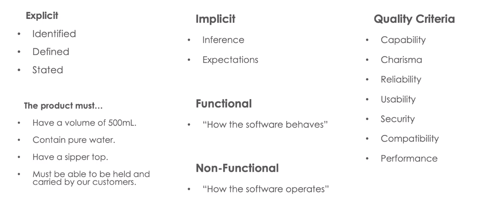

## 1.2. What do we test?

### 1.2.1. Unit testing

-   small components
-   Components = methods
-   golden rules of unit testing, one the bug you are testing should fail

### 1.2.2. Integration testing

-   testing integration of components

### 1.2.3. User Interface testing

-   Usually tests the entire stack of the application
-   Tests ui user would use

## 1.3. What does a pass look like?

Positive testing:

-   Prove you application works as expected

Negative testing:

-   Prove that you application gracefully handles invalid input.

## 1.4. Defect Report

What makes a good defect report?

-   What you did
    -   Detailed steps to reproduce
-   What you expected to see
    -   Expected behavior
-   What you saw
    -   Observation:
        -   Where you were doing it (Platform, Browser, O/S)
        -   Include images
        -   What impact does this have?

## 1.5. How to do testing?

-   Static Testing
    -   Finding defects without executing code
-   Dynamic Testing
    -   Automatic testing?

## 1.6. Testing Techniques

-   Boundary Value Analysis
    -   Testing boundaries between partitions
-   Equivalence Class Partitioning
    -   Allows you to partition set of tests into different groups

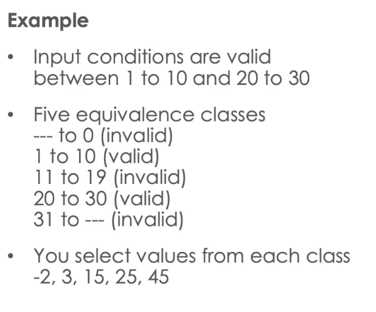

-   Decision Table Based Testing
    -   aka As Cause-Effect table

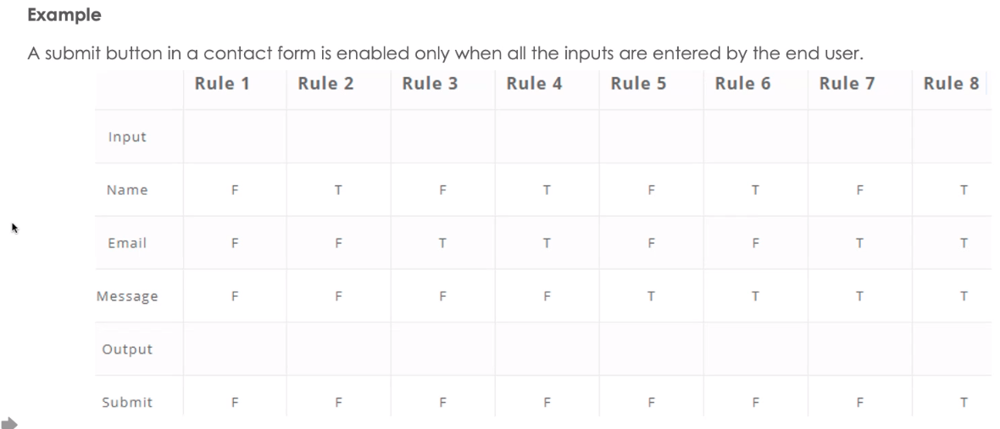

# 2. Manual Testing

## 2.1. Scripted Testing

-   Tests where certain data is needed
-   Testers have low domain knowledge
    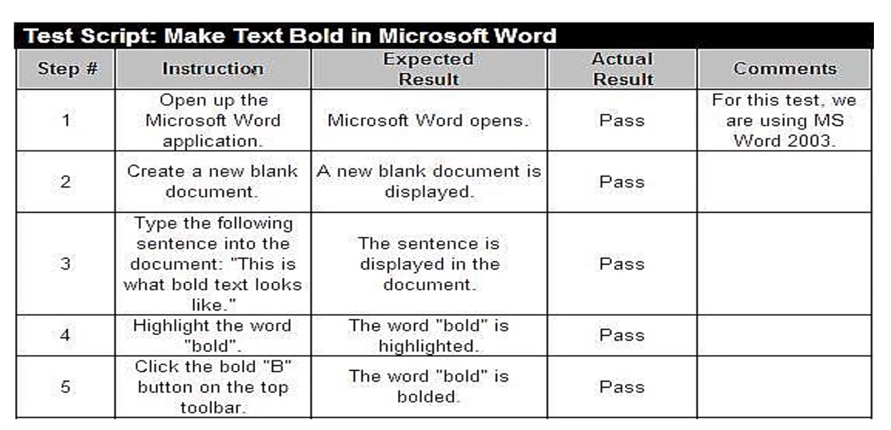

## 2.2. Exploratory Testing

> Exploratory testing is where the tester explores the system based on their expectations of its behavior, assessing if it meets out model.
> Those expectations are formed from explicit and implicit requirements

# 3. Automation Testing

-   Quick
-   Reliable

Good where is can be difficult, tedious, or error prone to do manually

Applied effectively, test automation can:

-   reduce repetitive manual testing
-   test areas hard to test manually
-   verify existing functionality hasn't broken (regression testing)
-   speed up time to delivery
-   decrease defect detection time

Examples:

-   Backend (API, DB, Cookies) validation
-   Acceptance checks to ensure previously developed features have nod regressed
-   Verifying network traffic between two components contain a hashed GUID
-   Generating synthetic data to check pagination within n report.

Types of Automation

-   Unit
-   Integration
-   User Interface
-   Acceptance
-   End to End
-   Performance
-   Compatibility
-   Security

## 3.1. Automation Test Pyramid

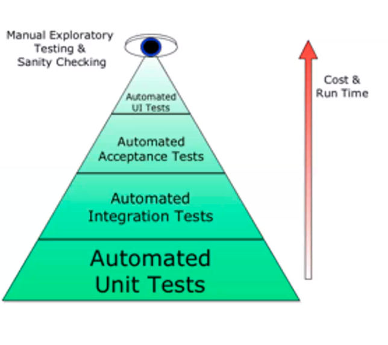

## 3.2. Manual vs Automated: Pros

Automated:

-   Fast to execute
-   Doesn't get bored
-   Hight attention to detail
-   Accurately repeatable
-   Achieve technically tricky testing
-   Low long term cost

Manual:

-   Creativity
-   High ROI (Return of Investments) initially
-   Lower technical skill lever entry point
-   Takes in a broader view

## 3.3. Manual vs Automated: Cons

Automated:

-   Maintenance cost
-   Low ROI (Initially)
-   Only does what we think of when we create it

Manual:

-   Slow to Execute
-   Can get bored / distracted affecting attention to detail
-   Harder to do technical testing
-   Maintenance costs (scripts)
-   Handover costs

# 4. When to do testing?

Testing should take place throughout the Software Development Life Cycle (SDLC)

## 4.1. The cost of testing...

The more code or systems the test uses, the more expensive it is to run
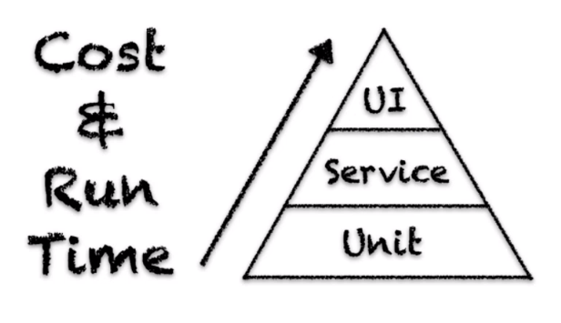

## 4.2. Cost of defects ...

The earlier we find defects, the cheaper they are to rectify
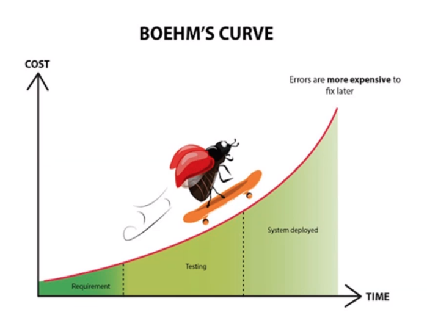

## 4.3. Shift Left

Push testing activities early as possible (to the left)

-   Test requirements before code is written
-   Automate tests early to give fastest feedback
-   Imagine test cases and talk them through

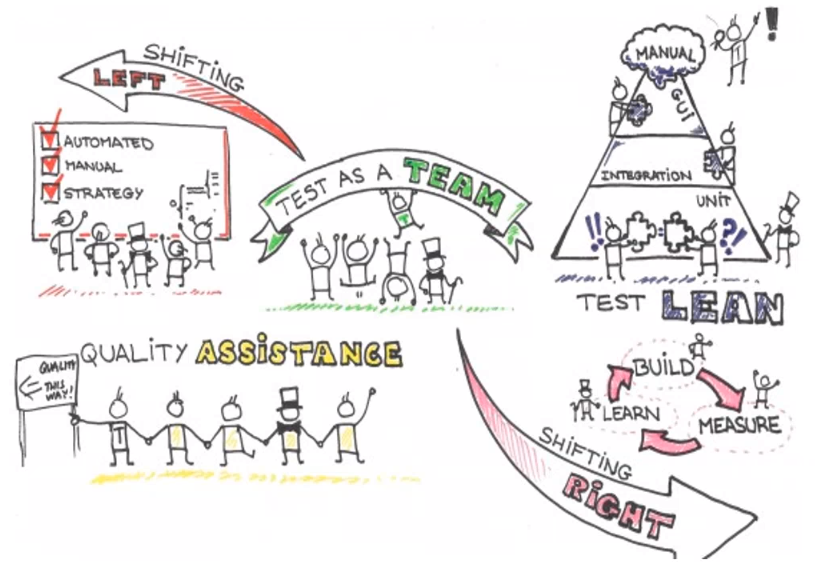

## 4.4. Test cheat sheet

-   `Claims testing` - Challenge what it claims it does
-   `User testing` - Be as a user
-   `Stress testing` - Overwhelm it
-   `Time` - Changes and behaviors in time
-   `Risk testing` - Imagine a problem, then look for it
-   `Data testing` - Test what it does with and to data

# 5. Who does the testing?

## 5.1. Test as a Team

Quality is a team responsibility.
The entire team is responsible for delivering a quality product:

-   Refining requirements
-   Refining test approaches ( 3 amigos)
-   Creating automation
-   Manual test execution

## 5.2. Test Lean

Reduce duplication between test layers

-   Test Pyramid
-   Collaborate, use team skills to create, refine & execute
-   Low (context appropriate) documentation

## 5.3. Testing Tools

-   Accessibility​

    -   Wave scanner​
    -   Accessibility heuristics​

-   Security​

    -   QWASP ZAP scanner​
    -   Burp Suite​

-   Performance​

    -   JMeter ​
    -   AWS Distributed Load Testing​

-   Automation​
    -   Cucumber BDD​
    -   Selenium​
    -   Rest Assured​
    -   Appium​
    -   TestNG​
    -   Cypress​
-   API ​
    -   Postman​
    -   Soap UI​
-   Compatibility​
    -   BrowserStack​
    -   SauceLabs​

## 5.4. Take-aways

Testing is:​

-   Analysing and discovering requirements to understand the expectations of a product.​

-   Examining that a product to assess if it meets those requirements.​

-   Using activities (tests) to elicit a pass or a fail against a requirement.​
    (A pass may be subjective.)​

-   We can start testing and thinking about testing before we have the product in front of us.​

-   Our knowledge and expectations of a product is not static.​
    It will evolve, and so should our testing.​

            ​

​Requirements​

-   Implicit & Explicit can be different from person to person.​

-   The lines between functional, non-functional, explicit and implicit requirements are blurry.​

-   Removing ambiguity is important. A clear understanding helps focus our testing​
    ​
-   Testing is not a competition. But it is a team sport. ​
    Collaboration, peer review, communication is important.​
-   Testing a product without knowing the rules or requirements is hard.​

-   Tests can take place at any point in a product (system)

---

-   A mix of manual and automated is a good thing.​
    We can’t, and shouldn’t, automate everything​
    We can’t, and shouldn’t, do everything manually​

​

-   Different types of testing check different requirements and areas: accessibility, performance, security, acceptance​

          ​
          ​

# 6. Practical Day 1

## 6.1. Automated Testing

## 6.2. Unit Testing

Verify individual units of source code
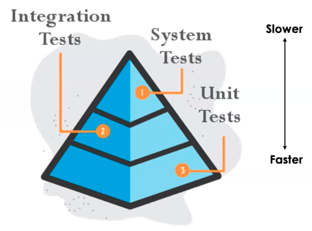

## 6.3. What does good look like?

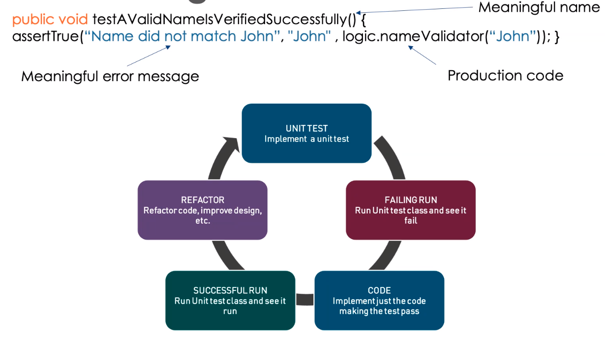

## 6.4. Test Coverage

start with 60%, aim to achieve 80%-90%. 100% is impractical
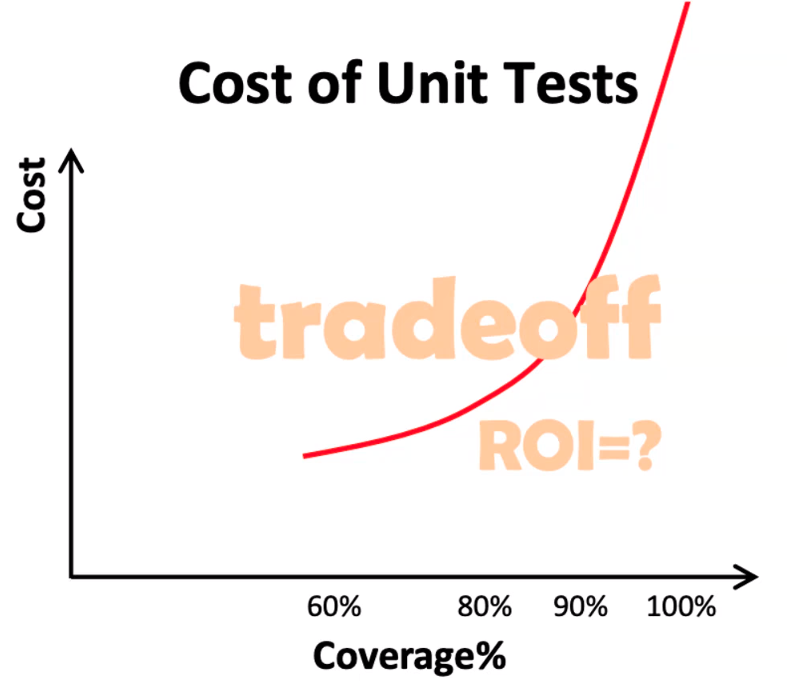

## 6.5. Evergreen Tests

Tests that always pass, that's bad.

## 6.6. Best Practices

-   Unit tests should be independed
-   Test only one code at a time

## 6.7. Unit Tests FIRST

-   Fast
-   Isolatable/Independed
-   ...

## 6.8. TDD

-   Write the tests first
-   Make them fail
-   write code
-   Make them pass

## 6.9. Integration Testing

-   makes sure modules/ components work properly together

---

-   Run reasonably fast
-   Test how your code interacts with framework
-   my mock or stub external dependencies
-   May access a db or filesystem or a network
-   may or may not run in parallel

test names should be as long as possible, the longer and more descriptive the better

## 6.10. Automated UI Testing

Why do automated ui testing?

-   saves time
-   verifies functionality and specifications
-   faster
-   repeatable and reusable
-   can run efficiently on ci/cd

Drawbacks

-   false sense of quality
-   slow feedback
-   test can be brittle
-   cannot replace human intelligence
-   maintenance time and effort
-   flaky tests
-   requires coding skills
-   data maintenance

## 6.11. What is selenium?

is a free open-source automated testing framework used to validate a web applications across different browsers and platforms

### 6.11.1. Selenium Webdriver

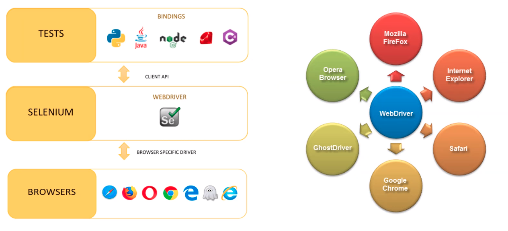

### 6.11.2. Selenium Grid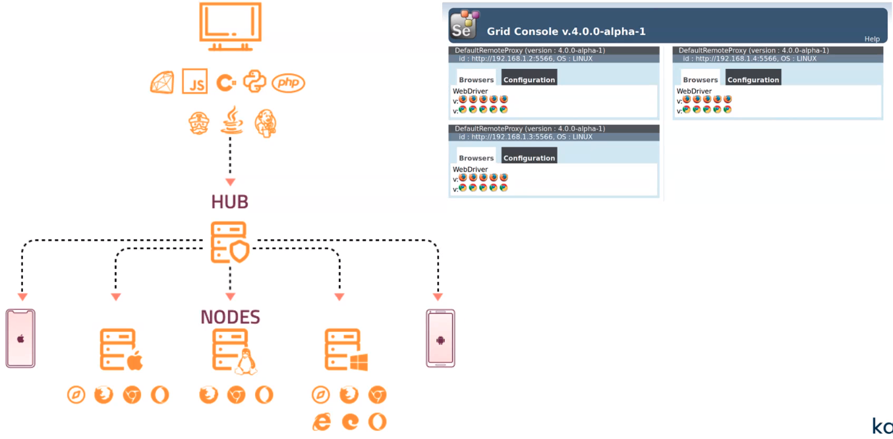

### 6.11.3. Locating UI elements

Selenium identifies UI elements using "locators"

-   a locator should uniquely identify te element under consideration"

Locator types:

-   ID
-   Name
-   CSS
-   Class name
-   XPath
-   Link text
-   TagName
-   Partial link text

## 6.12. Selenium Test Frameworks

-   Junit
-   TestNG
-   Hamcrest or AssertJ
-   Apache Ant/Maven

## 6.13. Page Object Model

-   Separation of concerns
    -   Tests and their implementations are separated into different layers of code.
    -   `page class` - handles all user interactions with a given page
    -   Each user interaction should be implemented as a separate method within the class
    -   `MasterPage` class represents UI elements common across all pages
-   Test scripts define the high-level business logic, and delegate all the corresponding implementation to page classes:

## 6.14. Page waits

-   Implicit waits
    -   `driver.manage().timeouts().implicitlyWait(20, TimeUnit.SECONDS);`
    -   Should be used with caution and only when necessary
    -   may slow down tests
    -   may cause flakiness
-   Explicit waits
    -   `element = WebDriverWait(driver, 10).until( EC.presence_of_element_located(By.ID, "myDynamicElement"))`
    -   much more flexible in slow environments
    -   could disguise performance issues
    -   recommended for async calls

## 6.15. Webdriver functions

-   Screenshots
-   Handling alerts
-   Handling pop-up windows
-   Handling frames
-   keyboard interactions

# 7. Automated Testing - day 2

## 7.1. Cucumber BDD

software tool that supports behavior-driven development(BDD)

Supports over a dozen of different software platforms

-   ruby on rails
-   selenium
-   picocontainer
-   spring framework
-   watir

bridge between business and technical language.

## 7.2. Advantages of Cucumber BDD

-   can be used as requirements
-   acceptance criteria
-   testers can easily read test cases
-   automation engineers can automatically run teh scripts from the test cases
-   can be used as walk through the project for the stakeholders
-   everyone in dev team relies on the same scenarios. Scenarios are requirements, acceptance criteria

## 7.3. Cucumber Structure

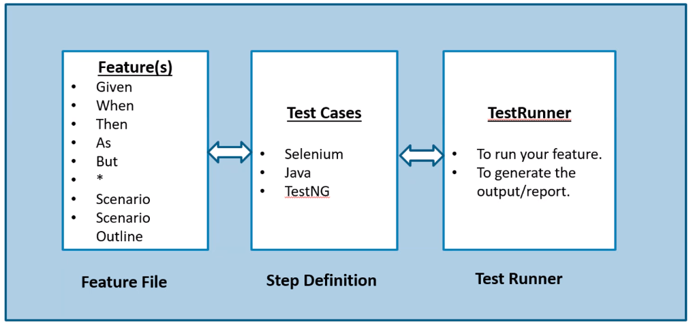

## 7.4. Cucumber Keywords

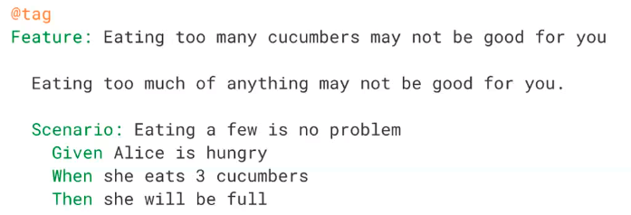

-   feature - info about functionality adn purpose of app
-   scenario - represents particular functionality
-   given - specifies pre-condition
-   when - same action needs to be performed
-   then - expected result
-   and
-   background
    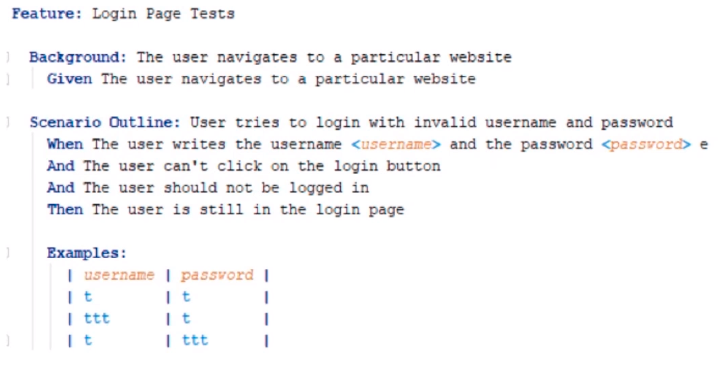

## 7.5. Performance Testing

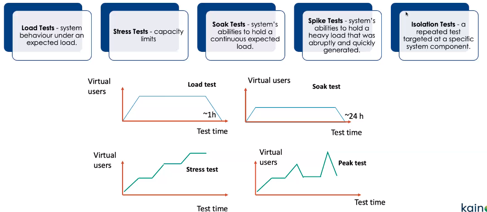

### 7.5.1. The consequences

Lost sales

-   too slow, people get bored

Lost customers

-   customer switch to competitor if website fails to load

Reputation

-   search engines de-index 'dead' sites
-   newspaper story

Time-critical service

-   people are not able to book critical appointments, pay a bill

### 7.5.2. NFR Requirements

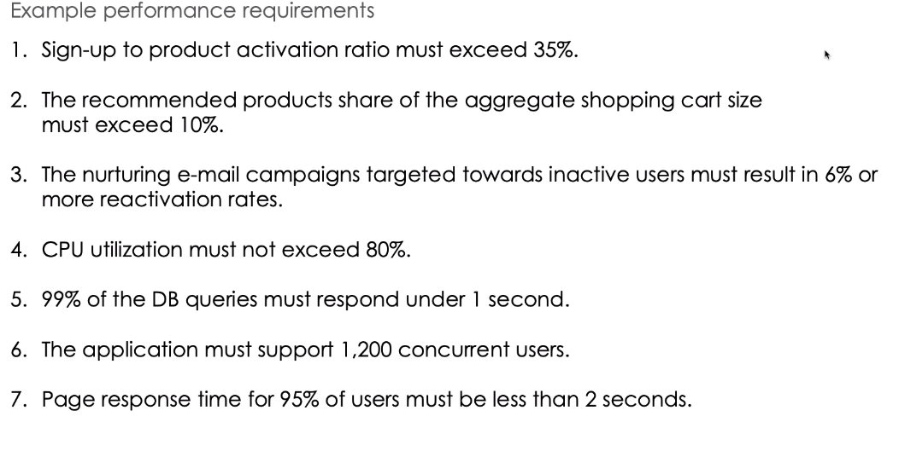

### 7.5.3. Load distribution

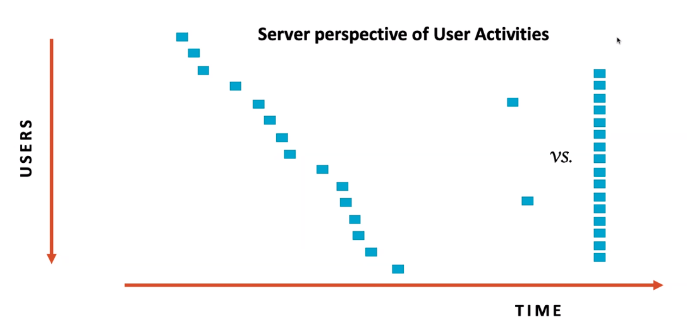

### 7.5.4. Utilisation metrics

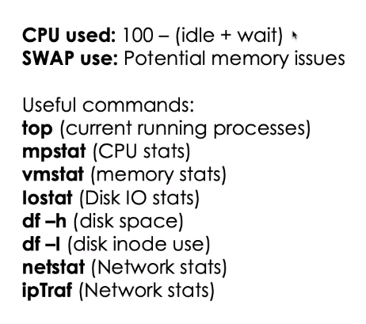

### 7.5.5. JMeter

open source java based performance test tool

-   cross-platform any os with java
-   scalable with distributed mode
-   multi-protocol support
