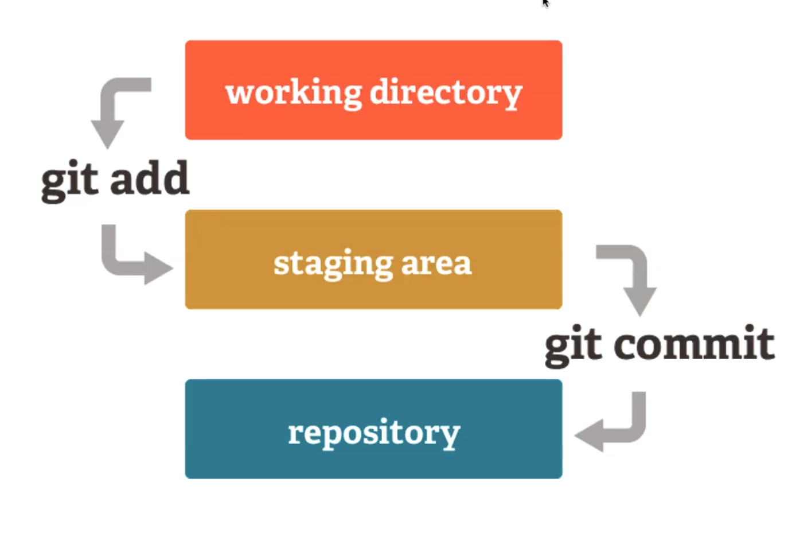
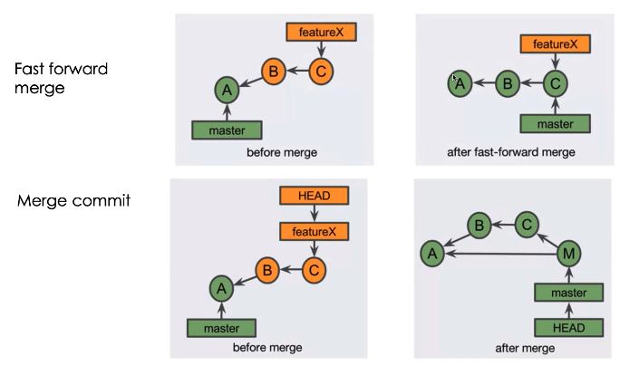
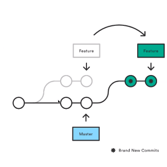

# 1. Git

Git is a distributed version control system

## 1.1. Git 101



> This diagram is missing remote repo

## 1.2. Scenarios

### 1.2.1. Modifying pushed commit (changes and message)

If you pushed a commit but realise you pushed something wrong up, you can amend your previous commit by making any changes then using

1. `git commit --no-edit --amend` to change commit message

2. `git commit -amend -m 'New commit message'` you will need to do git
3. `push --force` to push it up

### 1.2.2. Pushed a few changes that were not supposed to be committed

You can try deleting files with a new commit, but it doesn't fully delete those files from repository

In order to remove this change

1. `git reset HEAD~n` this command lets you move back to your previous `n` commits
2. `git reset HEAD~2` will take you back two commits and will show you the changes of the last two commits.
3. `git reset HEAD --hard` will delete all those changes.
   Next you will need to force push those changes **WARNING: THINK BEFORE YOU PUSH**
   This way you are completely rewriting history so all those files will be deleted

### 1.2.3. Cherry Picking

Allows you to pick specific commits from one branch and merge it into another branch

Example:
Say develop branch is 3 commits ahead of master, out of those 3, just 2nd commit need to be merged on master.

1. Checkout the master branch
2. `git cherry-pick <commit-hash>` to merge the specific commit to the master branch

if you want to merge the rest of develop branch with master, simply run `git rebase develop`

### 1.2.4. Git seems to be running quite slow locally

To optimise git run `git gc` which stands for garbage collection
It does a couple of housekeeping tasks:

-   compressing file revisions (reduce space and improve performance)
-   removing no longer reachable objects
-   packing refs
-   pruning reflog
-   rerere metadata
-   Other

### 1.2.5. Creating and Pushing new branch

> When you have created a new branch and want to push it off to a remote

From Git version 2.37.0, to check your version run `git --version`

```bash
git config --global --add --bool push.autoSetupRemote true
```

Now `git push` will automatically set up the remote branch

### 1.2.6. Squashing commits that contain a merge

> Need to create a **temporary** branch from the **master** to squash a **feature** branch there and then repoint the **feature** to the **temporary** branch now with squashed commits

-   `git checkout -b temp master`
-   `git merge --squash feature`
-   `git commit` commit all changes under one commit
-   `git checkout feature`
-   `git reset --hard temp` point feature branch to temp branch
-   `git branch -d temp`

### 1.2.7. Revert part of the commit

> A commit has been pushed to master that contains only parts of the changes you want to keep.

-   `git checkout -b revertBranch`
-   `git revert <commit hash you want to modify>`
-   `git reset HEAD~1` pops the last commit into staging, where parts you want to keep can be removed from this revert

### 1.2.8. Gitignore file without deleting it, and not tracking changes

> Say you have a config file that you want to be present in the repo, but you don't want people to keep overriding it with their changes

Ignoring file with `.gitignore` is not enough, but git allows you to manually "ignore" changes to a file / directory:

```bash
git update-index --assume-unchanged <file or directory>
```

You can also start tracking it again

```bash
git update-index --no-assume-unchanged <file>
```

To view files with disabled tracking

```bash
git ls-files -v | grep ^[h]
```

## 1.3. Tags

`git tag` to view tags in local repository
`git tag -a -m "includes feature 1" v0.1` -m to specify message, -a creates annotated tag

## 1.4. Merge



## 1.5. Rebase

-   Rebasing is the process of moving or combining a sequence of commit to a new base commit
-   Rebasing allows developers to maintain a linear project history
    

> Reasons to rebase is to maintain a clean commit history (just if you were working off an up to date master)

## 1.6. Rebase vs Merge


## 1.7. Resetting local branch to origin

When changes were made to local branch which are no longer desired, as long as the branch wasn't pushed, it can be reset to origin remote branch

1. On the branch to be reset `git fetch --all`
2. `git reset --hard origin/<branch>`

## 1.8. Rebasing feature branch with develop when the branched is based on another feature branch

> Scenario: feature-1 was developed, when development for the branch finished it wasn't merge into master. feature-2 branch was based on feature-1. feature-1 was merge into master with squash. Now master needs to be rebased into feature-2 update it.

1. `git rebase -i master` while in the target branch to do interactive rebase
2. Next commits will pop up, enter `d` to those commits you want to exclude and `p` for those you want to include (feature-2 commits)
3. `git push --force` to update origin

> There are different options that can be entered above
> Commands:
>
> -   p, pick <commit> = use commit
> -   r, reword <commit> = use commit, but edit the commit message
> -   e, edit <commit> = use commit, but stop for amending
> -   s, squash <commit> = use commit, but meld into previous commit
> -   f, fixup <commit> = like "squash", but discard this commit's log message
> -   x, exec <command> = run command (the rest of the line) using shell
> -   b, break = stop here (continue rebase later with 'git rebase --continue')
> -   d, drop <commit> = remove commit
> -   l, label <label> = label current HEAD with a name
> -   t, reset <label> = reset HEAD to a label
> -   m, merge [-C <commit> | -c <commit>] <label> [# <oneline>]. create a merge commit using the original merge commit's message (or the oneline, if no original merge commit was specified). Use -c <commit> to reword the commit message.

https://git-scm.com/book/en/v2/Git-Tools-Rewriting-History

# 2. Reference
