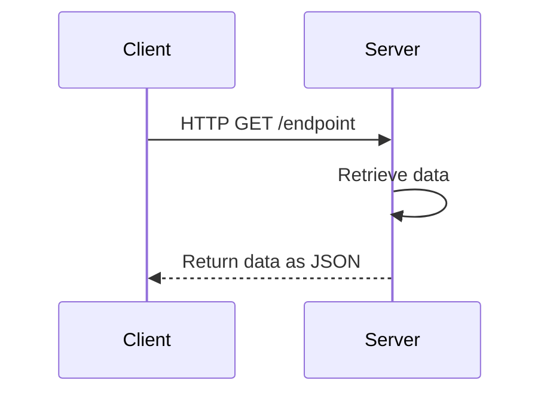

# 1. API Architectures

## 1.1. REST

REST - representational state transfer

### 1.1.1. end point options

-   `:` - variable
    -   `/users/:username/repos`
-   `?` - Query parameters
-   `&` - Query parameters separator - `?query1=value1&query2=value2
`

### 1.1.2. HTTP methods

-   `GET`
    -   This request is used to get a resource from a server. If you perform a `GET` request, the server looks for the data you requested and sends it back to you. In other words, a `GET` request performs a `READ` operation. This is the default request method.
-   `POST`
    -   This request is used to create a new resource on a server. If you perform a `POST` request, the server creates a new entry in the database and tells you whether the creation is successful. In other words, a `POST` request performs an `CREATE` operation.
-   `PUT` & `PATCH`
    -   These two requests are used to update a resource on a server. If you perform a `PUT` or `PATCH` request, the server updates an entry in the database and tells you whether the update is successful. In other words, a `PUT` or `PATCH` request performs an `UPDATE` operation.
-   `DELETE`
    -   This request is used to delete a resource from a server. If you perform a `DELETE` request, the server deletes an entry in the database and tells you whether the deletion is successful. In other words, a `DELETE` request performs a `DELETE` operation.

### 1.1.3. Headers

Provides information to both client an server.

List of valid headers [MDN web docs](https://developer.mozilla.org/en-US/docs/Web/HTTP/Headers)

Headers are `property-value pairs`

eg.

-   `Content-Type: application/json`

### 1.1.4. Data (Body)

Information to be sent to the server. This is usually used with `POST`, `PUT`, `PATCH` or `DELETE`

### 1.1.5. Authentication

There are 2 ways to authenticate yourself:

1. With a username and password
2. With a secret token (Like oAuth)

### 1.1.6. HTTP Status Codes and Error Messages

-   200+ means the request has `succeeded`.
-   300+ means the request is `redirected` to another URL
-   400+ means an `error that originates from the client` has occurred
-   500+ means an `error that originates from the server` has occurred

### 1.1.7. API Version

Requesting specific api version

1. Directly in the endpoint

    - https://api.twitter.com/1.1/account/settings.json

2. In a request header
    - Specify version with an `Accept` header