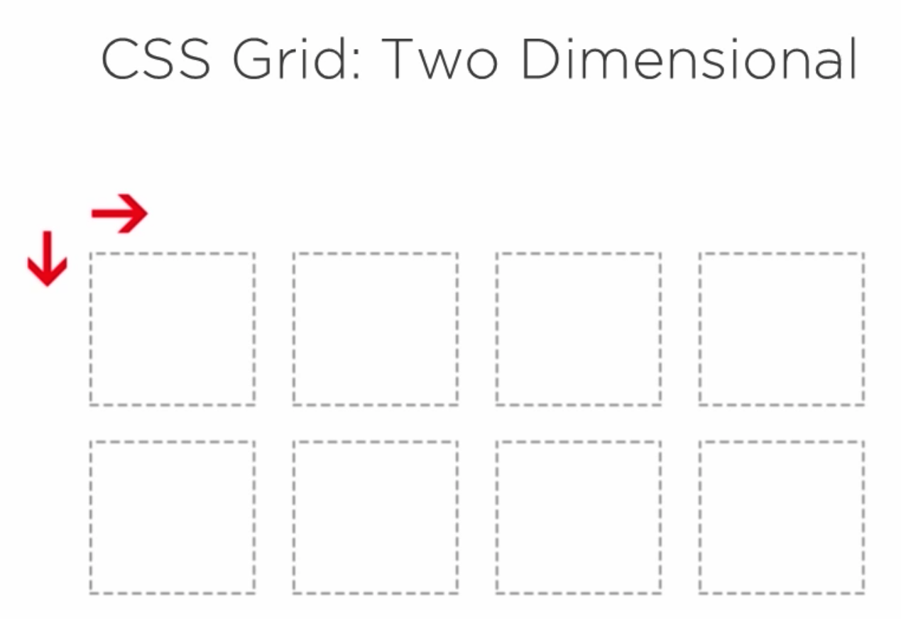

# 1. CSS

- [1. CSS](#1-css)
    - [1.1. Grid](#11-grid)
        - [1.1.1. Terminology](#111-terminology)
            - [1.1.1.1. Grid Container](#1111-grid-container)
            - [1.1.1.2. Grid Item](#1112-grid-item)
            - [1.1.1.3. Grid Line](#1113-grid-line)
            - [1.1.1.4. Grid Cell](#1114-grid-cell)
            - [1.1.1.5. Grid Track](#1115-grid-track)
            - [1.1.1.6. Grid Area](#1116-grid-area)
        - [1.1.2. Grid Properties](#112-grid-properties)
            - [1.1.2.1. Properties for the Parent (Grid container)](#1121-properties-for-the-parent-grid-container)
                - [1.1.2.1.1. display](#11211-display)
                - [1.1.2.1.2. grid-template-columns \& grid-template-rows](#11212-grid-template-columns--grid-template-rows)
                - [1.1.2.1.4. grid-template-areas](#11214-grid-template-areas)
                - [1.1.2.1.5. grid-template](#11215-grid-template)
                - [1.1.2.1.6. grid-column-gap](#11216-grid-column-gap)
                - [1.1.2.1.7. grid-row-gap](#11217-grid-row-gap)
                - [1.1.2.1.8. grid-gap](#11218-grid-gap)
                - [1.1.2.1.9. justify-items](#11219-justify-items)
                - [1.1.2.1.10. align-items](#112110-align-items)
                - [1.1.2.1.11. place-items](#112111-place-items)
                - [1.1.2.1.12. justify-content](#112112-justify-content)
                - [1.1.2.1.13. align-content](#112113-align-content)
                - [1.1.2.1.14. place-content](#112114-place-content)
                - [1.1.2.1.15. grid-auto-columns](#112115-grid-auto-columns)
                - [1.1.2.1.16. grid-auto-rows](#112116-grid-auto-rows)
                - [1.1.2.1.17. grid-auto-flow](#112117-grid-auto-flow)
                - [1.1.2.1.18. grid](#112118-grid)
            - [1.1.2.2. Properties for the Grid item](#1122-properties-for-the-grid-item)
                - [1.1.2.2.1. grid-column-start](#11221-grid-column-start)
                - [1.1.2.2.2. grid-column-end](#11222-grid-column-end)
                - [1.1.2.2.3. grid-row-start](#11223-grid-row-start)
                - [1.1.2.2.4. grid-row-end](#11224-grid-row-end)
                - [1.1.2.2.5. grid-column](#11225-grid-column)
                - [1.1.2.2.6. grid-row](#11226-grid-row)
                - [1.1.2.2.7. grid-area](#11227-grid-area)
                - [1.1.2.2.8. justify-self](#11228-justify-self)
                - [1.1.2.2.9. align-self](#11229-align-self)
                - [1.1.2.2.10. place-self](#112210-place-self)
        - [1.1.3. CSS Grid](#113-css-grid)
        - [1.1.4. Grid Features](#114-grid-features)
        - [1.1.5. Grid Basis](#115-grid-basis)
            - [1.1.5.1. Columns and Rows](#1151-columns-and-rows)
            - [1.1.5.2. Grid Lines](#1152-grid-lines)
- [2. Reference](#2-reference)

## 1.1. Grid

System for structuring layouts using CSS
Other Structuring Layouts

-   HTML Tables
-   Box Model
-   Flexbox

Grid is a two-dimensional grid-based layout system

### 1.1.1. Terminology

#### 1.1.1.1. Grid Container

The element on which `display: grid` is applied. It’s the direct parent of all the grid items. In this example `container` is the grid container.

```html
<div class="container">
    <div class="item item-1"></div>
    <div class="item item-2"></div>
    <div class="item item-3"></div>
</div>
```

#### 1.1.1.2. Grid Item

The children (i.e. direct descendants) of the grid container. Here the `item` elements are grid items, but `sub-item` isn’t.

```html
<div class="container">
    <div class="item"></div>
    <div class="item">
        <p class="sub-item"></p>
    </div>
    <div class="item"></div>
</div>
```

#### 1.1.1.3. Grid Line

The dividing lines that make up the structure of the grid. They can be either vertical (“column grid lines”) or horizontal (“row grid lines”) and reside on either side of a row or column. Here the yellow line is an example of a column grid line.


#### 1.1.1.4. Grid Cell

The space between two adjacent row and two adjacent column grid lines. It’s a single “unit” of the grid. Here’s the grid cell between row grid lines 1 and 2, and column grid lines 2 and 3.


#### 1.1.1.5. Grid Track

The space between two adjacent grid lines. You can think of them like the columns or rows of the grid. Here’s the grid track between the second and third row grid lines.


#### 1.1.1.6. Grid Area

The total space surrounded by four grid lines. A grid area may be composed of any number of grid cells. Here’s the grid area between row grid lines 1 and 3, and column grid lines 1 and 3.


### 1.1.2. Grid Properties

#### 1.1.2.1. Properties for the Parent (Grid container)

##### 1.1.2.1.1. display

Defines the element as a grid container and establishes a new grid formatting context for its contents

> Values:
>
> -   `grid` - generates a block-level grid
> -   `inline-grid` - generates an inline-level grid

```css
.container {
    display: grid | inline-grid;
}
```

##### 1.1.2.1.2. grid-template-columns & grid-template-rows

Defines the columns and rows of the grid with a space-separated list of values. The values represent the track size and space between them represents the grid line.

> Values:
>
> -   `<track-size>` - can be a length, a percentage, or a fraction of the free space in the grid(using the fr unit)
> -   `<line-name>` - an arbitrary name of your choosing

```css
.container {
    grid-template-columns: ... | ...;
    grid-template-rows: ... | ...;
}
```

**Example**
When you leave an empty space between the track values, the grid lines are automatically assigned positive and negative numbers

```css
.container {
    grid-template-columns: 40px 50px auto 50px 40px;
    grid-template-rows: 25% 100px auto;
}
```


or you can name lines explicitly

```css
.container {
    grid-template-columns: [first] 40px [line2] 50px [line3] auto [col4-start] 50px [five] 40px [end];
    grid-template-rows: [row1-start] 25% [row1-end] 100px [third-line] auto [last-line];
}
```


Line can have more than one name

```css
.container {
    grid-template-rows: [row1-start] 25% [row1-end row2-start] 25% [row2-end];
}
```

You can use `repeat()` notation to repeat parts

```css
.container {
    grid-template-columns: repeat(3, 20px [col-start]);
}
```

lines which have the same name can be referenced by their line name and count

```css
.item {
    grid-column-start: col-start 2;
}
```

The `fr` unit allows to set track size as a fraction. Free space is calculated after the non-flexible items (px)

```css
.container {
    grid-template-columns: 1fr 1fr 1fr;
}
```

##### 1.1.2.1.4. grid-template-areas

Defines a grid template by referencing the names of the grid areas which are specified with teh `grid-area` property. Repeating the name of a grid area causes the content to span those cells

Values:

-   `<grid-area-name>` - the name of a grid area specified with **grid-area**
-   `.` - a period signifies an empty grid cell
-   `none` - no grid areas are defined

```css
.container {
    grid-template-areas:
        " | . | none | ... "
        "...";
}
```

example

```css
item-a {
    grid-area: header;
}
.item-b {
    grid-area: main;
}
.item-c {
    grid-area: sidebar;
}
.item-d {
    grid-area: footer;
}

.container {
    display: grid;
    grid-template-columns: 50px 50px 50px 50px;
    grid-template-rows: auto;
    grid-template-areas:
        "header header header header"
        "main main . sidebar"
        "footer footer footer footer";
}
```


Each row in declaration needs to have the same number of cells

##### 1.1.2.1.5. grid-template

##### 1.1.2.1.6. grid-column-gap

##### 1.1.2.1.7. grid-row-gap

##### 1.1.2.1.8. grid-gap

##### 1.1.2.1.9. justify-items

##### 1.1.2.1.10. align-items

##### 1.1.2.1.11. place-items

##### 1.1.2.1.12. justify-content

##### 1.1.2.1.13. align-content

##### 1.1.2.1.14. place-content

##### 1.1.2.1.15. grid-auto-columns

##### 1.1.2.1.16. grid-auto-rows

##### 1.1.2.1.17. grid-auto-flow

##### 1.1.2.1.18. grid

#### 1.1.2.2. Properties for the Grid item

##### 1.1.2.2.1. grid-column-start

##### 1.1.2.2.2. grid-column-end

##### 1.1.2.2.3. grid-row-start

##### 1.1.2.2.4. grid-row-end

##### 1.1.2.2.5. grid-column

##### 1.1.2.2.6. grid-row

##### 1.1.2.2.7. grid-area

##### 1.1.2.2.8. justify-self

##### 1.1.2.2.9. align-self

##### 1.1.2.2.10. place-self

### 1.1.3. CSS Grid



### 1.1.4. Grid Features

-   Fixed and Fluid Tracks
-   Horizontal and Vertical Alignment
-   Naming Tracks
-   Dynamic Organization

### 1.1.5. Grid Basis

#### 1.1.5.1. Columns and Rows

```css
grid-template-columns: 20px 50% auto;
grid-template-rows: 1fr 1.5fr;
```

defines width of each column and row

To repeat the values `repeat()` can be used.

> -   1st argument number of times to repeat the value
> -   2nd argument value to repeat

```css
grid-template-columns: repeat(3, 15) auto;
```

#### 1.1.5.2. Grid Lines

```css
grid-template-columns: 10% 40% auto;
/*                                         1     2     3 */
```

Each row or column are automatically given an implicit grid line number

**Can also be explicitly named**

```css
grid-template-columns: [sidebar] 10% [content] 40% [sidebar] auto [last-line];
```

**Using Grid Lines in Child Containers**

> They accept
>
> -   Implicit Number
> -   Explicit Name
> -   Span followed by (implicit or explicit)
> -   auto

```css
grid-column-start:
grid-column-end:

grid-row-start:
grid-row-end:
```

# 2. Reference

-   [CSS Tricks | A Complete Guide to Grid ](https://css-tricks.com/snippets/css/complete-guide-grid/)
