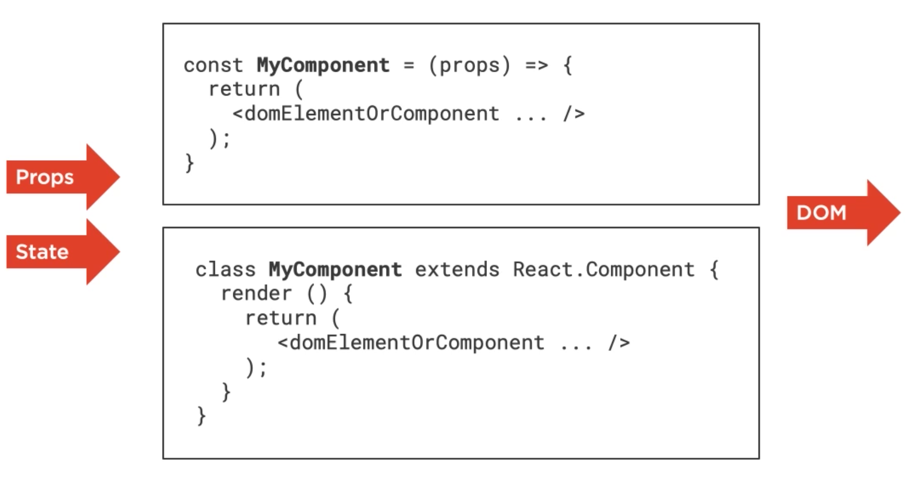

# 1. React

React is a declarative, efficient, and flexible JavaScript library for building user interfaces. It lets you compose complex UIs from small and isolated pieces of code called “components”.
https://reactjs.org/tutorial/tutorial.html

-   Components
-   Reactive Updates
-   Virtual views in memory


## 1.1. Setup

`npx create-react-app my-app`

when ready to build run
`npm run build`

# 2. React.Component

> -   Like functions
> -   Input: props, state | Output: UI
> -   Reusable and composable
> -   \<Component /\>
> -   Can Manage a private state

```JSX
class ShoppingList extends React.Component {
    render() {
        return (
            <div className="shopping-list">
                <h1>Shopping List for {this.props.name}</h1>
                <ul>
                    <li>Instagram</li>
                    <li>WhatsApp</li>
                    <li>Oculus</li>
                </ul>
            </div>
        );
    }
}

// Example usage: <ShoppingList name="Mark" />
```

components take parameters called `props` (properties) and return a hierarchy of views to display via the `render` method

Most developers use special syntax called "JSX" which makes it easier to write
`<div />` is equivalent to

```jsx
return React.createElement(
    "div",
    { className: "shopping-list" },
    React.createElement("h1" /* ... h1 children ... */),
    React.createElement("ul" /* ... ul children ... */),
);
```

The ShoppingList component above only renders built-in DOM components like `<div />` and `<li />`. But you can compose and render custom React components too. For example, we can now refer to the whole shopping list by writing `<ShoppingList />`. Each React component is encapsulated and can operate independently; this allows you to build complex UIs from simple components.

## 2.1. Types:


props

    - Can be passed
    - Immutable

state - Internal state  
 - Can be changed internally

### 2.1.1. Function component

```jsx
const MyComponent =(props) => {
    return (
            <domElementOrComponent ... />
    );
}
```

### 2.1.2. Class Component

```jsx
const MyComponent extends React.Component {
    render () {
        return (
            <domElementOrComponent ... />
        )
    }
}
```

# 3. State

React components can have state by setting `this.state` in their constructors. `this.state` should be considered as private to a React component that it’s defined in. Let’s store the current value of the Square in `this.state`, and change it when the Square is clicked.

```jsx
class Square extends React.Component {
    constructor(props) {
        super(props);
        this.state = {
            value: null,
        };
    }

    render() {
        return (
            <button
                className="square"
                onClick={() => this.setState({value: 'X'}>
                {this.state.value} </button>
        );
    }
}
```

> all javascript classes need to start with super call

## 3.1. useState()

> `[a, b] = useState()`
>
> -   a - state object (getter)
> -   b - updater function (setter)

```jsx
function Button(props) {
    const handleClick = () => props.onClick(props.incrementValue)
	return (
        <button onClick={handleClick}>
            +{props.incrementValue}
        </button>
        );
}

function Display(props) {
    return (
        <div>{props.message}</div>
    );
}

function App() {
    const [counter, setCounter] = useState(0);
    const incrementCounter = (inc) => setCounter(counter+inc));
    return (
        <>
            <Button onClick={incrementCounter} incrementValue={1}/>
            <Display message={counter} />
        </>
    );
}

ReactDOM.render(
    <App />,
    document.getElementById('mountNode'),
);
```

> When rendering you can't just write `<Button /><Display />`, as those will be translated into functions. There are two options you can do
>
> 1. Make an array `[<Button />,<Display />]` which is useful for dynamic content
> 2. Make them children of other element `<div> <Button /><Display /> </div`. React has a special element for that which doesn't introduce a dumb parent `<React.Fragment> </React.Fragment>` which also has a shortcut as a empty tag `<> </>`

# 4. Reference

-   [Tutorial: Intro to React](https://reactjs.org/tutorial/tutorial.html)
-   [Pluralsight | React: Getting Started by Samer Buna](https://app.pluralsight.com/library/courses/react-js-getting-started/table-of-contents)
