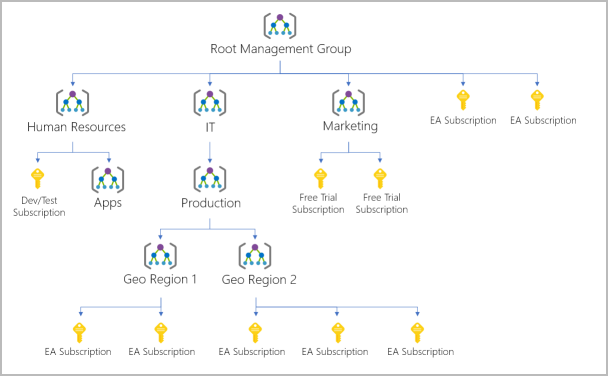
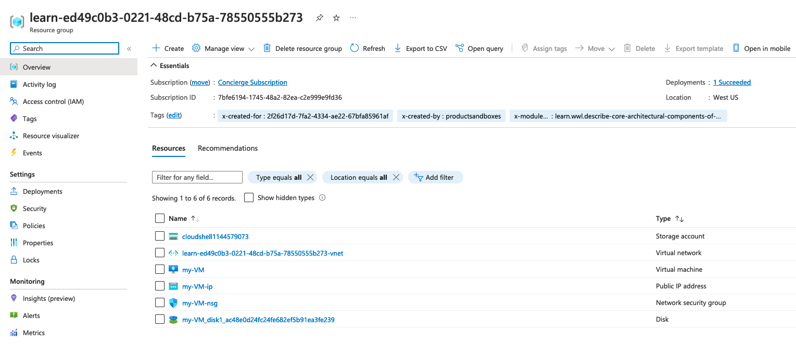
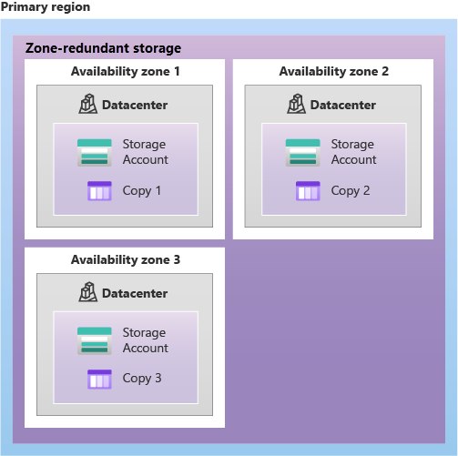
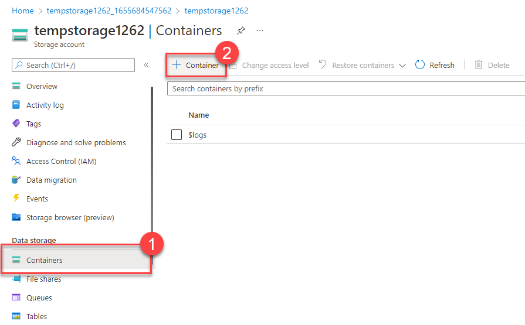
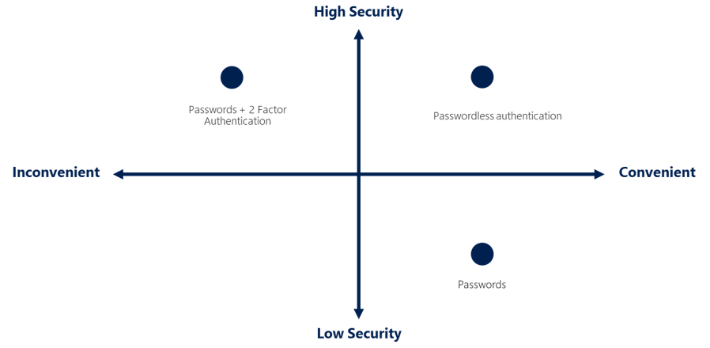
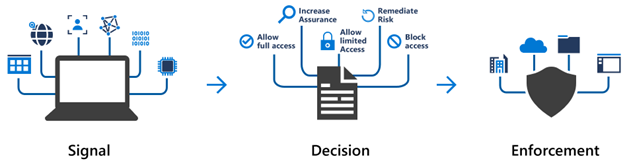
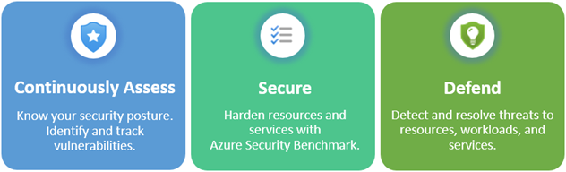
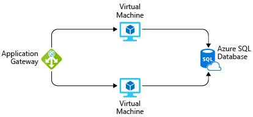

# 1. AZ-900 Fundamentals

- [1. AZ-900 Fundamentals](#1-az-900-fundamentals)
  - [1.1. Describe Cloud concepts](#11-describe-cloud-concepts)
    - [1.1.1. Describe Cloud computing](#111-describe-cloud-computing)
      - [1.1.1.1. What is cloud computing](#1111-what-is-cloud-computing)
      - [1.1.1.2. Describe the shared responsibility model](#1112-describe-the-shared-responsibility-model)
    - [1.1.2. Define cloud models](#112-define-cloud-models)
    - [1.1.3. Describe the consumption-based model](#113-describe-the-consumption-based-model)
      - [1.1.3.1. Compare Cloud pricing models](#1131-compare-cloud-pricing-models)
    - [1.1.4. Knowledge Check](#114-knowledge-check)
    - [1.1.5. Describe the benefits of using cloud services](#115-describe-the-benefits-of-using-cloud-services)
      - [1.1.5.1. Describe the benefits of high availability and scalability in the cloud](#1151-describe-the-benefits-of-high-availability-and-scalability-in-the-cloud)
        - [1.1.5.1.1. High Availability](#11511-high-availability)
        - [1.1.5.1.2. Scalability](#11512-scalability)
          - [1.1.5.1.2.1. Vertical Scaling](#115121-vertical-scaling)
          - [1.1.5.1.2.2. Horizontal Scaling](#115122-horizontal-scaling)
      - [1.1.5.2. Describe the benefits of reliability and predictability in the cloud](#1152-describe-the-benefits-of-reliability-and-predictability-in-the-cloud)
        - [1.1.5.2.1. Reliability](#11521-reliability)
        - [1.1.5.2.2. Predictability](#11522-predictability)
          - [1.1.5.2.2.1. Performance](#115221-performance)
          - [1.1.5.2.2.2. Cost](#115222-cost)
      - [1.1.5.3. Describe the benefits of security and governance in the cloud](#1153-describe-the-benefits-of-security-and-governance-in-the-cloud)
      - [1.1.5.4. Describe the benefits of manageability in the cloud](#1154-describe-the-benefits-of-manageability-in-the-cloud)
        - [1.1.5.4.1. Management of the cloud](#11541-management-of-the-cloud)
        - [1.1.5.4.2. Management in the cloud](#11542-management-in-the-cloud)
      - [1.1.5.5. Knowledge Check](#1155-knowledge-check)
    - [1.1.6. Describe Cloud Service Types](#116-describe-cloud-service-types)
      - [1.1.6.1. Share Responsibility model](#1161-share-responsibility-model)
      - [1.1.6.2. Describe Infrastructure as a Service (IaaS)](#1162-describe-infrastructure-as-a-service-iaas)
        - [1.1.6.2.1. Scenarios](#11621-scenarios)
      - [1.1.6.3. Describe Platform as a Service (PaaS)](#1163-describe-platform-as-a-service-paas)
        - [1.1.6.3.1. Scenarios](#11631-scenarios)
      - [1.1.6.4. Describe Software as a Service (SaaS)](#1164-describe-software-as-a-service-saas)
        - [1.1.6.4.1. Scenarios](#11641-scenarios)
      - [1.1.6.5. Knowledge Check](#1165-knowledge-check)
  - [1.2. Describe Azure Architecture and services](#12-describe-azure-architecture-and-services)
    - [1.2.1. Describe the core architectural components of Azure](#121-describe-the-core-architectural-components-of-azure)
      - [1.2.1.1. Get started with Azure accounts](#1211-get-started-with-azure-accounts)
        - [1.2.1.1.1. What is the Microsoft Learn sandbox?](#12111-what-is-the-microsoft-learn-sandbox)
      - [1.2.1.2. Explore the Learn Sandbox](#1212-explore-the-learn-sandbox)
        - [1.2.1.2.1. Task 1: Use the PowerShell CLI](#12121-task-1-use-the-powershell-cli)
        - [1.2.1.2.2. Task 2: Use the BASH CLI](#12122-task-2-use-the-bash-cli)
        - [1.2.1.2.3. Task 3: Use Azure CLI interactive mode](#12123-task-3-use-azure-cli-interactive-mode)
      - [1.2.1.3. Describe Azure physical infrastructure](#1213-describe-azure-physical-infrastructure)
        - [1.2.1.3.1. Regions](#12131-regions)
        - [1.2.1.3.2. Availability Zones](#12132-availability-zones)
        - [1.2.1.3.3. Use availability zones in your apps](#12133-use-availability-zones-in-your-apps)
        - [1.2.1.3.4. Region pairs](#12134-region-pairs)
          - [1.2.1.3.4.1. Additional Advantages of region pairs:](#121341-additional-advantages-of-region-pairs)
        - [1.2.1.3.5. Sovereign Regions](#12135-sovereign-regions)
      - [1.2.1.4. Describe Azure management infrastructure](#1214-describe-azure-management-infrastructure)
        - [1.2.1.4.1. Azure resources and resource groups](#12141-azure-resources-and-resource-groups)
        - [1.2.1.4.2. Azure subscriptions](#12142-azure-subscriptions)
        - [1.2.1.4.3. Create additional Azure subscriptions](#12143-create-additional-azure-subscriptions)
        - [1.2.1.4.4. Azure management groups](#12144-azure-management-groups)
        - [1.2.1.4.5. Management group, subscriptions, and resource group hierarchy](#12145-management-group-subscriptions-and-resource-group-hierarchy)
      - [1.2.1.5. Exercise - Create and Azure Resource](#1215-exercise---create-and-azure-resource)
        - [1.2.1.5.1. Task 1: Create a Virtual Machine](#12151-task-1-create-a-virtual-machine)
        - [1.2.1.5.2. Task 2: Verify resources created](#12152-task-2-verify-resources-created)
        - [1.2.1.5.3. Clean up](#12153-clean-up)
      - [1.2.1.6. Knowledge Check](#1216-knowledge-check)
    - [1.2.2. Describe Azure compute and networking services](#122-describe-azure-compute-and-networking-services)
      - [1.2.2.1. Describe Azure Virtual Machines](#1221-describe-azure-virtual-machines)
        - [1.2.2.1.1. Scale VMs in Azure](#12211-scale-vms-in-azure)
          - [1.2.2.1.1.1. Virtual Machine scale set](#122111-virtual-machine-scale-set)
          - [1.2.2.1.1.2. Virtual Machine availability set](#122112-virtual-machine-availability-set)
        - [1.2.2.1.2. Example of when to use VMs](#12212-example-of-when-to-use-vms)
        - [1.2.2.1.3. VM Resources](#12213-vm-resources)
      - [1.2.2.2. Exercise - Create an Azure Virtual Machine](#1222-exercise---create-an-azure-virtual-machine)
        - [1.2.2.2.1. Task 1: Create a Linux virtual machine and install Nginx](#12221-task-1-create-a-linux-virtual-machine-and-install-nginx)
      - [1.2.2.3. Describe Azure Virtual Desktop](#1223-describe-azure-virtual-desktop)
      - [1.2.2.4. Describe Azure Containers](#1224-describe-azure-containers)
        - [1.2.2.4.1. VM vs Container](#12241-vm-vs-container)
      - [1.2.2.5. Describe Azure Functions](#1225-describe-azure-functions)
      - [1.2.2.6. Describe application hosting options](#1226-describe-application-hosting-options)
        - [1.2.2.6.1. Azure App Service](#12261-azure-app-service)
          - [1.2.2.6.1.1. Types of App Services](#122611-types-of-app-services)
          - [1.2.2.6.1.2. Web Apps](#122612-web-apps)
          - [1.2.2.6.1.3. API Apps](#122613-api-apps)
          - [1.2.2.6.1.4. WebJobs](#122614-webjobs)
          - [1.2.2.6.1.5. Mobile Apps](#122615-mobile-apps)
      - [1.2.2.7. Describe Azure Virtual Networking](#1227-describe-azure-virtual-networking)
        - [1.2.2.7.1. Isolation and Segmentation](#12271-isolation-and-segmentation)
        - [1.2.2.7.2. Internet Communications](#12272-internet-communications)
        - [1.2.2.7.3. Communicate between Azure resources](#12273-communicate-between-azure-resources)
        - [1.2.2.7.4. Communicate with no-premises resources](#12274-communicate-with-no-premises-resources)
        - [1.2.2.7.5. Route network traffic](#12275-route-network-traffic)
        - [1.2.2.7.6. Filter network traffic](#12276-filter-network-traffic)
        - [1.2.2.7.7. Connect virtual networks](#12277-connect-virtual-networks)
      - [1.2.2.8. Exercise - Configure network access](#1228-exercise---configure-network-access)
        - [1.2.2.8.1. Task 1: Access your web server](#12281-task-1-access-your-web-server)
        - [1.2.2.8.2. Task 2: List the current network security group rules](#12282-task-2-list-the-current-network-security-group-rules)
        - [1.2.2.8.3. Task 3: Create the network security rule](#12283-task-3-create-the-network-security-rule)
        - [1.2.2.8.4. Task 4: Access your web server again](#12284-task-4-access-your-web-server-again)
      - [1.2.2.9. Describe Azure Virtual Private Network](#1229-describe-azure-virtual-private-network)
        - [1.2.2.9.1. VPN Gateways](#12291-vpn-gateways)
        - [1.2.2.9.2. High-availability scenarios](#12292-high-availability-scenarios)
      - [1.2.2.10. Describe Azure ExpressRoute](#12210-describe-azure-expressroute)
        - [1.2.2.10.1. Features and benefits of ExpressRoute](#122101-features-and-benefits-of-expressroute)
        - [1.2.2.10.2. ExpressRoute connectivity models](#122102-expressroute-connectivity-models)
        - [1.2.2.10.3. Security considerations](#122103-security-considerations)
      - [1.2.2.11. Describe Azure DNS](#12211-describe-azure-dns)
        - [1.2.2.11.1. Benefits of Azure DNS](#122111-benefits-of-azure-dns)
        - [1.2.2.11.2. Reliability and performance](#122112-reliability-and-performance)
        - [1.2.2.11.3. Security](#122113-security)
        - [1.2.2.11.4. Ease of use](#122114-ease-of-use)
        - [1.2.2.11.5. Customizable virtual networks with private domains](#122115-customizable-virtual-networks-with-private-domains)
        - [1.2.2.11.6. Alias records](#122116-alias-records)
      - [1.2.2.12. Knowledge Check](#12212-knowledge-check)
    - [1.2.3. Describe Azure storage services](#123-describe-azure-storage-services)
      - [1.2.3.1. Describe Azure storage accounts](#1231-describe-azure-storage-accounts)
        - [1.2.3.1.1. Storage account endpoints](#12311-storage-account-endpoints)
      - [1.2.3.2. Describe Azure storage redundancy](#1232-describe-azure-storage-redundancy)
        - [1.2.3.2.1. Redundancy in the primary region](#12321-redundancy-in-the-primary-region)
        - [1.2.3.2.2. Redundancy in a secondary region](#12322-redundancy-in-a-secondary-region)
        - [1.2.3.2.3. Read access to data in the secondary region](#12323-read-access-to-data-in-the-secondary-region)
      - [1.2.3.3. Describe Azure storage services](#1233-describe-azure-storage-services)
      - [1.2.3.4. Exercise - Create a storage blob](#1234-exercise---create-a-storage-blob)
        - [1.2.3.4.1. Create a storage account](#12341-create-a-storage-account)
        - [1.2.3.4.2. Work with blob storage](#12342-work-with-blob-storage)
        - [1.2.3.4.3. Change the access level of your blob](#12343-change-the-access-level-of-your-blob)
      - [1.2.3.5. Identify Azure data migration options](#1235-identify-azure-data-migration-options)
        - [1.2.3.5.1. Azure Migrate](#12351-azure-migrate)
        - [1.2.3.5.2. Azure Data Box](#12352-azure-data-box)
      - [1.2.3.6. Identify Azure file movement options](#1236-identify-azure-file-movement-options)
      - [1.2.3.7. Knowledge check](#1237-knowledge-check)
    - [1.2.4. Describe Azure identity, access, and security](#124-describe-azure-identity-access-and-security)
      - [1.2.4.1. Describe Azure directory services](#1241-describe-azure-directory-services)
        - [1.2.4.1.1. Can I connect my on-premises AD with Azure AD?](#12411-can-i-connect-my-on-premises-ad-with-azure-ad)
        - [1.2.4.1.2. Azure Active Directory Domain Services](#12412-azure-active-directory-domain-services)
      - [1.2.4.2. Describe Azure authentication methods](#1242-describe-azure-authentication-methods)
      - [1.2.4.3. Describe Azure External identities](#1243-describe-azure-external-identities)
      - [1.2.4.4. Describe Azure conditional access](#1244-describe-azure-conditional-access)
      - [1.2.4.5. Describe Azure role-based access control (Azure RBAC)](#1245-describe-azure-role-based-access-control-azure-rbac)
        - [1.2.4.5.1. How is Azure RBAC enforced?](#12451-how-is-azure-rbac-enforced)
      - [1.2.4.6. Describe zero trust model](#1246-describe-zero-trust-model)
      - [1.2.4.7. Describe defence-in-depth](#1247-describe-defence-in-depth)
      - [1.2.4.8. Describe Microsoft Defender for Cloud](#1248-describe-microsoft-defender-for-cloud)
        - [1.2.4.8.1. Protection everywhere you're deployed](#12481-protection-everywhere-youre-deployed)
        - [1.2.4.8.2. Azure-native protections](#12482-azure-native-protections)
        - [1.2.4.8.3. Defend your hybrid resources](#12483-defend-your-hybrid-resources)
        - [1.2.4.8.4. Assess, Secure, and Defend](#12484-assess-secure-and-defend)
        - [1.2.4.8.5. Security alerts](#12485-security-alerts)
      - [1.2.4.9. Knowledge Check](#1249-knowledge-check)
  - [1.3. Describe Azure management and governance](#13-describe-azure-management-and-governance)
    - [1.3.1. Describe cost management in Azure](#131-describe-cost-management-in-azure)
      - [1.3.1.1. Describe factors that can affect costs in Azure](#1311-describe-factors-that-can-affect-costs-in-azure)
      - [1.3.1.2. Compare the Pricing and Total Cost of Ownership calculators](#1312-compare-the-pricing-and-total-cost-of-ownership-calculators)
      - [1.3.1.3. Exercise - Estimate workload costs by using the Pricing calculator](#1313-exercise---estimate-workload-costs-by-using-the-pricing-calculator)
        - [1.3.1.3.1. Define your requirements](#13131-define-your-requirements)
        - [1.3.1.3.2. Explore the Pricing calculator](#13132-explore-the-pricing-calculator)
      - [1.3.1.4. Exercise - Compare workload costs using TCO Calculator](#1314-exercise---compare-workload-costs-using-tco-calculator)
      - [1.3.1.5. Describe the Azure Cost Management tool](#1315-describe-the-azure-cost-management-tool)
      - [1.3.1.6. Describe the purpose of tags](#1316-describe-the-purpose-of-tags)
        - [1.3.1.6.1. How do I manage resources tags?](#13161-how-do-i-manage-resources-tags)
        - [1.3.1.6.2. Example of tagging structure](#13162-example-of-tagging-structure)
      - [1.3.1.7. Knowledge check](#1317-knowledge-check)
    - [1.3.2. Describe feature and tools in Azure for governance and compliance](#132-describe-feature-and-tools-in-azure-for-governance-and-compliance)
      - [1.3.2.1. Describe the purpose of Azure Blueprints](#1321-describe-the-purpose-of-azure-blueprints)
        - [1.3.2.1.1. What are artifacts](#13211-what-are-artifacts)
        - [1.3.2.1.2. How do Azure Blueprints help monitor deployments?](#13212-how-do-azure-blueprints-help-monitor-deployments)
      - [1.3.2.2. Describe the purpose of Azure Policy](#1322-describe-the-purpose-of-azure-policy)
        - [1.3.2.2.1. Define policies with Azure Policy](#13221-define-policies-with-azure-policy)
        - [1.3.2.2.2. Azure Policy initiatives](#13222-azure-policy-initiatives)
      - [1.3.2.3. Describe the purpose of resource locks](#1323-describe-the-purpose-of-resource-locks)
        - [1.3.2.3.1. Managing resource locks](#13231-managing-resource-locks)
      - [1.3.2.4. Describe the purpose of the Service Trust portal](#1324-describe-the-purpose-of-the-service-trust-portal)
      - [1.3.2.5. Knowledge check](#1325-knowledge-check)
    - [1.3.3. Describe features and tools for managing and deploying Azure resources](#133-describe-features-and-tools-for-managing-and-deploying-azure-resources)
      - [1.3.3.1. Describe tools for interacting with Azure](#1331-describe-tools-for-interacting-with-azure)
      - [1.3.3.2. Describe the purpose of Azure Arc](#1332-describe-the-purpose-of-azure-arc)
      - [1.3.3.3. Describe Azure Resource manager and Azure ARM templates](#1333-describe-azure-resource-manager-and-azure-arm-templates)
        - [1.3.3.3.1. ARM templates](#13331-arm-templates)
      - [1.3.3.4. Knowledge Check](#1334-knowledge-check)
    - [1.3.4. Describe monitoring tools in Azure](#134-describe-monitoring-tools-in-azure)
      - [1.3.4.1. Describe the purpose of Azure Advisor](#1341-describe-the-purpose-of-azure-advisor)
      - [1.3.4.2. Describe Azure Service Health](#1342-describe-azure-service-health)
      - [1.3.4.3. Describe Azure Monitor](#1343-describe-azure-monitor)
      - [1.3.4.4. Knowledge Check](#1344-knowledge-check)
- [2. Additional info](#2-additional-info)
  - [2.1. What are some cloud computing advantages?](#21-what-are-some-cloud-computing-advantages)
- [3. Reference](#3-reference)

## 1.1. Describe Cloud concepts

### 1.1.1. Describe Cloud computing

#### 1.1.1.1. What is cloud computing

`Cloud computing` - delivery of computing services over the internet including common IT infrastructure such as:

- Virtual Machines
- Storage
- Databases
- Networking

As well as offering expanded IT infrastructure like:

- Internet of Things (IoT)
- Machine Learning (ML)
- Artificial Intelligence (AI)

Your IT infrastructure can be rapidly expanded by getting more bandwidth or features.

#### 1.1.1.2. Describe the shared responsibility model

**Traditional Corporate DataCenter**
Company is responsible for:

- Maintaining the physical space
- Ensuring security
- Maintaining or replacing the servers if anything happens

The IT department is responsible for:

- Maintaining all the infrastructure and software needed to keep the datacenter up and running
- Responsible for keeping all systems patched and on the correct version.

**Shared Responsibility Model**
Responsibilities get shared between the cloud provider and the consumer.

Responsibilities of cloud provider

- Physical security
- Power
- Cooling
- Network connectivity

Consumer is responsible for:

- Date and Information stored in the cloud
- Access security

Some other responsibilities depend. Eg

> If you are using cloud SQL database.
> The cloud provider would be responsible for maintaining the actual database
> The consumer is responsible for data that gets ingested into the database


- `SaaS` - Software As A Service
  - Outlook email, Calendar, Microsoft Office 365
- `PaaS` - Platform As A Service
  - Azure SQL Database, Azure App Service, Azure Cosmos DB, Azure Synapse Analytics
- `IaaS` - Infrastructure As A Service
  - Azure VM, Azure storage accounts
- `On-prem` - On Premises

The consumer is always responsible for:

- Information and data stored in the cloud
- Devices that are allowed to connect to your cloud
- Account and identities of the people, services, and devices within your organisation.

The cloud provider is always responsible for:

- The physical datacenter
- The physical network
- The physical hosts

Your service model will determine responsibilities for things like:

- OS
- Network controls
- Applications
- Identity and infrastructure

### 1.1.2. Define cloud models

`Cloud model` - defines the deployment type of cloud resources. There are 3 main cloud models:

- **Private Cloud** - cloud (delivering IT services over the internet) that's used by a single entity.
  - Provides much greater control, however, it comes with greater cost and fewer of the benefits of a public cloud deployment.
  - Can be hosted from your on site datacenter, or dedicated datacenter offsite, or even by a 3rd party that has dedicated that datacenter to your company.
- **Public Cloud** - built, controlled, and maintained by a 3rd party cloud provider
  - Anyone can purchase cloud services to access and user resources.
  - General public availability is a key difference between public and private clouds.
- **Hybrid Cloud** - uses both public and private clouds in an inter-connected environment.
  - Can be used to allow a private cloud to surge for increased, temporary demand by deploying public cloud resources.
  - Can be used to provide an extra layer of security.
    - users can flexibly choose which services to keep in public cloud and which to deploy to their private cloud infrastructure.

Key comparative aspects between the cloud models.
| Public Cloud                                                          | Private Cloud                                                      | Hybrid Cloud                                                      |
| --------------------------------------------------------------------- | ------------------------------------------------------------------ | ----------------------------------------------------------------- |
| No capital expenditures to scale up                                   | Organisations have complete control over resources and security    | Provides the most flexibility                                     |
| Applications can be quickly provisioned and deprovisioned             | Data is not collocated with other organisations' data              | Organisations determine where to run their applications           |
| Organisations pay only what they use                                  | Hardware must be purchased for startup and maintenance             | Organisations control security, compliance, or legal requirements |
| Organisations don't have complete control over resources and security | Organisations are responsible for hardware maintenance and updates |                                                                   |

- **Multi-cloud** - A fourth and increasingly likely scenario
  - Use multiple public cloud providers.
    - Mostly because they offer different features or locations (gov)
    - or, in the process of migration between different provider
- **Azure Arc** - set of technologies that helps manage your cloud environment
  - Can help manage your cloud environment, whether it's a public cloud solely on Azure, a private cloud in your datacenter, a hybrid configuration, or even a multi-cloud env.
- **Azure VMware Solution** - Let's you run VMware workloads in Azure with seamless integration and scalability.

### 1.1.3. Describe the consumption-based model

There are two types of expenses to consider:

- `Capital expenditure (CapEx)` - One-time, up-front expenditure to purchase a tangible resources. Ex:
  - New building, repaving the parking lot, building a datacenter or buying a company vehicle
- `Operational expenditure (OpEx)` - spending money on services or products over time. Ex:
  - Renting a convention center, leasing a company vehicle, or signing up for cloud services

> `Cloud Computing` falls under **OpEx** because cloud computing operates on consumption-based model, as you pay for the IT infrastructure you use.

Benefits of **Consumption-based** model:

- No upfront costs
- No need to purchase and manage costly infrastructure that users might not use it its fullest potential
- The ability to pay for more resources when they're needed

Cons of **traditional datacenters**:

- If you overestimate, you spend more on your datacenter than you need to and potentially waster money
- If you underestimate, your datacenter will quickly reach capacity and your application and services may suffer form decreased performance.
  - Fixing an under-provisioned datacenter can take a long time

#### 1.1.3.1. Compare Cloud pricing models

In cloud computing, the benefits helps you:

- Plan and manage your operating costs
- Run your infrastructure more efficiently
- Scale as your business needs change

### 1.1.4. Knowledge Check

> 1. What is cloud computing?

- **Deliver of computing services over the internet.** :white_check_mark:
- Delivery of storage services over the internet.
- Delivery of websites accessible via the internet.

> 2.  Which cloud model uses some datacenters focused on providing cloud services to anyone that wants them, and some data centers that are focused on a single customer?

- Public cloud
- **Hybrid cloud**
  - :white_check_mark: The hybrid cloud model is a combination of public cloud and private cloud, using both datacenters dedicated solely to one customer and datacenters that are shared with the public.
- Multi-cloud

> 3. According to the shared responsibility model, which cloud service type places the most responsibility on the customer?

- **Infrastructure as a Service (IaaS)**
  - :white_check_mark: Places the most of the responsibility on the consumer, which the cloud provider being responsible for the basics of physical security, power and connectivity.
- Software as a Service (SaaS)
- Platform as a Service (PaaS)

### 1.1.5. Describe the benefits of using cloud services

#### 1.1.5.1. Describe the benefits of high availability and scalability in the cloud

When building or deploying a cloud app, two of the biggest considerations are uptime (or availability) and the ability to handle demand (or scale)

##### 1.1.5.1.1. High Availability

Focuses on ensuring maximum availability, regardless of disruptions or events that may occur. Service availability guarantees are a part of the service level agreements (SLAs).

> :memo: SLA - formal agreement between a service provider and customer, that guaranties the customer a stated level of service. Azures SLA is presented as a percentage (representing up time and down time).
> 100% - Always available
> 0% - never available
>
> It's impossible to have 100% up time as:
>
> - You need to take down service for repair or upgrade
> - Need to duplicate, every single component in case one component fails
> - Those back up components would need to instantly pick up the service without any interaction
>
> Therefore 99%, 99.9% and 99.95% is more common
> :exclamation: Note, there is a big difference between 99% and 99.9%

##### 1.1.5.1.2. Scalability

Ability to adjust resources to meet demand. If your service suddenly experiences peak traffic and the systems are overwhelmed, scaling can help meet those new demands.

With scaling you aren't overpaying for the services you are not using. As you pay for only what you use (Consumption-based model)

There are two types of scaling:

###### 1.1.5.1.2.1. Vertical Scaling

Can add my processing power, by adding more CPU or RAm to the vm. Same can be down in reverse, you can scale down the vm.

###### 1.1.5.1.2.2. Horizontal Scaling

To meet a sudden steep jump in demand, additional vm or containers can be deployed (either automatically or manually)

#### 1.1.5.2. Describe the benefits of reliability and predictability in the cloud

##### 1.1.5.2.1. Reliability

Ability of a system to recover from failures and continue to function. Also it's one of the `pillars of the Microsoft Azure Well-Architected Framework`

Cloud, as a decentralized design, naturally supports a reliable and resilient infrastructure.

- With decentralised designed, the cloud enables you to deploy resources in regions around the world. Therefore if region has a catastrophic event other regions are still up and running.

##### 1.1.5.2.2. Predictability

Performance predictability or cost predictability. Both of those are heavily influenced by the `Microsoft Azure Well-Architected Framework`.

###### 1.1.5.2.2.1. Performance

Predicts the resources needed to deliver a positive experience for your customers. `Autoscaling`, `load balancing` and `high availability` are just some of the cloud concepts that support performance predictability.

- `Autoscaling` - if suddenly need more resources, can deploy additional resources to meet the demand.
- `Load balancing` - can help redirect some of the overload to less stressed areas when the traffic is heavily focused on one area.

###### 1.1.5.2.2.2. Cost

Predicts and forecasts the cost of the cloud spend. Allows to track resources in real time, monitor resources to ensure they are used most efficiently, and apply data analytics to find patterns and trends that help better plan resource deployments.

- `Total Cost of Ownership (TCO)` or `Pricing Calculator` can get you an estimate of potential cloud spend

#### 1.1.5.3. Describe the benefits of security and governance in the cloud

Templates help ensure that all your deployed resources meet corporate standards and government regulatory requirements. Plus, you can update all your deployed resources to new standards as standards change.

Cloud-base auditing helps flag any resources that's out of compliance with your corporate standards and provide mitigation strategies. Depending of your operation model, software patches and updates may also automatically be applied, which helps with governance and security.

On security side, you can find a cloud solution that matches your security needs. Because the cloud is intended as an over-the-internet delivery of IT resources, cloud providers are typically well suited to handle things like distributed denial of service (**DDoS**) attacks, making your network more robust and secure.

> By establishing a good governance footprint early, you can keep your cloud footprint update, secure, and well managed.

#### 1.1.5.4. Describe the benefits of manageability in the cloud

Major benefit of the cloud is the manageability options. There are two types of manageability for cloud computing:

##### 1.1.5.4.1. Management of the cloud

Managing your cloud resources. You can:

- Automatically scale resources deployment based on need
- Deploy resources based on a preconfigured template, removing the need for manual config
- Monitor the health of resources and automatically replace failing resources
- Receive automatic alerts based on configured metrics, so you're aware of performance in real time.

##### 1.1.5.4.2. Management in the cloud

How you're able to manage your cloud environment and resources. You can manage these:

- Through a web portal
- Using a command line interface (CLI)
- Using APIs
- Using PowerShell

#### 1.1.5.5. Knowledge Check

> 1. Which type of scaling involves adding or removing resources (such as virtual machines or containers) to meet demand?

- Vertical scaling
- **Horizontal scaling**
  - :white_check_mark: Horizontal scaling is adding or subtracting the number of resources.
- Direct scaling

> 2. What is characterized as the ability of a system to recover from failures and continue to function?

- **Reliability**
  - :white_check_mark: Reliability is the ability of a system to recover from failures and continue to function, and it is one of the pillars of the Microsoft Azure Well-Architected Framework.
- Predictability
- Scalability

### 1.1.6. Describe Cloud Service Types

#### 1.1.6.1. Share Responsibility model

Applies to all the cloud service types.


#### 1.1.6.2. Describe Infrastructure as a Service (IaaS)

The most flexible category of cloud services, as it provides you the maximum amount fo control for your cloud resources.

- **Cloud provider** is responsible for maintaining the hardware, network connectivity (to the internet), and physical security.
- **You** are responsible for everything else:
  - Operating system
  - Installation
  - Configuration
  - Maintenance
  - Network configuration
  - Database
  - Storage configuration
  - Patching
  - Updates
  - Security
  - etc

> With IaaS you are essentially renting the hardware in a cloud datacenter, but you do with hardware what you want.

IaaS places the largest share of responsibility with you.

##### 1.1.6.2.1. Scenarios

Common scenarios where IaaS might make sense include:

- `Lift-and-shift migration`: You're standing up cloud resources similar to your on-prem datacenter, and then simply moving the things running on-prem to running on the IaaS infrastructure.
- `Testing and development`: You have established configurations for development and test environments that you need to rapidly replicate. You can stand up or shut down the different environments rapidly with an IaaS structure, while maintaining complete control.

#### 1.1.6.3. Describe Platform as a Service (PaaS)

This is a middle ground between renting space in datacenter (IaaS) and paying for a complete and deployed solution (SaaS).

In a PaaS environment, the cloud provider maintains:

- Physical Infrastructure
- Physical Security
- Connection to the internet
- Operating systems
- Middleware
- Development tools
- Business Intelligence services that make up a cloud solution

In PaaS, you don't have to worry about the licensing or patching for operating systems and databases. Depending on the provider, you and provider will share responsibility of:

- Network settings
- Connectivity within cloud environment
- Networking
- Application security
- Directory Infrastructure

##### 1.1.6.3.1. Scenarios

Common scenarios where PaaS might make sense include:

- `Development Framework`: PaaS provides a framework that developers can build upon to develop or customize cloud-based applications. Similar to the way you create an Excel macro, PaaS lets developers create applications using build-in software components. Cloud features such as scalability, high-availability, and multi-tenant capability are included, reducing the amount of coding that developer must do.
- `Analytics or business intelligence`: Tools provided as a service with PaaS allow organizations to analyze and mine their data, finding insights and patterns and predicting outcomes to improve forecasting, product design decisions, investment returns, and other business decisions.

#### 1.1.6.4. Describe Software as a Service (SaaS)

The most complete cloud service model from a product perspective. With SaaS, you're essentially renting or using a fully developed application. Email, financial software, messaging applications, and connectivity software are all common examples of SaaS implementation.

While it's the lest flexible, it's also the easiest to get up and running. It requires the least amount of technical knowledge or expertise to fully employ.

You are responsible for:

- Data that you put into the system
- Devices that you allow to connect to the system
- Users that have access

Nearly everything else falls to the cloud provider.

##### 1.1.6.4.1. Scenarios

Common scenarios for SaaS are:

- Email and messaging.
- Business productivity applications
- Finance and expense tracking

#### 1.1.6.5. Knowledge Check

> 1.Which cloud service type is most suited to a lift and shift migration from an on-premises datacenter to a cloud deployment?

- **Infrastructure as a Service (IaaS)**
  - :white_check_mark: With an IaaS service type, you can approximate your on-premises environment, making a lift-and-shift transition to the cloud relatively straightforward.
- Platform as a Service (PaaS)
- Software as a Service (SaaS)

> 2. What type of cloud service type would a Finance and Expense tracking solution typically be in?

- Infrastructure as a Service (IaaS)
- Platform as a Service (PaaS)
- **Software as a Service (SaaS)**
  - :white_check_mark: With an IaaS service type, you can approximate your on-premises environment, making a lift-and-shift transition to the cloud relatively straightforward.

## 1.2. Describe Azure Architecture and services

### 1.2.1. Describe the core architectural components of Azure

Introduction to core architecture components of Azure.

- `Physical organization of Azure`: Datacenters, availability zones, and regions
- `Organizational structure of Azure`: resources and resource groups, subscriptions, and management groups.

#### 1.2.1.1. Get started with Azure accounts

One Azure account can create multiple separate subscriptions. For example, your company might use a single Azure account for your business and separate subscriptions for development, marketing, and sales departments. Then resources can be created within each subscriptions.


##### 1.2.1.1.1. What is the Microsoft Learn sandbox?

Creates a temporary subscription that's added to your Azure account.

#### 1.2.1.2. Explore the Learn Sandbox

##### 1.2.1.2.1. Task 1: Use the PowerShell CLI

```powershell
PS /home/azureuser> az version                                                                          {
  "azure-cli": "2.45.0",
  "azure-cli-core": "2.45.0",
  "azure-cli-telemetry": "1.0.8",
  "extensions": {
    "ai-examples": "0.2.5",
    "ml": "2.13.0",
    "ssh": "1.1.3"
  }
}
PS /home/azureuser>
```

##### 1.2.1.2.2. Task 2: Use the BASH CLI

You can switch to bash in powershell with `bash`

```bash
azureuser [ ~ ]$ az version
{
  "azure-cli": "2.45.0",
  "azure-cli-core": "2.45.0",
  "azure-cli-telemetry": "1.0.8",
  "extensions": {
    "ai-examples": "0.2.5",
    "ml": "2.13.0",
    "ssh": "1.1.3"
  }
}
```

Upgrading azure cli

```bash
azureuser [ ~ ]$ az upgrade
```

##### 1.2.1.2.3. Task 3: Use Azure CLI interactive mode

This modes resembles integrated development environment (IDE). Provides:

- Autocompletion
- Command Descriptions
- Examples

To enter interactive mode

```console
az interactive
```

Don't need to enter `az` for every command.
To exit type `exit`

#### 1.2.1.3. Describe Azure physical infrastructure

Core architectural components of Azure may be broken down into two main groupings:

- Physical Infrastructure
- Management Infrastructure

**Physical infrastructure** for Azure starts with datacenter. Conceptually, they are the same as large corporate datacenter. They are facilities with resources arranged in racks, with dedicated power, cooling, and networking infrastructure.

Azure, has datacenters around the world. They aren't individually accessible. Datacenters are grouped into `Azure Regions` or `Azure Availability Zones` that help you achieve resiliency and reliability.

##### 1.2.1.3.1. Regions

`Region` - Is a geographical area on the planet that contains at least one, but potentially multiple datacenters that are nearby and networked together with a low-latency network. Azure assigns and controls the resources within each region ensure the workloads are balanced.

> When deploying in Azure, you need to chose the region of deployment
>
> > :exclamation: Note: Some services or VM features are only available in certain regions.
> 
> > Some global Azure services don't require you to select a particular region. Such as Azure Active Directory, Azure Traffic manager, and Azure DNS

##### 1.2.1.3.2. Availability Zones

`Availability Zones` (**AZ**) - are physically separate datacenters within an Azure region. Each **AZ** is made up of one or more datacenters equipped with independent power, cooling and networking. An availability zone is set up to be an isolation boundary. If one zone goes down, the other continues working. Availability zones are connected through high-speed, private fiber-opting networks.


> :exclamation: Important: To ensure resiliency, a minimum of 3 separate **AZ** are present in all availability zone-enabled regions. However, not all Azure Regions currently support availability zones

##### 1.2.1.3.3. Use availability zones in your apps

You can use **AZ** to run mission-critical applications and build-availability into your application architecture by `co-locating` your compute, storage, networking and data resources within an **AZ** and replicating in other **AZ**. :warning: FYI, there could be a cost for duplication and transferring data between **AZ**.

**AZs** are primarily for **VMs**, **managed disks**, **load balancers** and **SQL databases**. Azure services that support AZ fall into 3 categories:

- `Zonal service`: Pin the resource to a specific zone (ex, VMs, managed disks, IP addresses)
- `Zone-redundant services`: Platform replicates automatically across zones (ex, zone-redundant storage, SQL database)
- `Non-regional services`: Services always available from Azure geographies and are resilient to zone-wide outages as well as region-wide outages.

##### 1.2.1.3.4. Region pairs

Most **Azure regions** are paired with other **region** withing the same **geography** (such as US, Europe, or Asia) at least :exclamation:<span style="color:red">300 miles away</span>:exclamation:. This approach allows for the replication of resources across a geography that helps reduce the likelihood of interruptions because of events such as natural disasters, civil unrest, power outages, or physical network outage that affects the entire region.

> :warning: Not all Azure services automatically replicate data or automatically fall back from a failed region to cross-replicate to another enabled region. In those scenarios, recovery and replication must be configured by the customer.

Examples of **region pairs** in Azure are **West US** paired with **East US** and **South-East Asia** paired with **East Asia**.


###### 1.2.1.3.4.1. Additional Advantages of region pairs:

- If an extensive Azure outage occurs, one region out of every pair is prioritised to make sure at least one is restored as quickly as possible for application hosted in that region pair.
- Planned Azure updates are rolled out to paired regions one region at a time to minimise downtime and risk of application outage.
- Data continues to reside within the same geography as its pair (except for brazil north) for tax and law-enforcement jurisdiction purposes.

> :information_source:
> Most directions are paired in two directions, meaning they are the backup for the region that provides a backup for them (West US and East US back up each other up). However, some regions, such as West India and Brazil South, are paired in only one direction.
>
> :india:
> In a one-direction pairing, the Primary region does not provide backup for its secondary region. So, even though West India's secondary region is South India, South India does not rely on West India. West India's secondary regions is South India. But South India's secondary region is Central India.
>
> :brazil:
> Brazil South is unique because it's paired with a region outside of its geography. Brazil South's secondary region is South Central US. The secondary region of South Central US isn't Brazil South.

##### 1.2.1.3.5. Sovereign Regions

In addition to regular regions. Azure also has sovereign regions.
`Sovereign regions` are instances of Azure that are isolated from the main instances of Azure. You may need to use a sovereign region for compliance or legal purposes.

Azure sovereign regions include:

- :us: `US DoD Central`, `US Gov Virginia`, `US Gov Iowa` and more. Those regions are physical and logical network-isolated instances of Azure for U.S. government agencies and partners. Those datacenters are operated by screened U.S. personnel and include additional compliance certifications.
- :cn: `China East`, `China North` and more. Those regions are available through a unique partnership between Microsoft and 21Vianet, whereby Microsoft doesn't directly maintain the datacenters.

#### 1.2.1.4. Describe Azure management infrastructure

The management infrastructure includes Azure resources and resource groups, subscriptions, and accounts.

##### 1.2.1.4.1. Azure resources and resource groups

`resource` basic building block of Azure. Anything you create, provision, deploy, etc is a resource.


`Resource groups` groupings of resources. When resource is created it should be placed into a resource group.

- Single resource can only be assigned to 1 resource group at a time. Resources can be moved between groups.
- Groups cannot be nested.
- When an action is applied to a **resource group**, that action will apply to all the resources within the resource group.
  - If **resource group** is deleted, all resources in it will be deleted
  - Granting access to a **resource group**, grants access to all resources.

##### 1.2.1.4.2. Azure subscriptions

`Subscriptions` are unit of management, billing, and scale. Similar to how **resource groups** are a way to logically organise resources, subscriptions allow you to logically organise your resource groups and facilitate billing.


- Using Azure requires an Azure subscription
- Subscription provides you with authenticated and authorised access to Azure products and services
  - Also allows you to provision resources
- Azure subscription links to an Azure account, which is an identity in Azure Active Directory (Azure AD) or in a directory that Azure AD trusts.
- Azure account can have multiple subscriptions
  - But only required to have one
- In **multi-subscription account**, you can use the subscriptions to configure different billing models and apply different access-management policies.
- Azure subscriptions can be used to define boundaries:
  - `Billing boundary`: This subscription determines how an Azure account is billed for using Azure.
    - Multiple subscriptions can be created for different types of billing requirements.
    - Separate billing reports and invoices are generated for each subscription.
  - `Access Control boundary`: Azure applies access-management policies at the subscription level, and you can create separate subscriptions to reflect different organisational structure.
    - Different departments can have distinct Azure subscription policies
    - Allows to manage and control access to the resources that users provision with specific subscriptions.

##### 1.2.1.4.3. Create additional Azure subscriptions

Additional subscriptions can be created for resources or billing management purposes. Eg, additional subscriptions can be created:

- `Environments`: Subscriptions to set up separate environments for development and testing, security, or to isolate data for compliance reasons. Resource access control occurs at the subscription level.
- `Organisational structure`: Subscriptions to reflect different organisational structures. Eg, limit one team to lower-cost resources, while allowing the IT department a full range. Allows to manage and control access to the resources that users provision within each subscription.
- `Billing`: Allows to manage and track costs based on your needs. Eg, only subscription for production workloads and another for development and testing workloads.

##### 1.2.1.4.4. Azure management groups

> :bulb:
> `Resources` -gathered into-> `Resource Groups` -gathered into-> `Subscriptions`
>
> Might seem like that's enough hierarchy for organisation. But might need more if dealing with multiple applications, multiple development teams, in multiple geographies.

`Management groups`: provides level of scope above subscriptions

- Organise **subscriptions** into containers called **management groups** and apply governance conditions.
  - Allows to efficiently manage access, policies and compliance for those **subscriptions**.
- All **subscriptions** within a **management group** automatically inherit the conditions applied to the **management group**.
- Gives you enterprise-grade management at a large scale
- **Management groups** can be nested

##### 1.2.1.4.5. Management group, subscriptions, and resource group hierarchy

A flexible structure of **management groups** and **subscriptions** can be build to organise **resources** into a hierarchy for unified policy adn access management


Example of management group uses:

- `Create a hierarchy that applies a policy`: Could limit VM locations to US West Region in group called production. This policy will inherit onto all the **subscriptions** that are descendants of that **management group** and will apply to all VMs under those **subscriptions**. This security policy can't be altered by the resource or subscription owner, which allows for improved governance
- `Provide user access to multiple subscriptions`: By moving multiple **subscriptions** under a **management group**, you can create one Azure role-based access control (`Azure RBAC`) assignment on the management group. Assigning **Azure RBAC** at the **management group** level means that all sub-management groups, subscriptions, resource groups, and resource underneath that management group would also inherit those permissions

> :information_source: important facts about management groups:
>
> - 10,000 management groups can be supported in a single directory.
> - Management group tree can support up to 5 levels of depth.
>   - Doesn't include the root level.
> - Each management group and subscription can support only one parent.

#### 1.2.1.5. Exercise - Create and Azure Resource

##### 1.2.1.5.1. Task 1: Create a Virtual Machine

1. Sign in into the Azure Portal
2. Select `Create a resource > Compute > Virtual Machine > Create`
3. Create Virtual Machine pane should open on basic tab
4. The following should be in the basic tab

| Setting              | Value                                                 |
| -------------------- | ----------------------------------------------------- |
| Subscription         | Concierge Subscription                                |
| Resource group       | Select the resource group name that begins with learn |
| Virtual machine name | my-VM                                                 |
| Authentication type  | Password                                              |
| Username             | azureuser                                             |
| Password             | [Enter a custom password]                             |
| Confirm password     | [Reenter the custom password]                         |
| Public inbound ports | None                                                  |


5. Select Review and Create

> :exclamation: :warning: Product details will include a cost associated with create the virtual machine. This is a system function. You are creating the VM in the Learn sandbox, you won't actually incur any cost.

6. Select Create

Deployment is in process will change to Deployment is complete when the VM is ready

##### 1.2.1.5.2. Task 2: Verify resources created

Verify VM and associated **resources** have been created

1. Select Home
2. Select Resorce groups
3. Select the learn-ed49c0b3-0221-48cd-b75a-78550555b273 resource group

You should see:



- List of resources in the **resource group**
  - **Storage account** and **virtual network** are associated with the Learn sandbox
  - Rest of resources were created with the virtual machine
    - By default, Azure gave them all a similar name to help with association and grouped them in the same resource group

##### 1.2.1.5.3. Clean up

Don't forget to shutdown resources if you don't need them any more. Easiest way is to delete the **resource group** to delete the entire set of **resources**.

#### 1.2.1.6. Knowledge Check

> 1. How many resource groups can a resource be in at the same time?

- **One**
  - :white_check_mark: A resource can only be in one group at a time.
- Two
- Three

> 2. What happens to the resources within a resource group when an action or setting at the Resource Group level is applied?

- Current resources inherit the setting, but future resources don't.
- Future resources inherit the setting, but current ones don't.
- **The setting is applied to current and future resources.**
  - :white_check_mark: Resources inherit permissions from their resource group.

> 3. What Azure feature replicates resources across regions that are at least 300 miles away from each other?

- **Region pairs**
  - :white_check_mark: Most Azure regions are paired with another region within the same geography (such as US, Europe, or Asia) at least 300 miles away.
- Availability Zones
- Sovereign regions

### 1.2.2. Describe Azure compute and networking services

Introduction to compute and networking services in Azure.

#### 1.2.2.1. Describe Azure Virtual Machines

`VMs` - provide infrastructure as a service (IaaS) in the form of a virtualised server.

VMs are ideal when you need:

- Total control over your OS
- The ability to run custom software
- To use custom hosting configuration

:sparkle: Pro:

- Flexible
- Don't have to by and maintain the physical hardware
- Can rapidly provision VMs with preconfigured VM image

:no_entry: Con:

- As IaaS, you need ot configure, update, and maintain the software

##### 1.2.2.1.1. Scale VMs in Azure

Can run single VM for testing, development, or minor tasks. Or you can group VMs to provide high availability, scalability, and redundancy.

###### 1.2.2.1.1.1. Virtual Machine scale set

Lets you create and manage a group of identical, load-balanced VMs

> :grey_exclamation: If doing it manually:
>
> - Create multiple VMs with the same purpose
> - Ensure they all configured identically
> - Set up network routing parameters to ensure efficiency
> - Need to monitor utilisation to determine if need to increase or decrease the number of VMs

With **Virtual Machine scale sets**, Azure automates most of the work

- **Scale Sets** allow you to centrally manage, configure, and update a large number of VMs in minutes
- Number of VM instances can automatically increase or decrease in response to demand
  - or based on defined schedule you set
- Automatically deploys a load balancer to make sure that your resources are being used efficiently

###### 1.2.2.1.1.2. Virtual Machine availability set

Helps you build a more resilient, highly available environment. By ensuring that VMs stagger updates and have varied power, and network connectivity, preventing you from loosing all your VMs with a single network or power failure.

**Availability sets** do this by grouping VMs in two ways:

- `Update Domain`: The update Domain groups VMs that can be rebooted at the same time.
  - Allows to apply update while only one update domain grouping will be offline at a time.
  - All machines in one update domain will be updated
  - Update group going through the update process is given a 30-minute time to recover before maintenance on the next update starts
- `Fault Domain`: The fault domain groups VMs by common power source and network switch.
  - By default, an available set will split your VMs across up to 3 fault domains. This helps protect against a physical power or network failure by having VMs in different fault domains

> Best of all, there is no additional cost for configuring an availability set.

##### 1.2.2.1.2. Example of when to use VMs

Common examples:

- `During Testing and Development`:
- `When running applications in the cloud`:
- `When extending your datacenter to the cloud`:
- `During disaster recovery`:

##### 1.2.2.1.3. VM Resources

When provisioning a VM, you will have the chance to pick the resources that are associated with that VM, including:

- `Size` (purpose, number of processor cores, and amount of RAM)
- `Storage disks` (hard disk drives, solid state drives, etc.)
- `Networking` (virtual network, public IP address, and port configuration)

#### 1.2.2.2. Exercise - Create an Azure Virtual Machine

##### 1.2.2.2.1. Task 1: Create a Linux virtual machine and install Nginx

`Custom Script Extension` - easy way to download and run scripts on your Azure VM

1. From Cloud Shell, run the following command to create a Linux VM:

```powershell
az vm create \
  --resource-group learn-a7a04241-8e46-40c5-8839-e57836ebca82 \
  --name my-vm \
  --image UbuntuLTS \
  --admin-username azureuser \
  --generate-ssh-keys
```

2. Run the following command to configure Nginx on your vm

```powershell
az vm extension set \
  --resource-group learn-a7a04241-8e46-40c5-8839-e57836ebca82 \
  --vm-name my-vm \
  --name customScript \
  --publisher Microsoft.Azure.Extensions \
  --version 2.1 \
  --settings '{"fileUris":["https://raw.githubusercontent.com/MicrosoftDocs/mslearn-welcome-to-azure/master/configure-nginx.sh"]}' \
  --protected-settings '{"commandToExecute": "./configure-nginx.sh"}'
```

This command uses **Custom Script Extension** to run a Bash [script](https://raw.githubusercontent.com/MicrosoftDocs/mslearn-welcome-to-azure/master/configure-nginx.sh) on your VM

#### 1.2.2.3. Describe Azure Virtual Desktop

`Azure Virtual Desktop`: desktop and application virtualisation service that run on the cloud.

Provides centralised security management for users' desktops with Azure Active Directory (Azure AD). You can enable multi-factor authentication to secure user sign-ins. Access can be secured by assigning granular role-based access controls (RBACs) to users

With Azure Virtual Desktop, the data and apps are separated from the local hardware, as actual desktop and apps are running in the cloud. This reduces the risk of confidential data being left on a personal device.

User sessions are isolated in both single and multi-session environments.

#### 1.2.2.4. Describe Azure Containers

For when you want to run multiple instances of an application on a single host machine, containers are an excellent choice.

`Containers` - virtualised environment, much like running multiple VMs on a single physical host. Multiple containers, can be run on a single physical or virtual host.

- Unlike Virtual Machines, you don't manage the OS for a container.
- Containers are lightweight and designed to be created, scaled out, and stopped dynamically.
- Most popular container engine is Docker, which is supported by Azure.

##### 1.2.2.4.1. VM vs Container

| VM                      | Container                    |
| ----------------------- | ---------------------------- |
| Virtualise the hardware | Virtualise the OS            |
| Offers complete control | More portable and Performant |

Cluster orchestration to easily deploy multiple containers.

> :information_source: Azure Containers Instances are a **Platfrom as a Service** (PaaS) offering

Containers are often used to create solution by using a microservice architecture. Which makes it easy to scale.

#### 1.2.2.5. Describe Azure Functions

An event-driven, serverless compute option that doesn't require maintaining vm or containers. Only runs when there is a request.

Benefits of Azure Functions:

- Nothing to manage or service
- Only pay for what you use
- Good when you need to run a REST API

Can be triggered with, event, timer, message from another Azure service.

Functions can either be **stateless** or **stateful**:

- `Stateless`: Default, they behave as if they're restarted every time they respond to an event.
- `Stateful`:  (Durable functions), context is passed through the function track prior activity.

#### 1.2.2.6. Describe application hosting options

There are other hosting options in addition to VM and containers.

##### 1.2.2.6.1. Azure App Service

Enables to build and host web apps, background jobs, mobile back-ends, and RESTful APIs in the programming language of your choice without managing infrastructure.

- Offers automatic scaling and high availability.
- Supports Windows and Linux.
- Enables automated deployments from GitHub, Azure DevOps, or any Git repo supporting Continuous deployment model.

Azure App Service is an HTTP-based service for hosting web applications, REST APIs, and mobile back ends.

###### 1.2.2.6.1.1. Types of App Services

Most common app service styles are:

- `Web Apps`
- `API Apps`
- `WebJobs`
- `Mobile Apps`

App Service handles most of the infrastructure decision you deal with in hosting web-accessible apps:

- Deployment and management are integrated into the platform
- Endpoints can be secured
- Sites can be scaled quickly to handle high traffic loads
- The built-in load balancing and traffic manager provide high availability

###### 1.2.2.6.1.2. Web Apps

Can host web apps using ASP.NET, ASP.NET Core, Java, Ruby, Node.js, PHP, or Python.  Can choose between Windows and Linux OS.

###### 1.2.2.6.1.3. API Apps

Full swagger support and the ability to package and publish your API in Azure Marketplace.

###### 1.2.2.6.1.4. WebJobs

Can run a program (.exe, Java, PHP, Python, or Node.js) or script (.cmd, .bat, Powershell, or Bash) in the same context as a web app, API app, or mobile app. Can also be scheduled or run by a trigger. WebJobs are often used for background tasks.

###### 1.2.2.6.1.5. Mobile Apps

Backend for iOS or Android apps:

- Store mobile data in cloud based SQL database
- Authenticate customers against common social providers
- Send Push notification
- Execute custom back-end logic in C# or Node.js

Native SDK support is present for iOS and Android, Xamarin, React Native Apps.

#### 1.2.2.7. Describe Azure Virtual Networking

Azure virtual networks and virtual subnets enable Azure resources, such as VMs, web apps, and databases to communicate with each other on the internet, and with on-premises client computers.

Azure virtual networks provide the following network capabilities:

- Isolation and segmentation
- Internet communications
- Communicate between Azure resources
- Communicate with on-premise resources
- Route network traffic
- Filter network traffic
- Connect virtual network

It supports both public and private endpoints to enable communication between external or internal resources with other internal resources.

- `Public endpoints` have a public IP address and can be accessed from anywhere in the world
- `Private endpoints` exist within a virtual network and have a private IP address form within the address space of the virtual network

##### 1.2.2.7.1. Isolation and Segmentation

Can create multiple isolated virtual networks. Set up a virtual network, by defining a private IP address space by using either private or public IP address ranges.

- The IP range only exists within the virtual network and isn't internet routable
- Can define that IP address space into subnets and allocate part of the defined address space to each named subnet.
- For name resolution, you can use the name resolution service that's built into Azure. Can configure Azure to either use internal or external DNS server

##### 1.2.2.7.2. Internet Communications

Incoming connections can be enabled from the internet by assigning a public IP address to an Azure resource, or putting the resource behind a public load balancer.

##### 1.2.2.7.3. Communicate between Azure resources

For Azure resources to securely communicate with each other:

- `Virtual network` can connect not only VMs but other Azure resources, such as the App Service Environment for Power Apps, Azure Kubernetes Service, and Azure virtual machine scale sets.
- `Service endpoints` can connect to other Azure resource types, such as Azure SQL, databases adn storage accounts. This approach enables you to link multiple Azure resources to virtual network to improve security and provide optimal routing between resources.

##### 1.2.2.7.4. Communicate with no-premises resources

Can link resources together in your on-premises environment and within Azure subscription. Can create network that spans both local and cloud environments. There are 3 mechanisms for you to achieve this connectivity.

- `Point-to-site` virtual private network connections are from a computer outside your organisation back into your corporate network.
  - In this case, the client computer initiates and encrypted VPN connection to connect to the Azure virtual network.
- `Site-to-site` virtual private network link your on-premises VPN device or gateway to the Azure VPN gateway in a virtual network. In effect, the devices in Azure can appear as being on the local network. The connection is encrypted and works over the internet.
- `Azure ExpressRoute` provides a dedicated private connectivity to Azure that doesn't travel over the Internet. ExpressRoute is useful for environments where you need greater bandwidth and even higher levels of security.

##### 1.2.2.7.5. Route network traffic

By default, Azure routes traffic between subnets on any connected virtual networks, on-premises networks, and the internet. You also can control routing and override those settings, as follows.

- Route tables allow you to define rules about how traffic should be directed.
  - You can create custom route tables that control how packets are routed between subnets.
- Border Gateway Protocol (BGP) works with Azure VPN gateways, Azure Route Server, or Azure ExpressRoute to propagate on-premises BGP routes to Azure virtual networks

##### 1.2.2.7.6. Filter network traffic

Azure virtual networks enable you to filter traffic between subnets by using the following approaches:

- Network security groups are Azure resources that can contain multiple inbound and outbound security rules.
  - You define those rules to allow or block traffic, based on factors such as source and destination IP address, port and protocol.
- Network virtual appliances are specialised VMs that can be compared to a hardened network appliance. A network virtual appliance carries out a particular network function, such as running a firewall or performing wide area network (WAN) optimisation.

##### 1.2.2.7.7. Connect virtual networks

`Virtual Network Peering` can be used to link virtual networks together

- Connects two virtual networks directly to each other.
- Network traffic between peered networks is private and travels on Microsoft backbone network, never entering the public internet.
- Those private networks can be in separate region

`User-defined routes` (**UDR**) allows to control the routing tables between subnets within a virtual network or between virtual networks. Allows greater control over network traffic flow.

#### 1.2.2.8. Exercise - Configure network access

##### 1.2.2.8.1. Task 1: Access your web server

Get IP address for VM and attempt to access the web server

1. Run the following command to get VM's IP addresses ans store the result as Bash variable

```bash
IPADDRESS="$(az vm list-ip-addresses \
  --resource-group learn-a748f804-f2c8-4482-a2bd-1bc5bec40a56 \
  --name my-vm \
  --query "[].virtualMachine.network.publicIpAddresses[*].ipAddress" \
  --output tsv)"
```

2. Download the home page

```bash
curl --connect-timeout 5 http://$IPADDRESS
```

There is not access to the web service for some reason

##### 1.2.2.8.2. Task 2: List the current network security group rules

Let's find out why web server wasn't accessible

1. List the network security groups that are associated with the VM

```bash
az network nsg list \
  --resource-group learn-a748f804-f2c8-4482-a2bd-1bc5bec40a56 \
  --query '[].name' \
  --output tsv
```

output

```bash
my-vmNSG
```

> Every VM on Azure is associated with at least one network security group. In this case Azure created NSG named my-vmNSG

1. List rules associated with NSG named my-vmNSG

```bash
az network nsg rule list \
  --resource-group learn-a748f804-f2c8-4482-a2bd-1bc5bec40a56 \
  --nsg-name my-vmNSG
```

3. Run it a second time, but this time only retrieve the name priority, affected ports, and access (**Allow** or **Deny**) for each rule. And format output as a table

```bash
az network nsg rule list \
  --resource-group learn-a748f804-f2c8-4482-a2bd-1bc5bec40a56 \
  --nsg-name my-vmNSG \
  --query '[].{Name:name, Priority:priority, Port:destinationPortRange, Access:access}' \
  --output table
```

output

```bash
Name              Priority    Port    Access
-----------------  ----------  ------  --------
default-allow-ssh  1000        22      Allow
```

> This rule allows inbound connections over port 22 (SSH). The priority of the rule is **1000**
> :exclamation: Rules are processed in priority order, with lower numbers processed before higher numbers
>
> By default NSG allows network access only on port 22.

##### 1.2.2.8.3. Task 3: Create the network security rule

Allow inbound access on port 80 (HTTP)

1. Create a rule called *allow-http* that allows inbound access on port 80

```bash
az network nsg rule create \
  --resource-group learn-a748f804-f2c8-4482-a2bd-1bc5bec40a56 \
  --nsg-name my-vmNSG \
  --name allow-http \
  --protocol tcp \
  --priority 100 \
  --destination-port-range 80 \
  --access Allow
```

2. Verify configuration by looking at the updated list or rules

```bash
az network nsg rule list \
  --resource-group learn-a748f804-f2c8-4482-a2bd-1bc5bec40a56 \
  --nsg-name my-vmNSG \
  --query '[].{Name:name, Priority:priority, Port:destinationPortRange, Access:access}' \
  --output table
```

output

```bash
Name              Priority    Port    Access
-----------------  ----------  ------  --------
default-allow-ssh  1000        22      Allow
allow-http        100        80      Allow
```

##### 1.2.2.8.4. Task 4: Access your web server again

> :warning: It might take some time for changed rules to propagate

1. Access web server

```bash
curl --connect-timeout 5 http://$IPADDRESS
```

output

```html
<html><body><h2>Welcome to Azure! My name is my-vm.</h2></body></html>
````

> In practice, you can create a standalone network security group that includes the inbound and outbound network access rules you need. If you have multiple VMs that serve the same purpose, you can assign that NSG to each VM at the time you create it. This technique enables you to control network access to multiple VMs under a single, central set of rules.

#### 1.2.2.9. Describe Azure Virtual Private Network

##### 1.2.2.9.1. VPN Gateways

A VPN Gateway is a type of virtual network gateway. Azure VPN Gateway instances are deployed in a dedicated subnet of the virtual network and enable the following connectivity:

- Connect on-premises datacenters on virtual networks through a site-to-site connection
- Connect individual devices to virtual networks through a point-to-site connection
- Connect virtual network to other virtual networks through a network-to-network connection

---

- All data is encrypted
- You can only deploy one VPN gateway in each virtual network
- However, you can use one gateway to connect to multiple locations, which includes other virtual networks or on-premise datacenters.

When you deploy a VPN gateway, you specify the VPN type:

- Either `policy-based` or `route-based`

In both type of VPN gateways use a pre-shared key as the only method of authentication.

- `Policy-based` VPN gateway specify statically the IP address of packets that should be encrypted through each tunnel.
  - This type of device evaluates every data packet against those sets of IP addresses to choose the tunnel where that pocket is going to be sent through.
- `Route-based` gateway, IPSec tunnels are modelled as a network interface or virtual tunnel interface. IP routing (either **static routes** or **dynamic routing** protocol) decides which one of these tunnel interfaces to use when sending each packet.
  - Route-based VPNs are the preferred connection method for on-premises devices. They are more resilient to topology changes such as the creation of new subnets.

> Use a **route-based VPN gateway** if you need any of the following types of connectivity:
>  
> - Connections between virtual networks
> - Point-to-site connections
> - Multisite connections
> - Coexistence with an Azure ExpressRoute gateway

##### 1.2.2.9.2. High-availability scenarios

Ways to maximise resilience of VPN gateway:

- `Active/standby` Default deployment configuration
  - During maintenance or unplanned disruption affects the active instance, standby instance automatically assumes responsibility for connections without any user intervention. The connection might get interrupted during failover:
    - few seconds for planned maintenance
    - 90 seconds for unplanned disruptions
- `Active/active`
  - In this configuration, you assign a unique public IP address to each instance.
  - Then create separate tunnels from on-premise device to each IP address.
  - Availability can be extended by deploying additional VPN device on-premises
- `ExpressRoute failover`
  - ExpressRoute circuits have resilience built in. But they aren't immune to physical problems tha affect the cables delivering connectivity or outages that affect the complete ExpressRoute location.
  - If there is risk associated with an outage of an ExpressRoute circuit, a VPN gateway can be provisioned that uses the internet as an alternative method of connectivity. This way ensure to always have a connection to the virtual network
- `Zone-redundant gateways`
  - Regions that support availability zones, **VPN** gateways and **ExpressRoute** gateways can be deployed in a zone-redundant configuration.
  - This configuration brings *resiliency*, *scalability* and *higher availability* to virtual network gateways
  - Deploying gateways in Azure availability zones physically and logically separates gateways within a region while protecting your on-premises network connectivity to Azure from zone-level failures. These gateways require different gateway **stock keeping units** (**SKUs**) and use **Standard Public IP** addresses instead of Basic public IP addresses.

#### 1.2.2.10. Describe Azure ExpressRoute

Lets extend your on-premises network into the Microsoft cloud over a private connection. Can connect offices, datacenters, or other facilities to the Microsoft cloud (Azure, 365). Each location would have it's own ExpressRoute circuit.

Connectivity can be from an `any-to-any (IP VPN) network`, a `point-to-point Ethernet network`, or a `virtual cross-connection` through a connectivity provider at a colocation facility. :exclamation: ExpressRoute connections don't go over the public Internet, this offers more *reliability*, *faster speeds*, *consistent latencies*, and *higher security* than typical connectivity over the internet.

##### 1.2.2.10.1. Features and benefits of ExpressRoute

Benefits using ExpressRoute to connect Azure and on-prem network

- Connectivity to Microsoft cloud services across all regions in the geopolitical region.
  - ExpressRoute direct access to following services in all regions:
    - `Microsoft Office 365`
    - `Microsoft Dynamics 365`
    - `Azure compute services`  eg. AZ VM
    - `Azure Cloud services`, eg AZ Cosmos DB & AZ storage
- Global connectivity to Microsoft services across all regions with ExpressRoute Global Reach.
  - Allow communication across on-prem sites without using public internet.
- Dynamic routing between your network and Microsoft via Boarder Gateway Protocol (BGP)
  - `BGP` used to exchange routes between on-prem networks and resources running in Azure. This enables dynamic routing
- Built-in redundancy in every peering location for higher reliability.
  - Each connectivity provider uses redundant devices to ensure connections established with Microsoft are highly available. Multiple circuits can be configured to complement this feature.

##### 1.2.2.10.2. ExpressRoute connectivity models

Models for connecting on-prem with Microsoft cloud:

- `CloudExchange colocation`
  - co-location refers to your datacenter, office, or other facility being physically co-located at a cloud exchange, such as an ISP. If your facility is co-located at a cloud exchange, you can request a virtual cross-connect to the Microsoft cloud.
- `Point-to-point Ethernet connection`
  - Using point-to-point connection to connect your facility to Microsoft cloud
- `Any-to-any connection`
  - Can integrate WAN with Azure by providing connections to your offices and datacenters. Azure integrates with your WAN connection to provide a connection like you would have between your datacenters and any branch offices
- `Directly from ExpressRoute sites`
  - Connects directly to the Microsoft's global network at a peering location strategically distributed across the world.
  - ExpressRoute Direct provide dual 100 Gbps or 10-Gbps connectivity, which supports Active/Active connectivity at scale.

##### 1.2.2.10.3. Security considerations

- With ExpressRoute, your data doesn't travel over public internet, so it's not exposed to potential risks associated with internet communications.
- ExpressRoute is a private connection from you on-premises infrastructure to your Azure infrastructure
- Even if you have an ExpressRoute connection, DNS queries, certificate revocation list checking, and Azure Content Delivery Network requests are still sent over the public internet.

#### 1.2.2.11. Describe Azure DNS

Is a hosting service for DNS domains that provides name resolution by using Microsoft Azure infrastructure.

##### 1.2.2.11.1. Benefits of Azure DNS

- Reliability and performances
- Security
- Ease of Use
- Customisable virtual networks
- Alias records

##### 1.2.2.11.2. Reliability and performance

Azure DNS provides resiliency and high availability. It uses anycast networking, so each DNS query is answered by the closest available DNS server to provide fast performance and high availability for your domain.

##### 1.2.2.11.3. Security

Features:

- `Azure role-based access control` (Azure RBAC) to control who has access to specific actions for your organisation
- `Activity logs` to monitor how a user in your organisation modified a resource or to find an error when troubleshooting
- `Resource locking` to lock a subscription, resource group, or resource. Locking prevents other users in your organisation form accidentally deleting or modifying critical resources

##### 1.2.2.11.4. Ease of use

- Azure DNS can manage DNS records for your Azure services and provide DNS for your external resources as well.
- Azure DNS is integrated into Azure portal and uses the same credentials, support contract, and billing as your other Azure services.
- Can manage Azure DNS from Azure portal, Azure PowerShell cmdlets, and the cross-platform Azure CLI
- Services that need automated DNS management can integrate with the service by using the REST API and SDKs.

##### 1.2.2.11.5. Customizable virtual networks with private domains

Azure DNS also supports private DNS domains. Can use your own custom domain names

##### 1.2.2.11.6. Alias records

Azure DNS supports alias record sets. Can use alias record set to refer to an Azure resource, such as Azure public IP address, an Azure Traffic Manager profile, or an Azure Content Delivery Network (CDN) endpoint.

If the IP address of the underlying resource changes, the alias record set seamlessly updates itself during DNS resolution.

The alias record set points to the service instance, and the service instance is associated with an IP address.

> :exclamation: You can't use Azure DNS to buy domain name. For an annual fee, you can buy a domain name by using App Service domains or a third-party domain name registrar. Once purchased, you domains can be hosted in Azure DNS for record management

#### 1.2.2.12. Knowledge Check

> 1. Which Azure Virtual Machine feature staggers updates across VMs based on their update domain and fault domain?

- **Availability sets**
  - :white_check_mark: Availability sets stagger VM updates based on their update and fault domains.
- Scale sets
- Update sets

> 2. Which Azure service allows users to use a cloud hosted version of Windows from any location and connect from most modern browsers?

- **Azure Virtual Desktop**
  - :white_check_mark: Azure Virtual Desktop provides access to a cloud-hosted version of Windows, and it works with most modern browsers.
- Azure Virtual Machines
- Azure Container Instances

### 1.2.3. Describe Azure storage services

#### 1.2.3.1. Describe Azure storage accounts

Data in the storage account is secure, highly available, durable, and massively scalable.

---

When creating storage account, first storage account type needs to be picked. It determines the storage services and redundancy options.

List of the redundancy options

- Locally redundant storage (LRS)
- Geo-redundant storage (GRS)
- Read-access geo-redundant storage (RA-GRS)
- Zone-redundant storage (ZRS)
- Geo-zone-redundant storage (GZRS)
- Read-access geo-zone-redundant storage (RA-GZRS)

| Type                        | Supported services                                                                        | Redundancy Options                   | Usage                                                                                                                                                                                                                                        |
| --------------------------- | ----------------------------------------------------------------------------------------- | ------------------------------------ | -------------------------------------------------------------------------------------------------------------------------------------------------------------------------------------------------------------------------------------------- |
| Standard general-purpose v2 | Blob Storage (including Data Lake Storage), Queue Storage, Table Storage, and Azure Files | LRS, GRS, RA-GRS, ZRS, GZRS, RA-GZRS | Standard storage account type for blobs, file shares, queues, and tables. Recommended for most scenarios using Azure Storage. If you want support for network file system (NFS) in Azure Files, use the premium file shares account type.    | Blob Storage (including Data Lake Storage) | LRS, ZRS |
| Premium block blobs         | Blob Storage (including Data Lake Storage)                                                | LRS, ZRS                             | Premium storage account type for block blobs and append blobs. Recommended for scenarios with high transaction rates or that use smaller objects or require consistently low storage latency.                                                |
| Premium file shares         | Azure Files                                                                               | LRS, ZRS                             | Premium storage account type for file shares only. Recommended for enterprise or high-performance scale applications. Use this account type if you want a storage account that supports both Server Message Block (SMB) and NFS file shares. |
| Page blobs only             | Page blobs only                                                                           | LRS                                  | Premium storage account type for page blobs only.                                                                                                                                                                                            |

##### 1.2.3.1.1. Storage account endpoints

Every storage account in Azure has a unique-in-azure account name. Combination of account name and azure storage service forms the endpoints for your storage account.

Rules of naming storage account:

- Storage account names **must** be between `3` and `24` characters in length
- May contain number and lowercase letters only
- Storage account name must be unique within your Azure. No two storage accounts can have the same name. This supports the ability to have a unique, accessible namespace in Azure.

Endpoints format for Azure Storage services

| Storage service        | Endpoint                                               |
| ---------------------- | ------------------------------------------------------ |
| Blob Storage           | https://\<storage-account-name>.blob.core.windows.net  |
| Data Lake Storage Gen2 | https://\<storage-account-name>.dfs.core.windows.net   |
| Azure Files            | https://\<storage-account-name>.file.core.windows.net  |
| Queue Storage          | https://\<storage-account-name>.queue.core.windows.net |
| Table Storage          | https://\<storage-account-name>.table.core.windows.net |

#### 1.2.3.2. Describe Azure storage redundancy

The factors that help determine which redundancy option you should choose include:

- How your data is replicated in the primary region
- Whether your data is replicated to a second region that is geographically distant to the primary region, to protect against regional disasters.
- Whether your application requires read access to the replicated data in the secondary region if the primary region becomes unavailable.

##### 1.2.3.2.1. Redundancy in the primary region

Data in the Azure Storage account is always replicated 3 times in the primary region.

Azure Storage offers 2 options for how your data is replicated in the primary region:

- `Locally Redundant Storage` (LRS) Replicates data 3 times within a single data center in the primary region
  - LRS provides at least 11 nines of durability (99.999999999%) of objects over a given year.

    

   - LRS is the lowest-cost redundancy option and offers the least durability compared to other options.
   - LRS protects data against server rack and drive failures. However, does not protect data from a disaster within a data center. Recommended to use (ZRS, GRS, GZRS)
- `Zone-redundant Storage` (ZRS) replicates data synchronously across 2 Azure availability zones in the primary region.
  - Offers durability of Azure storage data objects of at least 12 nines (99.9999999999%) over a given year.
  
  - The data is still accessible for both read and write operations even if a zone becomes unavailable. No remounting of Azure file shares from the connected clients is required
  - Azure undertakes networking updates, such as DNS repointing. Those updates may affect your application if you access data before the updates have completed.

> Microsoft recommends using ZRS in the primary region for scenarios that require high availability.
>
> ZRS is also recommended for restricting replication for data within a country or region to meet data governance requirements.

##### 1.2.3.2.2. Redundancy in a secondary region

Additional copy of date in your storage account to a secondary region that is hundreds of miles away from the primary region.

> When a storage account is created, primary region is selected for the account. The paired secondary region is based on Azure Region Pairs, and can't be changed.

> :information_source: By default, data in the secondary region isn't available for read and write access unless there's a failover to the secondary region
> > If the primary region becomes unavailable, you can choose to failover to the secondary region. After the failover has completed, the secondary region becomes the primary region, and you can again read and write data.

> :warning: Because data is replicated to the secondary region asynchronously, a failure that affects the primary region may result in data loss if the primary region can't be recovered.
>  
> The interval between the most recent writes to the primary region and the last write to the secondary region is known as the `recovery point objective` RPO. The RPO indicates the point in time to which data can be recovered. Azure Storage typically has an RPO of less then **15 minutes**, although there's currently no SLA on how log it takes to replicate data to the secondary region.

Azure offers 2 options for copying your data to a secondary region:

- `Geo-redundant Storage` (GRS) is similar to running LRS in two regions
  
  - Copies your data synchronously 3 times within a single physical location in the primary region using LRS.
  - It then copies your data asynchronously to a single physical location in the secondary region (the region pair) using LRS.
  - GRS offers durability for Azure Storage data objects of at least 16 nines (99.99999999999999%) over a given year.
- `Geo-zone Storage` (GZRS) is similar to running ZRS in the primary region and LRS in the secondary region
  
  - GZRS combines high availability provided by redundancy across availability zones with protection from regional outages provided by geo-replication.
  - Data in a GZRS storage account is copied across 3 Azure availability zones in the primary region (like ZRS) and is also replicated to a secondary geographic region, using LRS, for protection from regional disasters.
  - Microsoft recommends using GZRS for application requiring maximum consistency, durability and availability, excellent performance, and resilience for disaster recovery.
  - GZRS is designed to provide at least 16 nines (99.99999999999999%) of durability of objects over a given year.

##### 1.2.3.2.3. Read access to data in the secondary region

> GRS and GZRS replicate your data to another physical location in the physical location in the secondary region to protect against regional outages. However, the data is available to be read only if the customer of Microsoft initiates a failover from the primary to secondary region.
> However, if you enable read access to the secondary region, your data is always available, even when the primary region is running optimally. For read access of the secondary region, enable read-access geo-redundant storage (**RA-GRS**), OR read-access geo-zone-redundant storage (**RA-GZRS**)

> :warning: Remember that your data in your secondary region may not be up-to-date due to RPO.  

#### 1.2.3.3. Describe Azure storage services

Benefits of Azure Storage:

- **Durable and highly available**: Redundancy ensures the data is safe
- **Secure**: All data written to Azure Storage is encrypted. Provides fine-grained control over access.
- **Scalable**: scalable to meet data storage and performance
- **Managed**: Azure handles hardware maintenance, updates, and critical issues.
- **Accessible**: Can use, HTTP, HTTPS and many programming languages. Also can access it with Azure PowerShell, or Azure CLI. Azure portal and Azure Storage Explorer.

Azure Storage platform includes the following data services:

- `Azure Blobs`: A massively scalable object store for text and binary data.
  - Unstructured
  - Can manage thousands of simultaneous uploads, massive amounts of data
  - Don't need to care about managing disks. Data is uploaded as blobs, and Azure takes care of the physical storage needs.
  - Best for:
    - Serving images or documents directly to a browser
    - Storing files for distributed access
    - Streaming video and audio
    - Storing data for backup and restore, disaster recovery, and archiving
    - Storing data for analysis and an on-premises for Azure-hosted service
  - Also includes big data analysis through `Data Lake Storage Gen2`
  - Blog storage tiers
    - :fire: `Hot Access tier`: Optimised for storing data that is access **frequently**
    - :snowflake: `Cool access tier`: Optimised for data that is infrequently accessed and stored for at least 30 days
    - :hourglass: `Archive access tier`: Appropriate for data that is rarely accessed and stored for the least 180 days, with flexible latency requirements (eg, long-term backups)
  - Only hot and cool access tiers can be set at the account level
  - Hot, cool, and archive tiers can be set at the blob level, during or after upload.
  - Data in cool access tier can tolerate slightly lower availability (SLA), but still requires high durability, retrieval latency and throughput characteristics similar to hot data.
  - Archive storage stores data offline and offers the lowest storage costs, but also the highest costs to rehydrate and access data.
- `Azure Files`: Managed file shares for cloud or on-premises deployments using industry standard (SMB) or (NFS)
  - SMB shares accessible from Windows, Linux, and MacOS
    - Additionally can be cached on Windows Servers with Azure File Sync for faster access
  - NFS shares accessible from Linux or MacOS
  - Benefits:
    - **Shared access**: using industry standard SMB and NFS
    - **Fully managed**: Azure manages and maintains it
    - **Scripting and tooling**: multiple ways to access it
    - **Resiliency**: Built in resiliency
    - **Familiar programmability**: can use REST API and etc
- `Azure Queues`: Messaging store for reliable messaging between application components
  - Can be combined with Azure Functions for asynchronously processing a backlog
- `Azure Disks`: Block-level storage volumes for Azure VMs
  - Conceptually, the same as physical disk, but virtualised, offering greater resiliency and availability than physical disk.
  
#### 1.2.3.4. Exercise - Create a storage blob

##### 1.2.3.4.1. Create a storage account

Create new storage account

1. Sign into Azure portal
2. Select `Create a resource`
3. Under Categories, select `Storage`
4. Under Storage account, select `Create`
5. On the basic tab of the create storage account block, fill the following info

| Setting              | Value                                               |
| -------------------- | --------------------------------------------------- |
| Subscription         | Concierge Subscription                              |
| Resource group       | learn-4f81875c-edc1-4090-9aa6-8826dafa5dbd          |
| Storage account name | create a unique storage account name (learnstorage) |
| Location             | default                                             |
| Performance          | Standard                                            |
| Redundancy           | Locally redundant storage (LRS)                     |

1. Select `Review + Create` to review your storage account settings and allow Azure to validate the configuration
2. Once validated, select `Create`, Wait for successful creation
3. Select `Go to resource`

##### 1.2.3.4.2. Work with blob storage

Create Blob container ad upload a picture

1. Under **Data storage**, select `Containers`
   
2. Select `+ Container` and complete the information

| Setting             | Value                                      |
| ------------------- | ------------------------------------------ |
| Name                | Enter a name for the container (learnblob) |
| Public access level | Private (no anonymous access)              |

3. Select `create`
4. Select container, and select `Upload`
5. Upload the file
6. Select the Blob (file) you just uploaded. You should be on the properties tab.
7. Copy the URL from the URL field and paste it into a new tab.

You should receive an error message similar to the following

```html
<Error>
  <Code>ResourceNotFound</Code>
  <Message>The specified resource does not exist. RequestId:4a4bd3d9-101e-005a-1a3e-84bd42000000 Time:2022-06-20T00:41:31.2482656Z</Message>
</Error>
```

##### 1.2.3.4.3. Change the access level of your blob

1. Go back to Azure portal
2. Select Change access level
3. Set public access level to blob (anonymous read access for blobs only)
  
4. Select OK
5. Refresh the tab where you attempt to access the file earlier

#### 1.2.3.5. Identify Azure data migration options

Azure supports both real-time migration of infrastructure, applications, and data using Azure Migrate as well as asynchronous migration of data using Azure Data Box

##### 1.2.3.5.1. Azure Migrate

Helps migrate from on-premises environment to the cloud. Azure Migrate functions as a hub to help you manage he assessment and migration of your on-premises datacenter to Azure. It provides the following.

- `Unified migration platform`: Single portal to start, run, and track your migration to Azure
- `Range of tools`:
  - `Azure Migrate: Discovery and assessment`: for checking on-premises servers running on VMware, Hyper-V, and physical servers in preparation for migration to Azure.
  - `Azure Migrate: Server Migration`: Migrate VMware VMs, Hyper-V VMs, physical servers, other virtualised servers, and public cloud VMs to Azure
  - `Data Migration Assistant`: Stand-alone tool to assess SQL Servers. Pinpoints potential problems blocking migration. It identifies unsupported features, new features that can benefit you after migration, and the right path for database migration
  - `Azure Database Migration Service`: Migrate on-premises database to Azure VMs running SQL Server, Azure SQL Database, or SQL Managed Instance
  - `Azure Web App Migration Assistant`: Standalone tool to assess on-premises website for migration to Azure App Service. Can migrate .NET and PHP Web app to Azure
  - `Azure Data Box`: Allows to move large amounts of offline data to Azure
  - Also integrated with independent software vendor (ISV) offerings
- `Assessment and migration`: can assess and migrate your on-premises infrastructure to Azure

##### 1.2.3.5.2. Azure Data Box

Helps transfer large amounts of data in a quick, inexpensive, and reliable way

- Ships you a proprietary Data Box storage device that has a maximum usable storage capacity of 80 terabytes.
- Transported to and from your datacenter via a regional carrier
- Rugged case protects and secures the Data Box from damage during transit.

Data Box is ideally suited to transfer data sizes large than 40 TBs

Use cases:

When Data Box can be used to import data to Azure

- One time migration
- Initial bulk transfer
- Periodic uploads

When Data Box can be used to export data from Azure

- `Disaster recovery`
- `Security requirements`
- `Migrating back to the on-premises or another cloud service provider`

Once the data is transferred, the disks on the device are wiped clean in accordance with NIST 800-88r1 standards

#### 1.2.3.6. Identify Azure file movement options

Azure also has tool to help you move or interact with individual files or small file groups. Tools such as:

- `AzCopy`: CLI utility to copy blobs or files to or from your storage account.
  - Can upload, download, copy files between storage accounts, and even synchronise files.
  - Can be configured with other cloud providers to move files back and forth between clouds

> :warning: Synchronising blogs or files with AzCopy is one-direction synchronisation. When you synchronise you designated the source and destination and AzCopy will copy files or blobs in that direction. It doesn't synchronise bi-directionally based on timestamps or other metadata.

- `Azure Storage Explorer`: Standalone app that provides GUI to manage files and blobs in you Azure Storage Account. Uses AzCopy on the backend to perform all the file and blob management tasks. With Storage Explorer, you can upload to Azure, download from Azure, or move between storage accounts.
- `Azure File Sync`: Helps centralise your file shares in Azure files and keep the flexibility, performance, and compatibility of Windows file server. Basically turning your Windows file server into a miniature content delivery network.
  - Once installed, automatically stay bi-directionally synced with your files in Azure
  - With Azure File Sync, you can
    - Use any protocol that's available on Windows server to access your data locally, including SMB, NFS, FTPS
    - Have many caches as you need across the world
    - Replace a failed local server by installing Azure File Sync on a new server in the same datacenter
    - Configure cloud tiering so that most frequently accessed files are replicated locally, while infrequently accessed files are kept in the cloud until requested.

#### 1.2.3.7. Knowledge check

> 1. Which tool automatically keeps files between an on-premises Windows server and an Azure cloud environment updated?

- **Azure File Sync**
  - :white_check_mark: Azure File Sync maintains a bidirectional synchronization of files between your on-premises and cloud Windows servers.
- Azure Storage Explorer
- AzCopy

> 2. Which storage redundancy option provides the highest degree of durability, with 16 nines of durability?

- Locally redundant storage
- Zone-redundant storage
- **Geo-zone-redundant-storage**
  - :white_check_mark: Geo-redundant storage (GRS) and geo-zone-redundant storage (GZRS) both provide 16 nines of durability.

> 3. Which Azure Storage service supports big data analytics, as well as handling text and binary data types?

- **Azure Blobs**
  - :white_check_mark: Azure Blobs is a massively scalable object store for text and binary data. Azure Blobs also includes support for big data analytics through Data Lake Storage Gen2.
- Azure Files
- Azure Disks

### 1.2.4. Describe Azure identity, access, and security

#### 1.2.4.1. Describe Azure directory services

`Azure Active Directory` (Azure AD) is a directory service that enables you to sign in and access both Microsoft cloud applications and cloud applications that you develop.

For on-premises environment, Active Directory running on Windows Server provides an identity and access management service that's managed by your organisation. With AD, you control the identity accounts, but Microsoft ensures that the service is available globally

When you secure identities on-premises with AD, Microsoft doesn't monitor sing-in attempts.

When you connect AD with Azure AD, Microsoft can help protect you by detecting suspicious sign-in attempts at no extra cost

Azure AD is for:

- `IT administrators`: Can use Azure AD to control access to applications and resources based on their business requirements.
- `App developers`: Can use Azure AD to provide a standards-based approach for adding functionality to applications that they build
- `Users`: Can manage their identity and take maintenance actions like self-service password reset.
- `Online service subscribers`: Microsoft 365, Microsoft Office 365, Azure, and Microsoft Dynamics CRM Online subscribers are already using Azure AD to authenticate into their account.

Azure AD provides services such as:

- `Authentication`: Verifying identity to access applications and resources. Also provides functionality such as a self-service password reset, multi-factor authentication, a custom list of banned passwords, and smart lockout services.
- `Single sign-on` (SSO): enables you to remember only one username and one password to access multiple application an services.
- `Application management`: Can manage your cloud and on-premises apps by using Azure AD. Those features better user experience Application Proxy, SaaS apps, My Apps portal and SSO
- `Device management`: Azure AD supports registration of devices. Allows devices to be managed through tools like Microsoft Intune. It allows for device-based Conditional Access policies to restrict access attempts to only those those coming from known devices, regardless of the requesting user account.

##### 1.2.4.1.1. Can I connect my on-premises AD with Azure AD?

By using `Azure AD Connect` you can synchronise user identities between on-premises AD and Azure AD. So you can use features as SSO, multi-factor authentication, and self-service password reset under both systems.

##### 1.2.4.1.2. Azure Active Directory Domain Services

`Azure AD DS` is a service that provides managed domain services such as domain join, group policy, lightweight directory access protocol (LDAP), and Kerberos/NTLM authentication.

Lets you run legacy applications in the cloud that can't use modern authentication methods, or where you don't want directory lookups to always go back to an on-premises AD DS environment.

To create an Azure AD DS managed domain, define a unique namespace. This namespace is the domain name. 2 Windows server domain controllers are then deployed into your selected Azure region. This deployment of DCs is known as a replica set.

Azure handles the management.

A managed domain is configured to perform a one-way synchronisation from Azure AD to Azure AD DS.

You can create resources directly in the managed domain, but they aren't synchronised back to Azure AD.

In a hybrid environment with an on-premises AD DS environment, Azure AD Connect synchronises identity information with Azure AD, which is then synchronised to the managed domain.


#### 1.2.4.2. Describe Azure authentication methods



Authentication methods:

- `Single Sign-on` SSO: enables user to sign in one time and use that credential to access multiple resources and applications from different providers
  - SSO is only as secure as the initial authenticator.
- `Multi-factor Authentication` MFA: Prompts user for extra factor
  - MFA provides additional security for identities by requiring 2 or more elements to fully authenticate, those fall into 3 categories
    - Something the user knows - question
    - Something the user has - code send to mobile app
    - Something the user is - biometrics
- `Passwordless Authentication`: Password replaced with something you have, plus something you are, or something you know.
  - There are 3 passwordless authentication options to integrate into Azure AD
    - Windows Hello for Business
    - Microsoft Authenticator App
    - FIDO2 Security keys

#### 1.2.4.3. Describe Azure External identities

`External Identity` - is a person, device, services, etc. That is outside your organisation.

Azure AD External Identities - refers to all the ways you can security interact with users outside your organisation.


The following capabilities make up External Identities:

- `Business to Business (B2B) Collaboration` - Collaborate with external users by letting them use their preferred identity to sing-in to your Microsoft application or other enterprise applications (SaaS apps, custom-development apps, etc). B2B collaboration users are usually represented as guest.
- `B2B direct connect` - Establish a mutual, two-way trust with another Azure AD organisation for seamless collaboration. B2B direct connect currently supports teams shared channels, enabling external users to access your resources from within their home instances of teams. B2B direct connect Users aren't represented in your directory, but they're visible from within the teams shared channel and can be monitored in Teams admin center reports.
- `Azure AD business to customer (B2C)` - Publish modern SaaS apps or custom-developed apps (excluding Microsoft apps) to consumers and customers, while using Azure AD B2C for identity and access management.

#### 1.2.4.4. Describe Azure conditional access

`Conditional Access` is a tool that Azure AD uses to allow (or deny) access to resources based on identity signals. The signals include:

- Who the user is
- Where the user is
- What device the user si requesting access from

Also provides more granular multi-factor authentication experience for users

When can I use conditional access?

- Require MFA to access an application depending on the requester's role, location, or network
- Require access to services only through approved client applications
- Require users to access your application only from managed devices.
- Block access from untrusted sources



#### 1.2.4.5. Describe Azure role-based access control (Azure RBAC)

Principle of least privilege says you should only grant access to a level needed to complete a task.

Role-based access control is applied to a scope, which is a resource or set of resources that is access applied to;

`Management group`, `subscription`, or `resource admin` must be given the role of owner, to have increased control and authority

`Observer` who isn't expected to make any updates, might be given a role of Reader. Enabling them to review or observer the management group, subscription, or resource group.


Scopes include:

- A management group (a collection of multiple subscriptions)
- A single subscription
- A resource group
- A single resource

`Azure RBAC` is hierarchical, in that when you grant access to a parent scope, those permissions are inherited by all child scopes.

##### 1.2.4.5.1. How is Azure RBAC enforced?

Passes through Azure Resource manager. `Resource Manager` is a management service that provides a way to organise an secure your cloud resources.

Resource manager can be access through Azure portal, Azure Cloud Shell, Azure PowerShell, and Azure CLI.

`Azure RBAC` doesn't enforce access permissions at the application or data level. Application security must by handled by the application.

`Azure RBAC` uses allow model. When you're assigned a role, Azure RBAC allows you to perform actions within the scope of that role. If one role assignment grants you read permissions to a resource group and a different role assignment grants you write permissions to the same resource group, you have both read and write permissions on that resource group.

#### 1.2.4.6. Describe zero trust model

Assumes breach at the outset, and then verifies each request as though it originated from an uncontrolled network.

Zero trust security model is based on those guiding principles:

- `Verify explicitly` - Always authenticate and authorise based on all available data points
- `Use least privilege access` - Limit user access with Just-In-Time and Just-Enough-Access (JIT/JEA), risk-based adaptive policies, and data protection
- `Assume breach` - Minimise blast radius and segment access. Verify end-to-end encryption. Use analytics to get visibility, drive through detection, and improve defences.

#### 1.2.4.7. Describe defence-in-depth

Goal is to prevent information being stolen by those who aren't authorised to access it.


Each layer provides protection if the other is breached. Slows down the attack and provides alert information that security team can act upon, either automatically or manually

- `Physical security layer`: is the first line of defence to protect computing hardware in the datacenter.
- `Identity and access layer`: controls access to infrastructure and change control.
  - At this layer it's important to:
    - Control access to infrastructure and change control
    - Use SSO and multi-factor authentication
    - Audit events and changes
- `Perimeter layer`: uses distributed denial of service (DDoS) protection to filter large-scale attacks before they can cause a denial of service for users. Uses perimeter firewalls to identify and alert of malicious attacks against your network.
- `Network layer`: limits communication between resources through segmentation and access controls.
  - Limit communication between resources
  - Deny by default
  - Restrict inbound internet access and limit outbound access where appropriate
  - Implement secure connectivity to on-premises network
- `Compute layer`: secures access to virtual machines. Implement endpoints protection on devices and keep systems patched and current.
- `Application layer` helps ensure that applications are secure and free of security vulnerabilities. Store sensitive app secrets in secure storage mediums.
- `Data layer`: controls access to business and customer data that you need to protect.

#### 1.2.4.8. Describe Microsoft Defender for Cloud

Is a monitoring tool for security posture management and thread protection. It monitors your cloud, on-premises, hybrid, and multi-cloud environments to provide guidance and notification aimed at strengthening your security posture.

##### 1.2.4.8.1. Protection everywhere you're deployed

Defender for Cloud is an Azure-native service, therefore many Azure services are monitored and protected without needing a service. Monitoring of Azure might not give complete picture of security on on-premises datacenter or for another cloud environment.

##### 1.2.4.8.2. Azure-native protections

Defender for Cloud helps detect threats across:

- `Azure PaaS Services` - Detect threats targeting Azure services including Azure App Service, Azure SQL, Azure Storage Account, and more data services. Can also perform anomaly detection on your Azure activity logs using native integration with Microsoft Defender for Cloud apps.
- `Azure Data Services` - Automatically classify your data in Azure SQL. Get assessments for potential vulnerabilities across Azure SQL and Storage services, and recommend for how to mitigate them.
- `Network` - Limits exposure to brute force attacks. Reduces access to VM ports, using just-in-time VM access, hardens network by preventing unnecessary access. Can set secure access policies on selected ports, for only authorised users, allowed src IP address ranges or IP addresses, and for limited amount of time.

##### 1.2.4.8.3. Defend your hybrid resources

Can also add Defender for Cloud to non-Azure servers

For example, if you've connected an Amazon Web Services (AWS) account to an Azure subscription, you can enable any of these protections:

- Defender for Cloud's CSPM features extend to your AWS resources. Assesses AWS resources according to AWS-specific security recommendations, and includes the results in the secure score. The resources will also be assessed for compliance with built-in standards specific to AWS (AWS CIS, AWS PCI DSS, and AWS Foundational Security Best Practices).
- Microsoft Defender for Containers extends its container threat detection and advanced defences to your Amazon EKS Linux clusters.
- Microsoft Defender for Servers brings threat detection and advanced defences to your Windows and Linux EC2 instances.

##### 1.2.4.8.4. Assess, Secure, and Defend

Defender for Cloud 3 vital needs:

- `Continuously assess`  Know your security posture. Identify and track vulnerabilities.
- `Secure`  Harden resources and services with Azure Security Benchmark
- `Defend`  Detect and resolve threats to resources, workloads, and services.



##### 1.2.4.8.5. Security alerts

When Defender for Cloud detects a threat it generates a security alert:

- Describe details of the affected resources
- Suggest remediation steps
- Provide in some cases, and option to trigger a logic app in response

#### 1.2.4.9. Knowledge Check

> 1. Which Azure Active Directory tool can vary the credentials needed to log in based on signals, such as where the user is located?

- **Conditional Access**
  - :white_check_mark: Conditional Access is a tool that Azure Active Directory uses to allow (or deny) access to resources based on identity signals. Conditional Access might challenge you for a second authentication factor if your sign-in signals are unusual or from an unexpected location.
- Guest access
- Passwordless

> 2. Which security model assumes the worst-case security scenario, and protects resources accordingly?

- **Zero trust**
  - :white_check_mark: Zero Trust is a security model that assumes the worst case scenario and protects resources with that expectation.
- Defense-in-depth
- Role-based access control

> 3. A user is simultaneously assigned multiple roles that use role-based access control. What are their actual permissions? The role permissions are: Role 1 - read || Role 2 - write || Role 3 - read and write.

- Read only
- Write only
- **Read and write**
  - :white_check_mark: Role-based access control, using an allow model, grants all of the permissions assigned in all of the assigned roles.

## 1.3. Describe Azure management and governance

### 1.3.1. Describe cost management in Azure

#### 1.3.1.1. Describe factors that can affect costs in Azure

Azure shifts development costs from Capital Expense to Operational Expense

Cost can be impacted by many factors:

- Resource type
- Consumption
- Maintenance
- Geography
- Subscription type
- Azure Marketplace

#### 1.3.1.2. Compare the Pricing and Total Cost of Ownership calculators

`Pricing Calculator` - Gives you estimated cost for provisioning resources in Azure.

> :warning: Pricing Calculator is for information purposes only. Prices are only an estimate. Nothing is provisioned when you add resources to the pricing calculator, and you won't be charged for any services you select.

`Total Cost of Ownership (TOC)` - Designed to help compare the cost for running an on-premises infrastructure compared to an Azure Cloud infrastructure. Give a cost estimated for running you on-site infrastructure in Azure.

#### 1.3.1.3. Exercise - Estimate workload costs by using the Pricing calculator

##### 1.3.1.3.1. Define your requirements

An ASP.NET web application that runs on Windows. The web application provides information about product inventory and pricing. There are two virtual machines that are connected through a central load balancer. The web application connects to a SQL Server database that holds inventory and pricing information.

To migrate to Azure, you might:

- Use Azure Virtual Machines instances, similar to the virtual machines used in your datacenter.
- Use Azure Application Gateway for load balancing.
- Use Azure SQL Database to hold inventory and pricing information.

Here's a diagram that shows the basic configuration:



In practice, you would define your requirements in greater detail. But here are some basic facts and requirements to get you started:

- The application is used internally. It's not accessible to customers.
- This application doesn't require a massive amount of computing power.
- The virtual machines and the database run all the time (730 hours per month).
- The network processes about 1 TB of data per month.
- The database doesn't need to be configured for high-performance workloads and requires no more than 32 GB of storage.

##### 1.3.1.3.2. Explore the Pricing calculator

1. Go to the [Pricing Calculator](https://azure.microsoft.com/pricing/calculator/)
2. Notice the tabs with the following

- `Products`: This is where you choose Azure services that are to be included in the estimate
- `Example Scenarios`: Reference architecture, or common cloud-based solutions that you can use as a starting point
- `Saved estimates`: Previously saved estimates
- `FAQs`: FAQ Duh

#### 1.3.1.4. Exercise - Compare workload costs using TCO Calculator

Let's say that:

You run two sets, or banks, of 50 virtual machines (VMs) in each bank. The first bank of VMs runs Windows Server under Hyper-V virtualization. The second bank of VMs runs Linux under VMware virtualization. There's also a storage area network (SAN) with 60 TB of disk storage. You consume an estimated 15 TB of outbound network bandwidth each month. There are also a number of databases involved, but for now, you'll omit those details.

Recall that the TCO Calculator involves three steps:

1. `Define your workloads`: Enter the specification of your on-premises infrastructure into the [TCO Calculator](https://azure.microsoft.com/pricing/tco/calculator)
2. `Adjust assumptions`: Specify your currency.
3. `View report` Can set timeframe (example 3 years) and region (ex North Europe)

#### 1.3.1.5. Describe the Azure Cost Management tool

Cost Management is an Azure Service helps avoid situations when a new resource is accidentally provisioned without being aware until it's time for next invoice.

Cost Management provides the ability to quickly check Azure resource costs, create alerts based on resource spend, and create budgets that can be used to automate management of resources.

- `Cost Analysis`: Subset of Cost Management that provides a quick visual for Azure costs. Allows to see accumulated costs over time to estimate monthly, quarterly, or even yearly cost trends against a budget.
- `Cost Alert`: Can quickly check on all of the different alert types. 3 types of alerts that may show up are:
  - Budget alerts
  - Credit alerts
  - Department spending quota alert
- `Budget alerts`: Notifies when spending, based on usage or cost, reaches or exceeds the amount defined in the alert condition of the budget. Cust Management budgets are created using the Azure portal or the Azure Consumption API.
  - Budgets are defined by cost or by consumption usage when using the Azure Consumption API.
  - Budget alerts support both cost-based and usage-based budgets
- `Credit alert`: notify when Azure Credit monetary commitments are consumed. Monetary commitments are for organisations with Enterprise Agreements (EAs). Generated automatically at 90% and at 100%
- `Department spending quota alerts`: notify you when department spending reaches a fixed threshold of the quota. When a threshold is met, it generates an email to department owners.

**Budgets**: Is where you set a spending limit for Azure. Can set budgets based on a subscription, resource group, service type, or other criteria.

#### 1.3.1.6. Describe the purpose of tags

Can organise resources with subscription or resource groups.

Can organise resources with tags. This metadata is useful for:

- `Resource Management`: Enable to locate and act on resources that are associated with specific workloads, environments, business units, and owners.
- `Cost Management and Optimisation`: Enables to group resources so that you can report on costs, allocate internal cost centers, track budgets, and forecast estimated costs.
- `Operations Management`: Can group resources according to how critical their availability is to your business. This grouping helps formulate service-level agreements (SLAs)
- `Security`: Can classify data by it's security level, such as public or confidential.
- `Governance and regulatory compliance`: Can be standards enforcement efforts. Eg, tag with owner or department name.
- `Workload optimization and automation`: Help visualise all of the resources that participate in complex deployments.


##### 1.3.1.6.1. How do I manage resources tags?

Can add, modify, or delete resources tags through **Windows PowerShell**, **Azure CLI**, **Azure Resource Manager template**, **REST API**, or **Azure portal**.

Azure Policy can enforce tagging rules and conventions. Eg:

- Require certain tags to be added to a new resources as they're provisioned
- Reapply tags, that have been removed.
- Resources don't inherit tags from subscriptions and resource groups, meaning tags can be applied on one level and not have those tags automatically show up at a different level

##### 1.3.1.6.2. Example of tagging structure

Resource tag consists of name and value. You can assign 1 or more tags to each Azure resource.

| Name        | Value                                                                                             |
| ----------- | ------------------------------------------------------------------------------------------------- |
| AppName     | Name of the application that the resource is part of                                              |
| CostCenter  | Internal cost center code                                                                         |
| Owner       | Name of the business owner who's responsible for the resource                                     |
| Environment | Such as "Prod", "Dev", "Test"                                                                     |
| Impact      | Importance of the resource to business operation. "Mission-critical", "High-impact", "Low-impact" |

#### 1.3.1.7. Knowledge check

> 1. What Azure feature can help stay organized and track usage based on metadata associated with resources?

- **Tags**
  - :white_check_mark: Correct. Tags allow you to associate metadata with a resource to help keep track of resource management, costs and optimization, security, and so on.
- Tracers
- Values

> 2. Whats the best method to estimate the cost of migrating to the cloud while incurring minimal costs?

- Migrate a small sample to the cloud and track costs over time.
- **Use the Total Cost of Ownership calculator to estimate expected costs.**
  - :white_check_mark: Correct. The Total Cost of Ownership calculator lets you input your current infrastructure and requirements and provides you an estimate for running in the cloud.
- Migrate to the cloud, but track usage closely using tags to rapidly understand costs.

### 1.3.2. Describe feature and tools in Azure for governance and compliance

#### 1.3.2.1. Describe the purpose of Azure Blueprints

`Azure Blueprints` - lets standardise cloud subscription or environment deployments. Helps configure the security and compliance settings, etc repeatable settings

##### 1.3.2.1.1. What are artifacts

Each component in the blueprint definition is known as an artifact.

- It is possible for artifacts to have no additional parameters (configs). Eg, Deploy threat detection on SQL servers policy, which requires no additional configurations
- Artifacts can also contain 1 or more parameters for configuration. Following screenshot shows the allowed locations policy. Policy includes a parameter that specifies allowed locations


- You can specify a parameter's value when you create the blueprint definition or when you assign the blueprint definition to a scope. This way we have a flexibility to specify relevant config at each scope.

Artifacts can include things such as:

- Role assignments
- Policy assignments
- Azure Resource Manager templates
- Resource groups

##### 1.3.2.1.2. How do Azure Blueprints help monitor deployments?

Azure Blueprints are version-able, allowing you to create an initial config and then make updates later on and assign a new version on the update. With versioning, can make small updates and keep track of which deployments used which config set.

Which Azure Blueprints, relationship between the blueprint definition (what should be deployed) and the blueprint assignment (what was deployed) is preserved. Azure creates a record that associates a resource with the blueprint that defines it. Helps to track and audit deployments.

#### 1.3.2.2. Describe the purpose of Azure Policy

Azure Policy service allows to create, assign, and manage policies that control or audit resources. Those policies enforce different rules across resource configurations so that those configs stay compliant with corporate standards.

##### 1.3.2.2.1. Define policies with Azure Policy

`Initiatives` - Azure Policy allows to define both individual policies and groups of related policies.

- Azure Policy evaluates resources and highlights resources that aren't compliant with the policy created. Can prevent non-compliant resources being created.
- Azure Policy can be set at each level, enabling to set policies on a specific resource, resource group, subscription, and so on.
  - Azure Policies are inherited
- Comes with built-in policy and initiative definitions for Storage, Networking, Compute, Security Center, and Monitoring
- In some cases, Azure Policy can automatically remediate non-compliant resources and configurations to ensure the integrity of the state of the resources.
  - Can tag a certain resource as an exemption, so policy doesn't automatically fix that resource.

##### 1.3.2.2.2. Azure Policy initiatives

`Azure Policy initiative` - way of grouping related policies together. Contains all of the policy definitions to help track your compliance state for a larger goal.

#### 1.3.2.3. Describe the purpose of resource locks

`Resource Lock`- prevents resources from being accidentally deleted or changed. Can be applied on resource group or entire subscription. Resource locks are inherited.

2 Types of resource lock:

- `Delete` means authorised users can still read and modify a resource, but they can't delete the resource.
- `ReadOnly` means authorised users can read a resource, but they can't delete or update the resource.

##### 1.3.2.3.1. Managing resource locks

Through Azure portal, PowerShell, Azure CLI, or Azure Resource Manager template.


#### 1.3.2.4. Describe the purpose of the Service Trust portal

`Microsoft Service Trust Portal` provides access to various content, tools, and other resources about Microsoft security, privacy, and compliance practices

Accessing [Service Trust Portal](https://servicetrust.microsoft.com/)

Categories on the main menu are:

- **Services Trust Portal** provides a quick access hyperlink to return to the Service Trust Portal home page
- **My Library** lets you save (pin) documents to quickly access them on your My Library page
- **All Documents** is a single landing place for documents on the service trust portal.

> Service Trust portal reports and documents are available to download for at least 12 months after publishing or until a new version of document becomes available

#### 1.3.2.5. Knowledge check

> 1. How many parameters does an Azure Blueprint Artifact need to be valid?

- **0**
  - :white_check_mark: Correct. It is possible for artifacts to have no additional parameters. An example is the Deploy threat detection on SQL servers policy, which requires no additional configuration.

- 1
- 2

> 2. How can you prevent non-compliant resources from being created, without having to manually evaluate each resource as its created?

- **Azure Policy**
  - :white_check_mark: Correct. Azure policy lets you create policies and initiatives (groups of policies) that prevent non-compliant resource from being created.
- Azure Blueprints
- Azure Resource Monitor

### 1.3.3. Describe features and tools for managing and deploying Azure resources

Features, tools for managing, and deploying Azure resources.

#### 1.3.3.1. Describe tools for interacting with Azure

Ways of interacting with Azure:

- `Azure portal`: Can
  - Build, manage and monitor everything from simple web apps to complex cloud deployments
  - Create custom dashboards for an organized view of resources
  - Configure accessibility options for an optimal experience
- `Azure PowerShell`
  - Can use shell in the web, don't need to install anything
  - Authenticated to Azure credential
  - Supports PowerShell, and Azure CLI (Bash)
  - PowerShell uses PowerShell commands
- `Azure CLI`
  - Uses Bash Commands

#### 1.3.3.2. Describe the purpose of Azure Arc

Azure Arc - let extend Azure compliance and monitoring to hybrid and multi-cloud configurations. Simplifies governance and management by delivering consistent multi-cloud and on-premises management platform

Azure Arc provides a centralised, unified way to:

- Manage your entire environment together by projecting your existing non-Azure resource into ARM (Azure Resource Manager)
- Manage multi-cloud and hybrid virtual machines, kubernetes clusters, and databases as if they are running in Azure.
- Use familiar Azure services and management capabilities
- Continue using traditional ITOps while introducing DevOps practices to support new cloud and native patterns in your environment
- Configure custom locations as an abstraction layer on top of Azure Arc-enabled kubernetes cluster and cluster extensions.

Azure Arc allows to manage the following resource types hosted outside of Azure:

- Servers
- Kubernetes clusters
- Azure data services
- SQL Servers
- VMs (preview)

#### 1.3.3.3. Describe Azure Resource manager and Azure ARM templates

`Azure Resource Manager (ARM)` is the deployment and management service for Azure. Management layer that enables you to create, update, and delete resources, in Azure account. Anytime something is done with Azure resources, ARM is involved.

Azure Resource Manager can:

- Manage infrastructure through declarative **templates** rather than scripts. Resource Manager template is a JSON file that defines what you want to deploy to Azure.
- Deploy, manage, and monitor all the resources for your solution as a group, rather than handling these resources individually.
- Re-deploy your solution throughout the development life-cycle and have confidence your resources are deployed in a consistent state.
- Define the dependencies between resources, so they're deployed in the correct order.
- Apply access control to all services because RBAC is natively integrated into the management platform
- Apply tags to resources to logically organise all the resources in your subscription
- Clarify your organisation's billing by viewing costs for a group of resources that share the same tag

##### 1.3.3.3.1. ARM templates

**Infrastructure as code** is a concept where you manage your infrastructure as line sof code. ARM templates are another example of Infrastructure as code. Uses JSON format. The code is verified before any code is run.

Benefits of using ARM templates:

- `Declarative syntax`: Declare what you want to deploy, but don't need to write actual programming commands and sequence the deployment.
- `Repeatable results`:  Consistent way to deploy resources
- `Orchestration`: ARM takes care of deploying everything in the right order. or parallel when applicable
- `Modular files`: Can nest one template inside another
- `Extensibility`: Can use PowerShell or Bash to extend

#### 1.3.3.4. Knowledge Check

> 1. What service helps you manage your Azure, on-premises, and multi-cloud environments?

- **Azure Arc**
  - :white_check_mark: Correct. Azure Arc, working with Azure Resource Manager, lets you extend your Azure compliance and monitoring to your hybrid and multi-cloud configurations.
- Azure Policy
- Azure Cloud Manager

> 2. What two components could you use to implement a infrastructure as code deployment?

- **Azure Blueprints and ARM Templates**
  - :white_check_mark: Correct. Azure Blueprints applies policies in an automated fashion and ARM Templates allow you to deploy your resource as code. Using the two together helps ensure that youre deploying consistent, compliant resources.
- Azure Policy and Azure Arc
- Azure Monitor and Azure Arc

### 1.3.4. Describe monitoring tools in Azure

Tools that help monitor environment and applications, both in Azure and on-premise or multi-cloud environments

#### 1.3.4.1. Describe the purpose of Azure Advisor

`Azure Advisor` evaluates Azure resources and makes recommendations to help improve reliability, security, and performance, achieve operational excellence, and reduce costs.

Recommendations are divided into five categories:

- `Reliability`: Ensure and improve the continuity of your business-critical app
- `Security`: Detect threats and vulnerabilities
- `Performance`: improve speed of application
- `Operational Excellence`: process and workflow efficiency, resource manageability, and deployment best practices.
- `Cost`: Optimise and reduce overall Azure spending


#### 1.3.4.2. Describe Azure Service Health

Helps keep track of Azure resources, both specifically deployed resources and the overall status of Azure and the overall status of Azure.

Azure Service Health combines 3 different services:

- `Azure Status`: Informs of service outages in Azure. Global view of the health fo all Services across all Azure regions.
- `Service Health`: Narrower view of Azure services and regions. Best place to look for service impacting communications about outages, planned maintenance activities, and other health advisories because the authenticated Service Health experience knows which services and resources you currently use.
- `Resource Health`: Tailored view of your actual Azure resources

#### 1.3.4.3. Describe Azure Monitor

Is for collecting data on your resources, analysing that data, visualising the information, and even acting on the results.

Azure Monitor can monitor:

- Azure resources
- On-premises resources
- Multi-cloud resources


**Left**: List of sources of logging and metric data.

**Center**: Logging and Metric data are stored in central repositories.

**Right**: Data is used in several ways

`Azure Log Analytics` - can write and log queries on the data gathered by Azure Monitor. Supports, simple and complex queries, and data analysis.

`Azure Monitor Alerts` - Automated way to stay informed on when Azure Monitor detects a threshold being crossed


`Application Insights` - monitors web applications that are running in Azure, on-premises, or in the different cloud environment.

There are 2 way to configure App Insights to monitor your application.

- Either Install an SDK in your app
- Use Application insights agent. Supported in C# .NET, VB.NET, Java, JavaScript, Node.js, and Python

Can use it to monitor:

- Request rates, response times, failure rates
- Dependency rates, response times, failure rates, show whether external services are slowing down performance
- Page views and load performance reported by users' browsers
- AJAX calls from web pages, including rates, response times, and failure rates
- User and session counts
- Performance counters from Windows or Linux server machines, such as CPU, memory and network usage

App Insights can also periodically send synthetic requests to the app to allow to monitor status of the app

#### 1.3.4.4. Knowledge Check

> 1. Which is **not** one of the recommendation categories for Azure Advisor?

- Reliability
- **Capacity**
  -  :white_check_mark: Correct. The five recommendation categories for Azure Advisor are: Reliability, Security, Performance, Operational Excellence, and Cost.
- Cost

> 2. You receive an email notification that virtual machines (VMs) in an Azure region where you have VMs deployed is experiencing an outage. Which component of Azure Service Health will let you know if your application is impacted?

- Azure status
- Service health
- **Resource health**
  - :white_check_mark: Correct. Resource Health is a tailored view of your actual Azure resources. It provides information about the health of your individual cloud resources

# 2. Additional info

`Azure Reservations` - offers discounted prices on certain Azure services. Azure Reservations can save you up to 72 percent as compared to pay-as-you-go prices. To receive a discount, you can reserve services and resources by paying in advance.

For example, you can prepay for one year or three years of use of VMs, database compute capacity, database throughput, and other Azure resources.

---

Virtual Networks is infrastructure as a service (IaaS)

## 2.1. What are some cloud computing advantages?

- `High availability`: Depending on the service-level agreement (SLA) that you choose, your cloud-based apps can provide a continuous user experience with no apparent downtime, even when things go wrong.
- `Scalability`: Apps in the cloud can scale vertically and horizontally:
  - **Scale vertically** to increase compute capacity by adding RAM or CPUs to a virtual machine.
  - **Scaling horizontally** increases compute capacity by adding instances of resources, such as adding VMs to the configuration.
- `Elasticity`: You can configure cloud-based apps to take advantage of autoscaling, so your apps always have the resources they need.
- `Agility`: Deploy and configure cloud-based resources quickly as your app requirements change.
- `Geo-distribution`: You can deploy apps and data to regional datacenters around the globe, thereby ensuring that your customers always have the best performance in their region.
- `Disaster recovery`: By taking advantage of cloud-based backup services, data replication, and geo-distribution, you can deploy your apps with the confidence that comes from knowing that your data is safe in the event of disaster.

# 3. Reference

- [AZ-900 self-paced learning](https://learn.microsoft.com/en-us/certifications/exams/az-900/)
