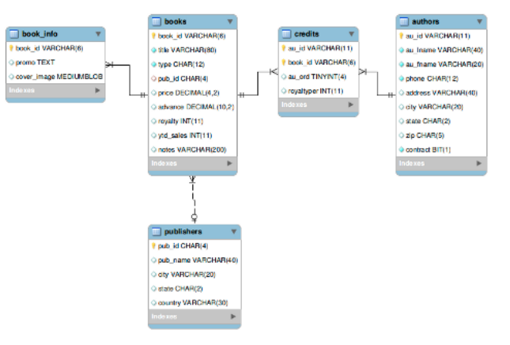
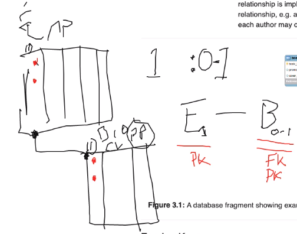
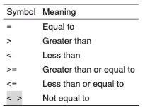
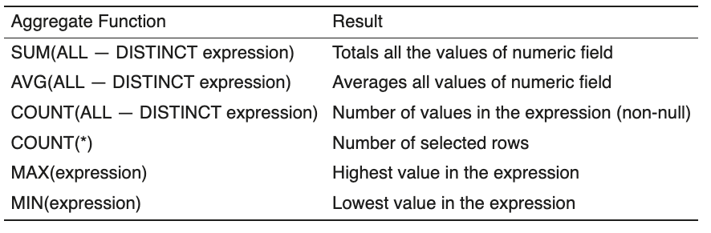

# 1. Databases

- [1. Databases](#1-databases)
  - [1.1. Day 1](#11-day-1)
    - [1.1.1. Relational Databases](#111-relational-databases)
    - [1.1.2. Naming conventional](#112-naming-conventional)
    - [1.1.3. Datatypes](#113-datatypes)
  - [1.2. Day 2](#12-day-2)
    - [1.2.1. Entitiy Integrity](#121-entitiy-integrity)
    - [1.2.2. Referential Integrity](#122-referential-integrity)
    - [1.2.3. DML](#123-dml)
      - [1.2.3.1. SELECT](#1231-select)
        - [1.2.3.1.1. Aliese](#12311-aliese)
      - [1.2.3.2. WHERE](#1232-where)
      - [1.2.3.3. ORDER BY](#1233-order-by)
      - [1.2.3.4. IN](#1234-in)
      - [1.2.3.5. LIKE](#1235-like)
      - [1.2.3.6. INSERT](#1236-insert)
      - [1.2.3.7. UPDATE](#1237-update)
      - [1.2.3.8. DELETE](#1238-delete)
  - [1.3. Day 3](#13-day-3)
    - [1.3.1. Order By](#131-order-by)
    - [1.3.2. GROUP BY](#132-group-by)
    - [1.3.3. Joining Tables](#133-joining-tables)
    - [1.3.4. Exercise](#134-exercise)
    - [1.3.5. UNION](#135-union)
    - [1.3.6. VIEW](#136-view)
    - [1.3.7. INSERT](#137-insert)
    - [1.3.8. UPDATE](#138-update)
    - [1.3.9. DELETE](#139-delete)
    - [1.3.10. Assignment](#1310-assignment)
  - [1.4. Day 4](#14-day-4)

## 1.1. Day 1
Huge amount of personal or sensitive data is stored, we as developers need ot know how to handle them
### 1.1.1. Relational Databases
In relational databases, tabels are defined in terms of it's columns

column should have a name and a datatype
### 1.1.2. Naming conventional
Really depends on what your team is using
### 1.1.3. Datatypes
- `char`
- `varchar`
- `int`
- `float`
- `money`
- `date`
- `datetime`
- `timestamp`


`Candidate key` - any key that is unique

## 1.2. Day 2 
### 1.2.1. Entitiy Integrity 
### 1.2.2. Referential Integrity

- `one-to-one`  the same primary key can unique in both tables?
- `one-to-many` one publisher may have many related books, the most common relationship type. Many end manages the relationship as this is where the relationship is created
- `many-to-many` might use junction table 
  
  standart naming convention for linked tables is `project-employee`, for table joining `employee` and `project`, the junction table would be called `assignmnet`


> one-to-one can also be one-to-(0-1) relationship


`Composite key` - is a primary key that is made up from many attributes to create a unigue identifier. Each attribute makes up the key. Often found in a junction table to manage a many to many relationship

`Candidate key` - a field that can be used to uniquely identify a record but may not actually be a primary key e.g. national insurance number

`trigger` - something that get's triggered when running DML statements
### 1.2.3. DML
Data Manipulation Language
> Select is not always categorized in DML definition

#### 1.2.3.1. SELECT
Lets you select data and lets you express an answer
```sql
SELECT 1;
```
```
+---+
| 1 |
+---+
| 1 |
+---+
```
```sql
SELECT 1,2;
```
```
+---+---+
| 1 | 2 |
+---+---+
| 1 | 2 |
+---+---+
```

```sql
SELECT 1 + 2;
```

```
+-------+
| 1 + 2 |
+-------+
|     3 |
+-------+
```
##### 1.2.3.1.1. Aliese
```sql
SELECT 1 + 2 AS Answer;
```
```
+--------+
| Answer |
+--------+
|      3 |
+--------+
```
---
Strings
```sql
SELECT jeremy;
```
Will give an error because it is a bare word, so it assumes you are specifying a column
```sql 
SELECT 'jeremy';
```
```
+--------+
| jaremy |
+--------+
| jaremy |
+--------+
```
```sql
SELECT "jeremy o'reilly" FROM authors;
```

```
+-----------------+
| jeremy o'reilly |
+-----------------+
| jeremy o'reilly |
| jeremy o'reilly |
| jeremy o'reilly |
| jeremy o'reilly |
| jeremy o'reilly |
| jeremy o'reilly |
| jeremy o'reilly |
+-----------------+
```

number of rows depends on the number of rows in authors
same things work with `"` and `'`
```sql
SELECT `au_fname` FROM authors;
```
would actually find the coloumn

```sql
SELECT DISTINCT type FROM titles;
```
Will return distinct fields, which will make sure that there is only one of each with no duplicates

#### 1.2.3.2. WHERE
```sql
SELECT * FROM publishers where LENGTH(pub_name) <= 5;
```


#### 1.2.3.3. ORDER BY
```sql
SELECT title, price FROM titles ORDER BY price;
```
orders in ascending order by price

```sql
SELECT  title, price FROM titles
WHERE price > 10 AND price < 20
ORDER BY price;
```
```sql
SELECT  title, price FROM titles
WHERE price BETWEEN 10 AND 20
ORDER BY price;
```
> *Be careful with this*, it's not what it appears
#### 1.2.3.4. IN
```sql
SELECT * FROM authors WHERE state IN ('WI', "CL");
```
#### 1.2.3.5. LIKE
```sql
SELECT au_fname FROM authors WHERE au_fname LIKE '';
```
`%` whild card, anything and of any numbers
`_` exacly one character
#### 1.2.3.6. INSERT
#### 1.2.3.7. UPDATE
#### 1.2.3.8. DELETE

## 1.3. Day 3
> Use `JOIN` instead of subquerry, because subquerry is slow.

### 1.3.1. Order By
```sql
SELECT title, price, ytd_sales FROM titles ORDER BY 2;
```
means orders by second column.
```sql
SELECT title, price, ytd_sales, price * ytd_sales AS 'revenue' FROM titles ORDER BY revenue;
```
### 1.3.2. GROUP BY



> `aggregate functions`if the value is NULL, it will not count it and therefore row will be ignored

```sql
SELECT pub_id, count(price) FROM titles GROUP BY pub_id;
```

### 1.3.3. Joining Tables
```sql
 SELECT CONCAT(au_fname, ' ', au_lname), 
       credits.au_id, title_id 
   FROM 
   authors JOIN credits 
   ON  (authors.au_id = credits.au_id);
```
> `JOIN` implies `INNER JOIN`

### 1.3.4. Exercise
Problem statement:
1. Table with two columns: book and publisher
2. Add a third column for author
3. Add a fourth column for the name of the store that sells this book.
4. Ooh, after seeing that last result, I've noticed that some books aren't in the list. Can you change it so that I see all the books?

```sql
1
SELECT 
    t.title as 'Title', p.pub_name as 'Publisher'
FROM
    titles t
        JOIN
    publishers p USING (pub_id);
    
2
SELECT 
    t.title AS 'Title',
    p.pub_name AS 'Publisher',
    CONCAT(a.au_fname, ' ', a.au_lname) AS 'Author'
FROM
    titles t
        JOIN
    publishers p USING (pub_id)
        JOIN
    credits c USING (title_id)
        JOIN
    authors a USING (au_id);
3
SELECT 
    t.title AS 'Title',
    p.pub_name AS 'Publisher',
    CONCAT(a.au_fname, ' ', a.au_lname) AS 'Author',
    st.stor_name
FROM
    titles t
        JOIN
    publishers p USING (pub_id)
        JOIN
    credits c USING (title_id)
        JOIN
    authors a USING (au_id)
        JOIN
    sales s USING (title_id)
        JOIN
    stores st USING (stor_id);


4.
SELECT 
    t.title AS 'Title',
    p.pub_name AS 'Publisher',
    CONCAT(a.au_fname, ' ', a.au_lname) AS 'Author',
    st.stor_name
FROM
    titles t
        LEFT JOIN
    publishers p USING (pub_id)
        LEFT JOIN
    credits c USING (title_id)
        LEFT JOIN
    authors a USING (au_id)
        LEFT JOIN
    sales s USING (title_id)
        LEFT JOIN
    stores st USING (stor_id);
```

### 1.3.5. UNION
### 1.3.6. VIEW
### 1.3.7. INSERT
```sql
 INSERT INTO publishers 
   VALUES ('9990', 'Jardin Inc.', 'Camden', 'NJ', 'USA');

-- explicit
 INSERT INTO publishers_yourname (pub_id, pub_name) 
      VALUES ('9991', 'The Health Center');
```

### 1.3.8. UPDATE
This statement is used to change data in existing rows in a table or view, either by adding new data or by modifying existing data. 
### 1.3.9. DELETE
```sql
DELETE FROM tablename 
  WHERE clause;
```
### 1.3.10. Assignment
```sql
CREATE TABLE Employee (
    EmployeeID INT PRIMARY KEY AUTO_INCREMENT,
    EmployeeFName VARCHAR(255) NOT NULL,
    EmployeeMName VARCHAR(255),
    EmployeeLName VARCHAR(255) NOT NULL,
    PublicEmployeeID VARCHAR(100) UNIQUE NOT NULL,
    Salary DECIMAL(19 , 4 ) NOT NULL,
    EmployeeNIN CHAR(9) UNIQUE NOT NULL
);

INSERT INTO Employee (EmployeeFName, EmployeeMName,EmployeeLName, PublicEmployeeID, Salary, EmployeeNIN) 
	VALUES ('Marcel', 'Alexandre Dias', 'Mendes', 'MAM001', 23000, '000000000'),
    ('Roman','Igorevich', 'Podkovyrin','RIP001',23000,'000000001'),
    ('Callum','', 'Atwal','CXA001',23000,'000000002'),
    ('Joshua','', 'Gallagher','JXG001',23000,'000000003'),
    ('Sam','', 'Chatfield','SXC001',23000,'000000004');

SELECT 
    *
FROM
    Employee;

SELECT 
    COUNT(*)
FROM
    Employee;

DELETE FROM Employee 
WHERE
    EmployeeID IS NULL;

SELECT 
    *
FROM
    ProjectAssignment;
SELECT 
    *
FROM
    EmployeeBio;

INSERT INTO EmployeeBio (EmployeeID, CV, Image, FavouriteTechnology) VALUES (2, 'roman.pdf', 'roman.jpg', 'Ocaml');
```
## 1.4. Day 4

1. Countries with zero population
2. Cities with zero population
3. Number of countries where you'll find a 'London'
...also 'Birmingham'
4. Number of countries where Spanish is spoken
5. List the top five most populous cities
6. List the top five most populous countries
7. Countries where the GNP has fallen
8. Countries with a GNP larger than that of the UK
9. Difference between the UK's GNP and the average European GNP
10. List the continents
11. Most common city name...and the number of countries in which it's found
12. Total population of each district in UK (Wales, Scotland, ...)
13. Total population of each region in Europe (Western Europe, Nordic Countries, ...)
14. List of cities in any countries that have less than 50000 population (without using a JOIN) 


```sql
-- 1
SELECT Name FROM country
WHERE Population = 0;

-- 2
SELECT Name FROM city
WHERE Population = 0;

-- 3
SELECT COUNT(DISTINCT ci.CountryCode) FROM city ci
WHERE Name = "London";

-- 4
SELECT COUNT(*) FROM countrylanguage
WHERE Language = 'Spanish';

-- 5
SELECT Name FROM city
ORDER BY Population DESC
LIMIT 5;

-- 6
SELECT Name FROM country
ORDER BY Population DESC
LIMIT 5;

-- 7
SELECT Name FROM country 
WHERE (GNP IS NOT NULL OR GNP IS NOT NULL) AND (GNP < GNPOld);

-- 8
SELECT Name FROM country
WHERE GNP >
(SELECT GNP FROM country
WHERE Name = 'United Kingdom');

-- 9
SELECT (SELECT AVG(GNP) FROM country
WHERE Continent = "Europe") - (SELECT GNP FROM country
WHERE Name = 'United Kingdom') AS 'Diff between UK and avg Europe GNP';

-- 10
SELECT DISTINCT Continent FROM country;

-- 11
SELECT Name, COUNT(DISTINCT CountryCode) FROM city
GROUP BY Name
ORDER BY COUNT(*) DESC LIMIT 10;

-- 12 

```