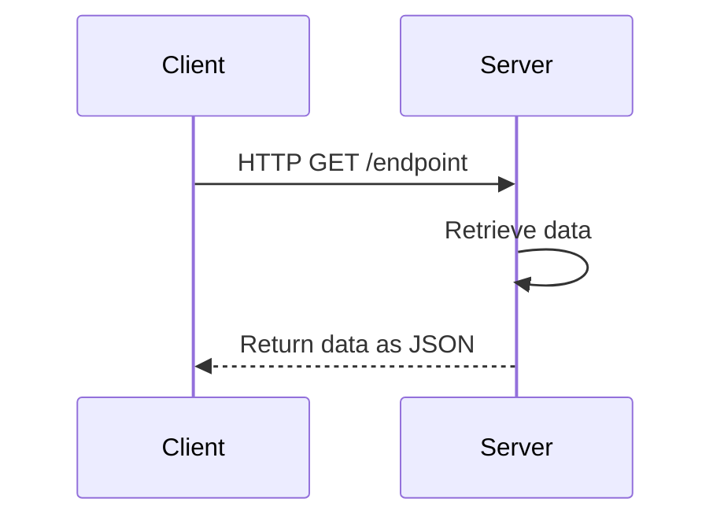
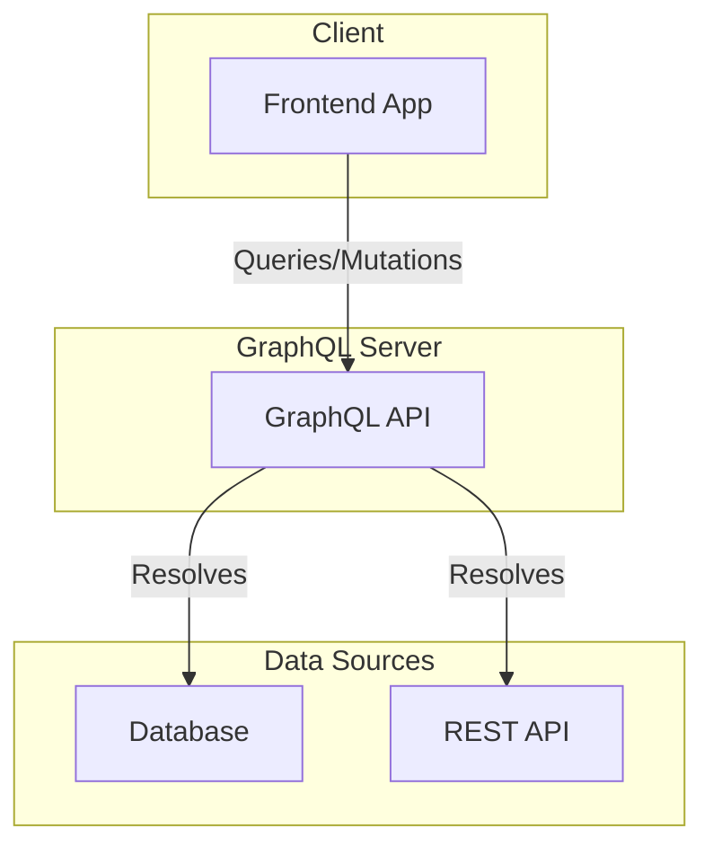
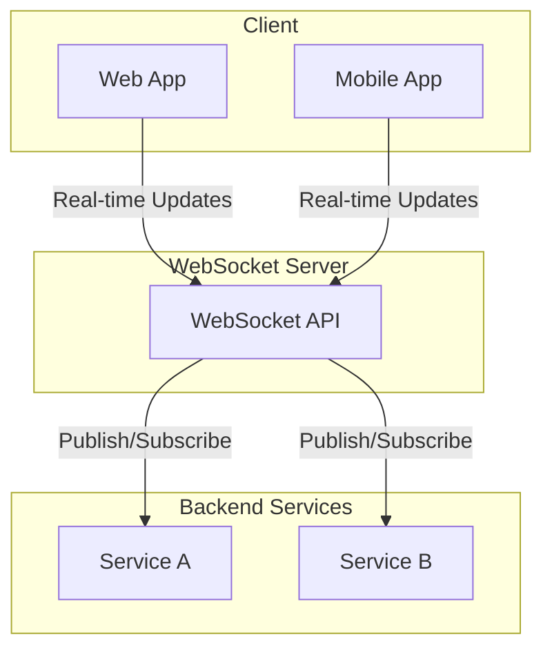

# API Architectures

- [API Architectures](#api-architectures)
  - [REST](#rest)
    - [end point options](#end-point-options)
    - [HTTP methods](#http-methods)
    - [Headers](#headers)
    - [Data (Body)](#data-body)
    - [Authentication](#authentication)
    - [HTTP Status Codes and Error Messages](#http-status-codes-and-error-messages)
  - [SOAP](#soap)
  - [GRAPHQL](#graphql)
  - [Apache Kafka](#apache-kafka)
  - [AsyncAPI](#asyncapi)
  - [RPC](#rpc)
  - [WebSocket](#websocket)
  - [Webhook](#webhook)
  - [MQTT](#mqtt)
  - [AMQP](#amqp)
  - [Resources](#resources)

## REST

REST - representational state transfer

### end point options

- `:` - variable
  - `/users/:username/repos`
- `?` - Query parameters
- `&` - Query parameters separator
  - `?query1=value1&query2=value2
`

### HTTP methods

- `GET`
  - This request is used to get a resource from a server. If you perform a `GET` request, the server looks for the data you requested and sends it back to you. In other words, a `GET` request performs a `READ` operation. This is the default request method.
- `POST`
  - This request is used to create a new resource on a server. If you perform a `POST` request, the server creates a new entry in the database and tells you whether the creation is successful. In other words, a `POST` request performs an `CREATE` operation.
- `PUT` & `PATCH`
  - These two requests are used to update a resource on a server. If you perform a `PUT` or `PATCH` request, the server updates an entry in the database and tells you whether the update is successful. In other words, a `PUT` or `PATCH` request performs an `UPDATE` operation.
- `DELETE`
  - This request is used to delete a resource from a server. If you perform a `DELETE` request, the server deletes an entry in the database and tells you whether the deletion is successful. In other words, a `DELETE` request performs a `DELETE` operation.

### Headers

### Data (Body)

### Authentication

### HTTP Status Codes and Error Messages

- 200+ means the request has succeeded.
- 300+ means the request is redirected to another URL
- 400+ means an error that originates from the client has occurred
- 500+ means an error that originates from the server has occurred

## SOAP

## GRAPHQL

## Apache Kafka

## AsyncAPI

## RPC

## WebSocket

## Webhook

## MQTT

## AMQP

## Resources

- [Understanding And Using REST APIs](https://www.smashingmagazine.com/2018/01/understanding-using-rest-api/)