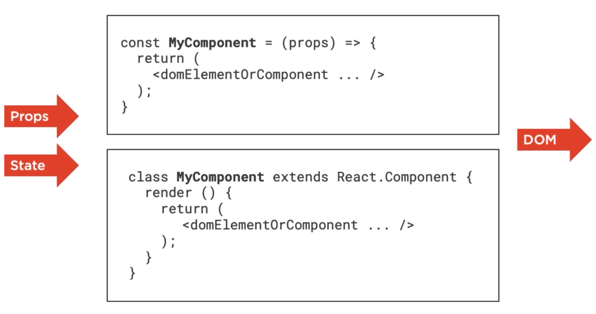

# 1. React
React is a declarative, efficient, and flexible JavaScript library for building user interfaces. It lets you compose complex UIs from small and isolated pieces of code called “components”.
https://reactjs.org/tutorial/tutorial.html

- Components
- Reactive Updates
- Virtual views in memory

## 1.1. Table of Contents
- [1. React](#1-react)
  - [1.1. Table of Contents](#11-table-of-contents)
  - [1.2. Setup](#12-setup)
- [2. React.Component](#2-reactcomponent)
  - [2.1. Types:](#21-types)
    - [2.1.1. Function component](#211-function-component)
    - [2.1.2. Class Component](#212-class-component)
- [3. State](#3-state)
  - [3.1. useState()](#31-usestate)
- [4. Reference](#4-reference)
## 1.2. Setup
`npx create-react-app my-app`

when ready to build run 
`npm run build`

# 2. React.Component
> - Like functions
> - Input: props, state | Output: UI
> - Reusable and composable
> - \<Component /\>
> - Can Manage a private state
``` JSX
class ShoppingList extends React.Component {
  render() {
    return (
      <div className="shopping-list">
        <h1>Shopping List for {this.props.name}</h1>
        <ul>
          <li>Instagram</li>
          <li>WhatsApp</li>
          <li>Oculus</li>
        </ul>
      </div>
    );
  }
}

// Example usage: <ShoppingList name="Mark" />
```
components take parameters called `props` (properties) and return a hierarchy of views to display via the `render` method

Most developers use special syntax called "JSX" which makes it easier to write
`<div />` is equivalent to 
```jsx
return React.createElement('div', {className: 'shopping-list'},
  React.createElement('h1', /* ... h1 children ... */),
  React.createElement('ul', /* ... ul children ... */)
);
```

The ShoppingList component above only renders built-in DOM components like `<div />` and `<li />`. But you can compose and render custom React components too. For example, we can now refer to the whole shopping list by writing `<ShoppingList />`. Each React component is encapsulated and can operate independently; this allows you to build complex UIs from simple components.

## 2.1. Types:

props 
  - Can be passed
  - Immutable
state 
  - Internal state  
  - Can be changed internally
### 2.1.1. Function component
```jsx
const MyComponent =(props) => {
  return (
      <domElementOrComponent ... />
  );
}
```
### 2.1.2. Class Component
```jsx
const MyComponent extends React.Component {
  render () {
    return (
      <domElementOrComponent ... />
    )
  }
}
```
# 3. State
React components can have state by setting `this.state` in their constructors. `this.state` should be considered as private to a React component that it’s defined in. Let’s store the current value of the Square in `this.state`, and change it when the Square is clicked.
```jsx
class Square extends React.Component {
  constructor(props) {
    super(props);
    this.state = {
      value: null,
    };
  }

  render() {
    return (
      <button
        className="square" 
        onClick={() => this.setState({value: 'X'}>
        {this.state.value} </button>
    );
  }
}
```
> all javascript classes need to start with super call
## 3.1. useState()
> `[a, b] = useState()`
> - a - state object (getter)
> - b - updater function (setter)
``` jsx
function Button(props) {
  const handleClick = () => props.onClick(props.incrementValue)
	return (
    <button onClick={handleClick}>
      +{props.incrementValue}
    </button>
    );
}

function Display(props) {
  return (
    <div>{props.message}</div>
  );
}

function App() {
  const [counter, setCounter] = useState(0);
  const incrementCounter = (inc) => setCounter(counter+inc));
  return (
    <>
      <Button onClick={incrementCounter} incrementValue={1}/>
      <Display message={counter} /> 
    </>
  );
}

ReactDOM.render(
  <App />,
  document.getElementById('mountNode'),
);
```
> When rendering you can't just write `<Button /><Display />`, as those will be translated into functions. There are two options you can do 
> 1. Make an array `[<Button />,<Display />]` which is useful for dynamic content
> 2. Make them children of other element `<div> <Button /><Display /> </div`. React has a special element for that which doesn't introduce a dumb parent `<React.Fragment> </React.Fragment>` which also has a shortcut as a empty tag `<> </>`


# 4. Reference
- [Tutorial: Intro to React](https://reactjs.org/tutorial/tutorial.html)
- [Pluralsight | React: Getting Started by Samer Buna](https://app.pluralsight.com/library/courses/react-js-getting-started/table-of-contents)