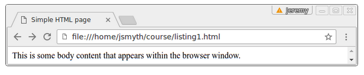
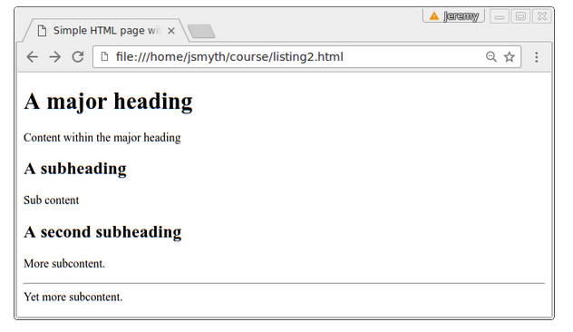

# 1. Web
- [1. Web](#1-web)
- [2. Native Front-End Web Development](#2-native-front-end-web-development)
  - [2.1. Considering Your Audience](#21-considering-your-audience)
    - [2.1.1. Screen Readers](#211-screen-readers)
    - [2.1.2. Accessibility](#212-accessibility)
    - [2.1.3. Web Content Accessibility Guidelines (WCAG)](#213-web-content-accessibility-guidelines-wcag)
      - [2.1.3.1. A/AA/AAA Compliance](#2131-aaaaaa-compliance)
    - [2.1.4. Best Practices in Audience Inclusion](#214-best-practices-in-audience-inclusion)
      - [2.1.4.1. Progressive Enhancements](#2141-progressive-enhancements)
      - [2.1.4.2. Responsive Design](#2142-responsive-design)
- [3. Overview](#3-overview)
  - [3.1. Static and Dynamic Websites](#31-static-and-dynamic-websites)
  - [3.2. HTML](#32-html)
    - [3.2.1. Tags, Attributes and Elements](#321-tags-attributes-and-elements)
    - [3.2.2. HTML Document Structure](#322-html-document-structure)
    - [3.2.3. Lists](#323-lists)
      - [3.2.3.1. Unordered listing](#3231-unordered-listing)
      - [3.2.3.2. Ordered listing](#3232-ordered-listing)
    - [3.2.4. Links](#324-links)
    - [3.2.5. Images](#325-images)
    - [3.2.6. Tables](#326-tables)
    - [3.2.7. Form Elements](#327-form-elements)
- [4. CSS](#4-css)
  - [4.1. CSS Properties](#41-css-properties)
  - [4.2. CSS Selectors](#42-css-selectors)
  - [4.3. Classes and IDs](#43-classes-and-ids)
  - [4.4. Pseudoclasses](#44-pseudoclasses)
  - [4.5. Demarcating Content with `div` and `span`](#45-demarcating-content-with-div-and-span)
  - [4.6. In-line, Embedded, and Linked Stylesheets](#46-in-line-embedded-and-linked-stylesheets)
  - [4.7. Modularising your Stylesheets](#47-modularising-your-stylesheets)
  - [4.8. CSS Extension Languages](#48-css-extension-languages)
  - [4.9. Google Fonts](#49-google-fonts)
  - [4.10. JavaScript](#410-javascript)
  - [4.11. Document Object Model (DOM)](#411-document-object-model-dom)
- [5. Front-End Applications](#5-front-end-applications)
  - [5.1. The package.json File](#51-the-packagejson-file)
- [6. Express](#6-express)
  - [6.1. Routes](#61-routes)
  - [6.2. Middleware](#62-middleware)
- [7. Introduction to Nunjucks](#7-introduction-to-nunjucks)
  - [7.1. Gulp](#71-gulp)
- [8. Web Services](#8-web-services)
  - [8.1. GET, POST, PUT, DELETE](#81-get-post-put-delete)
  - [8.2. Web Services](#82-web-services)
  - [8.3. RESTful Web Services](#83-restful-web-services)
- [9. Nunjucks Template Basics](#9-nunjucks-template-basics)
- [10. Working with forms](#10-working-with-forms)
- [11. Params](#11-params)
- [12. Database API and Asynchronous](#12-database-api-and-asynchronous)
  - [12.1. Promisify wrapper](#121-promisify-wrapper)

# 2. Native Front-End Web Development
Web standards; HTML; CSS; JavaScript; Foundation; Sass; Responsive design; Accessibility
## 2.1. Considering Your Audience
`User configuration`

Many browsers support the ability to disable web page styles or JavaScript behaviour, and some browsers support extensions that modify styles or behaviour. 

`Atypical user agent software`

Some consumers of a web page might not use a typical web browser. These might be:
- Bots, web crawlers, or spiders that read your content into search engines or aggregators
- Screen readers and other software used to make content more widely accessible to people with disabilities
- Reduced-feature browsers such as those embedded into simple mobile applications

### 2.1.1. Screen Readers
When you design your application, it is important to consider screen readers, particularly when producing content that might be difficult to express non-visually:

- Text that appears within an image (e.g. images with macro text that propagate on social media, commonly called “memes”)
- Tabular data
- Non-prose content of applications, including navigation bars, forms, and menus

### 2.1.2. Accessibility
Those disabilities might include: 

- Impaired vision
- Impaired hearing
- Reduced mobility or dexterity
- Dyslexia
- Learning difficulties
- Reduced vocabulary

### 2.1.3. Web Content Accessibility Guidelines (WCAG)
The guidelines come in the form of a technical document with recommendations that follow the “four principles of accessibility:

- Perceivable
- Operable
- Understandable
- Robust

#### 2.1.3.1. A/AA/AAA Compliance
### 2.1.4. Best Practices in Audience Inclusion
#### 2.1.4.1. Progressive Enhancements
Progressive enhancement is the principle that states that all users should be able to access the content in your application. The term deliberately inverts the sense of “graceful degradation” to imply that the basic functionality of the application should be considered the minimum level, or starting point, rather than adding “degradation” as a feature requiring more work; instead, the progressive enhancement should be considered to require more work on top of the basic application.

 According to the principle:

- Users with simpler browsers, a slow internet connection, or atypical viewports (e.g. screen readers, bots and spiders) get at least the basic content and functionality.
- Those with more advanced browsers get progressively more advanced features.
- During development
  - You start with basic form and functionality available to all users (even those where users have disabled functionality including cookies, JavaScript, or choose their own styling)
  - You then add extra form and behaviour for smart mobile devices and modern graphical browsers; Extra form comes from external CSS, and extra behaviour comes from external JavaScript


#### 2.1.4.2. Responsive Design
An application that exhibits responsible design is able to change in response to the viewport

# 3. Overview
## 3.1. Static and Dynamic Websites
Static, something that is written but not changes. 
Dynamic, changes it's content and state

`HTML` Describes the content 

`CSS` Styles the elements 

`JavaScript` Provides dynamic behaviour

## 3.2. HTML
### 3.2.1. Tags, Attributes and Elements
```html
<html> marks beggining of html </html>
<!-- tags can also have attributes to further define the tag's behaviour-->
<html lang="en"> </html>
<!--void element has no content so it doesn't need a closing tag, like hr horizontal rule line -->
<hr>
```
Character entities allow to display characters which otherwise would be treated by html as syntax
### 3.2.2. HTML Document Structure
```html
<!--Document is used to display version-->
<!DOCTYPE html> 
<html lang="en"> 
<head> 
<title>Simple HTML page</title> 
</head> 
<body> 
This is some body content that appears within the browser window. 
</body> 
</html>
```
The `<title>` element represents the page title. Its contents often appear in the title of the browser window or the tab containing the web page. Browsers typically use the page title when you create bookmarks to that page. The `<body>` element contains the structure and content of the web page. In listing 1.1, the body contains only plain text, and there are no tags or elements within the body that define any further structure



Body content with tags
```html
... 
<body> 
<h1>A major heading</h1> 
<p>Content within the major heading</p> 
<h2>A subheading</h2> 
<p>Sub content</p> 
<h2>A second subheading</h2> 
<p>More subcontent.</p> 
<hr> 
<p>Yet more subcontent.</p> 
</body> 
...
```


### 3.2.3. Lists
#### 3.2.3.1. Unordered listing
```html
<ul> 
<li>First list item</li> 
<li>Second list item</li> 
</ul>
```
<hr>
<ul> 
<li>First list item</li> 
<li>Second list item</li> 
</ul>

#### 3.2.3.2. Ordered listing
```html
<ol> 
<li>First list item</li> 
<li>Second list item</li> 
</ol>
```

<ol> 
<li>First list item</li> 
<li>Second list item</li> 
</ol>

### 3.2.4. Links
```html
<a href="somepage.html" title="mouseover text">Clickable text</a>
```
<a href="somepage.html" title="mouseover text">Clickable text</a>
<hr>
anchor

```html
<a name="anchortext">Some interesting text</a>
```
<a name="anchortext">Some interesting text</a>

The name attribute creates an anchor within the page to which links can refer by specifying `href=’#anchorname’` to link to points within the same page, or `href=’somepage.html#anchorname’` to link to that specific interesting text within another document. This technique is used in some long documents that have a table of contents at the top, including pages that you might read on Wikipedia. 
<hr>

### 3.2.5. Images
```html

```

### 3.2.6. Tables
HTML provides several elements to specify tabular data. A table might look like this:
```html
<table> 
<thead> 
<tr><th>First column</th><th>Second column</th></tr> 
</thead> 
<tbody> 
<tr><td>First cell</td><td>Second cell</td></tr> 
<tr><td rowspan=2>Third cell</td><td>Fourth cell</td></tr> 
<tr><td>Fifth cell</td></tr> 
</tbody> 
<tfoot> 
<tr><td colspan=2>Footer cell</td></tr> 
</tfoot> 
<caption>This is a lovely table</caption> 
</table>
```

<table> 
<thead> 
<tr><th>First column</th><th>Second column</th></tr> 
</thead> 
<tbody> 
<tr><td>First cell</td><td>Second cell</td></tr> 
<tr><td rowspan=2>Third cell</td><td>Fourth cell</td></tr> 
<tr><td>Fifth cell</td></tr> 
</tbody> 
<tfoot> 
<tr><td colspan=2>Footer cell</td></tr> 
</tfoot> 
<caption>This is a lovely table</caption> 
</table>


The elements of the table describe its components both in terms of semantics and in contents:

- `table` defines the tabular content.
- `thead`, `tbody`, and `tfoot` enclose the markup for the header content, body content, and footer content of the table. This does not change its appearance (unless you use it for styling), but it is useful for some user agents that can render specific parts of the table in ways that are useful to users.
- `th` and `td` enclose the table header cells and content cells respectively. The rowspan and colspan attributes enable a cell to expand beyond its traditional boundaries by spanning multiple rows or columns respectively.
- `caption`s adds a caption to the table.

### 3.2.7. Form Elements

- `<input type="text"> `(or just `<input>`) is a text box
- `<input type="password">` is a text box that replaces characters with some other character as you type them so that nobody can see the text. Often used for passwords.
- `<input type="search">` is a text box that tends to be used for search terms (are you getting the hang of the naming convention?)
- `<input type="button">` is (quite obviously) a button.
- `<input type="submit">` is also a button, and perhaps surprisingly, is probably the one you want unless you use JavaScript; it’s the one that submits the form. The “button” button actually does nothing unless you write code for it.
- `<input type="reset">` is another kind of button. This one clears out the form. It’s rarely used.
- `<input type="image">` is (perhaps surprisingly) also a button, although this one has a picture rather than, er, a button.
- `<input type="radio">` is a “radio button”, which isn’t, in fact, a button, but rather tends to be used in mutually-exclusive sets of selectors in a “radio button group” of radio buttons that share the same name attribute.
date, month, week, datetime-local, and time are input types for entering various types of temporal data. They aren’t buttons, but they might include buttons to step through valid dates or times
`<input type="hidden">` is a control that definitely isn’t a button. In fact, it doesn’t appear anywhere on the screen, can’t be changed, and is usually completely outside the knowledge and control of the user. It’s very useful, despite all that.

The following are inputs that don’t use the `<input>` tag:

- `<select>` and `<option>` are used together to create multiple select controls like dropdowns and listboxes; `<option>` elements to specify each possible entry, and `<select>` to wrap around the whole set. The `<select>` tag includes attributes such as size and multiple to control the display and behaviour of the element.
- `<textarea>` is a multi-line input textbox with configurable columns and rows.

all this typically consists within `<form>` element, form needs to have action with the url where it is submitted

The `<legend>` and `<fieldset>` tags are often used together within forms to make it easier to navigate around large sets of often complex input types. 
# 4. CSS
## 4.1. CSS Properties
```css
font-family: Serif;font-size: 12pt;
color: blue;
margin: 2px 1em 5mm 8pt;# silly to mix units like it, don't do it
background: url("img/bg.png") #A0A no-repeat fixed;
```
## 4.2. CSS Selectors
isses element names to change styling
```css
body { 
   color: blue; 
} 
 
p {   
    font-family: Serif; 
}
```

## 4.3. Classes and IDs
HTML elements support the attributes class and id. These attributes are used to mark their elements as belonging to a group (class) or having a particular identifier (ID) so that they can be manipulated in JavaScript through the document object model (DOM), or selected in CSS.  The assumption (and indeed the specification) is that you can have multiple elements with the same class, but only a single element with a given id. 

html with class
```html
 <h6 class=’classname’>…</h6>
```
<div>

secting this class from attribute in css
```css
h6.classname {
    font-family: Serif; 
}
```
> To select the element with a given ID, prefix the ID with a hash/pound/octothorpe: “#id”

## 4.4. Pseudoclasses

```css
:active and :hover
:focus, :checked, :disabled, and :required
:first-child, :last-child, and :nth-of-type

::first-letter and ::first-line

You can select the ::before and ::after
```

## 4.5. Demarcating Content with `div` and `span`
```css
<div></div> <span></span>
```

In general, you might consider the following guidelines:

- Use `<div>` elements when you want to treat a block of content as a block, in relation to other blocks. This is a common thing to do, because web pages are often constructed with building blocks of text content, graphical content, navigation bars, and title sections.
- Use `<span>` elements when you want to mark a word or phrase of text within a paragraph, in the same way you might use `<em>` or `<strong>`. You can then style by specifying a class or ID on that word or phrase.
## 4.6. In-line, Embedded, and Linked Stylesheets

- In-line styles
  
    are included with the element in a style attribute.
    Example: `<h1 style="font-family: wingdings; font-size:32;">` 

- Embedded styles
  
    are included within `<style>` elements within the HTML source. Example:
    ```css <style> 
    h1 { font-family: wingdings; font-size:32; } 
    body {color: blue; } 
    </style>```

- Linked stylesheet
  
    are separate files—usually with the .css extension—that contain the CSS styling used in the page. Example HTML:
    `<link rel="stylesheet" type="text/css" href="style.css" />`

with linked stylesheets, think about order of linking

## 4.7. Modularising your Stylesheets
can give a different stylesheets for a printed version of your page

## 4.8. CSS Extension Languages
`Sass` (Syntactically Awesome Style Sheets) and Less are variations of CSS used for styling but with syntactical additions. Stylesheets written with CSS extension languages must be compiled to native CSS so that the browser can render them correctly. 

## 4.9. Google Fonts

```html
<link href="https://fonts.googleapis.com/css?family=Montserrat|Oswald" 
   rel="stylesheet">
```

## 4.10. JavaScript
> The JavaScript versions implemented by the major browsers cannot be said to implement any particular version. Rather, they use JavaScript engines that support, to a greater or lesser extent, features of JavaScript that implement, to a greater or lesser extent, the ECMAScript standards.

## 4.11. Document Object Model (DOM)

The DOM is defined in terms of interfaces, which correspond to the objects you might manipulate:

`Document` - represents the web page loaded within the browser tab or window, and is available in JavaScript through the document global. 

`Window` is the tab object containing the document. It usually has a 1:1 correspondence with a given document, but windows also have a history object referring to previous documents that appeared in the window. The recommended way to get a document’s current window by querying the document.defaultView property.

Invoking document.defaultView in a browser is somewhat of a tautology, because the window object is a global object. Calling window.window returns the window, as does window on its own, or this. In fact, the reason document.defaultView is available in your code’s namespace is because the window object is a global object, and its properties (including document) are available in your namespace; querying the document.defaultView property in a browser is exactly the same as querying window.document.defaultView, or even this.document.defaultView. 

`Navigator` is the user agent application that contains the windows. You can get this object by querying the window.navigator property.

`Elements` are typically the HTML elements within a document. These might be visible elements that you can manipulate or query, such as text boxes or checkboxes, or structural elements that you make visible or populate dynamically, such as divs.

You can get the root element of a document (usually its `<html>` element) by querying the document.documentElement property. Each element has a .children property, which is a collection of elements. Each element also has a .attributes collection of its attributes.

Elements have an id, a classList, a name, and contents accessible through the innerHTML property.

# 5. Front-End Applications
Node.js is a JavaScript runtime engine typically used to run server-side JavaScript code. It is based on the V8 JavaScript engine, used in Google Chrome. 

he Node ecosystem is vast, and includes many frameworks in their own right. Tying them all together is a package ecosystem.

**npm**

When you install Node.js, npm is automatically installed as its default package manager. However, npm is considered a general JavaScript package manager, not just a Node.js component.

The npm client and the package registry are owned and run by “npm, Inc.”, a subsidiary of Github.

**nvm**

```javascript
const http = require('http');


const server = http.createServer((req, res) => {
   res.statusCode = 200;
   res.setHeader('Content-Type', 'text/html');
   res.end('<h1>First message from Node</h1>\n');
   console.log('Request processed.');
});

server.listen(7999, 'localhost', () => {
   console.log('Server started.');
});
```

## 5.1. The package.json File
**name and version** are defined by the developer of the package, and together form a unique identifier. The name can’t be more than 214 characters long and the version is in the form M.m.p (for Major version, minor version, and patch level). 

**scripts** is where you define the commands that run at certain points in the package lifecycle, such as “install”, “build”, or “test”. 

**license** is a common entry in Node applications. It contains an . licence code that matches the license under which you distribute your application. The default licence chosen by npm init is “ISC”, a permissive licence. UNLICENSED is a special code that means “All rights reserved”, effectively denying users of the source code any rights at all, including the right to execute your code.

Rather than include a license, you might include a line "private": true,. This tells the packager that this package will not be distributed through any repository. If you include this line you do not need to specify a license.

If you upload to a repository, you should also include an author field. It might look like this:
```javascript
       "author": { 
          "name":  "Jeremy Smyth", 
          "email": "jeremy@metablur.com", 
          "url:  "http://metablur.com" 
       }
```

**dependencies** are required to run the application. 

**devDependencies** are required to develop and build the application, but are typically not deployed with the application. For example, client applications don’t need to import TypeScript into the browser.
# 6. Express
Basic framework which allows you to do routing in server-side applications
## 6.1. Routes
Express routes incoming web requests based on the HTTP method and the requested resource.

The following example might be used to list all cars:
`app.get('/cars', function (req, res) {`

If you want to get a specific car, you might pass in an ID as a parameter string, such as http://localhost:3000/car/15:
`app.get('/car/:id', function (req, res) {`

The code would then read the req.param.id property to provide the template with details of that specific car.

Other HTTP methods might enable different types of operation. For example, you might want to delete a car:
`app.delete('/car/:id', function (req, res) { `

```javascript
const express = require('express') 
const app = express() 
 
app.get('/', function (req, res) { 
   res.send('<h1>First message from Express</h1>') 
   console.log('Request processed'); 
}); 

app.get('/anystring', function (req, res) { 
    res.send('<h1>Who do you think you are </h1>') 
    console.log('Request processed'); 
 });
 
app.listen(7999, function() { 
   console.log('Express started') 
});
```
## 6.2. Middleware
You can set functions which will run regardless of route.

```javascript
app.use(function(req, res, next){ 
   ... 
})

or
var myMiddleware = function(req, res, next){ 
   ... 
} 
 
app.use(myMiddleware) 
```

These functions execute for every request, in the order that you apply them. The next parameter is used by the router to identify the middleware that runs after the current one.

Middleware is often used for state management and authentication. 

# 7. Introduction to Nunjucks


To enable it in your Express application is simple:
```javascript
const nunjucks = require('nunjucks'); 
... 
nunjucks.configure('app/views', { // template directory 
         express: app             // assumes "app" is the Express app 
}); 
app.set('view engine', 'njk');    // extension of template files 

//You can then route templates using res.render:
app.get('/sample', function (req, res) { 
   res.render('sample', { myvar: 'Sample' }); 
}); 
```

## 7.1. Gulp
Typical Gulp tasks might:
- Clean the project directory of previously-compiled assets
- Compile templates or code to browser-native languages
- Watch source directories for changes, and compile those changes
- Serve assets, both precompiled and changed

# 8. Web Services
## 8.1. GET, POST, PUT, DELETE
`GET` -  in which only the HTTP request header is sent and the form data are submitted as part of the file name, using a special syntax 
`POST` - , in which the filename in the header remains unchanged, and the request is contained in the HTTP body.

The special syntax for GET requests include the ?, &, and = characters, as well as escape sequences such as %20 which indicate the hexadecimal codes for characters not supported in HTTP headers, including spaces, and the three reserved characters listed.
## 8.2. Web Services
Web services can sometimes works as a client in relation to other classes
## 8.3. RESTful Web Services
RESTful Web services refer to the REST architecture, which in turn is short for Representational State Transfer. REST defines a set of standards or constraints that dictate how clients can request resources of a server, and how state is communicated between client and server. 

# 9. Nunjucks Template Basics
```javascript
{{ myvar }} 
{{ mynum * 3 }}

----------------------------

... 
 
{{ cat.name }} 
There are no cats :( 


----------------------------

 
<h1>My Lovely Block: Default Content</h1> 


----------------------------



----------------------------

 
<h1>This replaces the default content.</h1> 
 
```
# 10. Working with forms
The “action” attribute defaults to the current resource.
The “method” defaults to GET, but you can choose POST to submit larger quantities of data. In a RESTful application, you might also use PUT or DELETE to create or remove data from the back end from your forms. 

# 11. Params
```javascript
router.get('football/:team/player/:player'), function(req, res) {
   var ip = req.ip
   var host = req.hostname
   var team = req.params.team
   var player = req.params.player

   res.send('Your IP is:' + ip + "\nYour hostname is: " 
   + host + "\n" + player + " plays for " + team)
}
```

```javascript
// url /football/arsenal/?player=Eric+Cantona

var player = req.query.player
```

# 12. Database API and Asynchronous
```javascript
// connection
const mysql = require('mysql'); 
const con = mysql.createConnection( 
  { 
    "host": "localhost", 
    "user": "worlduser", 
    "password": "worldPwd!", 
    "database": "world" 
  } 
)

// using database
let sql = "SELECT name FROM city WHERE id = ?" 
let cityid = 469 
con.query(sql, cityid, function (err, rows) { 
   // process rows asynchronously 
})
```

## 12.1. Promisify wrapper
```javascript
function wrapDB(credentials) {
   return {
      query(sql, args) {
         return utils.promisify(con.query)
         .call(con,sql,args)
      },
      close() {
         return utils.promisify(con.close)
         .call(con) s
      }
   }
}

const mysqlP = wrapDB(credentials)
// query function returns a promise
mysqlP.query("SELECT name FROM city WHERE id = 469")
.then(r => r[0].name)
.then(console.log)//belfast
.catch(err=> console.log(err))
```
